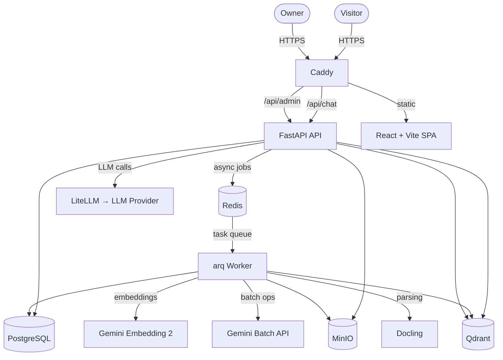
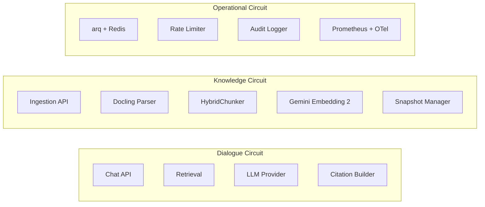
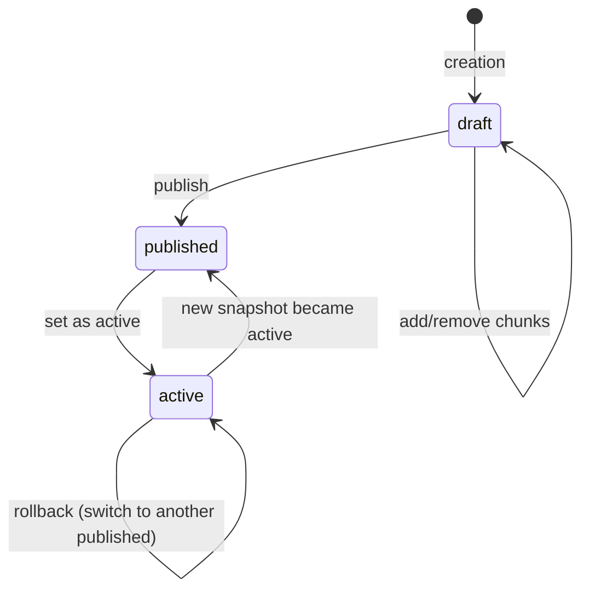
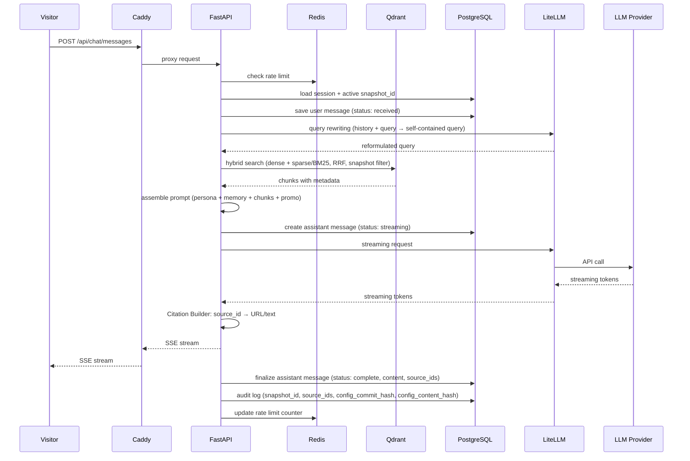
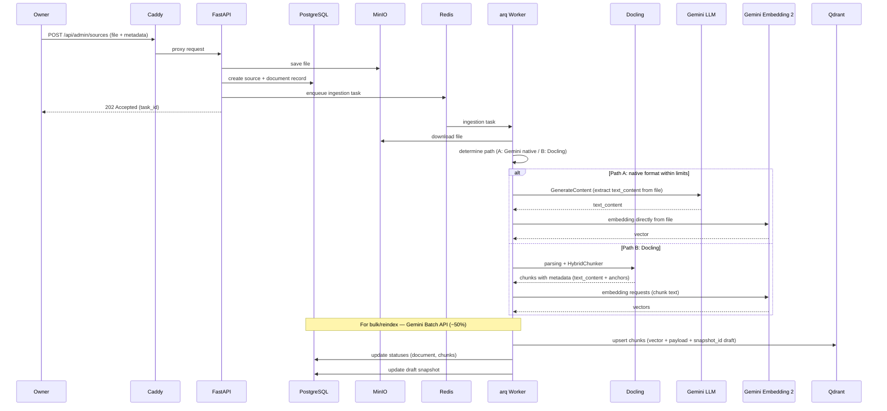
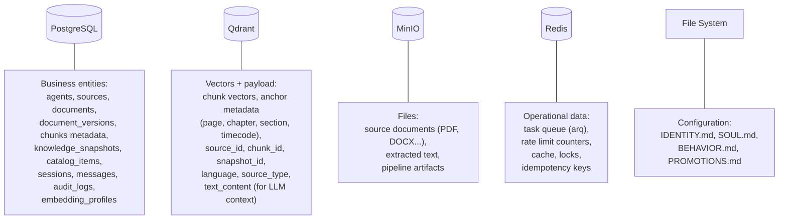
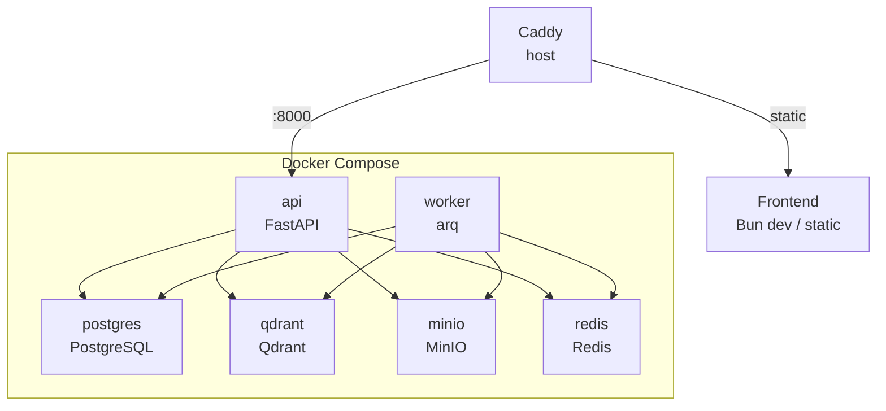
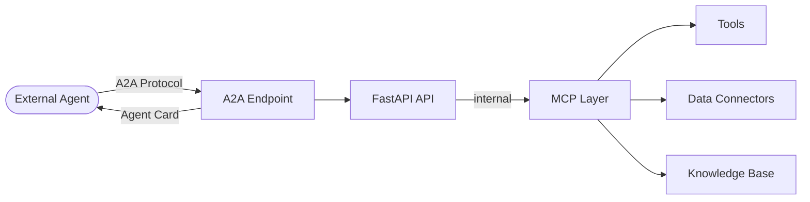

# ProxyMind Architecture

## System overview

ProxyMind is a self-hosted digital twin. One instance = one twin. The system consists of three circuits (dialogue, knowledge, operational), five data stores, and two runtime processes (API server and worker).



## System circuits

Three independent circuits. Each can evolve and scale independently.



### Dialogue circuit

Processes user messages in real time:

1. Receives a message via Chat API (REST + SSE streaming).
2. Query rewriting — reformulates the query taking dialogue history into account.
3. Hybrid retrieval — scoped search over Qdrant (dense + sparse/BM25, RRF fusion) within the active snapshot.
4. Assembles prompt: persona files + dialogue memory + retrieval context + PROMOTIONS.md.
5. Calls LLM via LiteLLM, streaming the response.
6. Citation Builder substitutes real links based on `source_id` from the LLM response.
7. Returns the response to the client via SSE.

### Channel connectors (future)

Later stages may expose the same dialogue capabilities through external messaging and social platforms such as Telegram, Facebook, VK, Instagram, TikTok, and similar channels. To avoid ambiguity with MCP data connectors, the preferred term for these integrations is **channel connectors**.

Channel connectors do not change the core dialogue workflow. They adapt channel-specific events into the same internal chat flow used by the web client. The connector authenticates with the external platform, normalizes inbound messages, and resolves the end user by platform identity.

This has one important architectural consequence: **admin authentication and visitor identity must remain separate concerns**. Admin authentication protects owner-facing APIs and management actions. Visitor identity represents an external person chatting with the twin and may be created implicitly on first contact based on `(channel_connector, external_user_id)` without a standalone ProxyMind registration step.

### Knowledge circuit

Runs asynchronously, does not block chat. Two-tier parsing:

1. Owner uploads a source via Admin API.
2. File is saved to MinIO, metadata to PostgreSQL.
3. arq Worker picks up the task from Redis.
4. Worker determines the processing path:
   - **Path A (Gemini direct)** — for native formats within limits: PDF ≤ 6 pages, images, audio ≤ 80 sec, video ≤ 120 sec. Worker creates a single chunk record for the entire file. Two separate Gemini calls:
     1. **Gemini LLM (GenerateContent)** — generates `text_content`. The embedding model returns only vectors, not text, so the textual representation is generated by a separate LLM call:
        - **PDF ≤ 6 pages** — text extraction via Gemini LLM (multimodal, accepts PDF).
        - **Images** — text description via Gemini LLM (describe image).
        - **Audio** — transcript via Gemini LLM (transcribe audio).
        - **Video** — transcript + visual description via Gemini LLM.
     2. **Gemini Embedding 2** — generates an embedding directly from the file (multimodal input).
        Worker saves: `text_content` (required textual context for LLM during retrieval), anchor metadata (filename, format, duration/page count), link to the file in MinIO. During retrieval, `text_content` is passed to the LLM; citations are formed from anchor metadata.
   - **Path B (Docling)** — for everything else: long PDFs, DOCX, HTML, Markdown, TXT. Docling parses, HybridChunker splits into chunks with anchor metadata (page, chapter, section). Gemini Embedding 2 generates embeddings from chunk text.
5. For bulk operations (book uploads, reindex) worker uses **Gemini Batch API** (−50% cost, SLO ≤24h). For individual files — interactive API.

**Batch API lifecycle within the task system:**

- Worker creates a batch job via Gemini API and saves `batch_operation_name` in PostgreSQL (`batch_jobs` table, linked to `task_id`).
- Status mapping: Gemini `PENDING`/`RUNNING` → internal `processing`, `SUCCEEDED` → `complete`, `FAILED`/`EXPIRED` → `failed`, `CANCELLED` → `cancelled`.
- Worker periodically checks batch job status (polling).
- **Deduplication guard:** before creating a batch job, worker checks for an existing `batch_operation_name` for the given `task_id` in PostgreSQL. If the batch job already exists, worker joins it (polling) instead of creating a new one. This prevents duplicates during arq retry, since Gemini Batch API creation is not idempotent.

6. Chunks with payload metadata are indexed in Qdrant with the `snapshot_id` of the current draft.
7. Snapshot Manager updates the draft snapshot.

### Snapshot lifecycle



Unified identifier: **`snapshot_id`**. Each snapshot has a `snapshot_id` (UUID) and a `status` field (draft / published / active / archived).

States:

- **draft** — being populated. Chunks in Qdrant are tagged with this draft's `snapshot_id`. Retrieval against a draft is available only for testing via Admin API (`POST /api/admin/snapshots/:id/test`).
- **published** — finalized, immutable. All chunks are bound to a specific `snapshot_id`.
- **active** — the current published snapshot used by the twin to answer. Exactly one snapshot is active at any time. Its `snapshot_id` is stored as `active_snapshot_id` in agent settings (PostgreSQL).
- **archived** — historical snapshot retained for audit and future owner-driven archive actions. Deactivation returns an active snapshot to **published**, so the published pool remains available for rollback.

Qdrant payload contains **`snapshot_id`** — the sole key linking a chunk to a snapshot. Chat API retrieval filters by `snapshot_id` == `active_snapshot_id`. Draft chunks are invisible to Chat API.

Rollback: switching `active_snapshot_id` to the `snapshot_id` of another published snapshot. Atomic operation in PostgreSQL. When a new snapshot becomes active, the previously active snapshot returns to **published** rather than becoming archived automatically.

> **Term mapping:** spec.md uses `published_version_id` — this is the `snapshot_id` of the snapshot with active status. The codebase uniformly uses `snapshot_id`.

### Operational circuit

Serves both circuits:

- **arq + Redis** — background task queue.
- **Rate Limiter** — Redis-based request throttling.
- **Audit Logger** — records every response with `snapshot_id`, `config_commit_hash`, and `config_content_hash` in PostgreSQL.
- **Prometheus + OpenTelemetry** — metrics, traces, correlation IDs.

## Data flows

### Chat flow



### Chat state model

Each message transitions through statuses:

- **User message:** `received` — saved before processing begins. Idempotency key prevents duplicates on retry.
- **Assistant message:** `streaming` → `complete` / `partial` / `failed`.
  - `streaming` — created before streaming starts.
  - `complete` — LLM finished generation, response is full.
  - `partial` — client disconnected (SSE disconnect), whatever was generated is saved.
  - `failed` — LLM error or internal error.

On a repeated request with the same idempotency key: if the response is `complete`, the saved version is returned; otherwise, a new generation is triggered.

A completed response = an assistant message with status `complete`, containing the full text, `source_ids` of used chunks, and `snapshot_id`.

### Ingestion flow



## Data stores

Five stores, each with its own purpose. Nothing is duplicated between them.



### PostgreSQL — source of truth

All business entities and their lifecycle. OAuth built-in. Tables contain tenant-ready fields: `owner_id`, `agent_id`, `knowledge_base_id`, `published_version_id`.

### Qdrant — vector retrieval

Chunks with embeddings and payload metadata. Payload indexes on frequently filtered fields. Collection organization (single or separate) — decision deferred until first evals.

### MinIO — object storage

Source files and ingestion pipeline artifacts. No binary data in PostgreSQL.

### Redis — operational glue

Task broker (arq), cache, rate limits, locks. Does not store business data.

### File system — configuration

Persona and promo files. Versioned via git. In v1, managed manually.

## Repository structure

Monorepo. Infrastructure primitives live in the root `.env`, backend app config lives in `backend/.env`, and frontend client config lives in `frontend/.env`.

```
proxymind/
├── backend/                  # Python, Docker
│   ├── app/
│   │   ├── api/              # FastAPI routers
│   │   │   ├── chat.py       # Chat API (SSE streaming)
│   │   │   └── admin.py      # Admin API (sources, snapshots)
│   │   ├── core/             # Config, settings, logging
│   │   ├── db/               # SQLAlchemy models, Alembic
│   │   ├── services/         # Business logic
│   │   │   ├── retrieval.py  # Scoped retrieval
│   │   │   ├── citation.py   # Citation Builder
│   │   │   ├── llm.py        # LiteLLM abstraction
│   │   │   ├── ingestion.py  # Ingestion orchestration
│   │   │   └── snapshot.py   # Snapshot Manager
│   │   ├── workers/          # arq task definitions
│   │   └── persona/          # Loader for IDENTITY/SOUL/BEHAVIOR
│   ├── migrations/           # Alembic migrations
│   ├── tests/
│   │   ├── unit/
│   │   ├── integration/
│   │   └── evals/
│   ├── Dockerfile
│   ├── pyproject.toml
│   └── .env                  # App-only config (LOG_LEVEL, API keys)
├── frontend/                 # Bun + React + Vite
│   ├── src/
│   │   ├── components/
│   │   ├── pages/
│   │   └── lib/
│   ├── biome.json
│   ├── vite.config.ts
│   ├── package.json
│   └── .env                  # Client-only VITE_* config
├── persona/                  # Twin persona files
│   ├── IDENTITY.md
│   ├── SOUL.md
│   └── BEHAVIOR.md
├── config/                   # Operational configs
│   └── PROMOTIONS.md
├── .env                      # Store hosts, ports, and credentials
├── docker-compose.yml        # PostgreSQL, Qdrant, MinIO, Redis, backend
├── Caddyfile
├── docs/
│   ├── about.md
│   ├── spec.md
│   ├── architecture.md
│   ├── plan.md
│   ├── rag.md
│   └── agent.md
├── .editorconfig
└── .gitignore
```

## Docker Compose

All backend services and stores run via docker-compose. Frontend runs separately (Bun dev server or static build behind Caddy).



### Services

> For minimum tool/image versions, see [docs/spec.md](spec.md#tools-and-versions).

| Service  | Image / Build | Port | Dependencies                   |
| -------- | ------------- | ---- | ------------------------------ |
| api      | ./backend     | 8000 | postgres, qdrant, minio, redis |
| worker   | ./backend     | —    | postgres, qdrant, minio, redis |
| postgres | postgres:18   | 5432 | —                              |
| qdrant   | qdrant/qdrant | 6333 | —                              |
| minio    | minio/minio   | 9000 | —                              |
| redis    | redis:8       | 6379 | —                              |

`api` and `worker` use the same Docker image (`backend/`), but with different entrypoints:

- **api:** `uvicorn app.main:app`
- **worker:** `arq app.workers.main.WorkerSettings`

Caddy runs on the host (not in Docker) — simpler certificate management and proxying for both backend and frontend.

## API

REST API. Two sets of endpoints with different security boundaries.

### Security model

- **Chat API** (`/api/chat/*`) — public, no authentication required. Rate limiting via Redis.
- **Admin API** (`/api/admin/*`) — authentication required. In v1: API key in header (`Authorization: Bearer <key>`). Key is set in `.env` at installation. Future: full auth via PostgreSQL OAuth.
- **Service endpoints** (`/health`, `/ready`, `/metrics`) — no authentication required, but Caddy can restrict access by IP.

### Delete semantics

Deleting a source is a **soft delete**. The source gets `deleted` status, but the record remains in PostgreSQL. Reasons:

- Chunks from this source may be part of published snapshots.
- `source_id` is used in audit logs and historical citations.
- Source may be linked to a catalog item.

Chunks from a deleted source are excluded from **future** snapshots but remain in already published ones. Full cleanup (hard delete) is a separate operation, available only for sources not included in any published snapshot.

### Chat API

| Method | Path                   | Description          | Response   |
| ------ | ---------------------- | -------------------- | ---------- |
| POST   | /api/chat/sessions     | Create a new session | JSON       |
| POST   | /api/chat/messages     | Send a message       | SSE stream |
| GET    | /api/chat/sessions/:id | Get session history  | JSON       |

**SSE response format:** each SSE event contains JSON with fields:

- `type` — `token` (streaming token) / `citations` (citation block) / `done` (completion).
- `content` — token text (for type=token) or citations array (for type=citations).

**Saved message format (GET sessions/:id):**

- `content` — full Markdown text of the response.
- `citations` — array of objects: `{source_id, source_title, anchor, url?}`.
- `content_types` — content type markup: `{spans: [{start, end, type: "fact"|"inference"|"promo"}]}`.

### Admin API

| Method | Path                              | Description                              | Response |
| ------ | --------------------------------- | ---------------------------------------- | -------- |
| POST   | /api/admin/sources                | Upload source (file + metadata)          | JSON     |
| GET    | /api/admin/sources                | List sources                             | JSON     |
| DELETE | /api/admin/sources/:id            | Delete source                            | JSON     |
| POST   | /api/admin/snapshots              | Create draft snapshot                    | JSON     |
| GET    | /api/admin/snapshots              | List snapshots                           | JSON     |
| POST   | /api/admin/snapshots/:id/test     | Test retrieval against draft             | JSON     |
| POST   | /api/admin/snapshots/:id/publish  | Publish (draft → published → active)     | JSON     |
| POST   | /api/admin/snapshots/:id/rollback | Rollback (make another published active) | JSON     |
| GET    | /api/admin/tasks/:id              | Background task status                   | JSON     |
| GET    | /api/admin/catalog                | List catalog items                       | JSON     |
| POST   | /api/admin/catalog                | Add catalog item                         | JSON     |

### Service endpoints

| Method | Path     | Description        |
| ------ | -------- | ------------------ |
| GET    | /health  | Health check       |
| GET    | /ready   | Readiness check    |
| GET    | /metrics | Prometheus metrics |

## Backup and recovery

### What to back up

| Store      | What                                 | Method                         | Frequency           |
| ---------- | ------------------------------------ | ------------------------------ | ------------------- |
| PostgreSQL | All business data                    | pg_dump / pg_basebackup        | Daily               |
| Qdrant     | Collections with vectors and payload | Qdrant snapshots API           | On snapshot publish |
| MinIO      | Source files and artifacts           | mc mirror / bucket replication | Daily               |
| Redis      | Not backed up                        | —                              | —                   |
| Files      | persona/, config/                    | git                            | On change           |

Redis is not backed up — all its data is recoverable (tasks are re-enqueued, cache warms up, counters reset).

**Consistency on recovery:** PostgreSQL is the source of truth. If stores diverge: Qdrant can be fully reindexed from PostgreSQL + MinIO. Qdrant snapshots API backup is taken on each snapshot publish — this guarantees the Qdrant backup corresponds to a specific `snapshot_id` in PostgreSQL.

### Recovery

1. Bring up Docker Compose with empty volumes.
2. Restore PostgreSQL from dump.
3. Restore MinIO from backup.
4. Restore Qdrant from snapshot or reindex (data for reindex exists in PostgreSQL + MinIO).
5. Persona and promo files — checkout the specific git commit. The required `config_commit_hash` is taken from the audit log of the last response or from the active snapshot record in PostgreSQL.

**Reproducing a specific historical response:** audit log contains `snapshot_id` + `config_commit_hash` + `config_content_hash`. `config_content_hash` (SHA256 of `persona/` + `config/` contents) distinguishes configuration changes from code changes. To reproduce: activate the required snapshot, checkout the required commit for persona/config.

## A2A and MCP — architectural provisions

Implementation in later stages, but the architecture accounts for them from the start.



### A2A — external interface (later stages)

- **Agent Card** — public description of the twin (name, capabilities, endpoint).
- **Task lifecycle** — accepting tasks, stateful processing.
- **Streaming transport** — streaming responses.

Architectural provision: Chat API is already designed as stateful (sessions, messages, streaming). The A2A endpoint will be a thin wrapper over the same retrieval + LLM pipeline.

### MCP — internal interface (later stages)

- Standardized access to tools, data connectors, and twin capabilities.
- Allows external MCP clients to use the twin as a data source or tool.

Architectural provision: the service layer (`services/`) already isolates business logic from the API. MCP will be an alternative transport layer to the same services.
