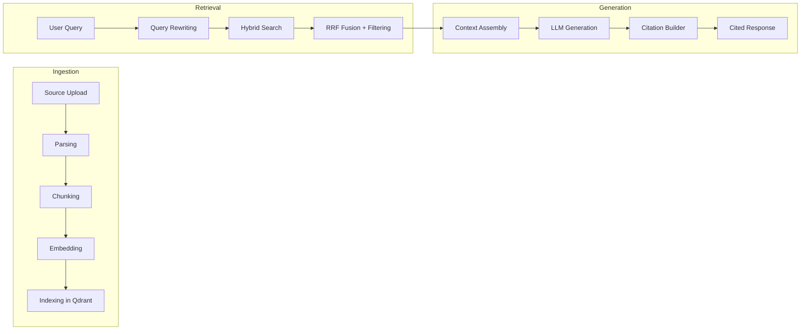
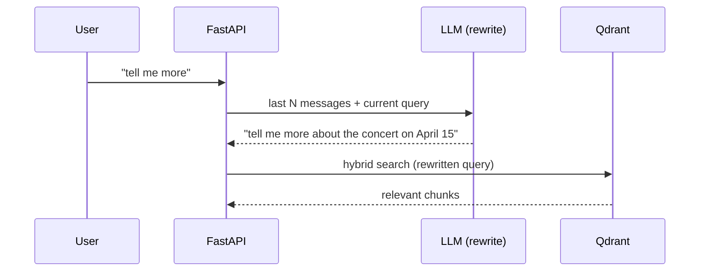

# RAG Pipeline ProxyMind

Detailed description of the Retrieval-Augmented Generation pipeline. This document complements spec.md (tools and contracts) and architecture.md (data flows and services), focusing on RAG-specific decisions: how data flows from source to cited answer.

The reference example for RAG organization is [RAGFlow](https://github.com/infiniflow/ragflow). Below describes which approaches were borrowed, which were adapted, and which were rejected.

## Pipeline overview



Three stages: **Ingestion** (offline, async worker) → **Retrieval** (online, per query) → **Generation** (online, streaming).

## Ingestion: parsing and chunking

### What was borrowed from RAGFlow

RAGFlow offers 12 template-based chunking strategies (General, Book, Paper, Laws, Q&A, Table, etc.), each adapted to the structure of a specific document type. The key idea: **chunking must respect document structure**, not just split by tokens.

ProxyMind borrows this principle through the **lightweight parser + shared TextChunker** stack — a structure-aware chunker that:

- Recognizes document hierarchy (headings, sections, paragraphs).
- Preserves anchor metadata (page, chapter, section) in each chunk.
- Merges small consecutive chunks sharing the same heading.
- Splits oversized chunks with tokenization awareness.
- Configurable chunk size targeting the 8192-token window of Gemini Embedding 2.

### What was not taken from RAGFlow

- **12 separate templates** — the lightweight parser stack covers the main cases with a single strategy. For specific formats (Laws, Resume), a custom preprocessor can be added if needed.
- **DeepDoc (RAGFlow's built-in parser)** — replaced with a product-owned lightweight parser path plus Document AI fallback when layout complexity requires external processing.
- **Elasticsearch as document engine** — RAGFlow stores text and vectors in Elasticsearch. We use Qdrant (lighter, 2–4 GB vs 8+ GB for Elasticsearch).

## Ingestion: two-tier parsing

### Path A — Gemini native

For formats that Gemini Embedding 2 accepts directly and within limits:

| Format             | Limit                     |
| ------------------ | ------------------------- |
| PDF                | ≤ 6 pages                 |
| Images (PNG, JPEG) | up to 6 files per request |
| Audio (MP3, WAV)   | ≤ 80 sec                  |
| Video (MP4)        | ≤ 120 sec                 |

Pipeline Path A:

1. **Gemini LLM (GenerateContent)** — generates the required `text_content` (text representation for LLM during retrieval).
2. **Gemini Embedding 2** — generates embedding directly from the file (retrieval-oriented task type).
3. One chunk-record for the entire file with `text_content`, anchor metadata, and a reference to the file in SeaweedFS.

**Trade-off:** Path A creates one chunk per file. This simplifies the pipeline but reduces retrieval and citation granularity to the file level (instead of page/section/timecode). For short single-topic files this is acceptable. For topically dense documents (even short ones) — it is not.

**Criterion for switching to Path B:** only PDF falls back from Path A to Path B when `text_content` exceeds `path_a_text_threshold_pdf` (default: 2000 tokens). Images stay in Path A regardless of description length. Audio and video use `path_a_text_threshold_media` (default: 500 tokens); if exceeded, ingestion fails because Path B is not yet available for those formats.

### Path B — lightweight local

For everything that does not fit Path A limits:

- Long PDFs (> 6 pages)
- DOCX, HTML, Markdown, TXT
- Long audio/video are currently rejected in the worker. A future fallback for these formats remains deferred until ASR support is wired in a later story.

Pipeline Path B:

1. **LightweightParser** — local parsing for Markdown, TXT, HTML, DOCX, and text-based PDFs.
2. **TextChunker** — shared chunking with anchor metadata preservation.
3. **Gemini Embedding 2** — generating embeddings from chunk text.
4. Multiple chunk-records, each with `text_content` and anchor metadata.

### Path C — Document AI fallback

For PDFs where lightweight extraction is insufficient:

- scanned PDFs
- layout-heavy PDFs
- explicit `processing_hint="external"`

Pipeline Path C:

1. **Google Cloud Document AI** — OCR and layout-aware parsing.
2. **TextChunker** — normalization into the same chunk contract used by Path B.
3. **Gemini Embedding 2** — generating embeddings from chunk text.
4. Multiple chunk-records with the same anchor contract and `processing_path=path_c`.

### Bulk operations

For uploading books, reindex, and bulk operations — **Gemini Batch API** (−50% cost, SLO ≤24h). For individual files — interactive API.

## Hybrid search

### Architecture

Dual-vector retrieval in Qdrant:

- **Dense vector** — Gemini Embedding 2. Semantic search.
  - **Indexing:** retrieval-oriented task type.
  - **Search:** query-oriented task type.
- **Sparse vector** — Qdrant BM25 (`language` configurable per installation). Keyword/term matching.

Both vectors are stored in a single Qdrant collection as named vectors.

### Fusion

**Reciprocal Rank Fusion (RRF)** — combining results from dense and sparse search. Qdrant supports RRF natively (see version requirements in [docs/spec.md](spec.md#data-stores)).

For reference: RAGFlow uses weighted score fusion (default 70% keyword / 30% vector). We use RRF as a more robust method that does not require weight calibration.

### Filtering

Retrieval is always scoped. Required payload filters:

- `snapshot_id` == active snapshot
- `agent_id`, `knowledge_base_id` — tenant-ready fields (required even with a single agent per instance)
- `language`, `status`, `source_type` — additional filters

All filterable fields have Qdrant payload indexes.

### Quality filtering

The relevance threshold is applied to **dense cosine similarity before RRF fusion** (`min_dense_similarity`), not to the fused RRF score. The RRF score depends on the fusion formula and ranking depth — it is not suitable as a stable absolute threshold. The exact value of `min_dense_similarity` is to be determined empirically via evals.

### Top-N selection

A limited set of chunks (top-N by RRF score) is passed to the LLM. N is a configurable parameter (balance between context completeness and prompt cost).

## Query rewriting

### Why

In multi-turn chat, queries like "tell me more" or "what about that?" are meaningless for retrieval without context. Query rewriting transforms such a query into a self-contained formulation.

### How it works



1. Before retrieval, the LLM receives the last messages of the conversation + current query.
2. The LLM returns a rewritten self-contained query.
3. The rewritten query is used for embedding and BM25 search.

The call is lightweight (small prompt, small output). A cheap/fast model can be used.

**Fail-open:** if the rewrite model times out or returns an error — retrieval proceeds with the user's original query. Query rewriting must not be a point of failure on the hot path of the chat.

## Context assembly

The prompt is assembled from multiple layers. Order and priority:

```
┌─────────────────────────────────┐
│ 1. System prompt (immutable)    │  ← system security policy
│ 2. IDENTITY.md                  │  ← who this digital twin is
│ 3. SOUL.md                      │  ← how they sound
│ 4. BEHAVIOR.md                  │  ← how they react
│ 5. PROMOTIONS.md (active only)  │  ← current promotions
│ 6. Conversation memory          │  ← recent messages + summary
│ 7. Retrieval context            │  ← chunks from Qdrant with metadata
│ 8. Current user query           │
└─────────────────────────────────┘
```

**Three types of memory are kept separate:**

- **Conversational** (layer 6) — recent messages + brief summary.
- **Operational** — language, channel, response format, active `snapshot_id` (not in prompt, but in runtime config).
- **Knowledge** (layer 7) — retrieval context from Qdrant.

**Context limit:** total prompt size is limited by the context window of the chosen LLM. When exceeded — conversational memory is reduced first (summary instead of full history), then retrieval context is reduced (fewer top-N).

## Citation protocol

Described in detail in [docs/spec.md](spec.md#citation-protocol). In brief:

1. The LLM receives chunks with `source_id` and anchor metadata.
2. The LLM references retrieved sources via `[source:N]` ordinal markers.
3. The backend substitutes real URLs (for online sources) or text citations (for offline sources).
4. The LLM **never** generates URLs on its own.

## Chunk enrichment (deferred)

### What it is

A pattern from RAGFlow (Transformer stage): before indexing, an LLM enriches each chunk with additional data:

- **Summary** — brief description of chunk contents.
- **Keywords** — keywords for BM25 recall.
- **Questions** — questions this chunk can answer.

Enriched data is indexed in the Qdrant payload. Retrieval can search not only by chunk text but also by generated questions/keywords, improving recall for queries phrased differently from the original text.

### Why deferred

1. **Cost:** enrichment increases ingestion cost by 10–20x (LLM call per chunk). With Gemini Batch API (−50%) — by 5–10x.
2. **Unknown utility:** hybrid search (dense + BM25) may provide sufficient retrieval quality without enrichment. The baseline needs to be measured on evals first.
3. **Easy rollback:** the pipeline is staged; enrichment is a separate stage between chunking and embedding. Adding it later takes 1–2 days of development without breaking the architecture.

### Implementation plan (when needed)

1. **Re-research best practices**, primarily based on RAGFlow (Transformer stage, Improvise/Precise/Balance modes, field selection for indexing). By the time of implementation, RAGFlow may have updated its approaches.
2. Add a stage to the worker pipeline: `LightweightParser/DocumentAIParser → chunks → [Enrichment] → embeddings → Qdrant`.
3. New fields in Qdrant payload: `summary`, `keywords`, `questions`.
4. Use **Gemini Batch API** for enrichment (cost minimization).
5. Update retrieval — optionally search by enriched fields.
6. Reindex existing chunks (mechanism already exists).
7. Run A/B evals: retrieval with enrichment vs without.

### Enrichment cost (approximate)

| Knowledge base size     | Without enrichment | With enrichment (Batch API) |
| ----------------------- | ------------------ | --------------------------- |
| 100 chunks (articles)   | ~$0.01–0.05        | ~$0.20–1.00                 |
| 1,000 chunks (book)     | ~$0.10–0.50        | ~$2–10                      |
| 10,000 chunks (library) | ~$1–5              | ~$20–100                    |

## Parent-child chunking (future)

### Idea

A pattern from RAGFlow (TreeRAG): for long documents (books), chunking creates a hierarchy:

- **Child chunks** (small) — indexed for precise retrieval.
- **Parent chunks** (large) — used for context expansion.

During retrieval: find the relevant child chunk, but pass its parent (or siblings) to the LLM for context completeness. This solves the problem of "found the right fragment, but there is not enough context for an answer."

### Relationship with the lightweight parser stack

The lightweight parser stack preserves the hierarchical document structure (heading levels). This creates a natural foundation for parent-child: heading level 1 → parent, heading level 2–3 → children.

### Status

Deferred. Implementation after evals, once it is clear whether flat chunking is sufficient for the typical documents of a digital twin.

## Multilingual support

ProxyMind defaults to English, but all language-dependent components are configurable:

| Component          | Configuration              | Languages                                                                                  |
| ------------------ | -------------------------- | ------------------------------------------------------------------------------------------ |
| Gemini Embedding 2 | Automatic                  | 100+ languages                                                                             |
| Qdrant BM25        | `language` in `Bm25Config` | EN, RU, DE, FR, ES, IT, PT, NL, SV, NO, DA, FI, HU, RO, TR, and others (Snowball stemmers) |
| Query rewriting    | Automatic (LLM)            | Any language supported by the LLM                                                          |
| Lightweight parser | Automatic                  | Local multilingual-friendly parsing for text-native formats                                |
| Document AI        | External fallback          | OCR and layout-aware parsing for scanned or complex PDFs                                   |

The BM25 language is set at deploy time via `.env` and applies system-wide.

**Fallback: BGE-M3** — if Qdrant BM25 shows insufficient quality for a specific language on evals, the sparse component (BM25) is replaced with the sparse output of BGE-M3. The dense component (Gemini Embedding 2) **remains unchanged**. BGE-M3 can generate dense + sparse + ColBERT in a single pass, but we use only its sparse output as a BM25 replacement. This is a minimal change: only the sparse vector generation method changes during indexing; the Qdrant collection schema (named vectors) and retrieval pipeline remain the same.

## Implementation defaults

Starting values for v1. All configurable. Refined based on eval results.

| Parameter                     | Default                    | Description                                                                                                                                                                                                                   |
| ----------------------------- | -------------------------- | ----------------------------------------------------------------------------------------------------------------------------------------------------------------------------------------------------------------------------- |
| `retrieval_top_n`             | 5                          | Number of chunks passed to the LLM                                                                                                                                                                                            |
| `retrieval_context_budget`    | 4096 tokens                | Maximum retrieval context budget in the prompt                                                                                                                                                                                |
| `min_dense_similarity`        | to be determined via evals | Minimum cosine similarity for dense vector. Applied **before** RRF fusion. The RRF score is not used as a threshold — it depends on the fusion formula and ranking depth and is not a stable metric for an absolute threshold |
| `min_retrieved_chunks`        | 1                          | Minimum chunks required for an answer. If retrieval returns fewer — the digital twin responds "no answer found in the knowledge base"                                                                                         |
| `rewrite_timeout_ms`          | 3000                       | Query rewriting timeout (fail-open on exceed)                                                                                                                                                                                 |
| `rewrite_token_budget`        | 2048 tokens                | Maximum prompt budget for query rewriting (history + query). If history is longer — truncated to the most recent messages that fit within the budget                                                                          |
| `max_citations_per_response`  | 5                          | Maximum citations per response                                                                                                                                                                                                |
| `max_promotions_per_response` | 1                          | Maximum commercial recommendations per response                                                                                                                                                                               |
| `path_a_text_threshold_pdf`   | 2000 tokens                | text_content threshold for PDF: Path A → Path B                                                                                                                                                                               |
| `path_a_text_threshold_media` | 500 tokens                 | text_content threshold for audio/video only. Over-threshold audio/video fail ingestion because Path B is not yet available; images ignore this threshold and remain single-chunk Path A                                       |
| `rewrite_history_messages`    | 10                         | Maximum recent messages for query rewriting (additionally limited by `rewrite_token_budget`)                                                                                                                                  |
| `bm25_language`               | english                    | Qdrant BM25 language (Snowball stemmer)                                                                                                                                                                                       |

## Quality metrics

### Retrieval metrics

- **Precision@K** — fraction of relevant chunks among the top-K results.
- **Recall@K** — fraction of relevant chunks found out of all relevant chunks.
- **MRR (Mean Reciprocal Rank)** — how highly the first relevant result is ranked.

### Answer metrics

- **Groundedness** — fraction of statements in the response supported by retrieval chunks.
- **Citation accuracy** — correctness of `source_id` mapping to actual sources.
- **Persona fidelity** — response alignment with persona files (style, tone, boundaries).
- **Refusal quality** — appropriateness of refusals when knowledge is absent.

### How to measure

Two testing tracks (see [docs/spec.md](spec.md#testing-strategy)):

- **CI (deterministic)** — mock retrieval results, verify citation builder, prompt assembly, snapshot filtering.
- **Evals (on real models)** — run test conversations, manual/semi-automated assessment of answer metrics. Run separately, do not block CI.

Evals determine whether upgrade paths are needed: chunk enrichment, parent-child chunking, BGE-M3 fallback.
