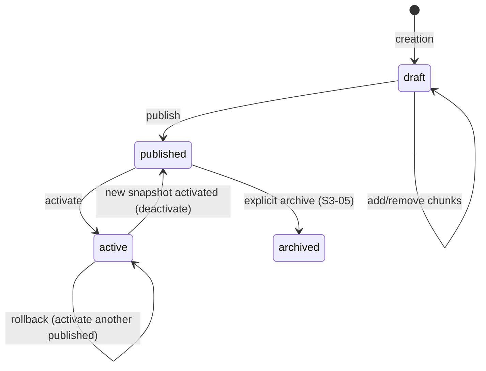

# S2-03: Knowledge Snapshot (Minimal) Implementation Plan

> **For agentic workers:** REQUIRED SUB-SKILL: Use superpowers:subagent-driven-development (recommended) or superpowers:executing-plans to implement this plan task-by-task. Steps use checkbox (`- [ ]`) syntax for tracking.

**Goal:** Implement snapshot lifecycle (draft → published → active) with Admin API endpoints, concurrency guards, and ingestion-side immutability enforcement.

**Architecture:** State machine in SnapshotService handles all transitions with SELECT FOR UPDATE locking and live SQL guards. A new partial unique index enforces single-active-per-scope at DB level. Ingestion and publish share the same lock protocol (FOR UPDATE on snapshot row) — they cannot run concurrently on the same snapshot, which guarantees published snapshot immutability.

**Tech Stack:** Python 3.14, FastAPI, SQLAlchemy 2.x, Alembic, asyncpg, pytest, testcontainers

**Spec:** `docs/superpowers/specs/2026-03-19-s2-03-knowledge-snapshot-design.md`

---

## File Structure

| File | Responsibility | Action |
|------|---------------|--------|
| `backend/app/db/models/knowledge.py` | Add `uq_one_active_per_scope` partial unique index to KnowledgeSnapshot | Modify |
| `backend/migrations/versions/005_add_active_snapshot_unique_index.py` | Migration for the new index | Create |
| `backend/app/services/snapshot.py` | State machine: list, get, publish, activate, ensure_draft_or_rebind | Modify |
| `backend/app/api/snapshot_schemas.py` | Pydantic response/query schemas for snapshot endpoints | Create |
| `backend/app/api/admin.py` | 4 new snapshot endpoints | Modify |
| `backend/app/api/dependencies.py` | Add `get_snapshot_service` dependency | Modify |
| `backend/app/workers/tasks/ingestion.py` | Add snapshot status re-check before chunk persistence | Modify |
| `docs/architecture.md` | Update snapshot lifecycle state diagram | Modify |
| `docs/plan.md` | Update S2-03 and S3-05 task lists | Modify |
| `backend/tests/integration/test_snapshot_lifecycle.py` | Lifecycle + concurrency + isolation tests | Create |
| `backend/tests/integration/test_snapshot_api.py` | API endpoint tests | Create |

---

## Task 1: Alembic migration — active snapshot unique index

**Files:**
- Modify: `backend/app/db/models/knowledge.py:143-153`
- Create: `backend/migrations/versions/005_add_active_snapshot_unique_index.py`

- [ ] **Step 1: Add index to SQLAlchemy model**

In `backend/app/db/models/knowledge.py`, add the second partial unique index to `KnowledgeSnapshot.__table_args__`:

```python
class KnowledgeSnapshot(PrimaryKeyMixin, TenantMixin, KnowledgeScopeMixin, TimestampMixin, Base):
    __tablename__ = "knowledge_snapshots"
    __table_args__ = (
        Index(
            "uq_one_draft_per_scope",
            "agent_id",
            "knowledge_base_id",
            unique=True,
            postgresql_where=text("status = 'draft'"),
        ),
        Index(
            "uq_one_active_per_scope",
            "agent_id",
            "knowledge_base_id",
            unique=True,
            postgresql_where=text("status = 'active'"),
        ),
    )
```

- [ ] **Step 2: Generate Alembic migration**

Run: `cd /Users/techmeat/www/projects/agentic-depot/proxymind/backend && uv run alembic revision --autogenerate -m "add_active_snapshot_unique_index"`

Review the generated migration. It should contain:

```python
def upgrade() -> None:
    op.create_index(
        "uq_one_active_per_scope",
        "knowledge_snapshots",
        ["agent_id", "knowledge_base_id"],
        unique=True,
        postgresql_where=sa.text("status = 'active'"),
    )

def downgrade() -> None:
    op.drop_index(
        "uq_one_active_per_scope",
        table_name="knowledge_snapshots",
    )
```

- [ ] **Step 3: Run migration and verify**

Run: `cd /Users/techmeat/www/projects/agentic-depot/proxymind/backend && uv run alembic upgrade head`
Expected: migration applies without errors.

- [ ] **Step 4: Run existing tests to ensure no regression**

Run: `cd /Users/techmeat/www/projects/agentic-depot/proxymind/backend && uv run pytest tests/integration/test_snapshot.py -v`
Expected: all 3 existing tests pass.

- [ ] **Step 5: Propose commit** (do NOT commit without user permission)

Suggested message: `feat(db): add partial unique index for single active snapshot per scope (S2-03)`

---

## Task 2: SnapshotService — publish and activate logic

**Files:**
- Modify: `backend/app/services/snapshot.py`

- [ ] **Step 1: Write failing test — publish valid draft**

Create `backend/tests/integration/test_snapshot_lifecycle.py`:

```python
from __future__ import annotations

import uuid

import pytest
from sqlalchemy import func, select
from sqlalchemy.ext.asyncio import AsyncSession, async_sessionmaker

from app.core.constants import DEFAULT_AGENT_ID, DEFAULT_KNOWLEDGE_BASE_ID
from app.db.models import Agent, Chunk, Document, DocumentVersion, KnowledgeSnapshot
from app.db.models.enums import (
    ChunkStatus,
    DocumentStatus,
    DocumentVersionStatus,
    SnapshotStatus,
)
from app.services.snapshot import SnapshotService


async def _create_indexed_chunk(
    session: AsyncSession,
    *,
    snapshot_id: uuid.UUID,
    chunk_index: int = 0,
) -> Chunk:
    """Create a valid Chunk with required parent records (Document + DocumentVersion).

    FK constraints require document_version_id to reference a real DocumentVersion.
    """
    source_id = uuid.uuid7()
    doc = Document(
        id=uuid.uuid7(),
        owner_id=None,
        agent_id=DEFAULT_AGENT_ID,
        source_id=source_id,
        title="Test document",
        status=DocumentStatus.READY,
    )
    doc_version = DocumentVersion(
        id=uuid.uuid7(),
        document_id=doc.id,
        version_number=1,
        file_path="test/path.md",
        status=DocumentVersionStatus.READY,
    )
    # Source is also required by FK on Document.source_id — create a minimal one
    from app.db.models import Source
    from app.db.models.enums import SourceStatus, SourceType

    source = Source(
        id=source_id,
        owner_id=None,
        agent_id=DEFAULT_AGENT_ID,
        knowledge_base_id=DEFAULT_KNOWLEDGE_BASE_ID,
        source_type=SourceType.MARKDOWN,
        title="Test source",
        file_path="test/source.md",
        status=SourceStatus.READY,
    )
    chunk = Chunk(
        id=uuid.uuid7(),
        owner_id=None,
        agent_id=DEFAULT_AGENT_ID,
        knowledge_base_id=DEFAULT_KNOWLEDGE_BASE_ID,
        document_version_id=doc_version.id,
        snapshot_id=snapshot_id,
        source_id=source_id,
        chunk_index=chunk_index,
        text_content="test chunk content",
        token_count=10,
        status=ChunkStatus.INDEXED,
    )
    session.add_all([source, doc, doc_version, chunk])
    return chunk


@pytest.mark.asyncio
@pytest.mark.usefixtures("committed_data_cleanup")
async def test_publish_valid_draft(
    session_factory: async_sessionmaker[AsyncSession],
) -> None:
    service = SnapshotService()

    async with session_factory() as session:
        snapshot = await service.get_or_create_draft(
            session,
            agent_id=DEFAULT_AGENT_ID,
            knowledge_base_id=DEFAULT_KNOWLEDGE_BASE_ID,
        )
        await _create_indexed_chunk(session, snapshot_id=snapshot.id)
        await session.commit()

    async with session_factory() as session:
        published = await service.publish(session, snapshot.id)
        await session.commit()

    assert published.status == SnapshotStatus.PUBLISHED
    assert published.published_at is not None
```

- [ ] **Step 2: Run test to verify it fails**

Run: `cd /Users/techmeat/www/projects/agentic-depot/proxymind/backend && uv run pytest tests/integration/test_snapshot_lifecycle.py::test_publish_valid_draft -v`
Expected: FAIL — `AttributeError: 'SnapshotService' object has no attribute 'publish'`

- [ ] **Step 3: Add new methods to SnapshotService**

Add the following methods to `backend/app/services/snapshot.py` (keep existing `get_or_create_draft` unchanged, add new methods below it):

```python
from __future__ import annotations

import uuid
from datetime import datetime, timezone

from fastapi import HTTPException
from sqlalchemy import func, select, update
from sqlalchemy.dialects.postgresql import insert
from sqlalchemy.exc import IntegrityError
from sqlalchemy.ext.asyncio import AsyncSession

from app.db.models import Agent, Chunk, KnowledgeSnapshot
from app.db.models.enums import ChunkStatus, SnapshotStatus


class SnapshotService:
    async def get_or_create_draft(
        self,
        session: AsyncSession,
        *,
        agent_id: uuid.UUID,
        knowledge_base_id: uuid.UUID,
    ) -> KnowledgeSnapshot:
        statement = (
            insert(KnowledgeSnapshot)
            .values(
                id=uuid.uuid7(),
                agent_id=agent_id,
                knowledge_base_id=knowledge_base_id,
                name="Auto draft",
                description="Automatically created draft snapshot for ingestion.",
                status=SnapshotStatus.DRAFT,
            )
            .on_conflict_do_nothing(
                index_elements=["agent_id", "knowledge_base_id"],
                index_where=KnowledgeSnapshot.status == SnapshotStatus.DRAFT,
            )
        )
        await session.execute(statement)

        snapshot = await session.scalar(
            select(KnowledgeSnapshot).where(
                KnowledgeSnapshot.agent_id == agent_id,
                KnowledgeSnapshot.knowledge_base_id == knowledge_base_id,
                KnowledgeSnapshot.status == SnapshotStatus.DRAFT,
            )
        )
        if snapshot is None:
            raise RuntimeError("Failed to create or load draft knowledge snapshot")
        return snapshot

    async def get_snapshot(
        self,
        session: AsyncSession,
        snapshot_id: uuid.UUID,
    ) -> KnowledgeSnapshot | None:
        return await session.get(KnowledgeSnapshot, snapshot_id)

    async def list_snapshots(
        self,
        session: AsyncSession,
        *,
        agent_id: uuid.UUID,
        knowledge_base_id: uuid.UUID,
        statuses: list[SnapshotStatus] | None = None,
        include_archived: bool = False,
    ) -> list[KnowledgeSnapshot]:
        query = select(KnowledgeSnapshot).where(
            KnowledgeSnapshot.agent_id == agent_id,
            KnowledgeSnapshot.knowledge_base_id == knowledge_base_id,
        )

        if statuses:
            query = query.where(KnowledgeSnapshot.status.in_(statuses))
            # If archived explicitly requested via statuses, show it
            # regardless of include_archived flag
        elif not include_archived:
            query = query.where(KnowledgeSnapshot.status != SnapshotStatus.ARCHIVED)

        query = query.order_by(KnowledgeSnapshot.created_at.desc())
        result = await session.scalars(query)
        return list(result.all())

    async def publish(
        self,
        session: AsyncSession,
        snapshot_id: uuid.UUID,
        *,
        activate: bool = False,
    ) -> KnowledgeSnapshot:
        # Lock the row to serialize concurrent publishes
        snapshot = await session.scalar(
            select(KnowledgeSnapshot)
            .where(KnowledgeSnapshot.id == snapshot_id)
            .with_for_update()
        )
        if snapshot is None:
            raise HTTPException(status_code=404, detail="Snapshot not found")

        if snapshot.status != SnapshotStatus.DRAFT:
            raise HTTPException(
                status_code=409,
                detail=f"Cannot publish: snapshot status is '{snapshot.status.value}', expected 'draft'",
            )

        # Guard: live SQL query — indexed chunks must exist
        indexed_count = await session.scalar(
            select(func.count())
            .select_from(Chunk)
            .where(Chunk.snapshot_id == snapshot_id, Chunk.status == ChunkStatus.INDEXED)
        )
        if not indexed_count:
            raise HTTPException(
                status_code=422,
                detail="Cannot publish: snapshot has no indexed chunks",
            )

        # Guard: live SQL query — no pending/failed chunks
        non_indexed_count = await session.scalar(
            select(func.count())
            .select_from(Chunk)
            .where(Chunk.snapshot_id == snapshot_id, Chunk.status != ChunkStatus.INDEXED)
        )
        if non_indexed_count:
            raise HTTPException(
                status_code=422,
                detail=f"Cannot publish: {non_indexed_count} chunks are still processing",
            )

        snapshot.status = SnapshotStatus.PUBLISHED
        snapshot.published_at = datetime.now(timezone.utc)

        if activate:
            await self._do_activate(session, snapshot)

        return snapshot

    async def activate(
        self,
        session: AsyncSession,
        snapshot_id: uuid.UUID,
    ) -> KnowledgeSnapshot:
        snapshot = await session.scalar(
            select(KnowledgeSnapshot)
            .where(KnowledgeSnapshot.id == snapshot_id)
            .with_for_update()
        )
        if snapshot is None:
            raise HTTPException(status_code=404, detail="Snapshot not found")

        if snapshot.status != SnapshotStatus.PUBLISHED:
            raise HTTPException(
                status_code=409,
                detail=f"Cannot activate: snapshot status is '{snapshot.status.value}', expected 'published'",
            )

        await self._do_activate(session, snapshot)
        return snapshot

    async def _do_activate(
        self,
        session: AsyncSession,
        snapshot: KnowledgeSnapshot,
    ) -> None:
        # Deactivate current active snapshot (if any) — return to published pool
        current_active = await session.scalar(
            select(KnowledgeSnapshot)
            .where(
                KnowledgeSnapshot.agent_id == snapshot.agent_id,
                KnowledgeSnapshot.knowledge_base_id == snapshot.knowledge_base_id,
                KnowledgeSnapshot.status == SnapshotStatus.ACTIVE,
            )
            .with_for_update()
        )
        if current_active is not None:
            current_active.status = SnapshotStatus.PUBLISHED

        # Activate the new snapshot
        snapshot.status = SnapshotStatus.ACTIVE
        snapshot.activated_at = datetime.now(timezone.utc)

        # Update Agent.active_snapshot_id
        await session.execute(
            update(Agent)
            .where(Agent.id == snapshot.agent_id)
            .values(active_snapshot_id=snapshot.id)
        )

        # Flush to catch unique constraint violation from uq_one_active_per_scope
        # as a safety net for concurrent activate race conditions
        try:
            await session.flush()
        except IntegrityError:
            raise HTTPException(
                status_code=409,
                detail="Another snapshot is being activated concurrently, retry",
            )

    async def ensure_draft_or_rebind(
        self,
        session: AsyncSession,
        snapshot_id: uuid.UUID,
        *,
        agent_id: uuid.UUID,
        knowledge_base_id: uuid.UUID,
    ) -> KnowledgeSnapshot:
        """Always returns a FOR UPDATE-locked DRAFT snapshot.

        1. Acquires FOR UPDATE on the given snapshot_id.
        2. If still DRAFT — returns it (locked).
        3. If not DRAFT — obtains/creates a new draft via get_or_create_draft,
           then acquires FOR UPDATE on the new draft before returning it.

        The caller inserts chunks under this lock. The lock is held until
        session.commit(), which serializes with publish() on the same row.
        """
        snapshot = await session.scalar(
            select(KnowledgeSnapshot)
            .where(KnowledgeSnapshot.id == snapshot_id)
            .with_for_update()
        )
        if snapshot is not None and snapshot.status == SnapshotStatus.DRAFT:
            return snapshot

        # Snapshot was published/activated between get_or_create_draft and now.
        # Get or create a new draft, then lock it too.
        new_draft = await self.get_or_create_draft(
            session,
            agent_id=agent_id,
            knowledge_base_id=knowledge_base_id,
        )
        # Acquire FOR UPDATE on the new draft to maintain the lock invariant
        locked_draft = await session.scalar(
            select(KnowledgeSnapshot)
            .where(KnowledgeSnapshot.id == new_draft.id)
            .with_for_update()
        )
        if locked_draft is None or locked_draft.status != SnapshotStatus.DRAFT:
            raise RuntimeError("Failed to acquire locked draft snapshot after rebind")
        return locked_draft
```

- [ ] **Step 4: Run the test again**

Run: `cd /Users/techmeat/www/projects/agentic-depot/proxymind/backend && uv run pytest tests/integration/test_snapshot_lifecycle.py::test_publish_valid_draft -v`
Expected: PASS

- [ ] **Step 5: Write and run additional lifecycle tests**

Add to `backend/tests/integration/test_snapshot_lifecycle.py`:

```python
@pytest.mark.asyncio
@pytest.mark.usefixtures("committed_data_cleanup")
async def test_publish_empty_draft_returns_422(
    session_factory: async_sessionmaker[AsyncSession],
) -> None:
    service = SnapshotService()

    async with session_factory() as session:
        snapshot = await service.get_or_create_draft(
            session,
            agent_id=DEFAULT_AGENT_ID,
            knowledge_base_id=DEFAULT_KNOWLEDGE_BASE_ID,
        )
        await session.commit()

    async with session_factory() as session:
        with pytest.raises(HTTPException) as exc_info:
            await service.publish(session, snapshot.id)
        assert exc_info.value.status_code == 422
        assert "no indexed chunks" in exc_info.value.detail


@pytest.mark.asyncio
@pytest.mark.usefixtures("committed_data_cleanup")
async def test_publish_draft_with_pending_chunks_returns_422(
    session_factory: async_sessionmaker[AsyncSession],
) -> None:
    service = SnapshotService()

    async with session_factory() as session:
        snapshot = await service.get_or_create_draft(
            session,
            agent_id=DEFAULT_AGENT_ID,
            knowledge_base_id=DEFAULT_KNOWLEDGE_BASE_ID,
        )
        indexed = await _create_indexed_chunk(session, snapshot_id=snapshot.id, chunk_index=0)
        # Add a PENDING chunk reusing the same parent records (valid FK)
        session.add(
            Chunk(
                id=uuid.uuid7(),
                owner_id=None,
                agent_id=DEFAULT_AGENT_ID,
                knowledge_base_id=DEFAULT_KNOWLEDGE_BASE_ID,
                document_version_id=indexed.document_version_id,
                snapshot_id=snapshot.id,
                source_id=indexed.source_id,
                chunk_index=1,
                text_content="pending chunk",
                token_count=5,
                status=ChunkStatus.PENDING,
            )
        )
        await session.commit()

    async with session_factory() as session:
        with pytest.raises(HTTPException) as exc_info:
            await service.publish(session, snapshot.id)
        assert exc_info.value.status_code == 422
        assert "1 chunks are still processing" in exc_info.value.detail


@pytest.mark.asyncio
@pytest.mark.usefixtures("committed_data_cleanup")
async def test_publish_non_draft_returns_409(
    session_factory: async_sessionmaker[AsyncSession],
) -> None:
    service = SnapshotService()

    async with session_factory() as session:
        snapshot = await service.get_or_create_draft(
            session,
            agent_id=DEFAULT_AGENT_ID,
            knowledge_base_id=DEFAULT_KNOWLEDGE_BASE_ID,
        )
        await _create_indexed_chunk(session, snapshot_id=snapshot.id)
        await session.commit()

    async with session_factory() as session:
        await service.publish(session, snapshot.id)
        await session.commit()

    async with session_factory() as session:
        with pytest.raises(HTTPException) as exc_info:
            await service.publish(session, snapshot.id)
        assert exc_info.value.status_code == 409
        assert "published" in exc_info.value.detail


@pytest.mark.asyncio
@pytest.mark.usefixtures("committed_data_cleanup")
async def test_activate_published_snapshot(
    session_factory: async_sessionmaker[AsyncSession],
) -> None:
    service = SnapshotService()

    async with session_factory() as session:
        snapshot = await service.get_or_create_draft(
            session,
            agent_id=DEFAULT_AGENT_ID,
            knowledge_base_id=DEFAULT_KNOWLEDGE_BASE_ID,
        )
        await _create_indexed_chunk(session, snapshot_id=snapshot.id)
        await session.commit()

    async with session_factory() as session:
        await service.publish(session, snapshot.id)
        await session.commit()

    async with session_factory() as session:
        activated = await service.activate(session, snapshot.id)
        await session.commit()

    assert activated.status == SnapshotStatus.ACTIVE
    assert activated.activated_at is not None

    async with session_factory() as session:
        agent = await session.get(Agent, DEFAULT_AGENT_ID)
        assert agent is not None
        assert agent.active_snapshot_id == snapshot.id


@pytest.mark.asyncio
@pytest.mark.usefixtures("committed_data_cleanup")
async def test_activate_draft_returns_409(
    session_factory: async_sessionmaker[AsyncSession],
) -> None:
    service = SnapshotService()

    async with session_factory() as session:
        snapshot = await service.get_or_create_draft(
            session,
            agent_id=DEFAULT_AGENT_ID,
            knowledge_base_id=DEFAULT_KNOWLEDGE_BASE_ID,
        )
        await session.commit()

    async with session_factory() as session:
        with pytest.raises(HTTPException) as exc_info:
            await service.activate(session, snapshot.id)
        assert exc_info.value.status_code == 409


@pytest.mark.asyncio
@pytest.mark.usefixtures("committed_data_cleanup")
async def test_activate_deactivates_previous_active(
    session_factory: async_sessionmaker[AsyncSession],
) -> None:
    service = SnapshotService()

    # Create and publish+activate first snapshot
    async with session_factory() as session:
        snap1 = await service.get_or_create_draft(
            session,
            agent_id=DEFAULT_AGENT_ID,
            knowledge_base_id=DEFAULT_KNOWLEDGE_BASE_ID,
        )
        await _create_indexed_chunk(session, snapshot_id=snap1.id)
        await session.commit()

    async with session_factory() as session:
        await service.publish(session, snap1.id, activate=True)
        await session.commit()

    # Create and publish+activate second snapshot
    async with session_factory() as session:
        snap2 = await service.get_or_create_draft(
            session,
            agent_id=DEFAULT_AGENT_ID,
            knowledge_base_id=DEFAULT_KNOWLEDGE_BASE_ID,
        )
        await _create_indexed_chunk(session, snapshot_id=snap2.id)
        await session.commit()

    async with session_factory() as session:
        await service.publish(session, snap2.id, activate=True)
        await session.commit()

    # Verify: snap1 returned to PUBLISHED, snap2 is ACTIVE
    async with session_factory() as session:
        snap1_reloaded = await session.get(KnowledgeSnapshot, snap1.id)
        snap2_reloaded = await session.get(KnowledgeSnapshot, snap2.id)
        agent = await session.get(Agent, DEFAULT_AGENT_ID)

    assert snap1_reloaded is not None
    assert snap1_reloaded.status == SnapshotStatus.PUBLISHED
    assert snap2_reloaded is not None
    assert snap2_reloaded.status == SnapshotStatus.ACTIVE
    assert agent is not None
    assert agent.active_snapshot_id == snap2.id


@pytest.mark.asyncio
@pytest.mark.usefixtures("committed_data_cleanup")
async def test_publish_with_activate_flag(
    session_factory: async_sessionmaker[AsyncSession],
) -> None:
    service = SnapshotService()

    async with session_factory() as session:
        snapshot = await service.get_or_create_draft(
            session,
            agent_id=DEFAULT_AGENT_ID,
            knowledge_base_id=DEFAULT_KNOWLEDGE_BASE_ID,
        )
        await _create_indexed_chunk(session, snapshot_id=snapshot.id)
        await session.commit()

    async with session_factory() as session:
        result = await service.publish(session, snapshot.id, activate=True)
        await session.commit()

    assert result.status == SnapshotStatus.ACTIVE
    assert result.published_at is not None
    assert result.activated_at is not None


@pytest.mark.asyncio
@pytest.mark.usefixtures("committed_data_cleanup")
async def test_list_snapshots_excludes_archived_by_default(
    session_factory: async_sessionmaker[AsyncSession],
) -> None:
    service = SnapshotService()

    async with session_factory() as session:
        session.add(
            KnowledgeSnapshot(
                id=uuid.uuid7(),
                agent_id=DEFAULT_AGENT_ID,
                knowledge_base_id=DEFAULT_KNOWLEDGE_BASE_ID,
                name="Archived",
                status=SnapshotStatus.ARCHIVED,
            )
        )
        session.add(
            KnowledgeSnapshot(
                id=uuid.uuid7(),
                agent_id=DEFAULT_AGENT_ID,
                knowledge_base_id=DEFAULT_KNOWLEDGE_BASE_ID,
                name="Published",
                status=SnapshotStatus.PUBLISHED,
            )
        )
        await session.commit()

    async with session_factory() as session:
        snapshots = await service.list_snapshots(
            session,
            agent_id=DEFAULT_AGENT_ID,
            knowledge_base_id=DEFAULT_KNOWLEDGE_BASE_ID,
        )

    names = [s.name for s in snapshots]
    assert "Published" in names
    assert "Archived" not in names


@pytest.mark.asyncio
@pytest.mark.usefixtures("committed_data_cleanup")
async def test_list_snapshots_with_status_filter(
    session_factory: async_sessionmaker[AsyncSession],
) -> None:
    service = SnapshotService()

    async with session_factory() as session:
        session.add(
            KnowledgeSnapshot(
                id=uuid.uuid7(),
                agent_id=DEFAULT_AGENT_ID,
                knowledge_base_id=DEFAULT_KNOWLEDGE_BASE_ID,
                name="Published",
                status=SnapshotStatus.PUBLISHED,
            )
        )
        snap_draft = await service.get_or_create_draft(
            session,
            agent_id=DEFAULT_AGENT_ID,
            knowledge_base_id=DEFAULT_KNOWLEDGE_BASE_ID,
        )
        await session.commit()

    async with session_factory() as session:
        drafts = await service.list_snapshots(
            session,
            agent_id=DEFAULT_AGENT_ID,
            knowledge_base_id=DEFAULT_KNOWLEDGE_BASE_ID,
            statuses=[SnapshotStatus.DRAFT],
        )

    assert len(drafts) == 1
    assert drafts[0].status == SnapshotStatus.DRAFT


@pytest.mark.asyncio
@pytest.mark.usefixtures("committed_data_cleanup")
async def test_ensure_draft_or_rebind_returns_same_draft(
    session_factory: async_sessionmaker[AsyncSession],
) -> None:
    service = SnapshotService()

    async with session_factory() as session:
        snapshot = await service.get_or_create_draft(
            session,
            agent_id=DEFAULT_AGENT_ID,
            knowledge_base_id=DEFAULT_KNOWLEDGE_BASE_ID,
        )
        await session.commit()

    async with session_factory() as session:
        result = await service.ensure_draft_or_rebind(
            session,
            snapshot.id,
            agent_id=DEFAULT_AGENT_ID,
            knowledge_base_id=DEFAULT_KNOWLEDGE_BASE_ID,
        )
        assert result.id == snapshot.id
        assert result.status == SnapshotStatus.DRAFT
        await session.commit()


@pytest.mark.asyncio
@pytest.mark.usefixtures("committed_data_cleanup")
async def test_ensure_draft_or_rebind_creates_new_draft_after_publish(
    session_factory: async_sessionmaker[AsyncSession],
) -> None:
    service = SnapshotService()

    async with session_factory() as session:
        snapshot = await service.get_or_create_draft(
            session,
            agent_id=DEFAULT_AGENT_ID,
            knowledge_base_id=DEFAULT_KNOWLEDGE_BASE_ID,
        )
        await _create_indexed_chunk(session, snapshot_id=snapshot.id)
        await session.commit()

    async with session_factory() as session:
        await service.publish(session, snapshot.id)
        await session.commit()

    async with session_factory() as session:
        result = await service.ensure_draft_or_rebind(
            session,
            snapshot.id,
            agent_id=DEFAULT_AGENT_ID,
            knowledge_base_id=DEFAULT_KNOWLEDGE_BASE_ID,
        )
        assert result.id != snapshot.id
        assert result.status == SnapshotStatus.DRAFT
        await session.commit()


@pytest.mark.asyncio
@pytest.mark.usefixtures("committed_data_cleanup")
async def test_activate_active_returns_409(
    session_factory: async_sessionmaker[AsyncSession],
) -> None:
    """Activating an already-active snapshot returns 409 (status is not PUBLISHED)."""
    service = SnapshotService()

    async with session_factory() as session:
        snapshot = await service.get_or_create_draft(
            session,
            agent_id=DEFAULT_AGENT_ID,
            knowledge_base_id=DEFAULT_KNOWLEDGE_BASE_ID,
        )
        await _create_indexed_chunk(session, snapshot_id=snapshot.id)
        await session.commit()

    async with session_factory() as session:
        await service.publish(session, snapshot.id, activate=True)
        await session.commit()

    async with session_factory() as session:
        with pytest.raises(HTTPException) as exc_info:
            await service.activate(session, snapshot.id)
        assert exc_info.value.status_code == 409


@pytest.mark.asyncio
@pytest.mark.usefixtures("committed_data_cleanup")
async def test_activate_archived_returns_409(
    session_factory: async_sessionmaker[AsyncSession],
) -> None:
    service = SnapshotService()

    async with session_factory() as session:
        session.add(
            KnowledgeSnapshot(
                id=uuid.uuid7(),
                agent_id=DEFAULT_AGENT_ID,
                knowledge_base_id=DEFAULT_KNOWLEDGE_BASE_ID,
                name="Archived",
                status=SnapshotStatus.ARCHIVED,
            )
        )
        await session.commit()

    async with session_factory() as session:
        archived = await session.scalar(
            select(KnowledgeSnapshot).where(
                KnowledgeSnapshot.status == SnapshotStatus.ARCHIVED,
            )
        )
        with pytest.raises(HTTPException) as exc_info:
            await service.activate(session, archived.id)
        assert exc_info.value.status_code == 409
```

Note on `chunk_count`: the advisory `chunk_count` column is already incremented by the ingestion worker (S2-02). The `SnapshotResponse` returns this value for display. Publish guards use live SQL queries, not this counter.

Note on concurrency tests: full concurrency tests (e.g., `asyncio.gather` for parallel activate) require separate DB connections and are better suited for the manual smoke test or a dedicated concurrency test harness. The `uq_one_active_per_scope` index + IntegrityError catch provide the DB-level safety net. Sequential tests above verify the state machine logic thoroughly.

Note on Qdrant isolation: the spec's "isolation proof" test requires both Qdrant and PostgreSQL fixtures together. This will be verified during Task 7 manual smoke test. The Qdrant payload already includes `snapshot_id` (verified in S2-02 tests). The lifecycle tests above prove that `Agent.active_snapshot_id` correctly tracks the active snapshot, which retrieval (S2-04) will use for filtering.

- [ ] **Step 6: Run all lifecycle tests**

Run: `cd /Users/techmeat/www/projects/agentic-depot/proxymind/backend && uv run pytest tests/integration/test_snapshot_lifecycle.py -v`
Expected: all tests PASS.

- [ ] **Step 7: Propose commit** (do NOT commit without user permission)

Suggested message: `feat(service): add snapshot publish/activate state machine with concurrency guards (S2-03)`

---

## Task 3: Pydantic schemas for snapshot API

**Files:**
- Create: `backend/app/api/snapshot_schemas.py`

- [ ] **Step 1: Create snapshot schemas**

```python
from __future__ import annotations

import uuid
from datetime import datetime

from pydantic import BaseModel, ConfigDict

from app.db.models.enums import SnapshotStatus


class SnapshotResponse(BaseModel):
    model_config = ConfigDict(from_attributes=True)

    id: uuid.UUID
    agent_id: uuid.UUID | None
    knowledge_base_id: uuid.UUID | None
    name: str
    description: str | None
    status: SnapshotStatus
    chunk_count: int
    created_at: datetime
    updated_at: datetime
    published_at: datetime | None
    activated_at: datetime | None
    archived_at: datetime | None
```

- [ ] **Step 2: Propose commit** (do NOT commit without user permission)

Suggested message: `feat(api): add Pydantic schemas for snapshot endpoints (S2-03)`

---

## Task 4: Admin API — snapshot endpoints

**Files:**
- Modify: `backend/app/api/dependencies.py`
- Modify: `backend/app/api/admin.py`

- [ ] **Step 1: Write failing API test — list snapshots**

Create `backend/tests/integration/test_snapshot_api.py`:

```python
from __future__ import annotations

import uuid

import httpx
import pytest
from sqlalchemy.ext.asyncio import AsyncSession, async_sessionmaker

from app.core.constants import DEFAULT_AGENT_ID, DEFAULT_KNOWLEDGE_BASE_ID
from app.db.models import KnowledgeSnapshot
from app.db.models.enums import SnapshotStatus
from app.services.snapshot import SnapshotService

# Import the shared helper from lifecycle tests
from tests.integration.test_snapshot_lifecycle import _create_indexed_chunk


@pytest.mark.asyncio
@pytest.mark.usefixtures("committed_data_cleanup")
async def test_list_snapshots(
    api_client: httpx.AsyncClient,
    session_factory: async_sessionmaker[AsyncSession],
) -> None:
    async with session_factory() as session:
        service = SnapshotService()
        await service.get_or_create_draft(
            session,
            agent_id=DEFAULT_AGENT_ID,
            knowledge_base_id=DEFAULT_KNOWLEDGE_BASE_ID,
        )
        await session.commit()

    response = await api_client.get("/api/admin/snapshots")
    assert response.status_code == 200
    data = response.json()
    assert len(data) >= 1
    assert data[0]["status"] == "draft"


@pytest.mark.asyncio
@pytest.mark.usefixtures("committed_data_cleanup")
async def test_get_snapshot(
    api_client: httpx.AsyncClient,
    session_factory: async_sessionmaker[AsyncSession],
) -> None:
    async with session_factory() as session:
        service = SnapshotService()
        snapshot = await service.get_or_create_draft(
            session,
            agent_id=DEFAULT_AGENT_ID,
            knowledge_base_id=DEFAULT_KNOWLEDGE_BASE_ID,
        )
        await session.commit()

    response = await api_client.get(f"/api/admin/snapshots/{snapshot.id}")
    assert response.status_code == 200
    assert response.json()["id"] == str(snapshot.id)


@pytest.mark.asyncio
async def test_get_snapshot_not_found(api_client: httpx.AsyncClient) -> None:
    response = await api_client.get(f"/api/admin/snapshots/{uuid.uuid4()}")
    assert response.status_code == 404


@pytest.mark.asyncio
@pytest.mark.usefixtures("committed_data_cleanup")
async def test_publish_snapshot(
    api_client: httpx.AsyncClient,
    session_factory: async_sessionmaker[AsyncSession],
) -> None:
    async with session_factory() as session:
        service = SnapshotService()
        snapshot = await service.get_or_create_draft(
            session,
            agent_id=DEFAULT_AGENT_ID,
            knowledge_base_id=DEFAULT_KNOWLEDGE_BASE_ID,
        )
        await _create_indexed_chunk(session, snapshot_id=snapshot.id)
        await session.commit()

    response = await api_client.post(f"/api/admin/snapshots/{snapshot.id}/publish")
    assert response.status_code == 200
    assert response.json()["status"] == "published"


@pytest.mark.asyncio
@pytest.mark.usefixtures("committed_data_cleanup")
async def test_publish_with_activate(
    api_client: httpx.AsyncClient,
    session_factory: async_sessionmaker[AsyncSession],
) -> None:
    async with session_factory() as session:
        service = SnapshotService()
        snapshot = await service.get_or_create_draft(
            session,
            agent_id=DEFAULT_AGENT_ID,
            knowledge_base_id=DEFAULT_KNOWLEDGE_BASE_ID,
        )
        await _create_indexed_chunk(session, snapshot_id=snapshot.id)
        await session.commit()

    response = await api_client.post(
        f"/api/admin/snapshots/{snapshot.id}/publish",
        params={"activate": "true"},
    )
    assert response.status_code == 200
    assert response.json()["status"] == "active"


@pytest.mark.asyncio
@pytest.mark.usefixtures("committed_data_cleanup")
async def test_activate_snapshot(
    api_client: httpx.AsyncClient,
    session_factory: async_sessionmaker[AsyncSession],
) -> None:
    async with session_factory() as session:
        service = SnapshotService()
        snapshot = await service.get_or_create_draft(
            session,
            agent_id=DEFAULT_AGENT_ID,
            knowledge_base_id=DEFAULT_KNOWLEDGE_BASE_ID,
        )
        await _create_indexed_chunk(session, snapshot_id=snapshot.id)
        await session.commit()

    async with session_factory() as session:
        service = SnapshotService()
        await service.publish(session, snapshot.id)
        await session.commit()

    response = await api_client.post(f"/api/admin/snapshots/{snapshot.id}/activate")
    assert response.status_code == 200
    assert response.json()["status"] == "active"


@pytest.mark.asyncio
@pytest.mark.usefixtures("committed_data_cleanup")
async def test_publish_empty_draft_returns_422(
    api_client: httpx.AsyncClient,
    session_factory: async_sessionmaker[AsyncSession],
) -> None:
    async with session_factory() as session:
        service = SnapshotService()
        snapshot = await service.get_or_create_draft(
            session,
            agent_id=DEFAULT_AGENT_ID,
            knowledge_base_id=DEFAULT_KNOWLEDGE_BASE_ID,
        )
        await session.commit()

    response = await api_client.post(f"/api/admin/snapshots/{snapshot.id}/publish")
    assert response.status_code == 422


@pytest.mark.asyncio
@pytest.mark.usefixtures("committed_data_cleanup")
async def test_activate_draft_returns_409(
    api_client: httpx.AsyncClient,
    session_factory: async_sessionmaker[AsyncSession],
) -> None:
    async with session_factory() as session:
        service = SnapshotService()
        snapshot = await service.get_or_create_draft(
            session,
            agent_id=DEFAULT_AGENT_ID,
            knowledge_base_id=DEFAULT_KNOWLEDGE_BASE_ID,
        )
        await session.commit()

    response = await api_client.post(f"/api/admin/snapshots/{snapshot.id}/activate")
    assert response.status_code == 409
```

- [ ] **Step 2: Run tests to verify they fail**

Run: `cd /Users/techmeat/www/projects/agentic-depot/proxymind/backend && uv run pytest tests/integration/test_snapshot_api.py -v`
Expected: FAIL — 404 on all snapshot endpoints.

- [ ] **Step 3: Add dependency and implement endpoints**

Add to `backend/app/api/dependencies.py`:

```python
from app.services.snapshot import SnapshotService

def get_snapshot_service() -> SnapshotService:
    return SnapshotService()
```

Add snapshot endpoints to `backend/app/api/admin.py`:

```python
from app.api.dependencies import get_snapshot_service
from app.api.snapshot_schemas import SnapshotResponse
from app.core.constants import DEFAULT_AGENT_ID, DEFAULT_KNOWLEDGE_BASE_ID
from app.db.models.enums import SnapshotStatus
from app.services.snapshot import SnapshotService


@router.get("/snapshots", response_model=list[SnapshotResponse])
async def list_snapshots(
    snapshot_service: Annotated[SnapshotService, Depends(get_snapshot_service)],
    session: Annotated[AsyncSession, Depends(get_session)],
    status_filter: Annotated[list[str] | None, Query(alias="status")] = None,
    include_archived: bool = False,
) -> list[SnapshotResponse]:
    statuses = None
    if status_filter:
        statuses = [SnapshotStatus(s) for s in status_filter]

    snapshots = await snapshot_service.list_snapshots(
        session,
        agent_id=DEFAULT_AGENT_ID,
        knowledge_base_id=DEFAULT_KNOWLEDGE_BASE_ID,
        statuses=statuses,
        include_archived=include_archived,
    )
    return [SnapshotResponse.model_validate(s) for s in snapshots]


@router.get("/snapshots/{snapshot_id}", response_model=SnapshotResponse)
async def get_snapshot(
    snapshot_id: uuid.UUID,
    snapshot_service: Annotated[SnapshotService, Depends(get_snapshot_service)],
    session: Annotated[AsyncSession, Depends(get_session)],
) -> SnapshotResponse:
    snapshot = await snapshot_service.get_snapshot(session, snapshot_id)
    if snapshot is None:
        raise HTTPException(status_code=404, detail="Snapshot not found")
    return SnapshotResponse.model_validate(snapshot)


@router.post("/snapshots/{snapshot_id}/publish", response_model=SnapshotResponse)
async def publish_snapshot(
    snapshot_id: uuid.UUID,
    snapshot_service: Annotated[SnapshotService, Depends(get_snapshot_service)],
    session: Annotated[AsyncSession, Depends(get_session)],
    activate: bool = False,
) -> SnapshotResponse:
    snapshot = await snapshot_service.publish(session, snapshot_id, activate=activate)
    await session.commit()
    return SnapshotResponse.model_validate(snapshot)


@router.post("/snapshots/{snapshot_id}/activate", response_model=SnapshotResponse)
async def activate_snapshot(
    snapshot_id: uuid.UUID,
    snapshot_service: Annotated[SnapshotService, Depends(get_snapshot_service)],
    session: Annotated[AsyncSession, Depends(get_session)],
) -> SnapshotResponse:
    snapshot = await snapshot_service.activate(session, snapshot_id)
    await session.commit()
    return SnapshotResponse.model_validate(snapshot)
```

Note: the endpoints need `AsyncSession` from `get_session` and `Query` from `fastapi`. Update imports accordingly:

```python
from fastapi import APIRouter, Depends, File, Form, HTTPException, Query, Request, UploadFile, status
from sqlalchemy.ext.asyncio import AsyncSession
from app.db.session import get_session
```

- [ ] **Step 4: Run API tests**

Run: `cd /Users/techmeat/www/projects/agentic-depot/proxymind/backend && uv run pytest tests/integration/test_snapshot_api.py -v`
Expected: all tests PASS.

- [ ] **Step 5: Run all tests to check for regressions**

Run: `cd /Users/techmeat/www/projects/agentic-depot/proxymind/backend && uv run pytest tests/ -v --timeout=120`
Expected: all tests PASS.

- [ ] **Step 6: Propose commit** (do NOT commit without user permission)

Suggested message: `feat(api): add snapshot list/get/publish/activate endpoints (S2-03)`

---

## Task 5: Ingestion worker — serialized snapshot locking

**Files:**
- Modify: `backend/app/workers/tasks/ingestion.py:189-234`

- [ ] **Step 1: Replace get_or_create_draft + direct insert with ensure_draft_or_rebind**

In `backend/app/workers/tasks/ingestion.py`, replace the snapshot acquisition (around line 189) and move it to just before chunk insert. The key change: instead of `get_or_create_draft` early, use `ensure_draft_or_rebind` (which acquires FOR UPDATE lock) right before `session.add_all(chunk_rows)`, keeping the lock held through commit.

Replace the current pattern:

```python
        snapshot = await services.snapshot_service.get_or_create_draft(
            session,
            agent_id=source.agent_id,
            knowledge_base_id=source.knowledge_base_id,
        )
```

With two steps: keep the initial `get_or_create_draft` (to get the draft ID for document creation), but add a locked re-check before chunk insert:

After `session.add_all([document, document_version])` (line 210) and **before** the chunk_rows list comprehension (line 212), add:

```python
        # Mechanism 3: acquire FOR UPDATE lock on snapshot row before chunk insert.
        # This serializes with publish() — they cannot proceed concurrently.
        # If snapshot was published between get_or_create_draft and now, rebind.
        snapshot = await services.snapshot_service.ensure_draft_or_rebind(
            session,
            snapshot.id,
            agent_id=source.agent_id,
            knowledge_base_id=source.knowledge_base_id,
        )
```

The chunk_rows list comprehension at line 212 references `snapshot.id`, which now holds the (possibly new) draft. The FOR UPDATE lock on the snapshot row is held until `session.commit()` at line 234, which means publish cannot transition this draft while chunks are being written.

- [ ] **Step 2: Run existing ingestion tests**

Run: `cd /Users/techmeat/www/projects/agentic-depot/proxymind/backend && uv run pytest tests/integration/test_ingestion_worker.py -v --timeout=120`
Expected: all existing tests PASS (no regression).

- [ ] **Step 3: Propose commit** (do NOT commit without user permission)

Suggested message: `feat(worker): add serialized snapshot locking before chunk persistence (S2-03)`

---

## Task 6: Update architecture.md and plan.md

**Files:**
- Modify: `docs/architecture.md`
- Modify: `docs/plan.md`

- [ ] **Step 1: Update architecture.md snapshot lifecycle**

In `docs/architecture.md`, replace the Mermaid state diagram (around line 114-123):



Update the state descriptions (around line 127-136):

- **draft** — being populated. Chunks in Qdrant are tagged with this draft's `snapshot_id`. Retrieval against a draft is available only for testing via Admin API (`POST /api/admin/snapshots/:id/test`).
- **published** — finalized, immutable. All chunks are bound to a specific `snapshot_id`. Published snapshots form the rollback pool — any published snapshot can be activated.
- **active** — the current published snapshot used by the twin to answer. Exactly one snapshot is active at any time. Its `snapshot_id` is stored as `active_snapshot_id` in agent settings (PostgreSQL). When a new snapshot is activated, the previously active one returns to `published` status.
- **archived** — explicitly removed from the rollback pool by the owner. Terminal state. Retained for audit.

Remove the contradictory line: `active --> archived: new snapshot became active`.

- [ ] **Step 2: Update plan.md S2-03 tasks**

Replace S2-03 entry in `docs/plan.md`:

```markdown
- [ ] **S2-03: Knowledge snapshot (minimal)**
      Draft → publish → active lifecycle. On source upload, chunks are linked to a draft snapshot. Publish finalizes the snapshot; activate makes it current for retrieval. Convenience: `publish?activate=true` performs both in one call. Retrieval only from active.
  - **Outcome:** knowledge can be published and search works only against published content
  - **Verification:** create draft → upload source → publish+activate → vector search against active snapshot works; chunks from draft are not visible
  - Tasks: snapshot state machine (publish/activate with concurrency guards), snapshot list/detail/publish/activate API, active snapshot unique index, ingestion re-check for immutability
```

In S3-05, remove "GET list snapshots" since it is now in S2-03.

- [ ] **Step 3: Propose commit** (do NOT commit without user permission)

Suggested message: `docs: update architecture and plan to reflect snapshot lifecycle refinements (S2-03)`

---

## Task 7: Final verification

- [ ] **Step 1: Run full test suite**

Run: `cd /Users/techmeat/www/projects/agentic-depot/proxymind/backend && uv run pytest tests/ -v --timeout=180`
Expected: all tests PASS.

- [ ] **Step 2: Run linter**

Run: `cd /Users/techmeat/www/projects/agentic-depot/proxymind/backend && uv run ruff check app/ tests/`
Expected: no errors.

- [ ] **Step 3: Verify migration applies cleanly from scratch (disposable test DB only)**

This step uses a destructive `downgrade base` — run ONLY against a disposable test database, never against a DB with real data.

Run: `cd /Users/techmeat/www/projects/agentic-depot/proxymind/backend && uv run alembic downgrade base && uv run alembic upgrade head`
Expected: all migrations apply without errors.

- [ ] **Step 4: Manual smoke test (optional)**

```bash
# Start services
docker-compose up -d

# Upload a source (creates draft)
curl -X POST http://localhost:8000/api/admin/sources \
  -F 'file=@docs/about.md' \
  -F 'metadata={"title":"About ProxyMind"}'

# Wait for ingestion to complete, then:

# List snapshots
curl http://localhost:8000/api/admin/snapshots | jq

# Publish + activate
curl -X POST "http://localhost:8000/api/admin/snapshots/{id}/publish?activate=true" | jq

# Verify active
curl http://localhost:8000/api/admin/snapshots | jq '.[].status'
```
