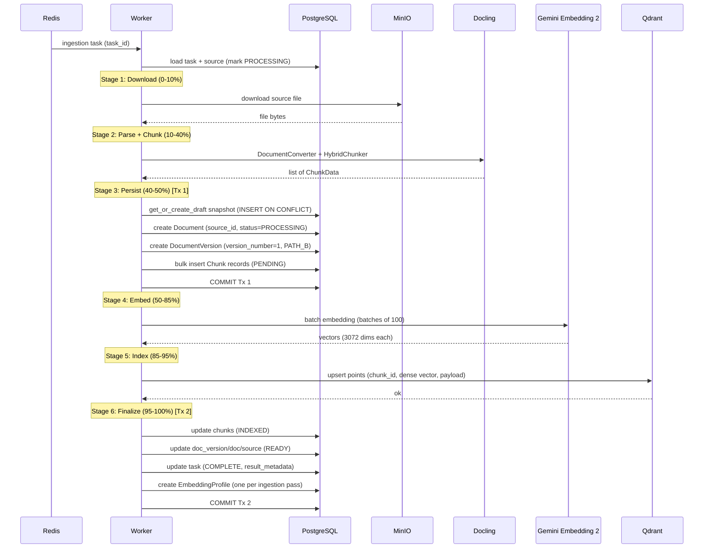

# S2-02: Parse + Chunk + Embed — Design Spec

> **Note:** The implementation plan (`docs/superpowers/plans/2026-03-18-s2-02-parse-chunk-embed.md`) supersedes this spec for execution details. Key additions in the plan: partial unique index on draft snapshots (D6 race condition fix), Document/DocumentVersion lifecycle (D6a), explicit Tx1/Tx2 failure cleanup, Qdrant round-trip integration test. If there is a conflict, the plan takes precedence.

## Overview

S2-02 is the second story of Phase 2 (First E2E Slice) and the core of the Knowledge Circuit. It replaces the noop ingestion worker from S2-01 with a real pipeline: download source file from MinIO, parse with Docling, split into chunks with HybridChunker, generate dense embeddings via Gemini Embedding 2, persist chunks in PostgreSQL, and upsert vectors into Qdrant.

### Scope

**In scope:**

- Docling integration — DocumentConverter for MD/TXT parsing
- HybridChunker configuration — structure-aware chunking with anchor metadata
- Google GenAI SDK — Gemini Embedding 2 dense vector generation
- Qdrant async client — collection creation, point upsert with payload
- Real ingestion pipeline replacing `_run_noop_ingestion()` in worker
- StorageService download method (MinIO → bytes)
- New config settings: Gemini API key, embedding model, chunk size, collection name
- EmbeddingProfile record creation for pipeline audit
- Auto-creation of a draft KnowledgeSnapshot for chunk tagging
- New Alembic migration: add `language` column to `sources` table, add partial unique index on `knowledge_snapshots` for draft uniqueness
- Worker startup: initialize Qdrant client, GenAI client, StorageService, ensure Qdrant collection
- Progress tracking through pipeline stages

**Out of scope:**

- Path A (Gemini native for short PDFs/images/audio/video) — S3-04
- BM25 sparse vectors — S3-02
- Formats beyond MD/TXT — S3-01
- Snapshot lifecycle (publish/activate/rollback) — S2-03
- Hybrid retrieval / search endpoint — S2-04
- Batch API for bulk operations — S3-06
- Chunk enrichment — S9-01

### Verification criteria (from plan.md)

Upload MD file → chunks in PG with metadata; chunks in Qdrant; vector search returns results.

---

## Decision Log

### D1: Embedding client — Google GenAI SDK (`google-genai`)

**Options considered:**

- **A. LiteLLM** (already in dependencies) — unified interface for all providers, supports `embedding()` for Gemini. However, it wraps the underlying API and may not expose all Gemini Embedding 2 parameters (task_type `RETRIEVAL_DOCUMENT` / `RETRIEVAL_QUERY`, output_dimensionality, title). LiteLLM sometimes breaks compatibility on updates. Provider switching for embeddings is theoretical — changing the embedding model requires full reindex per the spec, so the "swap with one line" benefit is illusory.

- **B. Google GenAI SDK (`google-genai`)** — official SDK from Google. Full access to all embedding parameters (task_type, dimensions, title). Stable API contract, good typing. New dependency, but ProxyMind is already architecturally tied to Gemini Embedding 2 (spec decision).

- **C. httpx (already in dependencies)** — direct REST API calls. No new dependencies but requires manual retry logic, serialization, error handling, and rate limiting — effectively building a mini-SDK. More code to maintain for the same result. Violates KISS.

**Decision: B.** Chosen by the user (Andrey). Embedding is a core RAG component, not a swappable abstraction. The spec explicitly ties ProxyMind to Gemini Embedding 2, and model switching requires full reindex. GenAI SDK provides the cleanest access to `task_type` (critical for retrieval vs. query distinction), `output_dimensionality`, and `title`. LiteLLM remains the correct choice for LLM calls (S2-04) where provider switching is genuinely useful.

### D2: Embedding dimensions — configurable, default 3072

**Options considered:**

- **A. Fixed 3072 (maximum)** — highest quality, default from Gemini. Matryoshka Representation Learning allows truncation later without re-embedding. Storage: ~24 KB per chunk in Qdrant (3072 × 4 bytes float32 + payload).
- **B. Fixed 1024 (reduced)** — good balance between quality and cost. ~8 KB per chunk. Reduces Qdrant memory footprint by ~3x. But if evals show 3072 is needed, requires re-embedding.
- **C. Configurable via Settings, default=3072** — one field `embedding_dimensions: int = 3072` in config. Any change triggers reindex (unavoidable — Qdrant collection must be recreated with new vector size). EmbeddingProfile in PG already stores `dimensions`, so audit trail is automatic.

**Decision: C.** Reindexing is unavoidable when changing dimensions regardless of approach. Configurability via Settings costs zero complexity (one field), while providing real flexibility for evals. Default=3072 gives maximum quality for the initial baseline. EmbeddingProfile records the actual value used per embedding pass, preserving audit history across dimension changes.

### D3: Qdrant collection schema — single collection, named dense vector, forward-compatible

**Options considered:**

- **A. Single collection with named vectors** — one collection `proxymind_chunks` with a named vector `dense` (3072 dims, cosine). Forward-compatible: S3-02 adds a `sparse` named vector to the same collection via `update_collection` without migration. Payload indexes on `snapshot_id`, `agent_id`, `knowledge_base_id`, `source_id`, `status`.
- **B. Separate collections per modality** — one for text, one for images, etc. Cleaner per-modality tuning but complicates retrieval (query N collections, merge results). Premature optimization.
- **C. Single unnamed vector** — simpler initial setup (one line less: no `"dense":` wrapper) but Qdrant `update_collection` can only add `sparse_vectors_config` alongside existing **named** vectors. Unnamed vector + sparse = collection recreation + full reindex. Blocks S3-02.

**Decision: A.** The cost of named vector now is one string (`"dense"` instead of unnamed) — zero additional complexity. The cost of unnamed vector (C) in S3-02 is full collection recreation + reindex of all chunks + downtime. This is not hypothetical YAGNI — S3-02 is planned and defined. `architecture.md` explicitly states: "Both vectors are stored in a single Qdrant collection as named vectors." Following the documented architecture.

**Collection configuration:**

- Name: `proxymind_chunks`
- Vectors: `{ "dense": { size: 3072, distance: Cosine } }`
- Payload indexes: `snapshot_id` (keyword), `agent_id` (keyword), `knowledge_base_id` (keyword), `source_id` (keyword), `status` (keyword), `source_type` (keyword)

**Point structure:**

- ID: chunk UUID from PostgreSQL (string format)
- Vector: `{ "dense": [float × 3072] }`
- Payload: `{ snapshot_id, source_id, chunk_id, document_version_id, agent_id, knowledge_base_id, text_content, chunk_index, token_count, anchor_page, anchor_chapter, anchor_section, anchor_timecode, source_type, language, status }`

**Note on `text_content` dual-write:** `text_content` is intentionally stored in both PostgreSQL (Chunk.text_content — source of truth, for audit and reindex) and the Qdrant payload (retrieval context for LLM prompt assembly during chat, avoiding a PG round-trip per chunk in the hot path of S2-04).

### D4: Pipeline architecture — services without abstract orchestrator

**Options considered:**

- **A. Pipeline as orchestrator + separate services** — create an `IngestionPipeline` orchestrator class (in workers/tasks/) that calls isolated services: `DoclingParser`, `EmbeddingService`, `QdrantService`. The orchestrator manages sequence and progress. Adds an abstraction layer between worker task and services.
- **B. All in one worker function** — linear code in `ingestion.py`. Fewer files, but by S3-01 (new formats) and S3-04 (Path A) the function grows and requires refactoring.
- **C. Services without abstract orchestrator** — create independent services (parsing, embedding, qdrant), worker task calls them directly in sequence. No Pipeline class — the worker task IS the orchestrator.

**Decision: C.** Key arguments:
1. **SRP satisfied**: DoclingParser, EmbeddingService, QdrantService — each does one thing. Independently testable.
2. **KISS/YAGNI**: a Pipeline class (A) is a premature abstraction. The worker task naturally orchestrates the sequence — adding another layer duplicates orchestration. When Path A appears (S3-04), we'll have two real use cases to design a proper abstraction from. `development.md`: "Three similar lines of code are better than a premature abstraction."
3. **Better than monolith (B)**: download + parse + chunk + DB writes + embed + Qdrant upsert in one function quickly becomes unreadable. Services provide natural boundaries.
4. Matches existing codebase patterns (StorageService, SourceService).

**New services:**

| Service | Responsibility | Location |
|---------|---------------|----------|
| `DoclingParser` | Parse file → DoclingDocument, chunk → list of ChunkData | `app/services/docling_parser.py` |
| `EmbeddingService` | Generate dense embeddings via GenAI SDK | `app/services/embedding.py` |
| `QdrantService` | Collection management, point upsert/delete | `app/services/qdrant.py` |

The existing `StorageService` gets a new `download()` method. The worker task (`ingestion.py`) orchestrates the pipeline.

### D5: HybridChunker configuration — 1024 max tokens, structure-aware

**Options considered:**

- **A. Large chunks (4096 tokens)** — fewer chunks, more context per chunk. But: poor retrieval precision, embedding quality degrades for long texts, wastes context budget in the LLM prompt.
- **B. Medium chunks (1024 tokens)** — good balance for retrieval precision vs. context completeness. Standard in production RAG systems. Well within Gemini Embedding 2's 8192-token window.
- **C. Small chunks (256 tokens)** — high retrieval precision but fragmented context. Requires parent-child expansion (S9-02) to be useful. Premature.

**Decision: B.** 1024 tokens is the industry standard for semantic search. HybridChunker will merge small consecutive chunks under the same heading (preserving structure) and split oversized chunks at sentence boundaries. The `chunk_max_tokens` setting is configurable for future tuning via evals.

**HybridChunker parameters:**

- `max_tokens`: 1024 (configurable via settings)
- Tokenizer: Docling default (sufficient for token count estimation; Gemini's exact tokenizer is not publicly available, but approximate counts are adequate for chunking)
- Structure awareness: Docling preserves heading hierarchy, page breaks, and section metadata automatically

### D6: Snapshot handling — auto-create draft on first ingestion

**Options considered:**

- **A. Auto-draft snapshot** — worker calls `get_or_create_draft(agent_id, knowledge_base_id)`. If no draft exists, creates one with DRAFT status. Subsequent ingestions reuse the same draft. S2-03 adds publish/activate API on top.
- **B. Sentinel snapshot** — seed migration creates one "default" snapshot with ACTIVE status. All chunks bind to it immediately. S2-03 refactors to add real lifecycle.
- **C. Require snapshot to exist before ingestion** — clean separation, but blocks S2-02 until S2-03 (snapshot CRUD). Creates circular dependency in Phase 2.

**Decision: A.** Key arguments against the sentinel approach (B):
1. **Architecture compliance**: `architecture.md` states "Chunks in Qdrant are tagged with this draft's `snapshot_id`" — worker writes to draft, publish/activate is a separate step. Sentinel with ACTIVE status bypasses this workflow.
2. **S2-03 verification**: plan.md requires "chunks from draft are not visible" — with auto-draft (DRAFT status), this works by default. With sentinel (ACTIVE), chunks are immediately visible to chat, violating draft isolation. S2-03 would need to refactor the sentinel.
3. **Minimal work**: `get_or_create_draft()` is one simple function — find existing DRAFT or INSERT new one.
4. **No technical debt**: S2-03 adds publish/activate endpoints on top of real DRAFT snapshots. Zero refactoring needed.

**Race condition mitigation:** The `knowledge_snapshots` table has no constraint preventing multiple DRAFTs per `(agent_id, knowledge_base_id)`. Two concurrent ingestion tasks could both fail to find a draft and create duplicates. Fix: add a **partial unique index** via Alembic migration:

```sql
CREATE UNIQUE INDEX uq_one_draft_per_scope
    ON knowledge_snapshots (agent_id, knowledge_base_id)
    WHERE status = 'draft';
```

`get_or_create_draft()` implementation: `INSERT ... ON CONFLICT DO NOTHING` + `SELECT`. If the INSERT conflicts, the SELECT returns the existing draft. This is atomic at the DB level, no advisory locks needed.

### D6a: Document and DocumentVersion lifecycle

S2-01 creates only `Source` + `BackgroundTask` at upload time. `Document` and `DocumentVersion` are NOT created during upload — they are part of ingestion, not storage.

**S2-02 worker creates Document + DocumentVersion atomically during Stage 3 (Persist):**

1. `Document(source_id=source.id, title=source.title, status=PROCESSING)`
2. `DocumentVersion(document_id=doc.id, version_number=1, processing_path=PATH_B, status=PROCESSING)`
3. Bulk insert `Chunk` records (PENDING) linked to the DocumentVersion

**version_number assignment:** `SELECT COALESCE(MAX(version_number), 0) + 1 FROM document_versions WHERE document_id = ?`. For the first ingestion this yields 1.

**Retry/re-upload behavior:** If a task fails mid-pipeline, `Document` and `DocumentVersion` remain with FAILED status. Re-upload (new Source + new task) creates a new `Document` + `DocumentVersion(version_number=1)` — clean slate. Re-indexing the SAME source (future story) would create a new `DocumentVersion(version_number=2)` under the existing `Document`. Failed DocumentVersion/Chunk records are orphaned but harmless (audit trail); cleanup is an admin concern, not pipeline logic.

### D7: Worker initialization — services in context

**Options considered:**

- **A. Create services per-task** — instantiate MinIO client, Qdrant client, GenAI client in each task invocation. Simple but wasteful — creates new connections per task.
- **B. Create services on worker startup, store in context** — initialize all clients and services in `on_startup()`, store in worker context dict. Reuse across tasks. Graceful shutdown in `on_shutdown()`.
- **C. Global singletons** — module-level clients. Hard to test, hard to configure, violates DI.

**Decision: B.** Matches the existing pattern (session_factory is already in worker context). Worker context receives: `storage_service`, `docling_parser`, `embedding_service`, `qdrant_service`, `snapshot_service`, and `settings`. Qdrant collection is ensured (idempotent create) during startup. Connection cleanup in `on_shutdown()`.

### D8: Batch embedding strategy — batched API calls, 100 texts per request

**Options considered:**

- **A. One embedding per API call** — `embed_content` per chunk. Simplest code, granular progress. But: 20 HTTP calls for 20 chunks, 1000+ calls for a book. Rate limit pressure, high latency.
- **B. Batch texts in a single API call** — Google GenAI SDK supports batched embedding (up to 100 texts per HTTP call, exact method name to be verified at implementation time). Dramatically reduces latency and rate limit pressure. ~5 lines of batching code.
- **C. Concurrent parallel batches** — send multiple batch requests concurrently via asyncio.gather. Maximum throughput but risks rate limiting and complicates error handling (which batch failed?).

**Decision: B.** Key arguments:
1. **Performance**: 1 HTTP call instead of 20 for a typical document. For a book (S3-01): 10 batches instead of 1000 calls.
2. **Rate limits**: Gemini API limits are per-request. Batch = one request = less pressure.
3. **Minimal complexity**: batch call instead of per-chunk calls + slicing texts into groups — ~5 lines of code.
4. **Compatible with all-or-nothing (D9)**: if a batch fails, tenacity retries the batch. All-or-nothing at batch level → all-or-nothing at document level.
5. Batch size configurable via Settings (`embedding_batch_size`, default=100). Concurrent batches (C) deferred — optimization available in S3-06 if throughput matters.

### D9: Error handling — all-or-nothing with tenacity retry

**Options considered:**

- **A. All-or-nothing without retry** — any failure = task FAILED. Simple but fragile — Gemini API transient errors (429, 503) would fail tasks that could succeed on retry.
- **B. Partial success with chunk-level retry** — successful chunks saved to PG (INDEXED) and Qdrant, failed chunks marked FAILED. Task FAILED with `result_metadata` containing failed chunk IDs. Retry re-processes only failed chunks. Saves API cost on retry but adds significant complexity: idempotent partial upsert, tracking which chunks are indexed vs not, cleanup on full retry, "holey" documents with partially indexed chunks.
- **C. All-or-nothing with tenacity retry** — tenacity wraps each external call (Gemini, Qdrant) with exponential backoff. After retries exhausted, entire task fails. No partial state.

**Decision: C.** Key arguments:
1. **KISS**: partial success (B) adds substantial complexity for a scenario that rarely occurs. Tracking chunk-level state, idempotent re-embed, cleanup — all for handling a failure mode that tenacity retry resolves 99% of the time.
2. **Clean data guarantee**: a document in Qdrant is either fully indexed or not present at all. No "holey" documents with missing chunks causing incomplete retrieval results.
3. **Retry cost is low**: for .md/.txt files (S2-02 scope), documents are small — full re-embed on retry is cheap. Partial retry optimization becomes relevant for large PDFs (S3-01), when we'll have real failure data to design from.
4. **Tenacity is already a dependency** (`spec.md`): exponential backoff on 429/5xx covers Gemini rate limits and transient errors.
5. On failure: Task → FAILED, Source → FAILED. Before the recovery transaction, chunks in PG are still PENDING; after recovery, they are marked FAILED (see cleanup strategy below). No vectors in Qdrant (upsert happens only after ALL embeddings succeed).

**Failure cleanup strategy:** When the pipeline fails after Stage 3 (Persist), `DocumentVersion` and `Chunk` records exist in PG in intermediate states (PROCESSING/PENDING). On failure:
- `DocumentVersion` → FAILED
- All `Chunk` records for this version → FAILED
- `Document` → FAILED

These records are NOT deleted — they serve as audit trail. **Retry path:** re-upload creates a new Source + Document + DocumentVersion. This is clean and simple. Re-indexing the same source (future story) would create a new DocumentVersion under the same Document.

**Transaction boundaries:** The pipeline uses two transaction scopes:
- **Tx 1 (Stage 3):** `get_or_create_draft` + create Document + create DocumentVersion + bulk insert Chunks (PENDING). Committed before calling Gemini. If Tx 1 fails, nothing was persisted — task fails clean.
- **Tx 2 (Stage 6):** Update Chunks → INDEXED, DocumentVersion → READY, Document → READY, Source → READY, update snapshot.chunk_count, create EmbeddingProfile, task → COMPLETE. Committed only after successful Qdrant upsert.
- **On failure between Tx 1 and Tx 2:** Chunks are in PG (PENDING) but not in Qdrant. Error handler marks DocumentVersion/Chunks/Document as FAILED in a recovery transaction.

**Retry configuration (via tenacity):**

- Gemini Embedding API: retry on 429 (rate limit) and 5xx, exponential backoff, max 3 attempts
- Qdrant upsert: retry on connection errors, max 3 attempts
- Docling parse: no retry (deterministic — if it fails, it will fail again)

### D10: Language handling — system-wide from config

**Options considered:**

- **A. Per-source language (from upload metadata)** — most flexible, but SourceUploadMetadata.language is optional and currently not persisted on the Source model. Would require a migration to add Source.language column.
- **B. System-wide language from config** — add `bm25_language` to Settings (default: "english"). Used in Qdrant payload for future BM25 filtering (S3-02). Consistent with spec: "The BM25 language is set at deploy time via .env and applies system-wide."
- **C. No language in payload** — defer entirely to S3-02. But then S3-02 would need to reindex existing chunks to add language.

**Decision: B.** System-wide language from config matches the spec. The `bm25_language` setting defaults to "english" and is included in the Qdrant payload from day one. This avoids reindexing when S3-02 adds BM25. Per-source language override (A) can be added in a future story without changing the Qdrant schema — it's just a payload field value change.

**Note:** S2-02 will also add `language` column to `sources` table via migration, persisting the language field from SourceUploadMetadata that S2-01 accepted but did not store. This ensures PG is the source of truth. If the source has no language set, the system-wide default is used.

---

## Architecture

### New Services

```text
app/services/
├── storage.py          # Existing — add download() method
├── source.py           # Existing — no changes
├── docling_parser.py   # NEW — Docling parsing + HybridChunker
├── embedding.py        # NEW — Gemini Embedding 2 via GenAI SDK
└── qdrant.py           # NEW — Qdrant async client wrapper
```

### Service Interfaces

**DoclingParser** (`app/services/docling_parser.py`)

- `parse_and_chunk(file_content: bytes, filename: str, source_type: SourceType) → list[ChunkData]`
  - Converts bytes to a temporary file, runs DocumentConverter, then HybridChunker
  - Returns a list of `ChunkData` dataclass instances with text_content, token_count, and anchor metadata (page, chapter, section)
  - Runs synchronously inside `asyncio.to_thread()` (Docling is CPU-bound, not async)

**EmbeddingService** (`app/services/embedding.py`)

- `embed_texts(texts: list[str], task_type: str = "RETRIEVAL_DOCUMENT") → list[list[float]]`
  - Batches texts into groups of up to `embedding_batch_size` (default 100)
  - Calls Google GenAI SDK batch embedding method per batch (verify exact API at implementation time: `client.models.embed_content()` with `contents` list, or `client.models.batch_embed_contents()` — the SDK may have renamed this)
  - Batch size is limited by element count AND total request size (verify SDK/API limits at implementation time)
  - Returns flat list of embedding vectors (dimensions per `settings.embedding_dimensions`)
  - Retries on 429/5xx via tenacity

**QdrantService** (`app/services/qdrant.py`)

- `ensure_collection() → None` — idempotent collection creation with correct vector config and payload indexes. **If the collection already exists, compares the existing `dense` vector size with `settings.embedding_dimensions`. On mismatch → raises `CollectionSchemaMismatchError` with a clear message ("Collection 'proxymind_chunks' has dense vector size 3072 but settings require 1024. Reindex required — delete the collection and re-run ingestion."). Worker fails fast, never silently writes vectors with wrong dimensions.**
- `upsert_chunks(points: list[PointData]) → None` — upsert points with named dense vector and payload

**StorageService** (`app/services/storage.py`) — existing, add:

- `download(object_key: str) → bytes` — download file content from MinIO via `asyncio.to_thread()`

### Pipeline Flow



### Data Flow: Chunk through the pipeline

```text
Source file (MinIO)
  │
  ▼
Docling DocumentConverter
  │  parses MD/TXT → DoclingDocument
  ▼
HybridChunker (max_tokens=1024)
  │  splits into chunks with heading/section metadata
  ▼
ChunkData (text_content, token_count, anchors)
  │
  ├──► PostgreSQL: Chunk record (PENDING)
  │     (id, document_version_id, snapshot_id, source_id,
  │      text_content, token_count, anchor_*, status)
  │
  ▼
Gemini Embedding 2 (RETRIEVAL_DOCUMENT, 3072 dims)
  │  generates dense vector per chunk
  ▼
Qdrant: upsert point
  │  (id=chunk_uuid, vector={"dense": [...]},
  │   payload={snapshot_id, source_id, agent_id, ...})
  │
  ▼
PostgreSQL: Chunk record → INDEXED
```

---

## Configuration

New settings added to `app/core/config.py`:

| Setting | Type | Default | Description |
|---------|------|---------|-------------|
| `gemini_api_key` | str | (required) | API key for Gemini Embedding 2 |
| `embedding_model` | str | `"gemini-embedding-2-preview"` | Embedding model ID (verify current model ID at implementation time — may have graduated from preview) |
| `embedding_dimensions` | int | `3072` | Output vector dimensions |
| `chunk_max_tokens` | int | `1024` | Maximum tokens per chunk |
| `qdrant_collection` | str | `"proxymind_chunks"` | Qdrant collection name |
| `bm25_language` | str | `"english"` | System-wide language for BM25 and payload |
| `embedding_batch_size` | int | `100` | Texts per embedding API call |

New `.env` variables: `GEMINI_API_KEY`, `EMBEDDING_MODEL`, `EMBEDDING_DIMENSIONS`, `CHUNK_MAX_TOKENS`, `QDRANT_COLLECTION`, `BM25_LANGUAGE`, `EMBEDDING_BATCH_SIZE`.

---

## New Dependencies

| Package | Min Version | Purpose |
|---------|-------------|---------|
| `google-genai` | 1.14.0+ | Google GenAI SDK for Gemini Embedding 2 |
| `qdrant-client` | 1.14.0+ | Async Qdrant client for vector operations |
| `docling` | 2.80.0+ | Document parsing (MD, TXT, PDF, DOCX, HTML) |

**Note:** `docling` is a heavy package (~500 MB with dependencies including PyTorch for table/figure models). For S2-02 (MD/TXT only), the lightweight pipeline mode is sufficient. Future stories (S3-01) will use the full Docling feature set for PDF/DOCX/HTML.

---

## Database Changes

### Migration: add `language` column to `sources`

```sql
ALTER TABLE sources ADD COLUMN language VARCHAR(32) NULL;
```

This persists the `language` field from SourceUploadMetadata that S2-01 accepted in the API schema but did not store. The column is nullable — existing sources get NULL, which means "use system default."

The `source.py` service MUST be updated: `create_source_and_task()` must pass `language=metadata.language` to the Source constructor. Currently S2-01 accepts `language` in `SourceUploadMetadata` but silently drops it — the field is never persisted.

### Migration: partial unique index on `knowledge_snapshots`

```sql
CREATE UNIQUE INDEX uq_one_draft_per_scope
    ON knowledge_snapshots (agent_id, knowledge_base_id)
    WHERE status = 'draft';
```

Guarantees at most one DRAFT snapshot per `(agent_id, knowledge_base_id)` scope. Prevents race conditions in `get_or_create_draft()` when multiple workers run concurrently. See D6 for rationale.

No other schema changes are needed — all required tables (chunks, documents, document_versions, knowledge_snapshots, embedding_profiles) already exist from S1-02.

---

## Worker Changes

### Startup (`app/workers/main.py`)

`on_startup()` additions:

1. Create MinIO client → `StorageService` instance → `ctx["storage_service"]`
2. Create `DoclingParser` instance → `ctx["docling_parser"]`
3. Create `google.genai.Client` → `EmbeddingService` instance → `ctx["embedding_service"]`
4. Create `AsyncQdrantClient` → `QdrantService` instance → `ctx["qdrant_service"]`
5. Create `SnapshotService` instance → `ctx["snapshot_service"]`
6. Call `qdrant_service.ensure_collection()` — idempotent
7. Store `settings` in context → `ctx["settings"]`

`on_shutdown()` additions:

1. Close Qdrant client connection

### Task (`app/workers/tasks/ingestion.py`)

Replace `_run_noop_ingestion()` with `_run_ingestion_pipeline()` that:

1. Extracts services from worker context
2. Downloads source file from MinIO
3. Parses and chunks via DoclingParser
4. Ensures a draft snapshot exists (auto-create if needed)
5. Creates DocumentVersion and Chunk records in PG
6. Generates embeddings via EmbeddingService
7. Upserts to Qdrant via QdrantService
8. Updates all status fields
9. Creates EmbeddingProfile (one new record per ingestion pass — never updates existing, for audit trail)

Progress is updated at each stage boundary via `task.progress` commits.

### Result Metadata

On success, `task.result_metadata` contains:

```json
{
  "chunk_count": 12,
  "embedding_model": "gemini-embedding-2-preview",
  "embedding_dimensions": 3072,
  "processing_path": "path_b",
  "snapshot_id": "uuid",
  "document_id": "uuid",
  "document_version_id": "uuid",
  "token_count_total": 8432
}
```

---

## Testing Strategy

### Unit Tests (CI, deterministic)

- **DoclingParser**: mock Docling's DocumentConverter and HybridChunker. Verify chunk extraction, anchor metadata mapping, token counting. Test edge cases: empty document, single-paragraph document, document with deep heading hierarchy.
- **EmbeddingService**: mock GenAI SDK. Verify batching logic (texts split into groups of 100), retry behavior on 429/5xx, dimension validation.
- **QdrantService**: mock qdrant-client. Verify collection creation params, point structure (named vector, payload fields), idempotent ensure_collection.
- **Pipeline orchestration**: mock all three services + StorageService. Verify: correct call sequence, progress updates, status transitions (Source/Document/DocumentVersion/Chunk), error propagation, draft snapshot auto-creation.

### Integration Tests (CI, with Docker services)

- **Full pipeline with real PG**: upload a source (via S2-01 fixture), run the pipeline with mocked GenAI (Docling runs real for MD/TXT — it's a local library), verify all PG records are created with correct statuses and relationships.
- **Snapshot auto-creation**: verify that the first ingestion creates a draft snapshot, second ingestion reuses it.
- **Qdrant round-trip with real Qdrant container**: create collection with named `dense` vector → upsert 2-3 points with realistic payload (snapshot_id, agent_id, text_content, anchors) → search by vector with `snapshot_id` filter → verify expected chunks returned with correct payload. This proves named vector schema, payload shape, and filter logic work end-to-end. Uses fake (random) vectors — no Gemini dependency.
- **Dimension mismatch detection**: create collection with size=3072 → change settings to 1024 → call `ensure_collection()` → verify `CollectionSchemaMismatchError` is raised.

### Manual Verification

- `docker-compose up` → upload MD file via curl → verify chunks in PG (`SELECT * FROM chunks`) → verify points in Qdrant (REST API: `GET /collections/proxymind_chunks/points`) → vector search returns results.

---

## Risks and Mitigations

| Risk | Impact | Mitigation |
|------|--------|------------|
| Docling heavy install (~500 MB) | Docker image size increase | Use lightweight pipeline config for MD/TXT; full models loaded only when needed (S3-01) |
| Gemini Embedding 2 rate limits | Ingestion slows down | Tenacity exponential backoff; configurable batch size; Batch API in S3-06 |
| Qdrant collection schema lock-in | Cannot add sparse vectors later | Named vectors design (D3) ensures forward compatibility |
| GenAI SDK breaking changes | Embedding calls fail | Pin minimum version; GenAI SDK follows semver |
| Large file chunking (edge case) | Many chunks, slow embedding | Progress tracking; batch processing; job_timeout=600s covers up to ~500 chunks |

---

## Out-of-Scope Decisions (documented for future stories)

- **Path A routing logic** (S3-04): determine processing path based on format + size thresholds
- **BM25 sparse vectors** (S3-02): add `sparse` named vector to collection, Bm25Config with language
- **Snapshot CRUD API** (S2-03): endpoints for create/publish/activate/rollback
- **Batch API** (S3-06): Gemini Batch API for bulk embedding at -50% cost
- **Chunk enrichment** (S9-01): LLM-generated summary/keywords/questions per chunk
