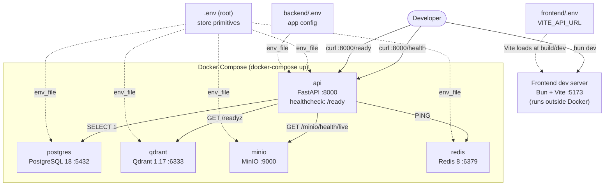

# S1-01: Project Bootstrap -- Design

**Story:** S1-01 (Phase 1: Bootstrap)
**Brainstorm spec:** `docs/superpowers/specs/2026-03-17-s1-01-project-bootstrap-design.md`

## Context

The ProxyMind repository contains only documentation -- no code, infrastructure, or tooling. This change establishes the monorepo skeleton: Docker infrastructure, FastAPI backend, React frontend, CI pipeline, and configuration scaffolds. Every subsequent story in the plan depends on the artifacts produced here.

The detailed design rationale is captured in the brainstorm spec (referenced above), which contains nine architectural decisions, with D10 merged into D1. This document summarizes the architectural approach and key choices without duplicating that rationale.

### Architecture scope

The following parts of `docs/architecture.md` are directly affected by S1-01:

| Section                   | Impact                                                            |
| ------------------------- | ----------------------------------------------------------------- |
| Repository structure      | Created from scratch; deviates on .env strategy (3 files vs 2)    |
| Docker Compose            | Partially realized: 5 of 6 services (no worker)                   |
| Service endpoints         | `/health` and `/ready` implemented                                |
| Data stores               | All 4 stores provisioned via Docker; no schema or collections yet |
| File system configuration | Persona and config templates created                              |

Sections that remain **unchanged** (not touched by S1-01): system circuits (dialogue, knowledge, operational), data flows, API contracts (chat, admin), retrieval, ingestion, snapshots, A2A/MCP provisions, backup/recovery.

## Goals

- All infrastructure starts with `docker-compose up` -- 4 data stores plus the API service, healthchecks green.
- `/health` returns 200 (liveness); `/ready` returns 200 only when all 4 stores are reachable (readiness).
- Frontend dev server starts with `bun dev` on port 5173.
- CI enforces code quality from the first commit: Ruff for Python, Biome for TypeScript/React.
- Persona and config directories exist with template files, ready for future persona loading.

## Non-goals

- No worker process (deferred to S2-01 when arq tasks exist).
- No Caddy runtime (Caddyfile is a valid scaffold only).
- No SQLAlchemy models, Alembic migrations, or any database schema (S1-02).
- No functional endpoints beyond health/ready.
- No functional tests beyond lint (S1-02, when there is testable behavior). Minimal pytest scaffolding (conftest.py with pytest-asyncio config) is included to prepare for S1-02.
- No type checking in CI (deferred to S1-02 when typed interfaces appear).

## Decisions

All decisions below are detailed with full alternatives analysis in the brainstorm spec. Only the summary and architectural consequences are repeated here.

### D1: Python 3.14.3+ with uv (D10 merged here)

Python version per `docs/spec.md`. Package management via `uv` with `pyproject.toml` and committed `uv.lock`. Docker multi-stage build uses `ghcr.io/astral-sh/uv:python3.14-bookworm-slim` (builder) and `python:3.14-slim-bookworm` (runtime).

**Architectural consequence:** If compiled dependencies do not support Python 3.14, the story blocks until resolution. No downgrade is permitted below spec.md minimums.

### D2: Caddy as scaffold only

A syntactically valid Caddyfile is committed but Caddy does not run at bootstrap. The target architecture (Caddy on host) is preserved as a future step. Direct access to the API on port 8000 is sufficient for all S1-01 verification.

### D3: No worker service in Docker Compose

Only the `api` service is included. The worker service appears in S2-01 alongside its first arq task definition. A worker without tasks is a dead process that adds noise to bootstrap verification.

### D4: Three .env files

| File            | Contents                                      | Consumed by                             |
| --------------- | --------------------------------------------- | --------------------------------------- |
| `.env` (root)   | Store credentials, hosts, ports               | docker-compose, passed to api container |
| `backend/.env`  | App config: LLM provider, API keys, log level | FastAPI via pydantic-settings           |
| `frontend/.env` | `VITE_API_URL`                                | Vite (client-side, VITE\_ prefix only)  |

Store connection parameters are primitives in root `.env`. DSNs are computed at runtime by the pydantic-settings `Settings` class. No duplication of connection strings across files.

**Documentation deviation:** `docs/architecture.md` currently shows 2 .env files. This must be updated as part of S1-01 implementation to reflect the 3-file strategy.

### D5: Frontend scaffold with Biome

Vite scaffold via `bun create vite`, then replace ESLint with Biome as the sole linter/formatter. Versions pinned per spec.md: React 19.2.4+, Vite 8.0.0+, Biome 2.4.7+.

### D6: Backend structure -- main.py + core/ + api/

Minimal directory structure at bootstrap:

```
backend/app/
  main.py           -- FastAPI app, lifespan, router mounting
  core/
    config.py       -- pydantic-settings Settings
    logging.py      -- structlog configuration
  api/
    health.py       -- /health and /ready router
```

Other directories from architecture.md (`services/`, `workers/`, `persona/`, `db/`) are created when their stories are implemented. Active packages (`app/`, `core/`, `api/`) include `__init__.py` as required by Python's import system. The constraint is: no empty directories or `__init__.py` files for directories that have no code yet (e.g., no `services/__init__.py` until S2-01).

### D7: /ready checks all 4 stores

`/ready` performs 4 parallel async health checks via `asyncio.gather`:

- PostgreSQL: `SELECT 1` via asyncpg
- Redis: `PING` via redis-py
- Qdrant: `GET /readyz` via HTTPX (no SDK dependency at bootstrap)
- MinIO: `GET /minio/health/live` via HTTPX (no SDK dependency at bootstrap)

All pass returns 200. Any failure returns 503 with details. The `api` service uses `/ready` as its Docker healthcheck.

### D8: CI lint pipeline

GitHub Actions with two parallel jobs on push/PR to `master`:

- `lint-backend`: `uv sync` then `ruff check` + `ruff format --check`
- `lint-frontend`: `bun install` then `biome check`

### D9: Persona and config templates

Template files in `persona/` (IDENTITY.md, SOUL.md, BEHAVIOR.md) and `config/` (PROMOTIONS.md) with 5-10 lines of English instructions each. These enable `config_content_hash` computation from the start.

## Bootstrap services topology



**What is NOT shown** (deferred to later stories):

- Worker service (S2-01)
- Caddy reverse proxy (post-Phase 1)
- Alembic migrations / DB schema (S1-02)
- Any inter-service data flow beyond health checks

## Risks and trade-offs

| Risk                                                             | Severity | Mitigation                                                                                               |
| ---------------------------------------------------------------- | -------- | -------------------------------------------------------------------------------------------------------- |
| Python 3.14 compiled dependency support (asyncpg, etc.)          | Medium   | If blocked, escalate to spec review. No silent downgrade.                                                |
| Three .env files add onboarding friction vs two                  | Low      | `.env.example` files with safe defaults and one-time copy step documented in README                      |
| No Caddy at bootstrap means dev topology differs from production | Low      | Acceptable for Phase 1. Caddyfile is validated (`caddy validate`) even if not running.                   |
| No tests in S1-01                                                | Low      | Intentional -- there is no testable behavior beyond lint. S1-02 introduces pytest with the first models. |
| Docker image sizes may be large with Python 3.14 + uv            | Low      | Multi-stage build separates builder (uv + compile) from runtime (slim). Layer caching for dependencies.  |

## Migration plan

This is a greenfield bootstrap. There is no existing system to migrate from.

**Deployment steps:**

1. Clone the repository.
2. One-time setup: `cp .env.example .env && cp backend/.env.example backend/.env && cp frontend/.env.example frontend/.env`
3. `docker-compose up` -- starts PostgreSQL, Qdrant, MinIO, Redis, and the API service.
4. Verify: `curl http://localhost:8000/health` returns 200; `curl http://localhost:8000/ready` returns 200 when all stores are up.
5. Frontend (separate terminal): `cd frontend && bun install && bun dev` -- dev server on port 5173.

**Rollback:** Not applicable -- this is the first commit of infrastructure. Reverting means returning to a docs-only repository.
