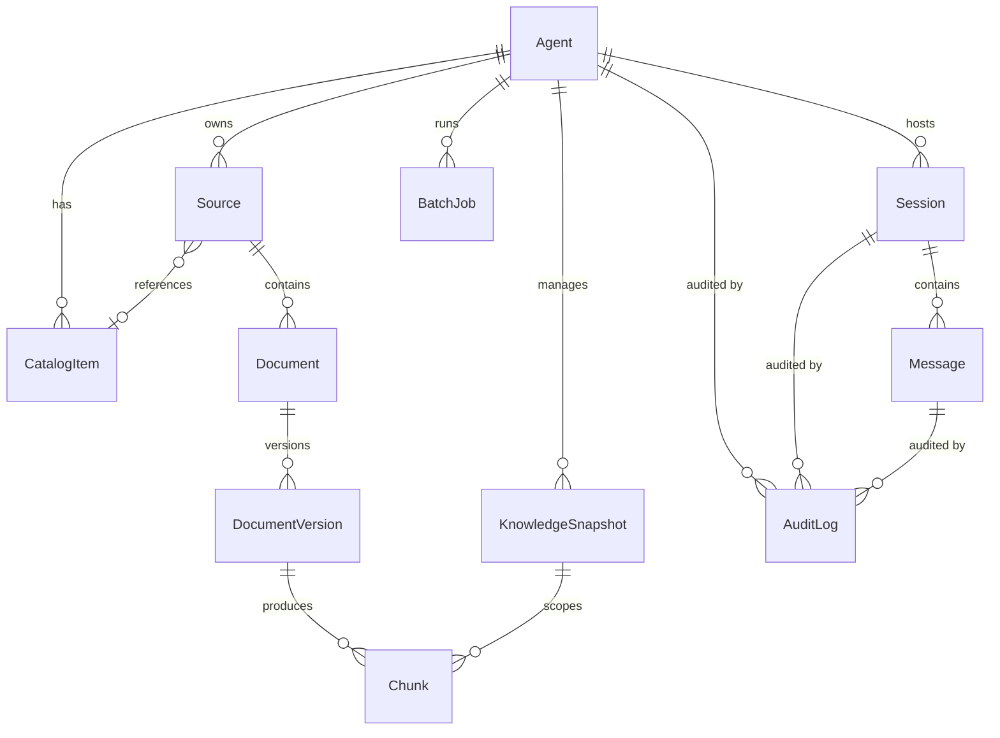
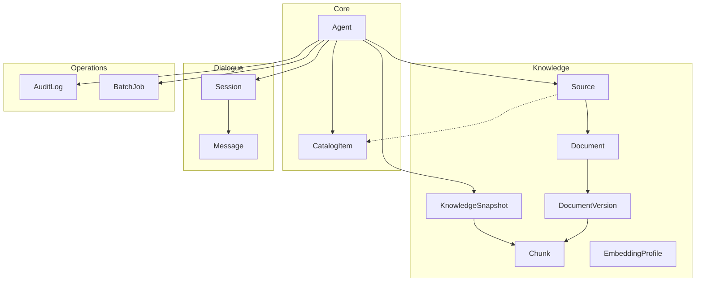

## Context

The backend has a running FastAPI app (`app/main.py`) with a raw `asyncpg.create_pool()` connection but no ORM, no models, and no migration system. Every subsequent story -- ingestion (S2-01), snapshots, chat, audit -- depends on a well-defined database schema. The project specifies 12 base tables across three system circuits plus core entities, with tenant-ready fields for future multi-tenancy.

PostgreSQL 18.3+ is the source of truth. SQLAlchemy 2.x (async) and Alembic are the mandated tools (see `docs/spec.md` for minimum versions). Python 3.14+ provides native `uuid.uuid7()`.

## Goals / Non-Goals

### Goals

- Replace raw asyncpg pool with SQLAlchemy async engine and session management.
- Create all 12 base tables with full column definitions in a single initial migration.
- Establish Alembic as the migration system with async-aware configuration.
- Seed a default agent via a data migration (one instance = one twin).
- Integrate migrations into Docker startup via entrypoint script.
- Validate the full migration chain with Testcontainers integration tests.

### Non-Goals

- Business logic or service layer -- no CRUD endpoints, no API routes for models.
- Qdrant collections, MinIO buckets, or Redis configuration.
- Worker service or arq runtime (deferred to S2-01).
- Multi-tenancy as a feature -- tenant-ready fields are architectural provisions only.
- A `knowledge_bases` table -- only the `knowledge_base_id` field exists as a forward provision.

## Decisions

All decisions were made during the brainstorm phase and are documented in `docs/superpowers/specs/2026-03-18-s1-02-database-migrations-design.md`. Summary and rationale:

**Decision 1 -- Replace raw asyncpg with SQLAlchemy async engine.** SQLAlchemy uses asyncpg under the hood. Keeping both means two connection pools, confusion about which to use, and harder monitoring. `/health` remains liveness-only (no DB probe); the DB readiness check (`SELECT 1` via async session) moves to `/ready`. No alternative considered -- dual pools have no upside.

**Decision 2 -- Models organized by system contours.** Four model files matching the architectural circuits: `core.py`, `knowledge.py`, `dialogue.py`, `operations.py`. This reflects the three-circuit architecture from `docs/architecture.md` plus core entities. Alternative rejected: 12+ single-model files create circular import risks; a single monolithic file grows unwieldy.

**Decision 3 -- Granular mixins for cross-cutting fields.** Five composable mixins (`PrimaryKeyMixin`, `TimestampMixin`, `TenantMixin`, `KnowledgeScopeMixin`, `SoftDeleteMixin`). Each model inherits only what it needs. Reading a model class declaration tells you exactly what capabilities it has. Alternative rejected: repeating fields per model violates DRY and makes constraint changes inconsistent.

**Decision 4 -- UUID v7 for all primary keys.** Time-ordered UUIDs solve B-tree fragmentation of UUID v4, are globally unique for future sharding, and leak no ordering information. Python 3.14 provides native `uuid.uuid7()`. Alternative rejected: UUID v8 is a custom-format spec with no time-ordering guarantee; auto-increment integers leak information and complicate distributed scenarios.

**Decision 5 -- Migrations via Docker entrypoint script.** `alembic upgrade head` runs in the entrypoint before `uvicorn` starts. Clean separation -- migrations are infrastructure, not application logic. No race conditions with multiple replicas (unlike running in lifespan). Alternative rejected: in-lifespan migration causes races when scaling horizontally.

**Decision 6 -- Seed agent via Alembic data migration.** A second migration inserts the default agent with a fixed UUID literal constant. The default agent is the required initial system state, not test data. A fixed literal (not UUID v7) ensures consistency across environments and avoids the semantic contradiction of a "deterministic time-based UUID." Alternative rejected: application-level "ensure exists" logic runs on every startup and complicates idempotency.

**Decision 7 -- Full schema upfront.** All 12 tables with all columns from spec/architecture/rag docs, including fields for later phases (SSE state machine, citation JSONB, batch tracking). The story says "all base tables" -- tables are complete, not stubs. This avoids ALTER TABLE migrations in every future story. Alternative rejected: stub tables with "add columns later" creates unnecessary migration churn.

**Decision 8 -- Testcontainers with real PostgreSQL.** Integration tests spin up an ephemeral PostgreSQL container. SQLite cannot validate UUID types, ARRAY, or JSONB. Mocks do not validate schema or constraints. Docker is already required. Alternative rejected: SQLite or mocks test nothing meaningful for a schema-focused story.

**Decision 9 -- `knowledge_base_id` as field without FK.** The plan specifies exactly 12 tables; `knowledge_bases` is not among them. The field exists for future use; the FK and table arrive in one migration when multi-KB is needed. Alternative rejected: creating an empty `knowledge_bases` table adds a table not in the plan and a premature abstraction.

## Architecture

### Package structure

All paths relative to `backend/`:

```
app/db/
  __init__.py
  engine.py           -- async engine + session factory
  base.py             -- DeclarativeBase + all mixins
  session.py          -- get_session FastAPI dependency
  models/
    __init__.py        -- re-exports all models
    core.py            -- Agent, CatalogItem
    knowledge.py       -- Source, Document, DocumentVersion, Chunk,
                          KnowledgeSnapshot, EmbeddingProfile
    dialogue.py        -- Session, Message
    operations.py      -- AuditLog, BatchJob
migrations/
  env.py               -- async-aware, imports Base.metadata
  versions/
    001_initial_schema.py
    002_seed_agent.py
alembic.ini
entrypoint.sh          -- alembic upgrade head && exec uvicorn
```

### Integration with existing app

- `app/main.py` lifespan: remove `asyncpg.create_pool()`, create SQLAlchemy async engine, store engine and session factory in `app.state`.
- `app/api/health.py`: `/health` remains liveness-only (always returns ok, no DB probe). DB readiness check (`SELECT 1` via async session) moves to `/ready` endpoint. This preserves the existing `/health` contract and follows Kubernetes liveness/readiness semantics.
- `app/db/session.py`: FastAPI dependency yielding `AsyncSession` with proper lifecycle.
- Alembic `env.py`: uses `run_async` with the same `postgresql+asyncpg://` URL from Settings -- no separate sync URL needed.

### Model relationships



### Contour grouping



## Tenant-Ready Scope Matrix

This matrix defines which tenant-scoping fields each table carries directly vs. inherits through FK joins. It is a key architectural artifact from the brainstorm design spec.

| Table | owner_id | agent_id | knowledge_base_id | snapshot_id | Scope strategy |
|-------|----------|----------|--------------------|-------------|----------------|
| Agent | direct | IS the PK | direct (default_kb) | direct (active) | Root entity |
| CatalogItem | via mixin | via mixin | -- | -- | Direct scope (top-level entity) |
| Source | via mixin | via mixin | via mixin | -- | Direct scope (entry point for ingestion) |
| Document | via mixin | via mixin | -- | -- | Direct scope; kb inherited from Source FK |
| DocumentVersion | -- | -- | -- | -- | Inherited via Document FK (always accessed through parent) |
| Chunk | via mixin | via mixin | via mixin | direct | Direct scope (must be filterable by all in Qdrant payload) |
| KnowledgeSnapshot | via mixin | via mixin | via mixin | IS the PK | Direct scope |
| EmbeddingProfile | -- | -- | direct | direct (nullable) | Scoped by kb + snapshot; in v1 filtered by knowledge_base_id directly (UUID known from seed). Full tenant derivation deferred until knowledge_bases table exists |
| Session | via mixin | via mixin | -- | direct | Direct scope (agent_id for routing, snapshot for audit) |
| Message | -- | -- | -- | direct (nullable) | Inherited via Session FK; scope recoverable through session |
| AuditLog | -- | direct | -- | direct | Minimal direct (agent_id + snapshot); rest via session/message FK |
| BatchJob | -- | direct | direct | -- | Minimal direct (agent_id + kb for operational queries) |

**Rules governing the matrix:**

1. Tables serving as Qdrant payload sources (Chunk) or frequently filtered in isolation (Source, Session, KnowledgeSnapshot) carry direct tenant fields via mixins.
2. Tables always accessed through a parent FK (DocumentVersion, Message) omit tenant fields -- scope is recoverable through the FK chain.
3. Operational tables (AuditLog, BatchJob) carry only fields needed for their specific query patterns.
4. If future RLS requirements demand direct scope on inherited tables, a migration adds the fields -- deliberate trade-off, not an oversight.

## Index Policies

**Partial unique indexes for nullable unique fields.** `idempotency_key` on Message uses `UNIQUE WHERE idempotency_key IS NOT NULL`. Standard PostgreSQL pattern allowing multiple NULLs while enforcing uniqueness on non-null values.

**Soft delete and unique constraints.** Policy established for the future: when a soft-deletable model gains a unique business key, use `UNIQUE WHERE deleted_at IS NULL`. This allows re-creation after soft delete. No such keys exist in v1, but the convention is set.

**JSONB fields stability.** Three JSONB fields are included in the full schema upfront. Their top-level structure is defined by spec/architecture docs and considered stable-by-design. Internal structure may evolve through application-level changes without schema migration:

- `citations` (Message) -- `[{source_id, source_title, anchor, url}]`
- `content_type_spans` (Message) -- `[{start, end, type}]`
- `channel_metadata` (Session) -- connector-specific, schema-free by design

**Mixin-provided indexes.** `TenantMixin` indexes `owner_id` and `agent_id`. `KnowledgeScopeMixin` indexes `knowledge_base_id`. These are automatically present on every table using the respective mixin.

## Risks / Trade-offs

| Risk | Severity | Mitigation |
|------|----------|------------|
| Full schema upfront may need changes in later stories | Low | Normal Alembic ALTER migrations handle this. Defining columns now avoids more migration churn than it creates. |
| `knowledge_base_id` without FK allows orphan references | Low | Single-agent v1 uses one fixed KB ID from the seed. FK and table added when multi-KB lands. |
| UUID v7 requires Python 3.14+ | Low | Project already mandates Python 3.14.3+. No fallback needed. |
| Testcontainers adds Docker dependency to test runs | Low | Docker is already required for development. CI runs Docker natively. |
| Entrypoint migration blocks startup if DB is unreachable | Medium | Docker Compose `depends_on` with healthcheck on postgres service. Entrypoint can retry with backoff if needed. |
| No worker service in S1-02 means `batch_jobs` table exists but is unused | None | Table is part of the full schema (Decision 7). Worker arrives in S2-01. |

## Migration Plan

### Deployment (Docker)

1. Build updated Docker image (includes `migrations/`, `alembic.ini`, `entrypoint.sh`).
2. `docker-compose up` starts postgres with healthcheck.
3. API service entrypoint runs `alembic upgrade head` -- creates all 12 tables and seeds the default agent.
4. `exec uvicorn app.main:app` starts the application.

### Deployment (local development)

1. Ensure PostgreSQL is accessible (Docker or local install).
2. Run `alembic upgrade head` manually.
3. Start uvicorn directly: `uvicorn app.main:app --reload`.

### Rollback

- `alembic downgrade base` drops all tables and enum types.
- Migration 001 (schema) and 002 (seed data) are independently reversible.
- In production: standard `alembic downgrade -1` for incremental rollback.

### Dockerfile changes

- COPY `migrations/`, `alembic.ini`, `entrypoint.sh` into the image.
- `RUN chmod +x entrypoint.sh`.
- Change `CMD`/`ENTRYPOINT` to use `entrypoint.sh`.

### docker-compose.yml changes

- API service command updated to use entrypoint.
- Worker service is NOT added (S2-01 scope -- the worker runtime does not exist yet).

## Testing Approach

### Infrastructure

- `testcontainers[postgres]` spins up an ephemeral PostgreSQL container (session-scoped fixture).
- Fixture runs `alembic upgrade head` on a clean database -- verifies the full migration chain.
- `db_session` fixture (function-scoped) provides an `AsyncSession` with rollback after each test.
- `seeded_agent` fixture loads the seed agent from the database for tests that need it.

### What is tested

1. **Schema integrity** -- `alembic upgrade head` succeeds, all 12 tables exist, PostgreSQL enum types are created, seed agent is present with expected UUID.
2. **CRUD Agent** -- create, read, update via SQLAlchemy session. Verify tenant-ready fields, timestamps auto-populate, UUID v7 PK generation.
3. **Relationships** -- create agent -> source -> document -> document_version -> chunk chain. Verify FK constraints enforce referential integrity.
4. **Soft delete** -- setting `deleted_at` on a source preserves the record. Verify the field is nullable and defaults to NULL.
5. **Enum constraints** -- inserting an invalid status value is rejected by PostgreSQL native enum types.

### What is NOT tested

- Business logic (no services exist yet).
- API endpoints for models (S2-01+).
- Qdrant, MinIO, or Redis integrations.
- Performance or load characteristics.
