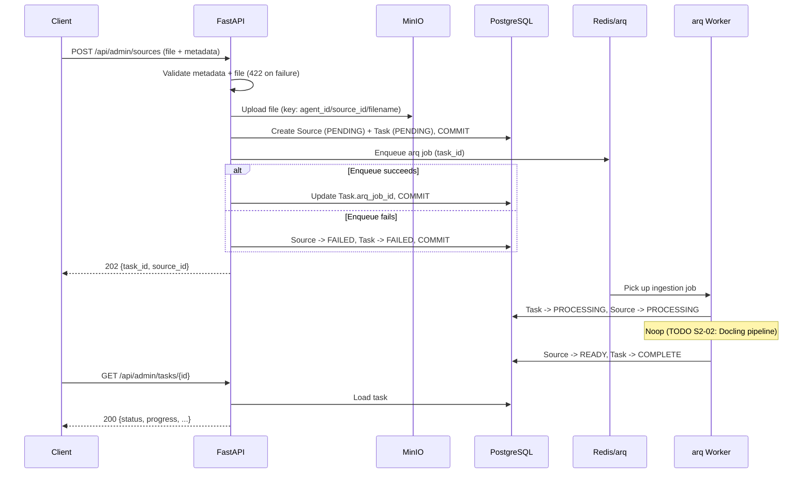

## Context

S2-01 is the first story of Phase 2 (First E2E Slice) and the entry point of the Knowledge Circuit. The backend has SQLAlchemy models, Alembic migrations, and a seeded agent (S1-02), but no API endpoints, no MinIO integration, no background workers, and no task tracking. Every subsequent Phase 2 story -- ingestion pipeline (S2-02), retrieval (S2-03), chat (S2-04) -- depends on source files being in the system.

This design introduces the first Admin API endpoint, the first use of MinIO and arq, and a new `background_tasks` table. The full detailed spec is in `docs/superpowers/specs/2026-03-18-s2-01-upload-source-design.md`; this document captures the architectural summary, key decisions with rationale, and risks.

## Goals / Non-Goals

### Goals

- Accept Markdown/TXT file uploads via `POST /api/admin/sources` (multipart: file + JSON metadata).
- Persist files in MinIO, metadata in PostgreSQL.
- Track async work via a new `background_tasks` table with full status lifecycle.
- Enqueue ingestion via arq with a noop worker that transitions statuses end-to-end.
- Expose `GET /api/admin/tasks/{id}` for task status polling.
- Add a `worker` service to Docker Compose (same image, arq entrypoint).
- Initialize MinIO bucket at application startup.

### Non-Goals

- Real ingestion pipeline -- parsing, chunking, embedding (S2-02).
- File formats beyond Markdown/TXT (S3-01).
- Admin API authentication (S7-01 -- explicit security exception, see Decision 6).
- Source listing and deletion endpoints (future stories).
- Document/DocumentVersion creation (S2-02 -- noop worker only transitions Source and Task statuses).

## Decisions

All decisions were made during the brainstorm phase and are documented in `docs/superpowers/specs/2026-03-18-s2-01-upload-source-design.md`. Summary and rationale:

**Decision 1 -- MinIO client: official `minio` SDK.** Lightweight (~2 MB), simple API, direct MinIO compatibility. Synchronous calls wrapped in `asyncio.to_thread()` for non-blocking usage in FastAPI and arq. Alternatives rejected: `boto3` is ~100 MB and overkill for self-hosted; `miniopy-async` is less maintained.

**Decision 2 -- Task storage: separate `background_tasks` table.** Clean entity with full history, queryable and extensible. Reused across S2-02, S5-03, and beyond. Alternatives rejected: overloading `batch_jobs` violates SRP (it is semantically designed for Gemini Batch API); Redis-only storage is ephemeral with no audit trail.

**Decision 3 -- File format scope: Markdown + TXT only.** Strict per plan, minimal edge cases, YAGNI. Endpoint rejects unsupported formats with 422. Extending to new formats in S3-01 is a whitelist change.

**Decision 4 -- Worker behavior: noop with full status lifecycle.** Worker transitions Source and Task through PENDING -> PROCESSING -> COMPLETE/READY without real processing. Demonstrates full end-to-end value. S2-02 replaces the noop body with the real Docling pipeline. Alternative rejected: stub with `NotImplementedError` leaves tasks permanently failed with no lifecycle demonstration.

**Decision 5 -- Upload format: multipart with file + JSON metadata field.** Single request, Pydantic validates JSON from a string field, compatible with the `curl` verification criteria. Alternative rejected: presigned URL flow adds complexity for no Phase 2 benefit.

**Decision 6 -- Admin API auth: deferred to S7-01.** Phase 2 runs locally in Docker. Auth middleware is added as a single layer in S7-01 without touching business logic. This is an **explicit security exception** per development.md principles 10-11: local Docker development only, not for exposed deployments. The TODO(S7-01) MUST be resolved before any non-local deployment.

**Decision 7 -- Bucket strategy: single `sources` bucket.** Key path `{agent_id}/{source_id}/{filename}` is tenant-ready. Created idempotently at startup in the FastAPI lifespan, same pattern as Alembic migrations and Redis init.

**Decision 8 -- Tasks table schema: extended with operational fields.** Includes `arq_job_id`, `progress`, `result_metadata` (JSONB) beyond the bare minimum. Every field is justified by stories within 2-3 sprints (S2-02 progress, S5-03 Admin UI, operational debugging).

**Decision 9 -- Commit-before-enqueue pattern.** PG transaction commits Source + Task records before arq enqueue. If enqueue happens first, the worker may pick up the job before the transaction is visible, finding no task. On enqueue failure, a compensating update marks both records FAILED. FAILED is observable and recoverable; stuck PENDING is not.

**Decision 10 -- Testing: unit + integration with PG testcontainer, mocked MinIO/arq.** Real PostgreSQL for migration and CRUD verification, mocked MinIO and arq for endpoint flow. Real MinIO/Redis integration tests deferred to S2-02 when the pipeline becomes meaningful.

## Architecture

### Affected Components

From `docs/architecture.md`:

- **Knowledge Circuit** -- first endpoint activated (`POST /api/admin/sources`). Source upload is step 1 of the ingestion flow.
- **Operational Circuit** -- arq + Redis infrastructure first used in production code. New `worker` Docker Compose service.
- **Data stores** -- MinIO first used (source file storage). PostgreSQL gains a new table. Redis gains arq task queue traffic.

### Unchanged Components

- **Dialogue Circuit** -- no changes. Chat API, retrieval, LLM, citations untouched.
- **Qdrant** -- no vector operations in S2-01.
- **Frontend** -- no UI changes.
- **Persona/config files** -- no changes.

### Data Flow

### New Components

| Component | Path | Responsibility |
|-----------|------|----------------|
| Admin router | `app/api/admin.py` | HTTP endpoints, request validation, response serialization |
| Storage service | `app/services/storage.py` | MinIO operations: upload, delete, key generation, bucket init |
| Source service | `app/services/source.py` | Source + Task creation, business logic orchestration |
| Worker settings | `app/workers/main.py` | arq WorkerSettings, DB engine lifecycle, task registry |
| Worker runner | `app/workers/run.py` | Python 3.14-compatible wrapper around arq worker startup |
| Ingestion task | `app/workers/tasks/ingestion.py` | Noop handler: status transitions for Task and Source |
| BackgroundTask model | `app/db/models/background_task.py` | SQLAlchemy model, re-exported via `operations.py` |
| Constants | `app/core/constants.py` | Canonical seeded IDs (default agent, etc.) |

### Database Changes

New migration `003_add_tasks_table.py` adds:

- `background_tasks` table with 12+ columns (id, task_type, status, source_id FK, arq_job_id, error_message, progress, result_metadata JSONB, tenant fields via mixin, started_at, completed_at)
- Two new PostgreSQL enum types: `background_task_type_enum` (INGESTION), `background_task_status_enum` (PENDING, PROCESSING, COMPLETE, FAILED, CANCELLED)
- Indexes on `agent_id`, `source_id`, `status`

### Docker Compose Changes

New `worker` service:

- Same Docker image as `api`, different startup command (`python -m app.workers.run`)
- `SKIP_MIGRATIONS=1` so only `api` runs Alembic migrations and the worker avoids migration races
- Depends on postgres, redis, minio (all with healthchecks)
- Shares `.env` and `backend/.env`

## Risks / Trade-offs

| Risk | Severity | Mitigation |
|------|----------|------------|
| No admin auth on `/api/admin/*` | Medium | Explicit security exception: local Docker only. TODO(S7-01) MUST resolve before non-local deployment. Caddy should not expose admin routes externally. |
| MinIO SDK is synchronous | Low | Wrapped in `asyncio.to_thread()`. Acceptable for file I/O. If throughput becomes a bottleneck, `miniopy-async` is a drop-in replacement. |
| Enqueue failure leaves MinIO file as orphan | Low | File is harmless; Source/Task records are marked FAILED. Orphan cleanup is a future operational concern, not a data integrity issue. |
| `arq_job_id` update fails after successful enqueue | Medium | The worker still processes by `task_id`, but DB correlation to the arq job is lost. Acceptable in S2-01; later operational work can reconcile missing job identifiers. |
| Worker crash leaves Task stuck in PROCESSING | Medium | No mitigation in S2-01. TODO(S7-04): stale task detection -- periodic check marks stuck tasks FAILED. |
| Noop worker provides no real processing value | None | By design. Full lifecycle is demonstrated and tested end-to-end. S2-02 replaces the noop body. |
| `background_tasks` table has fields unused in S2-01 (progress, result_metadata) | Low | Every field is justified by stories within 2-3 sprints. Avoids ALTER TABLE migrations later. Same reasoning as Decision 7 in S1-02 (full schema upfront). |

## Testing Approach

### Unit tests

- Metadata validation: required fields, lengths, types, URL format.
- File validation: allowed extensions (.md, .txt), rejection of unsupported formats.
- `source_type` determination from file extension.
- MinIO key generation: format correctness, filename sanitization.

### Integration tests (PostgreSQL testcontainer)

- Migration 003: table created with correct columns, downgrade works, enum values match.
- Upload flow via FastAPI TestClient: valid upload returns 202 with source_id + task_id, Source and Task records created in PG with correct status and fields, MinIO and arq called correctly (mocked).
- Rejection cases: invalid format (422), empty file (422), missing title (422).
- Compensating failure path: enqueue failure (mock raises) -> Source and Task marked FAILED in PG with error_message.
- Task status endpoint: 200 with correct fields, 404 for nonexistent task.
- Worker handler: task transitions PENDING -> PROCESSING -> COMPLETE, source transitions PENDING -> PROCESSING -> READY, exception handling marks both FAILED with error_message.

### Mocking strategy

- **MinIO:** dependency injection -- storage service receives client via DI, tests substitute a mock.
- **arq:** mock enqueue function -- source service calls `enqueue_job()`, tests substitute a mock.
- **PostgreSQL:** real DB via testcontainer (existing infrastructure from S1-02).
