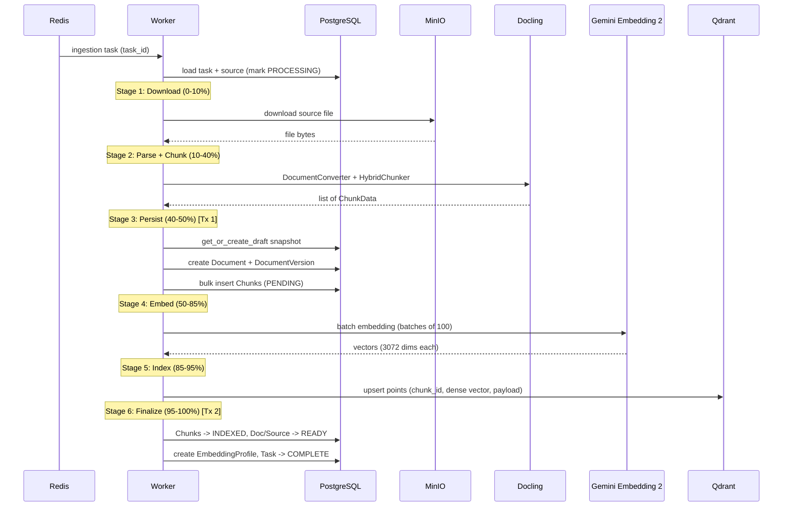

## Context

S2-02 is the second story of Phase 2 (First E2E Slice) and the core of the Knowledge Circuit. S2-01 delivered file upload with MinIO storage and a noop ingestion worker that transitions statuses end-to-end but performs no real processing. Uploaded documents exist in storage but cannot be searched or used for RAG -- they are dead weight.

This story replaces the noop worker with a real pipeline: download from MinIO, parse with Docling, chunk with HybridChunker, embed via Gemini Embedding 2, persist chunks in PostgreSQL, and upsert vectors into Qdrant. It is the critical path to a working E2E slice -- turning uploaded files into searchable knowledge.

The full detailed spec is in `docs/superpowers/specs/2026-03-18-s2-02-parse-chunk-embed-design.md`; this document captures the architectural summary, key decisions with rationale, and risks.

## Goals / Non-Goals

### Goals

- Replace noop ingestion with a real pipeline: download -> parse -> chunk -> embed -> index.
- Integrate Docling for structure-aware MD/TXT parsing with HybridChunker for anchor-preserving chunking.
- Integrate Google GenAI SDK for Gemini Embedding 2 dense vector generation (batched, with tenacity retry).
- Integrate Qdrant async client for collection management and chunk upsert with named dense vectors.
- Auto-create draft knowledge snapshots on first ingestion (race-safe via partial unique index).
- Create Document + DocumentVersion + Chunk records during ingestion (not at upload time).
- Add `StorageService.download()` for file retrieval from MinIO.
- Add `language` column to `sources` table and persist the field from upload metadata.
- Create EmbeddingProfile records for pipeline audit trail.
- Add 7 new configuration settings (gemini_api_key, embedding_model, embedding_dimensions, chunk_max_tokens, qdrant_collection, bm25_language, embedding_batch_size).

### Non-Goals

- Path A (Gemini native for short PDFs/images/audio/video) -- S3-04.
- BM25 sparse vectors -- S3-02.
- File formats beyond MD/TXT -- S3-01.
- Snapshot lifecycle (publish/activate/rollback) -- S2-03.
- Hybrid retrieval / search endpoint -- S2-04.
- Batch API for bulk operations -- S3-06.
- Chunk enrichment -- S9-01.

## Decisions

All decisions were made during the brainstorm phase and are documented in `docs/superpowers/specs/2026-03-18-s2-02-parse-chunk-embed-design.md`. Summary and rationale:

**Decision 1 -- Embedding client: Google GenAI SDK (`google-genai`).** ProxyMind is architecturally tied to Gemini Embedding 2 (spec decision); model switching requires full reindex, so LiteLLM's provider-swap benefit is illusory for embeddings. GenAI SDK provides cleanest access to `task_type` (RETRIEVAL_DOCUMENT/RETRIEVAL_QUERY), `output_dimensionality`, and `title`. Chosen by the user. LiteLLM remains correct for LLM calls (S2-04).

**Decision 2 -- Embedding dimensions: configurable, default 3072.** One `embedding_dimensions` setting in config. Default 3072 gives maximum quality for the initial baseline. Any change triggers reindex (unavoidable). EmbeddingProfile records the actual value per embedding pass for audit.

**Decision 3 -- Qdrant collection schema: single collection, named dense vector.** Collection `proxymind_chunks` with named vector `dense` (3072 dims, cosine). Named vectors are required for S3-02 forward compatibility -- `update_collection` can add a `sparse` named vector without collection recreation. Unnamed vectors would force full reindex at S3-02. Payload indexes on `snapshot_id`, `agent_id`, `knowledge_base_id`, `source_id`, `status`, `source_type`. Text content dual-written to PG (source of truth) and Qdrant payload (hot-path retrieval context).

**Decision 4 -- Pipeline architecture: services without abstract orchestrator.** Three independent services (DoclingParser, EmbeddingService, QdrantService), each doing one thing. Worker task orchestrates them directly in sequence -- no Pipeline class. A Pipeline abstraction is premature with only one processing path; when Path A arrives (S3-04), two real use cases will inform a proper abstraction.

**Decision 5 -- HybridChunker configuration: 1024 max tokens.** Industry standard for semantic search. Well within Gemini Embedding 2's 8192-token window. HybridChunker merges small consecutive chunks under the same heading and splits oversized chunks at sentence boundaries. Configurable via `chunk_max_tokens`.

**Decision 6 -- Snapshot handling: auto-create draft on first ingestion.** Worker calls `get_or_create_draft(agent_id, knowledge_base_id)`. Matches architecture.md ("Chunks in Qdrant are tagged with this draft's snapshot_id"). Draft isolation means chunks are invisible to chat by default -- S2-03 adds publish/activate on top. Race condition prevented by a partial unique index (`uq_one_draft_per_scope`) with `INSERT ... ON CONFLICT DO NOTHING` + `SELECT`.

**Decision 6a -- Document/DocumentVersion lifecycle.** Created by the worker during ingestion, not at upload time. `Document(status=PROCESSING)` + `DocumentVersion(version_number=1, processing_path=PATH_B)` + bulk `Chunk(status=PENDING)` records -- all in one transaction (Tx 1). Re-upload creates a clean slate (new Document). Re-indexing same source (future) creates a new DocumentVersion under the existing Document.

**Decision 7 -- Worker initialization: services in context.** All clients (MinIO, Qdrant, GenAI) initialized in `on_startup()`, stored in worker context dict, reused across tasks. Matches existing pattern (session_factory already in context). Qdrant collection ensured idempotently at startup. Cleanup in `on_shutdown()`.

**Decision 8 -- Batch embedding: 100 texts per API call.** GenAI SDK supports batched embedding. One HTTP call instead of 20 for a typical document. Reduces rate limit pressure. Batch size configurable via `embedding_batch_size`. Concurrent batches deferred to S3-06.

**Decision 9 -- Error handling: all-or-nothing with tenacity retry.** Tenacity wraps Gemini (retry on 429/5xx, max 3) and Qdrant (retry on connection errors, max 3). No retry for Docling (deterministic). On exhausted retries, entire task fails -- no partial state. Clean data guarantee: a document in Qdrant is either fully indexed or not present. Two transaction boundaries: Tx 1 (persist chunks as PENDING before Gemini calls), Tx 2 (finalize as INDEXED after successful Qdrant upsert). On failure between Tx 1 and Tx 2, a recovery transaction marks records FAILED (audit trail, not deleted).

**Decision 10 -- Language handling: system-wide from config.** `bm25_language` setting (default "english") included in Qdrant payload from day one, avoiding reindex when S3-02 adds BM25. Sources also get a `language` column (migration 004) to persist the upload metadata field that S2-01 accepted but silently dropped.

## Architecture

### Affected Components

From `docs/architecture.md`:

- **Knowledge Circuit** -- core activation. Ingestion pipeline (Docling Parser, HybridChunker, Gemini Embedding 2, Qdrant indexing) goes live. Draft snapshot auto-creation.
- **Operational Circuit** -- arq worker upgraded from noop to real processing with multi-stage progress tracking, tenacity retry, and structured error handling.
- **Data stores** -- Qdrant first used (vector storage). PostgreSQL gains Document/DocumentVersion/Chunk/EmbeddingProfile records and a new migration. MinIO download path added.

### Unchanged Components

- **Dialogue Circuit** -- no changes. Chat API, retrieval, LLM, citations untouched.
- **Frontend** -- no UI changes.
- **Persona/config files** -- no changes.
- **Admin API endpoints** -- no new routes (worker-only story).

### Pipeline Flow

### New Components

| Component | Path | Responsibility |
|-----------|------|----------------|
| DoclingParser | `app/services/docling_parser.py` | Parse file via Docling DocumentConverter, chunk via HybridChunker, return ChunkData list |
| EmbeddingService | `app/services/embedding.py` | Batched dense embedding via GenAI SDK, tenacity retry on 429/5xx |
| QdrantService | `app/services/qdrant.py` | Collection management (idempotent create, dimension mismatch detection), point upsert |
| SnapshotService | `app/services/snapshot.py` | `get_or_create_draft()` with INSERT ON CONFLICT DO NOTHING |

### Modified Components

| Component | Change |
|-----------|--------|
| StorageService (`app/services/storage.py`) | Add `download()` method |
| SourceService (`app/services/source.py`) | Persist `language` field from upload metadata |
| Worker main (`app/workers/main.py`) | Initialize Qdrant, GenAI, Storage services in context; ensure collection at startup |
| Ingestion task (`app/workers/tasks/ingestion.py`) | Replace noop with real 6-stage pipeline |
| Settings (`app/core/config.py`) | 7 new configuration fields |

### Database Changes

Migration 004 adds:

- `sources.language` column (VARCHAR(32), nullable) -- persists upload metadata field S2-01 accepted but dropped.
- `uq_one_draft_per_scope` partial unique index on `knowledge_snapshots(agent_id, knowledge_base_id) WHERE status = 'draft'` -- prevents duplicate drafts under concurrent ingestion.

No new tables -- all required tables (chunks, documents, document_versions, knowledge_snapshots, embedding_profiles) exist from S1-02.

## Risks / Trade-offs

| Risk | Severity | Mitigation |
|------|----------|------------|
| Docling heavy install (~500 MB with PyTorch dependencies) | Medium | Use lightweight pipeline config for MD/TXT; full models loaded only when needed (S3-01). Docker layer caching mitigates rebuild cost. |
| Gemini Embedding 2 rate limits slow ingestion | Medium | Tenacity exponential backoff; configurable batch size (100 default); Batch API in S3-06 for bulk. |
| Qdrant collection schema lock-in | Low | Named vectors (D3) ensure S3-02 can add sparse vectors via `update_collection` without recreation. |
| GenAI SDK breaking changes | Low | Pin minimum version (1.14.0+); GenAI SDK follows semver. |
| Dimension mismatch after config change | Medium | `ensure_collection()` detects mismatch and fails fast with `CollectionSchemaMismatchError`. No silent wrong-dimension writes. |
| All-or-nothing retry wastes API cost on large documents | Low | MD/TXT files (S2-02 scope) are small -- full re-embed is cheap. Partial retry optimization deferred to S3-01 when large PDFs introduce real failure cost. |
| Race condition on draft snapshot creation | Low | Partial unique index + INSERT ON CONFLICT eliminates at DB level. No advisory locks needed. |

## Testing Approach

### Unit tests

- **DoclingParser**: mock Docling internals. Verify chunk extraction, anchor metadata, token counting, edge cases (empty doc, single paragraph, deep headings).
- **EmbeddingService**: mock GenAI SDK. Verify batching logic (split into groups of 100), retry on 429/5xx, dimension validation.
- **QdrantService**: mock qdrant-client. Verify collection creation params (named vector, payload indexes), point structure, idempotent ensure_collection, dimension mismatch detection.
- **Pipeline orchestration**: mock all services. Verify call sequence, progress updates, status transitions, error propagation, draft snapshot auto-creation, Tx 1/Tx 2 boundaries.

### Integration tests (with Docker services)

- **Full pipeline with real PG**: upload source fixture, run pipeline with mocked GenAI (Docling runs real for MD/TXT), verify all PG records with correct statuses and relationships.
- **Snapshot auto-creation**: first ingestion creates draft, second reuses it.
- **Qdrant round-trip with real Qdrant container**: create collection -> upsert points with realistic payload -> search by vector with snapshot_id filter -> verify results. Uses fake vectors (no Gemini dependency).
- **Dimension mismatch**: create collection with size=3072, change settings to 1024, verify `CollectionSchemaMismatchError`.
