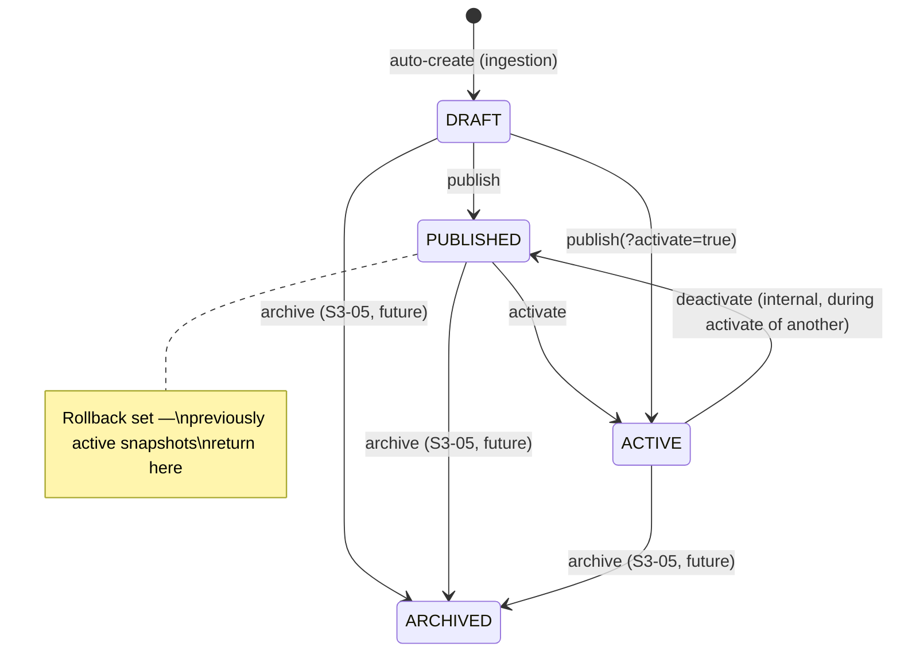
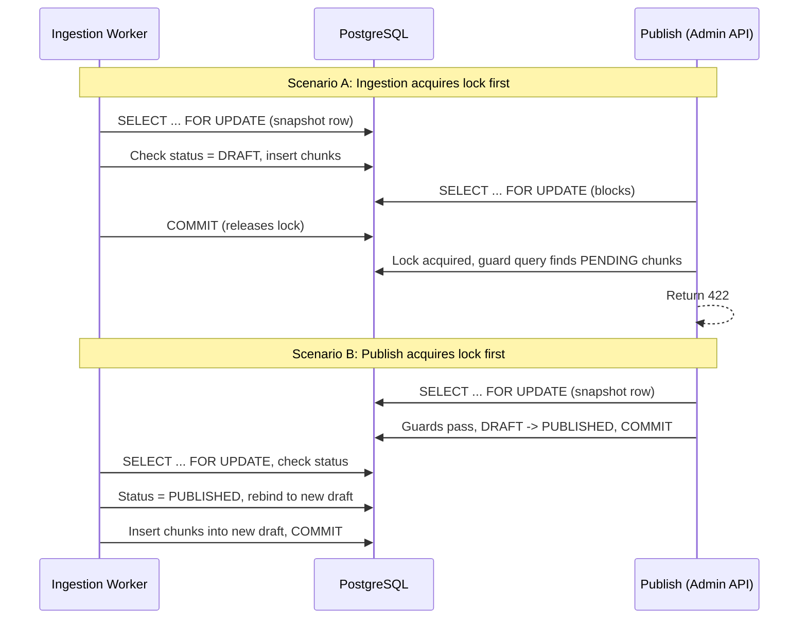

# S2-03: Knowledge Snapshot (Minimal) — Design

## Context

S2-02 delivered the ingestion pipeline: Docling parsing, Gemini Embedding 2 vectors, and Qdrant indexing. Chunks are linked to auto-created draft snapshots via `snapshot_id`, but there is no mechanism to make them visible to retrieval. The architecture defines four snapshot states (draft / published / active / archived) and a single-active invariant enforced through `Agent.active_snapshot_id`, but none of the transition logic exists yet.

The existing codebase provides:

- `KnowledgeSnapshot` model with status enum, timestamp fields, and `chunk_count` counter
- `SnapshotService.get_or_create_draft()` — upsert-based draft creation with partial unique index `uq_one_draft_per_scope`
- `Agent.active_snapshot_id` FK (nullable, currently always NULL)
- `Chunk.snapshot_id` as a plain UUID (not a FK — by design, to avoid circular FK paths)
- Ingestion worker that calls `get_or_create_draft`, inserts chunks, embeds, and upserts to Qdrant

**Architecture circuits affected:**

- **Knowledge circuit** — snapshot lifecycle management (new), ingestion worker locking (modified)
- **Operational circuit** — no changes; arq/Redis task queue used as-is

**Unchanged:**

- Dialogue circuit — no retrieval or chat endpoints added (that is S2-04)
- Data stores — PostgreSQL, Qdrant, MinIO, Redis schemas unchanged except one new index
- Frontend — no changes
- Docker/infrastructure — no changes

## Goals / Non-Goals

**Goals:**

- Implement the snapshot state machine: `draft -> published -> active`, with `active -> published` on deactivation
- Provide admin API endpoints to list, inspect, publish, and activate snapshots
- Enforce the single-active invariant at the database level
- Guarantee published snapshot immutability through serialized locking between publish and ingestion
- Satisfy the plan.md verification: "create draft -> upload source -> publish+activate -> vector search against active snapshot works; chunks from draft are not visible"

**Non-Goals:**

- Search/retrieval endpoint — S2-04 scope; isolation is verified via integration tests querying Qdrant directly
- Manual snapshot creation — drafts are auto-created during ingestion (YAGNI)
- Rollback, archive, draft testing endpoints — S3-05 scope
- Snapshot naming/editing (`PATCH`) — deferred
- Frontend changes

## Decisions

### D1: Two-step publish semantics (publish + activate separately)

Publish and activate are separate operations: `POST /snapshots/:id/publish` transitions `draft -> published`, and `POST /snapshots/:id/activate` transitions `published -> active`. A convenience parameter `?activate=true` on publish performs both in one transaction.

**Why:** `architecture.md` defines four distinct states. A two-step model maps directly to this contract and means S3-05 (rollback, draft testing) adds transitions to the same state machine without refactoring. The cost difference versus a single-step model is negligible.

**Rejected:** Single-step publish (`draft -> active` directly). Simpler for minimal story but conflates two lifecycle events and requires semantic changes when rollback is added.

### D2: Deactivated snapshot returns to published (domain model correction)

When a new snapshot is activated, the previously active snapshot transitions to `published` — not `archived`. This resolves a contradiction in `architecture.md` where line 120 states `active -> archived` on deactivation, but line 136 describes rollback as "switching to another published snapshot." If deactivated snapshots go to archived, there are no published snapshots left for rollback.

**Consequences:**

- Published pool = rollback set. All previously active snapshots remain available for re-activation.
- Archived is a terminal state reached only by explicit owner action (S3-05).
- `architecture.md` must be updated as part of this story.

**Rejected:** Automatic archival on deactivation (current `architecture.md` text) — incompatible with rollback semantics. Requiring explicit deactivate-then-activate — non-atomic, creates a window with no active snapshot.

### D3: Automatic draft creation only

No manual `POST /api/admin/snapshots` endpoint. Drafts continue to be created automatically by `get_or_create_draft()` during ingestion. The list/detail endpoints let the owner discover existing snapshots.

**Why:** YAGNI for minimal story. Two creation paths (manual + automatic) would create confusion about scope matching and empty snapshots.

### D4: Publishing empty or incomplete snapshots is forbidden

`publish` returns 422 if the snapshot has zero indexed chunks or if any chunks are still processing. Both checks use live SQL queries against the `chunks` table, not the advisory `chunk_count` counter (which may be stale during concurrent ingestion).

**Why:** Publish means "finalized, immutable." An empty immutable snapshot is a meaningless entity, and publishing before ingestion completes would create an incomplete knowledge base.

### D5: List/detail endpoints included in S2-03

`GET /api/admin/snapshots` and `GET /api/admin/snapshots/:id` are part of this story, pulled forward from the S3-05 scope note in `plan.md`.

**Why:** Without list/detail, the owner cannot discover which snapshot exists or check its status before calling publish/activate. These are a prerequisite for a usable publish flow.

### D6: Concurrency via three complementary mechanisms

Three race conditions exist: parallel activate, publish during ingestion, and parallel publish. They are addressed by three mechanisms working together:

1. **Partial unique index `uq_one_active_per_scope`** — database-level enforcement that at most one snapshot can be ACTIVE per `(agent_id, knowledge_base_id)` scope. Analogous to the existing `uq_one_draft_per_scope`. Requires a new Alembic migration.

2. **`SELECT ... FOR UPDATE` on the snapshot row** — serializes concurrent publish and activate calls on the same snapshot. Guard queries run inside the same transaction and see a consistent view.

3. **Ingestion-side locking (`ensure_draft_or_rebind`)** — since `Chunk.snapshot_id` is not a FK, the publish-side row lock alone cannot prevent chunks from landing in a published snapshot. The ingestion worker must also acquire `FOR UPDATE` on the snapshot row before persisting chunks, check status is still DRAFT, and rebind to a new draft if the snapshot was published concurrently.

**Why all three are needed:** The partial unique index is a safety net but cannot serialize the publish-ingestion race. The row lock serializes publish calls but does not block chunk inserts (different table, no FK). Ingestion-side locking closes the gap by ensuring both publish and chunk-insert contend on the same row lock.

**Rejected:** Relying solely on the row lock from publish — insufficient because `Chunk.snapshot_id` is a plain UUID, so chunk inserts are not blocked by a lock on the snapshot row.

### D7: Verification through integration tests, not a search endpoint

Snapshot isolation is proven via integration tests that query Qdrant directly with `snapshot_id` payload filters. No search/retrieval endpoint is added.

**Why:** S2-04 defines the retrieval service. Adding a test search endpoint here would duplicate scope. Integration tests calling the Qdrant client with filters are sufficient to prove isolation.

## State Machine



**Transition table:**

| Current   | Action            | Next      | Guards                                          | Side effects                                                     |
|-----------|-------------------|-----------|-------------------------------------------------|------------------------------------------------------------------|
| DRAFT     | publish           | PUBLISHED | indexed chunks > 0; pending chunks == 0 (live SQL) | `published_at = now()`; row locked via FOR UPDATE                |
| PUBLISHED | activate          | ACTIVE    | none                                            | `activated_at = now()`; old ACTIVE -> PUBLISHED; `Agent.active_snapshot_id` updated |
| ACTIVE    | deactivate        | PUBLISHED | internal only (during activate of another)      | `activated_at` preserved                                         |
| DRAFT     | publish+activate  | ACTIVE    | same as publish                                 | both transitions in one transaction                              |

Invalid transitions return `409 Conflict`.

## Publish-Ingestion Concurrency

The core correctness property: publish and chunk-insert are serialized on the same row lock. The `ensure_draft_or_rebind` method encapsulates this protocol in the service layer, and the ingestion worker calls it before persisting chunks.



## API Surface

Four new endpoints under `/api/admin/snapshots`:

| Method | Path                                | Response codes  | Purpose                                 |
|--------|-------------------------------------|-----------------|-----------------------------------------|
| GET    | `/api/admin/snapshots`              | 200             | List snapshots (filterable by status)   |
| GET    | `/api/admin/snapshots/:id`          | 200 / 404       | Snapshot detail with chunk count        |
| POST   | `/api/admin/snapshots/:id/publish`  | 200 / 409 / 422 | Publish draft (optional `?activate=true`) |
| POST   | `/api/admin/snapshots/:id/activate` | 200 / 409       | Activate a published snapshot           |

Archived snapshots are hidden from list by default; `?include_archived=true` shows them.

## Service Layer Changes

All lifecycle logic lives in `backend/app/services/snapshot.py`, extending the existing `SnapshotService`:

- **New methods:** `list_snapshots`, `get_snapshot`, `publish`, `activate`, `_do_activate` (private)
- **New method:** `ensure_draft_or_rebind` — acquires FOR UPDATE on the snapshot row, checks status is DRAFT, rebinds to a new draft if not. Always returns a locked DRAFT snapshot.
- **Existing unchanged:** `get_or_create_draft`

The router (`admin.py`) handles HTTP parsing and response serialization only. All state checks, guards, and locking are in the service. The service depends only on the SQLAlchemy session — no Qdrant or Redis calls.

## Database Changes

One new Alembic migration: partial unique index on ACTIVE per scope.

```sql
CREATE UNIQUE INDEX uq_one_active_per_scope
    ON knowledge_snapshots (agent_id, knowledge_base_id)
    WHERE status = 'active';
```

Everything else already exists: the `KnowledgeSnapshot` model with status/timestamps, `uq_one_draft_per_scope`, `Agent.active_snapshot_id` FK, and `Chunk.snapshot_id`.

## Ingestion Worker Modification

The worker currently calls `get_or_create_draft` and then inserts chunks without locking. It must be changed to call `ensure_draft_or_rebind` (which acquires FOR UPDATE) before chunk persistence, and keep the lock through commit. If the snapshot is no longer DRAFT, the worker rebinds to a new draft transparently.

This is a correctness requirement, not defense-in-depth. Without it, chunks can land in a published snapshot (see Scenario C in the brainstorm design).

## Documentation Updates

- **`architecture.md`:** Update the snapshot lifecycle state diagram to show `active -> published` on deactivation instead of `active -> archived`. Remove the contradiction between lines 120 and 136.
- **`plan.md`:** Update S2-03 tasks to reflect refined publish/activate semantics and list/detail endpoints; adjust S3-05 to note list/detail was pulled forward.

## Risks / Trade-offs

**Row-level locking adds latency to ingestion.** Every chunk-insert transaction now acquires FOR UPDATE on the snapshot row. This serializes concurrent ingestion tasks targeting the same draft. For the current scale (single-user, one file at a time), this is acceptable. If parallel multi-file ingestion becomes a bottleneck, the lock scope could be narrowed — but that would complicate the immutability guarantee.

**Advisory `chunk_count` may drift.** The counter on `KnowledgeSnapshot` is incremented during finalization but is not used for publish guards (live SQL is). If concurrent ingestion tasks commit in unexpected order, the counter may be transiently inaccurate. This is acceptable because it is display-only; guards always use live queries.

**`architecture.md` domain model changes.** This story intentionally corrects the snapshot lifecycle in `architecture.md`. The deactivation transition changes from `active -> archived` to `active -> published`. This is a design correction (resolving a contradiction), not scope creep, but anyone reviewing the PR should be aware the architecture doc changes semantics.

**No search endpoint for manual verification.** Isolation is proven only through integration tests and direct Qdrant API calls. The owner cannot verify through the application UI until S2-04 delivers the chat endpoint. This is intentional — adding a throwaway search endpoint would duplicate S2-04 work.

## Testing Approach

**Unit tests** (`test_snapshot_state_machine.py`): All valid transitions (draft->published, published->active, publish+activate, deactivation of old active), all invalid transitions (publish published, activate draft, etc.), and publish guards (empty snapshot, pending chunks).

**Integration tests** (`test_snapshot_lifecycle.py`): End-to-end lifecycle (upload -> draft -> publish -> activate -> verify in Qdrant), isolation proof (active chunks visible, draft chunks separate), concurrency tests (parallel activate -> one 409, publish during pending chunks -> 422, ingestion rebind after publish).

**API tests** (`test_snapshot_api.py`): Endpoint-level tests for all four routes, status filtering, error responses.

## Files to Modify

| File | Change type | Description |
|------|-------------|-------------|
| `backend/app/db/models/knowledge.py` | Modify | Add `uq_one_active_per_scope` partial unique index to model |
| `backend/migrations/versions/005_*.py` | New | Migration for the active-scope unique index |
| `backend/app/services/snapshot.py` | Modify | Add list, get, publish, activate, _do_activate, ensure_draft_or_rebind |
| `backend/app/workers/tasks/ingestion.py` | Modify | Replace direct chunk insert with locked snapshot protocol |
| `backend/app/api/admin.py` | Modify | Add 4 new snapshot endpoints |
| `backend/app/api/snapshot_schemas.py` | Create | SnapshotResponse Pydantic model |
| `docs/architecture.md` | Modify | Fix snapshot lifecycle diagram (active -> published on deactivation) |
| `docs/plan.md` | Modify | Update S2-03 tasks, adjust S3-05 scope note |
| `backend/tests/unit/test_snapshot_state_machine.py` | New | Unit tests for transitions and guards |
| `backend/tests/integration/test_snapshot_lifecycle.py` | New | End-to-end lifecycle, isolation, concurrency |
| `backend/tests/integration/test_snapshot_api.py` | New | API endpoint tests |
