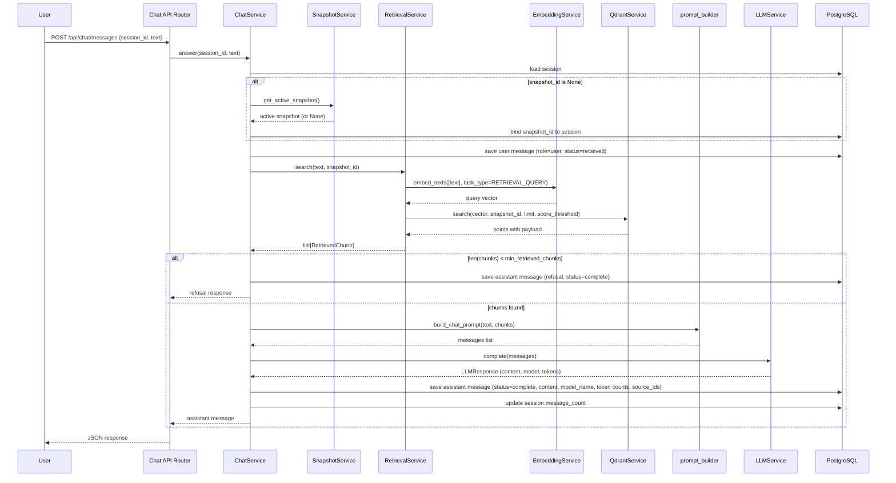

# S2-04: Minimal Chat — Design

## Context

**Background:** S2-04 is the final story in Phase 2 (First E2E Slice), closing the loop from upload to answer. With this story complete, the system delivers the full cycle: upload document, parse and embed it, publish a snapshot, ask a question, and receive an answer grounded in published knowledge.

**Current state:** the knowledge circuit is complete — source upload (S2-01), ingestion pipeline with Docling parsing, Gemini embedding, and Qdrant indexing (S2-02), and snapshot lifecycle with draft/published/active states (S2-03). The dialogue circuit has no implementation yet. Session and Message models already exist in the database schema; no migration is needed.

**Affected circuit:** dialogue circuit — this story provides its first implementation.

**Unchanged circuits:** knowledge circuit and operational circuit remain as-is. The only modifications to knowledge-circuit code are two additive methods: `QdrantService.search()` and `SnapshotService.get_active_snapshot()`.

## Goals / Non-Goals

### Goals

- Enable RAG-powered Q&A against published knowledge via a Chat API (three endpoints)
- Dense vector retrieval in Qdrant, scoped by the active snapshot
- LLM integration via LiteLLM (provider-agnostic, configured through explicit env vars)
- Session and message persistence in PostgreSQL
- Lazy-bind snapshot to session on first message (handles "session created before first publish")
- Explicit refusal without LLM call when retrieval returns insufficient context
- Prompt assembly as pure functions (system instruction + retrieval context + user question)

### Non-Goals

| Feature | Deferred to |
|---------|-------------|
| SSE streaming | S4-02 |
| Persona files (IDENTITY/SOUL/BEHAVIOR) | S4-01 |
| Citation builder | S4-03 |
| Query rewriting | S4-04 |
| Audit logging | S7-03 |
| Rate limiting | S7-02 |
| BM25 sparse vectors | S3-02 |
| Hybrid search + RRF fusion | S3-03 |
| Idempotency key | S4-02 |
| Content type spans | S4-06 |

## Decisions

### D1: Explicit session creation

**Decision:** sessions are created explicitly via `POST /api/chat/sessions`. The `POST /api/chat/messages` endpoint requires a `session_id`.

**Why:** matches the API contract already documented in `architecture.md` (three Chat API endpoints). Clean REST semantics — session creation and message sending are separate responsibilities. For S2-04 (no frontend, testing via curl), two requests are not a burden. When the frontend arrives (S5-01), it will call `POST /sessions` on chat open.

**Rejected alternatives:**
- Auto-create session on first message — convenient but creates a side effect in the messages endpoint. Blurs responsibility, harder to test and document.
- Both explicit and auto-create — maximum flexibility but two paths to the same result. Harder to maintain, violates KISS.

### D2: LLM configuration — three explicit env vars

**Decision:** configure LLM via `LLM_MODEL` (LiteLLM model string), `LLM_API_KEY` (provider API key), and `LLM_API_BASE` (custom endpoint URL).

**Why:** for a self-hosted product, all LLM configuration must be visible and explicit in `.env`, without hidden conventions. `LLM_API_BASE` is required for ZAI (the default provider) and any proxy or self-hosted LLM setup. Three variables are the minimum for full control without over-engineering.

**Rejected alternatives:**
- Single `LLM_MODEL` relying on LiteLLM naming conventions for API keys (e.g. `OPENAI_API_KEY`, `GEMINI_API_KEY`) — implicit dependency on env var naming, not transparent for self-hosted deployments.
- Two vars `LLM_PROVIDER` + `LLM_MODEL` — redundant because LiteLLM already supports the `provider/model` prefix format in a single string.

### D3: HTTP 422 when no active snapshot

**Decision:** `POST /api/chat/messages` returns HTTP 422 when the session has no associated active snapshot (including after lazy-bind attempt).

**Why:** from spec.md: "the twin responds only from the active published snapshot." Without a snapshot the twin cannot answer — this is not a server error but an unprocessable state. 422 (Unprocessable Entity) correctly reflects that the request is syntactically valid but the system cannot process it. Easy for clients (and future frontend) to handle distinctly from server errors.

**Rejected alternatives:**
- Answer without context (LLM receives only the question) — violates the "responds only from published snapshot" principle; LLM may hallucinate freely.
- HTTP 503 (Service Unavailable) — semantically imprecise. 503 implies temporary infrastructure unavailability, not missing data.

### D4: Explicit refusal without LLM call when no relevant chunks

**Decision:** when retrieval returns fewer chunks than `min_retrieved_chunks` (default: 1), the system saves an assistant message with a hardcoded refusal text and returns it without calling the LLM.

**Why:** from rag.md: "if retrieval returns fewer than `min_retrieved_chunks` — the digital twin responds 'no answer found in the knowledge base'." This is backend logic, not an LLM decision. Avoids a wasted LLM call for a predictable outcome. Eliminates hallucination risk when there is no grounding context.

**Rejected alternative:** pass the question to the LLM with an instruction to refuse — extra cost for a predictable result, and the LLM may ignore the instruction and hallucinate anyway.

### D5: Dedicated ChatService orchestrator

**Decision:** a thin `ChatService` orchestrates the chat flow by coordinating `RetrievalService`, `LLMService`, `SnapshotService`, and `prompt_builder`. Each responsibility is a separate service or module.

**Why:**
- `architecture.md` defines `retrieval.py` and `llm.py` as separate modules in `services/`.
- The project follows a stateless services + DI pattern — this approach fits naturally.
- `RetrievalService` will be extended in S3-02/S3-03 (BM25, hybrid, RRF) — isolation is critical.
- `LLMService` will be reused in query rewriting (S4-04) — a separate service enables this.
- `ChatService` remains a thin orchestrator (approximately 60-80 lines), easy to extend.

**Rejected alternatives:**
- Fat endpoint (router orchestrates directly) — business logic leaks into the router, violates SRP, harder to test, grows uncontrollably with streaming/citations/persona.
- Monolithic ChatService (embedding + search + LLM all in one) — violates SRP, would grow to 500+ lines, impossible to reuse retrieval or LLM independently.

### D6: Score threshold — configurable but disabled by default

**Decision:** `RetrievalService` accepts a `min_dense_similarity` parameter. It is exposed in Settings with a default of `None` (disabled). When set to a float, chunks with cosine similarity below the threshold are filtered out before being returned.

**Why:** from rag.md: "min_dense_similarity — to be determined via evals." Without empirical data a specific threshold value would be arbitrary. However, the filtering mechanism must exist from S2-04 — without it, dense top-N over a non-empty collection will almost always return at least one chunk, making the `min_retrieved_chunks` check practically unreachable. The mechanism is in place; the exact calibration value will come from evals (S8-02).

**Known limitation:** with `min_dense_similarity=None`, the system may pass weakly relevant context to the LLM. The system prompt instructs the LLM to refuse when context is insufficient, but this is a soft guard. Operators who want stricter filtering before evals can set `MIN_DENSE_SIMILARITY` to a conservative value (e.g., 0.3-0.5) in `.env`.

### D7: Lazy-bind snapshot_id on first message

**Decision:** `session.snapshot_id` is set to the currently active snapshot when the session is created. If no active snapshot exists at creation time, `snapshot_id` is set to `None`. On the first message, if `snapshot_id` is still `None`, the system attempts a lazy bind: it checks for the current active snapshot and, if one exists, binds it to the session before proceeding. If no active snapshot exists at message time either — 422.

**Why:** fixing the snapshot per session prevents mid-conversation inconsistency — once bound, the session stays on that snapshot even if a new one is published. Lazy bind solves the "session created before first publish" problem: the frontend can create a session and render UI before any knowledge is published. When the owner later publishes and the user sends their first message, the session picks up the newly active snapshot automatically. Without lazy bind, such a session would be permanently broken (always returning 422).

**Once bound, snapshot_id is immutable for the session.** Lazy bind happens only on the transition from `None` to an active snapshot. Subsequent messages always use the already-bound snapshot.

### D8: Prompt structure — context in user message, instructions in system

**Decision:** the system message contains behavioral instructions; the retrieval context and user question are placed in the user message.

**Why:**
- System prompt defines model behavior (instructions) — standard practice.
- Retrieval context is data, not instructions. Standard RAG pattern places context in the user message.
- Simplifies future persona integration (S4-01): persona goes into system, context stays in user.

### D9: Prompt assembly as pure functions, not a service class

**Decision:** `services/prompt.py` contains stateless functions (`build_chat_prompt`), not a class with injected dependencies.

**Why:** prompt assembly is a pure data transformation — input in, output out. No dependencies, no side effects, no state. Easy to test with simple assertions. When persona (S4-01) and promotions (S4-05) add complexity, the function gains parameters. If complexity warrants a class — refactor then (YAGNI now).

## Architecture

### Chat flow

### Service architecture

New services and their responsibilities:

- **ChatService** (`services/chat.py`) — thin orchestrator. Coordinates session creation, snapshot binding, retrieval, prompt assembly, LLM invocation, and message persistence. Per-request (depends on `AsyncSession` for DB transaction scope).
- **RetrievalService** (`services/retrieval.py`) — query embedding via `EmbeddingService` + dense vector search via `QdrantService`, scoped by snapshot. Initialized once in lifespan, stored in `app.state`.
- **LLMService** (`services/llm.py`) — async LiteLLM wrapper. Single point of LLM invocation. No retry (LiteLLM has built-in retry/fallback). No streaming in S2-04. Initialized once in lifespan, stored in `app.state`.
- **prompt_builder** (`services/prompt.py`) — pure functions. Builds the messages list in OpenAI chat API format (accepted by LiteLLM).

### Modified existing services

- **QdrantService** — gains a `search()` method: dense vector query with payload filtering by `snapshot_id`, `agent_id`, `knowledge_base_id`. Optional `score_threshold` parameter passed from `min_dense_similarity` in Settings.
- **SnapshotService** — gains a `get_active_snapshot()` method: queries for the snapshot with active status for the default agent.

### API endpoints

| Method | Path | Description | Response |
|--------|------|-------------|----------|
| POST | `/api/chat/sessions` | Create a new chat session | 201 JSON |
| POST | `/api/chat/messages` | Send message, get assistant response | 200 JSON |
| GET | `/api/chat/sessions/{session_id}` | Session details with message history | 200 JSON |

### Configuration

New settings in `backend/app/core/config.py`:

| Setting | Default | Env var | Purpose |
|---------|---------|---------|---------|
| `llm_model` | `"openai/gpt-4o"` | `LLM_MODEL` | LiteLLM model string |
| `llm_api_key` | `None` | `LLM_API_KEY` | Provider API key |
| `llm_api_base` | `None` | `LLM_API_BASE` | Custom endpoint URL |
| `llm_temperature` | `0.7` | `LLM_TEMPERATURE` | Default temperature |
| `retrieval_top_n` | `5` | `RETRIEVAL_TOP_N` | Chunks passed to LLM |
| `min_retrieved_chunks` | `1` | `MIN_RETRIEVED_CHUNKS` | Minimum chunks for an answer |
| `min_dense_similarity` | `None` | `MIN_DENSE_SIMILARITY` | Cosine similarity floor (disabled until evals) |

### Dependency injection

| Factory | Lifecycle | Why |
|---------|-----------|-----|
| `get_llm_service` | Singleton in `app.state` (lifespan) | Stateless, no reason to recreate per request |
| `get_retrieval_service` | Singleton in `app.state` (lifespan) | Stateless, reuses EmbeddingService and QdrantService |
| `get_chat_service` | Per-request | Depends on `AsyncSession` (DB transaction scope) |

### Error handling

| Situation | Behavior | HTTP |
|-----------|----------|------|
| Session not found | `SessionNotFoundError` | 404 |
| No active snapshot (after lazy-bind attempt) | `NoActiveSnapshotError` | 422 |
| Empty or missing text | Pydantic validation error | 422 |
| 0 relevant chunks retrieved | Save assistant message with refusal text (status=complete), return normally | 200 |
| LLM call fails | `LLMError`; save assistant message (status=failed), re-raise | 500 |
| Qdrant unreachable | Propagates; save failed assistant message | 500 |
| Embedding fails | Propagates; save failed assistant message | 500 |

**Principle:** fail loud, save state. After the user message is saved, any error results in an assistant message with `status=failed`. This provides observability without the full audit log (S7-03).

### Files to create

| File | Purpose |
|------|---------|
| `backend/app/services/retrieval.py` | RetrievalService |
| `backend/app/services/llm.py` | LLMService |
| `backend/app/services/chat.py` | ChatService orchestrator |
| `backend/app/services/prompt.py` | Prompt assembly functions |
| `backend/app/api/chat.py` | Chat API router |
| `backend/app/api/chat_schemas.py` | Pydantic request/response schemas |
| `backend/tests/unit/test_prompt_builder.py` | Unit tests for prompt assembly |
| `backend/tests/unit/test_llm_service.py` | Unit tests for LLM service |
| `backend/tests/unit/test_retrieval_service.py` | Unit tests for retrieval |
| `backend/tests/unit/test_chat_service.py` | Unit tests for chat orchestrator |
| `backend/tests/integration/test_chat_api.py` | Integration tests for chat API |

### Files to modify

| File | Change |
|------|--------|
| `backend/app/services/qdrant.py` | Add `search()` method with optional `score_threshold` |
| `backend/app/services/snapshot.py` | Add `get_active_snapshot()` method |
| `backend/app/core/config.py` | Add LLM and retrieval settings |
| `backend/app/api/dependencies.py` | Add DI functions for new services |
| `backend/app/main.py` | Register chat router; initialize LLMService and RetrievalService in lifespan |
| `backend/.env.example` | Add `LLM_MODEL`, `LLM_API_KEY`, `LLM_API_BASE` |

## Risks / Trade-offs

### Public GET history (UUID-as-secret)

`GET /api/chat/sessions/{session_id}` is public — anyone with the UUID can read the conversation. For S2-04 (curl testing, no frontend, no external channels), this is an acceptable trade-off. UUID v4 is unguessable in practice, and the endpoint is designed for same-client flow (the client that created the session retrieves its own history).

**Mitigation:** visitor identity binding (S11-01) will associate sessions with authenticated visitors.

### Quality guard without calibrated threshold

With `min_dense_similarity=None` (default), the system may return answers based on weakly relevant context. The LLM system prompt instructs it to refuse when context is insufficient, but this is a soft guard.

**Mitigation:** calibrated `min_dense_similarity` from evals (S8-02). Operators who need stricter filtering before evals can set `MIN_DENSE_SIMILARITY` in `.env`.

### No commit() auto-management

`ChatService` explicitly commits after saving messages and updating session state. This is intentional — the orchestrator owns the transaction boundary because it needs to save state at specific points in the flow (e.g., save user message before LLM call, save failed assistant message on error).

### retrieved_chunks_count is runtime-computed

The `retrieved_chunks_count` field in the message response is computed at runtime from the retrieval result. It is not persisted in the Message model and is not available in the `GET /sessions/{id}` history response. This avoids adding a column for a value that is only meaningful in the immediate response context.
