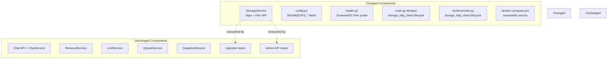
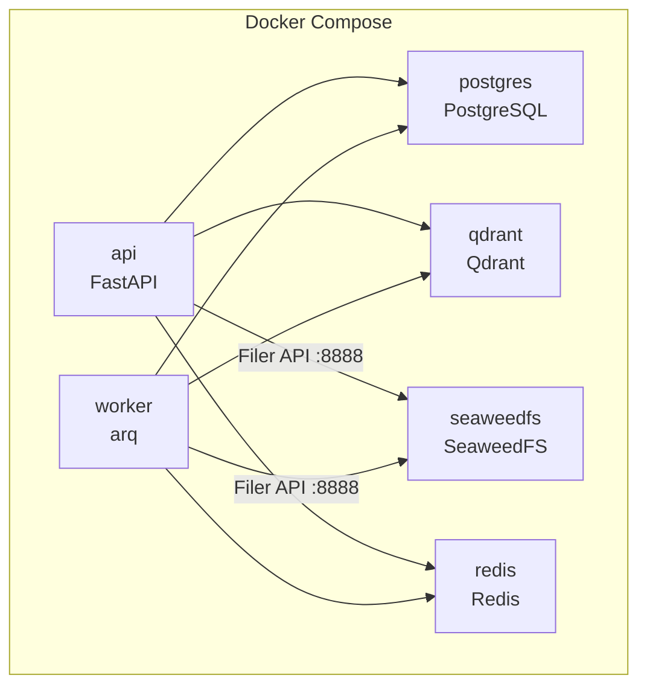

# S2-05: Replace MinIO with SeaweedFS — Design

## Context

**Background:** MinIO is deprecated and MUST be fully removed from the project. S2-05 is an infrastructure swap inserted between S2-04 (Minimal chat) and S3-01 (More formats). It has no prerequisites beyond what is already implemented and introduces no new capabilities — all existing functionality (upload, download, delete, ensure storage) is preserved with identical behavior for consumers.

**Current state:** the knowledge circuit (S2-01 through S2-03) and dialogue circuit (S2-04) are complete. `StorageService` currently wraps the synchronous `minio` Python SDK via `asyncio.to_thread`. Docker Compose runs a `minio/minio` container. Configuration uses `MINIO_*` environment variables.

**Affected circuit:** knowledge circuit (StorageService, ingestion pipeline) and operational circuit (Docker infrastructure, health checks, lifecycle management).

**Unchanged circuits:** dialogue circuit remains entirely untouched. The chat flow, retrieval, LLM integration, prompt assembly, and session management have no dependency on object storage.

## Goals / Non-Goals

### Goals

- Remove all MinIO references from runtime code, configuration, tests, and canonical documentation (zero `grep -ri minio` matches in `backend/`, `docs/`, `CLAUDE.md`, `AGENTS.md`, `README.md`, `docker-compose.yml`, `.env.example` — openspec change artifacts excluded as they document the migration itself)
- Replace Docker Compose `minio` service with SeaweedFS (`weed server -filer`, all-in-one)
- Rewrite `StorageService` to use `httpx` + SeaweedFS Filer HTTP API (natively async, no `asyncio.to_thread`)
- Rename `ensure_bucket()` to `ensure_storage_root()` to remove false S3 terminology
- Add dedicated `storage_http_client` with proper async lifecycle in both API and worker processes
- Update `/ready` health check to probe SeaweedFS Filer

### Non-Goals

| Feature | Why excluded |
|---------|-------------|
| S3 Gateway | Not needed for four HTTP operations (see D6 below) |
| JWT/TLS for Filer | Docker network isolation is sufficient for v1 (see D5) |
| Data migration | Phase 2 dev environment — data is recreated via upload |
| Retry decorators on storage operations | Future production-readiness concern, documented as TODO |
| PostgreSQL as Filer metadata backend | Unnecessary coupling at this scale (see D3) |

## Decisions

Nine key decisions were analyzed in the brainstorm spec (`docs/superpowers/specs/2026-03-22-s2-05-replace-minio-with-seaweedfs-design.md`). This section summarizes each with rationale; the brainstorm spec has full rejected-alternatives analysis.

### D1: httpx + Filer HTTP API (no new dependencies)

Use `httpx` (already a project dependency) to call the SeaweedFS Filer HTTP API directly. This eliminates the `minio` SDK, removes `asyncio.to_thread` wrappers (Filer API is native HTTP = native async), and adds zero new dependencies. The four operations (upload, download, delete, ensure directory) map cleanly to POST/GET/DELETE on the Filer.

Rejected: `boto3`/`aiobotocore` via S3 Gateway (heavy dependencies, unnecessary configuration surface), keeping `minio` SDK as S3 client (contradicts the removal mandate).

### D2: `weed server -filer` all-in-one topology

Single container runs master + volume + filer. One healthcheck, one Docker volume. ProxyMind is "one instance = one twin" — horizontal storage scaling is not in scope. Migration to separate containers is trivial if needed later.

### D3: LevelDB for Filer metadata (default)

Built-in LevelDB store keeps SeaweedFS self-contained. No additional load on PostgreSQL. LevelDB data lives inside the same Docker volume as volume server data. Migration to PostgreSQL backend is possible later via `filer.toml`.

### D4: `SEAWEEDFS_*` config naming

Consistent with existing naming pattern (`POSTGRES_*`, `REDIS_*`, `QDRANT_*` — all named after the specific tool). Three fields: `SEAWEEDFS_HOST`, `SEAWEEDFS_FILER_PORT`, `SEAWEEDFS_SOURCES_PATH`. Two fields removed entirely: `MINIO_ROOT_USER` and `MINIO_ROOT_PASSWORD` (no auth in v1).

### D5: No Filer authentication (v1)

Access restricted by Docker network isolation — only `api` and `worker` containers reach the Filer endpoint. Matches the current MinIO security posture. Adding JWT later requires one config field and one HTTP header.

### D6: No S3 Gateway

Even the embedded `weed filer -s3` option adds IAM and bucket mapping configuration that is not justified for four HTTP operations. The Filer API is simpler and sufficient.

### D7: `ensure_bucket` renamed to `ensure_storage_root`

SeaweedFS Filer has no buckets — "bucket = directory in Filer namespace." The new name is storage-agnostic and accurately describes the operation. Implementation becomes a `POST` to the base path directory, which also validates Filer availability at startup.

### D8: Dedicated `storage_http_client`

Separate from the generic `app.state.http_client` (timeout=5s, no base_url). The storage client has `base_url=settings.seaweedfs_filer_url` and `timeout=30.0` (large file uploads up to 50 MB). Both clients have proper async lifecycle management (created on startup, closed on shutdown).

### D9: Two-layer health checks

Docker Compose healthcheck uses `GET /cluster/healthz` on master port (9333) for coarse liveness, gating `depends_on`. Application readiness (`/ready`) performs a Filer-level probe (`GET {seaweedfs_filer_url}/`) to verify the Filer HTTP API is serving requests.

## Architecture Impact

### What changes

**Knowledge circuit:**
- `StorageService` — full rewrite (same interface except renamed method). Constructor changes from `(Minio client, bucket_name)` to `(httpx.AsyncClient, base_path)`. All four methods become natively async.
- `admin.py` — call site update: `ensure_bucket()` to `ensure_storage_root()`.
- `workers/tasks.py` — call site update: same rename. Worker gains async lifecycle responsibility for `storage_http_client`.

**Operational circuit:**
- Docker Compose — `minio` service replaced by `seaweedfs`. Volume renamed. Health check changed.
- `config.py` — `minio_*` fields replaced with `seaweedfs_*` fields.
- `health.py` — readiness probe target and response key change.
- `main.py` — new `storage_http_client` creation and shutdown. `StorageService` constructor call changes.
- `workers/main.py` — new `storage_http_client` creation and shutdown (new lifecycle responsibility).

**Dialogue circuit:** no changes whatsoever. Chat API, retrieval, LLM, prompt assembly, and session management have no dependency on object storage.

### StorageService interface

The public interface is preserved with one rename:

| Method | Change |
|--------|--------|
| `generate_object_key` | Unchanged (static, storage-agnostic) |
| `ensure_storage_root` (was `ensure_bucket`) | Renamed. Implementation: `POST {base_path}/` |
| `upload` | Unchanged signature. Implementation: `POST {base_path}/{key}` with multipart |
| `download` | Unchanged signature. Implementation: `GET {base_path}/{key}` |
| `delete` | Unchanged signature. Implementation: `DELETE {base_path}/{key}` |

Path normalization: `base_path` is canonicalized to leading slash, no trailing slash (e.g., `/sources`). A private `_build_url` helper joins `base_path` and `object_key` with a single `/` separator.

### Docker Compose topology

SeaweedFS exposes two ports: 8888 (Filer HTTP API, used by `StorageService`) and 9333 (master, used by Docker healthcheck only). Volume server port (9340) is internal.

### Configuration mapping

| Removed | Added | Default |
|---------|-------|---------|
| `minio_host` | `seaweedfs_host` | required |
| `minio_port` | `seaweedfs_filer_port` | `8888` |
| `minio_root_user` | -- | removed |
| `minio_root_password` | -- | removed |
| `minio_bucket_sources` | `seaweedfs_sources_path` | `/sources` |
| `minio_url` (computed) | `seaweedfs_filer_url` (computed) | `http://{host}:{port}` |

### Dependencies

| Action | Package | Effect |
|--------|---------|--------|
| Remove | `minio >= 7.2.0` | One fewer dependency |
| Keep | `httpx >= 0.28.1` | Already present, now also used as SeaweedFS client |

Net result: zero new dependencies, one dependency removed.

## Risks / Trade-offs

### No Filer authentication

The Filer is accessible without credentials from within the Docker network. Acceptable for a self-hosted single-tenant deployment. Risk is mitigated by Docker network isolation (only `api` and `worker` reach the Filer). Adding JWT later is a one-field, one-header change.

### No retry on storage operations

`httpx` calls use `raise_for_status()` without retry logic. Transient Filer errors will propagate as failures. This matches the current MinIO behavior (no retry wrapper). Retry decorators (e.g., via `tenacity`, already a dependency) can be added in a future production-readiness story.

### Tighter coupling to SeaweedFS Filer semantics

The `StorageService` implementation is specific to the Filer HTTP API (POST for upload, directory-as-bucket). This is an accepted trade-off for a self-hosted project — the storage interface is already abstracted behind `StorageService`, so swapping the implementation later changes only one file.

### LevelDB metadata is a single point of failure

LevelDB does not support concurrent access or replication. Acceptable for "one instance = one twin" architecture. If LevelDB corruption occurs, PostgreSQL is the source of truth and files can be re-uploaded. Migration to PostgreSQL-backed Filer metadata is a configuration change.

## Migration Plan

This is a dev-environment swap with no production data to migrate.

1. **Docker Compose:** replace `minio` service with `seaweedfs`. Replace `minio-data` volume with `seaweedfs-data`. Update `depends_on` for `api` and `worker`.
2. **Dependencies:** remove `minio` from `pyproject.toml`, run `uv lock`.
3. **Configuration:** replace `minio_*` fields in `config.py` with `seaweedfs_*`. Update `.env.example`.
4. **StorageService:** rewrite implementation. Rename `ensure_bucket` to `ensure_storage_root`.
5. **Lifecycle:** add `storage_http_client` creation/shutdown in `main.py` and `workers/main.py`.
6. **Health check:** update `/ready` probe in `health.py`.
7. **Tests:** update all test files referencing MinIO (config, health, lifespan, storage, conftest, source-upload validation, source-upload integration, worker shutdown).
8. **Documentation:** update all docs referencing MinIO (`spec.md`, `architecture.md`, `plan.md`, `rag.md`, `CLAUDE.md`, `AGENTS.md`, `README.md`).
9. **Verification:** `docker-compose up` with SeaweedFS healthy, upload source, existing tests pass, `grep -ri minio backend/ docs/ CLAUDE.md AGENTS.md README.md docker-compose.yml .env.example` returns zero matches (openspec change artifacts excluded).

## Testing Approach

### Unit tests for StorageService

Full rewrite of `test_storage_download.py` (renamed to `test_storage.py`). Tests use `httpx.MockTransport` to mock HTTP responses. Coverage:

- Correct HTTP method per operation (POST for upload/ensure, GET for download, DELETE for delete)
- URL path construction via `_build_url` helper
- Path normalization edge cases (`base_path` with/without trailing slash, `object_key` with/without leading slash)
- `ensure_storage_root` sends POST to base path directory
- Content-type forwarding in multipart upload
- Response body handling (download returns bytes)
- Error propagation (non-2xx raises `httpx.HTTPStatusError`)

### Lifespan tests

Update `test_app_main.py`: replace `minio_*` settings with `seaweedfs_*`, replace `Minio` client mock with httpx client mock, update `StorageService` constructor signature, assert `storage_http_client.aclose()` is called on shutdown.

### Health tests

Update `test_health.py`: `minio_url` to `seaweedfs_filer_url` in settings, `"minio"` to `"seaweedfs"` in readiness response keys.

### Config tests

Update `test_config.py`: environment variable names from `MINIO_*` to `SEAWEEDFS_*`, remove `MINIO_ROOT_USER` / `MINIO_ROOT_PASSWORD`.

### Source-upload validation tests

Update `test_source_validation.py`: rename `ensure_bucket` references to `ensure_storage_root`, update any MinIO-specific assertions to match the new StorageService contract.

### Source-upload integration tests

Update source-upload integration tests to verify the upload flow works with the new StorageService contract (mocked via `httpx.MockTransport`) and the enqueue-failure path with the updated storage mock.

### Worker shutdown test

New test verifying that worker `on_shutdown` properly closes `storage_http_client` — this is a new lifecycle responsibility that did not exist with the synchronous MinIO SDK.

### Fixtures

Update `conftest.py`: `mock_storage_service` changes `ensure_bucket` to `ensure_storage_root`, `admin_app` changes `minio_bucket_sources` to `seaweedfs_sources_path`.

### No integration test with real SeaweedFS

Consistent with the current approach — no MinIO container in CI. `StorageService` is verified through unit tests with `MockTransport`. Integration with real SeaweedFS is validated manually via `docker-compose up`.

## Open Questions

None. All decisions are resolved in the brainstorm spec. The implementation is a straightforward backend swap with no ambiguous design choices.
