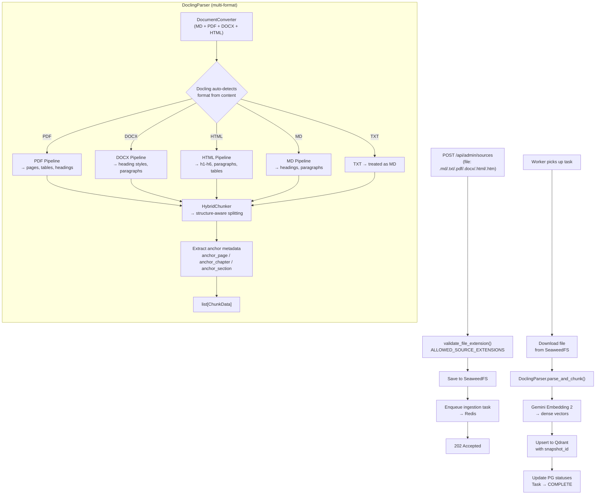

# S3-01: More Formats (PDF, DOCX, HTML) — Design

## Context

**Background:** ProxyMind's ingestion pipeline currently accepts only Markdown (`.md`) and plain text (`.txt`) files. This is a Phase 2 limitation — the Knowledge Circuit was bootstrapped with the simplest formats to prove the end-to-end slice (S2-01 through S2-04). Phase 3 begins with expanding format support to cover the primary digital twin use case: uploading books (PDF), articles (DOCX), and saved web pages (HTML) as knowledge sources.

**Current state:** The Knowledge Circuit is fully operational for MD/TXT. `DoclingParser` wraps a `DocumentConverter` configured with `allowed_formats=[InputFormat.MD]` and uses `HybridChunker` for structure-aware chunking. TXT files are already normalized to Markdown text via `convert_string(..., format=InputFormat.MD)` rather than being passed to Docling as a separate native input format. `StorageService` validates uploads against `ALLOWED_SOURCE_EXTENSIONS = (".md", ".txt")`. The `SourceType` enum already includes `PDF`, `DOCX`, and `HTML` entries (created in S1-02), but no code path handles them. Upload size limit is 50 MB.

**Affected circuit:** Knowledge Circuit — specifically the parser (`DoclingParser`), file validation (`StorageService`), and configuration (`upload_max_file_size_mb`). The ingestion worker, embedding service, Qdrant indexing, and snapshot manager are format-agnostic and require no changes.

**Unchanged circuits:** Dialogue Circuit (chat, retrieval, LLM, citations, prompt assembly) and Operational Circuit (arq, Redis, health checks, audit logging, monitoring) are entirely untouched. This change adds no new API endpoints, no new database tables, no new infrastructure services.

## Goals / Non-Goals

### Goals

- Accept `.pdf`, `.docx`, `.html`, and `.htm` file extensions in the upload endpoint
- Extend `DoclingParser` to handle PDF, DOCX, and HTML via a single multi-format `DocumentConverter`
- Extract per-format anchor metadata: `anchor_page` from PDF provenance, `anchor_chapter`/`anchor_section` from headings across all formats
- Raise `upload_max_file_size_mb` default from 50 to 100 MB to accommodate PDF books
- Ensure corrupt/malformed files cause the parser to raise an exception, which the worker handles by marking the task as FAILED
- Add static test fixtures and comprehensive tests for all new formats

### Non-Goals

| Feature | Why excluded |
|---------|-------------|
| URL fetch / `from-url` endpoint | SSRF risk on unauthenticated admin API; deferred to post-S7-01 |
| OCR for scanned PDFs | YAGNI — S3-01 targets structured digital documents; evals (S8-02) will reveal need |
| JavaScript rendering for HTML | Complex runtime dependency for marginal gain |
| `TableFormerMode.ACCURATE` | Default table extraction is 97.9% accurate; 2x slower mode not justified without eval data |
| Per-format file size limits | Unnecessary configuration complexity |
| Magic bytes / MIME content validation | Marginal benefit for authenticated-only endpoint (D6) |
| New anchor metadata fields | Current four fields are sufficient; evals will reveal if more granularity is needed (D2) |
| Path A: Gemini native parsing | Separate story (S3-04) |

## Decisions

Seven key decisions were analyzed in the brainstorm spec (`docs/superpowers/specs/2026-03-22-s3-01-more-formats-design.md`). This section summarizes each with rationale.

### D1: Single DocumentConverter with multiple formats

Use one `DocumentConverter` instance configured with `allowed_formats=[InputFormat.MD, InputFormat.PDF, InputFormat.DOCX, InputFormat.HTML]`. Docling v2.80+ auto-detects the format by content and applies the correct parser internally.

This follows KISS — no factory pattern, no format-to-converter mapping, no per-format configuration. The public interface of `DoclingParser` does not change. If format-specific options are needed later (driven by eval results), they can be added to the converter without changing callers.

Rejected: per-format converter factory — adds complexity with no current benefit.

### D2: Current anchor fields are sufficient

Keep the existing four anchor fields (`anchor_page`, `anchor_chapter`, `anchor_section`, `anchor_timecode`). No new fields added.

| Format | `anchor_page` | `anchor_chapter` | `anchor_section` |
|--------|:---:|:---:|:---:|
| PDF | Yes (provenance) | Yes (headings) | Yes (sub-headings) |
| DOCX | No | Yes (heading styles) | Yes (sub-headings) |
| HTML | No | Yes (`<h1>`-`<h6>`) | Yes |
| MD | No | Yes (`#`-`######`) | Yes |
| TXT | No | No | No |

Tables in PDF are extracted by Docling as Markdown text within the chunk body — no separate `anchor_table_index` needed. The citation builder uses page + chapter/section to form references, which is sufficient.

Rejected: new anchor fields (table index, paragraph number) — premature without eval data.

### D3: Raise upload size limit to 100 MB

Change `upload_max_file_size_mb` default from 50 to 100 MB. Single limit for all formats. Typical digital twin sources (books, articles, reports) in PDF can reach 50-100 MB with embedded images. Per-format limits add configuration complexity with no clear benefit — the user can always override via `.env`.

Rejected: per-format limits (unnecessary complexity), keeping 50 MB (too restrictive for PDF books).

### D4: Docling default table handling

Use Docling's default table extraction. `TableFormerMode.ACCURATE` is 2x slower and requires additional model dependencies. HybridChunker respects document structure and avoids splitting tables mid-row. Optimization is deferred to eval results (S8-02).

Rejected: `TableFormerMode.ACCURATE` — performance cost without proven need.

### D5: Static test fixtures committed to repository

Create minimal static sample files (`sample.pdf`, `sample.docx`, `sample.html`) in `tests/fixtures/`. Static fixtures are deterministic, fast, and do not require dev-only dependencies (reportlab, python-docx). They test parsing of real files, closer to production.

Rejected: programmatic generation in conftest — adds dev dependencies, slower test startup, harder to inspect.

### D6: Extension-only validation

Validate uploaded files by extension only (existing pattern). No magic bytes / MIME-type inspection. The admin API will be protected by API key (S7-01). If a file is misnamed, Docling will fail during parsing and the worker will mark the task as `failed` with a descriptive error.

Rejected: magic bytes validation — marginal benefit for an authenticated-only endpoint.

### D7: Accept both `.html` and `.htm` extensions

Both `.html` and `.htm` map to `SourceType.HTML`. Both extensions are common in the wild; cost of support is one line in the extension mapping.

## Architecture

### Parsing Data Flow

### Affected Components

From `docs/architecture.md`:

- **Knowledge Circuit** — `DoclingParser` gains multi-format support. `StorageService` validation accepts new extensions. Config default changes. The ingestion worker itself requires no code changes — it already calls `parser.parse_and_chunk(content, filename, source_type)` and processes returned chunks uniformly.

### Unchanged Components

- **Dialogue Circuit** — no changes. Chat API, retrieval, LLM, citations, prompt assembly, and session management have no dependency on file format.
- **Operational Circuit** — no changes. arq worker, Redis, health checks, audit logging, monitoring are format-agnostic.
- **Database schema** — no migrations. `SourceType` enum already includes PDF, DOCX, HTML. Anchor fields already exist on the `chunks` table. No new tables or columns.
- **Embedding service** — receives chunk text, format-independent.
- **Qdrant indexing** — receives vectors + payload, format-independent.
- **Snapshot manager** — format-independent.

### Components Modified

| Component | File | Change |
|-----------|------|--------|
| Extension mapping | `services/storage.py` | Add `.pdf`, `.docx`, `.html`, `.htm` to `ALLOWED_SOURCE_EXTENSIONS` and `SOURCE_TYPE_BY_EXTENSION` |
| DoclingParser | `services/docling_parser.py` | Multi-format `DocumentConverter`, per-format input handling in `_convert_document()` |
| Config | `core/config.py` | `upload_max_file_size_mb` default 50 → 100 |
| Dependencies | `pyproject.toml` | No change in the current locked environment; apply-time verification confirms whether Docling PDF extras are already satisfied before adding anything |

### What does NOT change in DoclingParser

The `_chunk_document()` method and `ChunkData` dataclass remain identical. `HybridChunker` and anchor extraction (`_extract_anchor_page`, heading extraction from `chunk.meta.headings`) already work correctly for all formats — Docling normalizes every format into a `DoclingDocument` before chunking. The change is entirely in `_convert_document()` (format routing) and the constructor (converter configuration).

## Risks / Trade-offs

### Docling PDF dependencies increase image size

Docling's PDF pipeline pulls in heavier dependencies (layout analysis models, table extraction). This may increase the Docker image size. Mitigation: Docling loads models lazily, so MD/TXT-only workloads are unaffected at runtime. Docker layer caching mitigates rebuild cost.

### No OCR for scanned PDFs

S3-01 targets structured digital PDFs (text-based). Scanned PDFs with embedded images will produce empty or low-quality chunks. This is an accepted limitation — OCR support can be added later via format-specific Docling options without changing the public interface.

### 100 MB upload limit may be insufficient for very large PDFs

Some academic PDFs or image-heavy books exceed 100 MB. The limit is configurable via `.env` (`UPLOAD_MAX_FILE_SIZE_MB`), so operators can raise it. The default balances coverage of 95%+ realistic content against worker processing time and memory.

### Corrupt file handling depends on Docling error quality

When Docling fails to parse a malformed file, the error message propagated to the task status depends on the quality of Docling's exception messages. If these are unclear, the user sees a generic "parsing failed" error. Mitigation: the worker logs the full exception with structlog; the task status stores the error message.

### Extension-only validation allows misnamed files through

A `.pdf` file that is actually a ZIP will pass validation but fail during Docling parsing. The worker marks the task as FAILED with the parsing error. This is acceptable for an authenticated admin endpoint — the feedback loop is slightly slower (async failure vs. sync rejection) but the end result is the same.

### Raw HTML serving remains out of scope

This story adds HTML ingestion, not browser-facing raw file serving. If a future endpoint serves uploaded HTML back to browsers, it MUST use a safe delivery strategy such as `Content-Disposition: attachment` or a segregated domain with restrictive headers.
