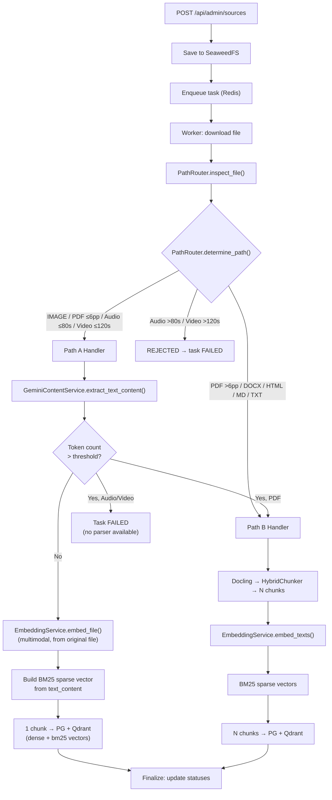

# S3-04: Path A (Gemini Native) — Design

## Story

> For short PDFs/images/audio/video: Gemini LLM -> text_content, Gemini Embedding 2 -> vector. Thresholds for switching to Path B.

**Outcome:** multimodal sources are indexed and searchable.

**Verification:** Upload image -> text_content generated -> search query finds it.

## Context

The ingestion pipeline currently processes all sources through a single path: Docling parsing, HybridChunker splitting, and Gemini Embedding 2 from chunk text (Path B). This handles text-heavy formats well (PDF, DOCX, HTML, Markdown, TXT) but has two limitations:

1. **No multimodal support.** Docling cannot process images, audio, or video. A digital twin that learns from podcasts, photos, and short videos needs native multimodal ingestion.
2. **Over-processing of short documents.** A 3-page PDF goes through full structural parsing and multi-chunk splitting when a single-chunk Gemini native representation would suffice and produce a richer embedding (multimodal rather than text-only).

Path A targets direct Gemini Embedding 2 input for the file formats used in this story (PDF, PNG/JPEG, MP3/WAV, MP4), producing embeddings in the same vector space as text embeddings. This enables a second ingestion path (Path A) that creates a single chunk per file using the original file for embedding, complementing the existing Docling path (Path B) for longer documents. Real-provider evals remain the final verification point for these provider capabilities before production rollout.

S3-01 through S3-03 established the foundation: multi-format Docling parsing, BM25 sparse vectors, and hybrid retrieval with RRF fusion. Path A chunks will participate in the same hybrid search pipeline (dense + BM25, RRF) as Path B chunks.

## Goals / Non-Goals

### Goals

- Accept new source types: images (PNG, JPEG), audio (MP3, WAV), video (MP4).
- Route short PDFs (6 pages or fewer) through Path A for native multimodal embedding.
- Extract text_content via Gemini LLM GenerateContent for each supported modality (required for LLM context during retrieval and BM25 indexing).
- Generate multimodal embeddings directly from files via Gemini Embedding 2.
- Create a single chunk per Path A file with dense + BM25 vectors in Qdrant.
- Implement threshold-based fallback: if Path A text_content is too long (PDF), redirect to Path B for structural chunking.
- Refactor the ingestion worker into an orchestrator + handler module pattern per `docs/development.md` OCP requirement.

### Non-Goals

- **Gemini Batch API for Path A** — planned in S3-06. Path A uses interactive API only.
- **Chunk enrichment** (summaries, keywords, questions) — planned in S9-01.
- **Audio transcription via Deepgram** or other dedicated ASR — later phases.
- **Parent-child chunking** for Path A — planned in S9-02.
- **Extended media formats** beyond MP3/WAV/MP4 — not required by the spec.
- **Duration/page-based pre-upload validation** in the API — `upload_max_file_size_mb` is sufficient; content-level validation happens in the worker.

## Decisions

### D1: Full format scope in a single story

Implement all multimodal formats (PDF + images + audio + video) together rather than incrementally.

**Rationale:** The architectural difference between formats is minimal. All go through the same flow: Gemini LLM (text extraction) then Gemini Embedding 2 (file embedding). The shared work is routing logic and the Gemini API client; per-format differences are limited to extraction prompts and limit validation. Splitting into multiple stories would duplicate the architectural scaffolding without reducing complexity.

### D2: Separate GeminiContentService via google.genai SDK

Text extraction lives in a new `app/services/gemini_content.py` using the `google.genai` SDK already in the project, not LiteLLM.

**Rationale:** Text extraction is tied to the Gemini ecosystem (same provider as embeddings). LiteLLM adds abstraction overhead with no benefit since provider switching is not planned for this pipeline. The existing `google.genai` SDK is proven for embeddings and supports multimodal file input natively. A separate service respects SRP and OCP from `docs/development.md`.

**Rejected:** LiteLLM (less reliable for multimodal file processing, unnecessary abstraction). Extending EmbeddingService (violates SRP: embedding is not text extraction).

### D3: Hybrid file transfer (inline < 10 MB, Files API >= 10 MB)

Files under 10 MB are sent inline via `types.Part.from_bytes()`. Larger files use the Gemini Files API with upload polling.

**Rationale:** Images and short PDFs are almost always under 10 MB (inline is simpler, single API call, no state management). Audio at 80 seconds MP3 is typically 1-5 MB. Video at 120 seconds MP4 can reach 10-50 MB and needs the Files API. The 10 MB threshold is conservative, well within the ~20 MB inline limit. Both code paths are isolated inside a shared `gemini_file_transfer.py` helper reused by GeminiContentService and EmbeddingService.

### D4: PathRouter as a separate service with a pure function

A new `app/services/path_router.py` contains `inspect_file()` (file metadata extraction) and `determine_path()` (pure routing function).

**Rationale:** `docs/development.md` explicitly requires OCP: "When adding a new ingestion path, create a new handler; do not branch inside the existing one." Routing logic contains non-trivial decisions (format checks, size/duration limits, PDF page counting) and deserves isolation. `determine_path()` is a pure function with no I/O, making it 100% unit-testable without mocks or worker infrastructure.

**Routing rules:**
- IMAGE -> always Path A
- PDF -> Path A if pages <= 6, else Path B
- AUDIO -> Path A if duration <= 80s; REJECTED if over limit (no Docling support)
- VIDEO -> Path A if duration <= 120s; REJECTED if over limit (no Docling support)
- MARKDOWN / TXT / DOCX / HTML -> always Path B

### D5-D6: Lightweight file inspection libraries

`pypdf` for PDF page counting, `tinytag` for audio/video duration. Both are pure Python with no system-level dependencies. `pypdf` reads only enough document structure to count pages. `tinytag` reads header metadata without decoding media. These libraries are used only for routing metadata, not for content extraction. Their inspected formats align with the Path A formats supported in this story: PDF, PNG/JPEG, MP3/WAV, MP4.

**Rejected:** FFprobe (accurate but requires FFmpeg in Docker image). mutagen (unreliable for MP4 video). pymediainfo (requires libmediainfo system library).

### D7: Optimistic threshold fallback (Path A first)

Gemini LLM is called first to extract text_content. Token count is checked after extraction. If it exceeds the threshold, PDF falls back to Path B; audio/video fails the task (Docling does not support these formats yet).

**Rationale:** This directly implements the spec from `docs/rag.md`. Fallback is expected to be rare given conservative thresholds (2000 tokens for PDF, 500 for media). The cost of a wasted Gemini LLM call on fallback is fractions of a cent. A pre-check heuristic would be unreliable without parsing the file.

**Thresholds:** `path_a_text_threshold_pdf` = 2000 tokens, `path_a_text_threshold_media` = 500 tokens. Counted via the existing HuggingFaceTokenizer already used by Docling HybridChunker. Gemini also exposes a token-counting API, but this story intentionally keeps thresholding local to avoid an extra network round-trip and to stay aligned with the tokenizer already used by the Path B chunking stack. Thresholds are therefore an operational heuristic and are tuned further through manual evals.

### D8: Multimodal embedding from the original file, not extracted text

Path A passes the original file to Gemini Embedding 2, not the text_content.

**Rationale:** This is the core value of Path A. For images, a text description loses visual information the embedding model captures directly. All Gemini Embedding 2 outputs (from files and text) live in the same vector space, so retrieval works uniformly. If we embedded from text_content, Path A would lose its purpose over Path B.

### D9: Extend existing upload endpoint

New file extensions are added to `ALLOWED_SOURCE_EXTENSIONS` in the existing `POST /api/admin/sources`. No new endpoints.

**Rationale:** KISS. One endpoint for all source types. Business logic (Path A/B routing) belongs in the worker, not the API layer. Unified API is simpler for frontend and documentation.

### D10: Orchestrator + separate handler modules

The ingestion worker is refactored into a thin orchestrator (`ingestion.py`) dispatching to `handlers/path_a.py` and `handlers/path_b.py`.

**Rationale:** `docs/development.md` states: "When adding a new ingestion path, create a new handler; do not branch inside the existing one." Each handler is isolated and independently testable. Existing Path B logic is extracted as a pure refactoring. The orchestrator stays thin: download, route, dispatch, finalize.

## Architecture

### Path A/B routing flow

### New and modified components

| Component | Location | Responsibility |
|-----------|----------|---------------|
| **PathRouter** | `app/services/path_router.py` | File inspection (pypdf, tinytag) and pure routing logic |
| **GeminiContentService** | `app/services/gemini_content.py` | Text extraction from multimodal files via Gemini LLM |
| **gemini_file_transfer** | `app/services/gemini_file_transfer.py` | Shared inline/Files API transfer helper with upload polling |
| **EmbeddingService.embed_file()** | `app/services/embedding.py` | New method for multimodal file embedding |
| **Path A handler** | `app/workers/tasks/handlers/path_a.py` | Orchestrates Path A: extract, check threshold, embed, store |
| **Path B handler** | `app/workers/tasks/handlers/path_b.py` | Extracted existing Docling pipeline (no behavioral changes) |
| **Orchestrator** | `app/workers/tasks/ingestion.py` | Refactored: download, route, dispatch, finalize |

### Configuration

New settings in `app/core/config.py`, all configurable via environment variables:

| Setting | Default | Purpose |
|---------|---------|---------|
| `path_a_text_threshold_pdf` | 2000 | Token threshold for PDF fallback to Path B |
| `path_a_text_threshold_media` | 500 | Token threshold for media (audio/video) |
| `path_a_max_pdf_pages` | 6 | Max PDF pages for Path A eligibility |
| `path_a_max_audio_duration_sec` | 80 | Max audio duration for Path A |
| `path_a_max_video_duration_sec` | 120 | Max video duration for Path A |
| `gemini_content_model` | `gemini-2.5-flash` | Gemini model for text extraction |
| `gemini_file_upload_threshold_bytes` | 10485760 | Inline vs Files API boundary (10 MB) |

### Dependencies

| Package | Purpose | Impact |
|---------|---------|--------|
| `pypdf` | PDF page counting | ~3 MB, pure Python |
| `tinytag` | Audio/video duration | ~100 KB, pure Python |

No system-level dependencies added. Docker image size impact is minimal.

## Risks / Trade-offs

### Single-chunk granularity

Path A creates one chunk per file. This reduces retrieval and citation granularity to the file level instead of page/section/timecode. For short single-topic files this is acceptable. For topically dense documents (even short ones), the threshold fallback to Path B provides a safety net. Future parent-child chunking (S9-02) can add sub-file granularity to Path A chunks.

### Audio/video rejection on threshold exceed

If Gemini LLM produces text_content exceeding the media threshold for audio or video, the task fails because Docling does not support these formats yet. This is an intentional limitation: the thresholds are conservative (500 tokens for media descriptions), and exceeding them indicates content too dense for single-chunk indexing. Resolution is planned when Docling audio support is implemented.

### Audio/video duration rejection (no Path B fallback)

Audio over 80 seconds and video over 120 seconds are rejected outright by the PathRouter. Unlike PDF (which can fall back to Docling), there is no Path B parser for long audio/video. This is documented in the REJECTED path decision and will be resolved in later phases.

### PDF metadata inspection fallback

If `pypdf` cannot determine the page count for a PDF, PathRouter defaults the source to Path B rather than assuming the file is short enough for Path A. This is the conservative choice because Docling can still parse the document even when the lightweight metadata probe fails.

### Optimistic Gemini LLM call cost

The threshold check happens after the Gemini LLM call, not before. A fallback to Path B wastes the LLM call cost. Mitigation: the cost is fractions of a cent per call, and fallback is expected to be rare given conservative thresholds. A pre-check heuristic was rejected as unreliable without parsing the file content.

### tinytag metadata accuracy

tinytag reads header metadata only, which may be inaccurate or missing for some media files. Mitigation: if tinytag cannot read duration, the router defaults to Path A (assume within limit). If the file turns out to be too content-dense, the token threshold check catches it as a second safety net.

### Tokenizer mismatch risk

Path A threshold checks use the local HuggingFace tokenizer, while Gemini models have their own tokenization and also expose a token-counting API. The thresholds in this story are not billing or hard model-limit checks; they are routing heuristics intended to keep Path A single-chunk behavior aligned with existing Path B chunking expectations. Manual provider evals remain the source of truth for tuning these values.

### Extraction prompt sensitivity

Per-modality extraction prompts are module-level constants (language-neutral per CLAUDE.md multilingual policy). Prompt quality directly affects text_content quality, which affects both BM25 indexing and LLM context during retrieval. Mitigation: prompts are versioned with code and can be tuned via evals without architectural changes.

## Testing strategy

### Unit tests (CI, no external dependencies)

- **PathRouter**: parametrized tests covering every source type, size/pages/duration combination, edge cases at thresholds, pypdf/tinytag failure fallbacks.
- **Path A handler**: mocked GeminiContentService + EmbeddingService verifying happy path (single chunk created), threshold fallback (returns fallback signal), and error handling (Gemini failure marks task FAILED).
- **GeminiContentService**: mocked google.genai.Client verifying correct prompt per source type, inline vs Files API threshold.
- **EmbeddingService.embed_file()**: mocked genai client verifying correct task type, dimensions, and transfer threshold.

### Integration tests (CI, real Qdrant in Docker)

- **Path A end-to-end**: mocked Gemini only (fixed text_content + embedding vector), real Qdrant. Verifies: upsert Path A chunk, hybrid search retrieves it, payload contains expected fields (text_content, anchor metadata, source_type, processing_path), dense + BM25 vectors both present and searchable.

## Files changed

| File | Change |
|------|--------|
| `backend/pyproject.toml` | Add pypdf, tinytag |
| `backend/app/core/config.py` | Add Path A settings |
| `backend/app/services/storage.py` | Extend allowed extensions + MIME mapping |
| `backend/app/services/gemini_file_transfer.py` | **New** shared inline/Files API helper |
| `backend/app/services/gemini_content.py` | **New** GeminiContentService |
| `backend/app/services/embedding.py` | Add `embed_file()` method |
| `backend/app/services/path_router.py` | **New** PathRouter |
| `backend/app/services/qdrant.py` | New payload fields for Path A chunks |
| `backend/app/workers/tasks/handlers/__init__.py` | **New** package init |
| `backend/app/workers/tasks/handlers/path_a.py` | **New** Path A handler |
| `backend/app/workers/tasks/handlers/path_b.py` | **New** extracted Path B handler |
| `backend/app/workers/tasks/ingestion.py` | Refactored to thin orchestrator |
| `backend/app/workers/main.py` | Initialize new services |

**Not affected:** Chat API, retrieval service, citation builder, snapshot lifecycle, frontend.
