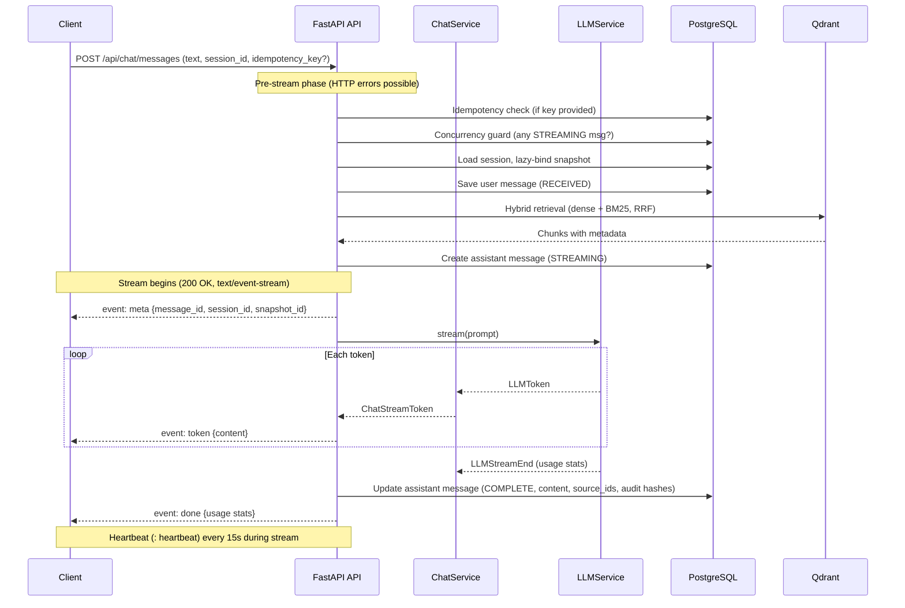

## Context

**Story S4-02** from `docs/plan.md`: Switch `POST /api/chat/messages` to SSE streaming. Message state machine: received -> streaming -> complete/partial/failed. Idempotency key. Persist user + assistant messages in PG.

This change lives in the **dialogue circuit**. It replaces the current blocking JSON response with real-time SSE token delivery, unblocking all downstream stories that depend on streaming (citations S4-03, query rewriting S4-04, frontend S5-01). The **knowledge circuit** is unaffected. The **operational circuit** is touched only for audit logging (existing behavior, no changes).

**Note on sources of truth:** The OpenSpec specs (`specs/sse-streaming/spec.md` and `specs/chat-dialogue/spec.md`) within this change are the authoritative requirements. The brainstorming-phase document `docs/superpowers/specs/2026-03-23-s4-02-sse-streaming-design.md` is historical context with extended rationale — in case of conflict, the OpenSpec specs take precedence.

## Goals / Non-Goals

**Goals:**

- Stream LLM tokens to the client via SSE as they are generated.
- Enforce a message state machine: user messages are `RECEIVED`; assistant messages transition `STREAMING -> COMPLETE | PARTIAL | FAILED`.
- Support idempotency keys for safe client retries (replay COMPLETE, re-generate PARTIAL/FAILED, reject STREAMING with 409).
- Guard against concurrent streams per session (409 Conflict).
- Detect client disconnect and persist accumulated content as PARTIAL.
- Add `parent_message_id` FK for explicit user-assistant message pairing.
- Preserve existing `answer()` / `complete()` methods for non-streaming internal use (query rewriting S4-04).

**Non-Goals:**

- SSE `Last-Event-ID` / reconnection protocol (idempotency key covers retry).
- JSON fallback mode (SSE-only; YAGNI).
- `citations` SSE event (S4-03).
- Query rewriting before retrieval (S4-04).
- Conversation memory in prompt (S4-07).

## Decisions

Decisions are numbered D1-D14 in the detailed design spec. Key architectural decisions condensed below.

### Streaming architecture: async generator pipeline

`LLMService.stream()` yields raw token events -> `ChatService.stream_answer()` yields domain events -> API layer formats as SSE via `StreamingResponse`. Each layer has a single responsibility and is independently testable.

Rejected alternatives: callback-based (less Pythonic, harder to test) and background worker + Redis pub/sub (over-engineered for current scale, adds per-token latency).

### SSE protocol (D1, D4, D5, D6, D7)

- **SSE-only, no JSON fallback** (D1). The plan says "switch". Frontend (S5-01) will use SSE.
- **Event types:** `meta` (message_id, session_id, snapshot_id), `token` (content chunk), `done` (usage stats), `error` (detail). A `citations` event type is reserved for S4-03.
- **Idempotency replay** (D4): replays as a single `token` event with full content + `done`. Client handles it identically to streaming.
- **No Last-Event-ID** (D5): idempotency key covers the retry case.
- **Heartbeat** (D6): SSE comment every 15s to prevent proxy timeouts.
- **Meta event first** (D7): client gets `message_id` immediately before any tokens.

### Idempotency and concurrency (D2, D3, D8, D13, D14)

- **Client-generated key, optional** (D2). Standard retry pattern.
- **DB-only storage** (D3). Existing `Message.idempotency_key` unique partial index is sufficient.
- **One active stream per session** (D8). Second request gets 409 Conflict.
- **Explicit `parent_message_id` FK** (D13). Reliable user-assistant pairing for idempotency lookup. One small migration (nullable UUID column).
- **Replay allowed during active stream** (D14). Replay is read-only — no LLM call, no state mutation. Idempotency check runs before concurrency guard. Example: Request A with key K starts streaming (STREAMING) → concurrent Request B with same key K returns replay of COMPLETE (allowed, read-only) → concurrent Request C with different/no key gets 409 (concurrency guard blocks).

### Content accumulation and timeouts (D9, D10, D11)

- **In-memory buffer, single DB write** (D9) on terminal state (COMPLETE/PARTIAL/FAILED).
- **Token counting via LiteLLM** `stream_options.include_usage` (D10). Fields nullable for unsupporting providers.
- **Inter-token timeout: 30s configurable** (D11). Prevents hung connections.

### Pre-stream / mid-stream error boundary

All validation and retrieval happen before the first `yield`. Exceptions before the first yield propagate as standard HTTP errors (404, 409, 422, 500). After the first yield (`meta` event), errors become SSE `error` events with FAILED status.

Retrieval errors persist a FAILED assistant message before raising, matching current `answer()` semantics.

### Existing code preserved (D12)

`LLMService.complete()` and `ChatService.answer()` remain for non-streaming internal calls.

### SSE streaming flow

### Database migration

One Alembic migration: add `parent_message_id` (nullable UUID FK to `messages.id`) on the `messages` table.

### New configuration

| Setting | Default | Purpose |
|---------|---------|---------|
| `sse_heartbeat_interval_seconds` | `15` | Heartbeat comment interval |
| `sse_inter_token_timeout_seconds` | `30` | Max wait between LLM tokens |

### Dependencies

- **New dev dependency:** `httpx-sse` for SSE parsing in tests.
- **Modified files:** `app/api/chat.py`, `app/services/llm.py`, `app/services/chat.py`, `app/api/chat_schemas.py`, `app/core/config.py`, `app/db/models/dialogue.py`, `app/api/dependencies.py`.

### Testing strategy

- **Unit tests:** LLMService.stream() event yields, ChatService.stream_answer() domain event sequence, idempotency logic (COMPLETE replay / PARTIAL re-gen / STREAMING 409), concurrency guard, SSE wire format, heartbeat timing, no-context refusal.
- **Integration tests:** Full SSE stream with httpx + httpx-sse, message persistence lifecycle, disconnect -> PARTIAL save, idempotency replay, concurrent stream rejection.
- Existing chat integration tests MUST be migrated from JSON to SSE parsing.

## Risks / Trade-offs

| Risk | Mitigation |
|------|------------|
| **Breaking change** — all current consumers of `POST /api/chat/messages` break when response switches from JSON to SSE | No external consumers yet. All existing tests will be updated. Frontend (S5-01) will use SSE natively. |
| **Disconnect detection unreliable in ASGI testing** — in-process httpx + ASGITransport may not perfectly reproduce `asyncio.CancelledError` | Integration test verifies the save logic. Manual testing against a real server for full confidence. |
| **In-memory buffer lost on API crash** — content accumulated in RAM is lost if the process crashes mid-stream | Acceptable at current scale. Idempotency key allows client retry. Periodic DB writes (D9 rejected alternative) add complexity without proportional benefit. |
| **No SSE reconnection** — client cannot resume from last received event | Idempotency key covers the retry case. Full SSE reconnection with `Last-Event-ID` adds significant complexity for marginal benefit given typical response sizes. |
| **Inter-token timeout false positives** — slow LLM providers may legitimately exceed 30s between tokens | Timeout is configurable via `sse_inter_token_timeout_seconds`. Can be increased per deployment. |
