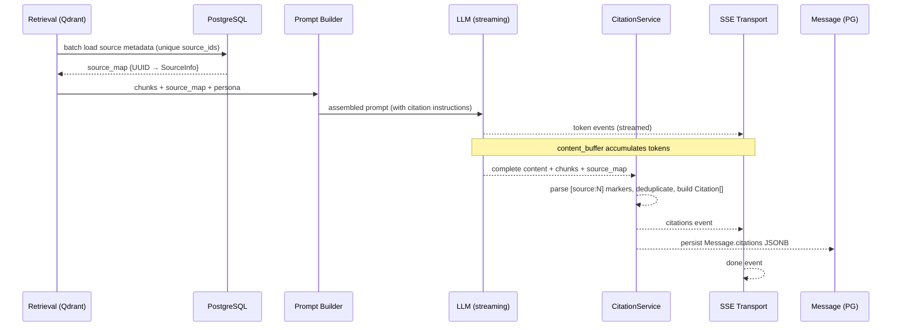

# S4-03: Citation Builder — Design

## Context

S4-03 belongs to Phase 4: Dialog Expansion. Prerequisites are in place: SSE streaming with idempotency (S4-02) and persona loading (S4-01) are complete. The retrieval pipeline already returns chunks with `source_id` and anchor metadata (page, chapter, section, timecode) from Qdrant payloads.

What is missing: the LLM produces text that references retrieved knowledge but provides no verifiable source attribution. Users cannot trace statements back to original documents. The citation builder closes this gap — it is the last piece before the frontend can render source references (S5-02) and before commercial link integration (S6-01).

**Affected circuit:** Dialogue circuit. The change touches prompt assembly, LLM output processing, SSE delivery, and message persistence. No changes to the knowledge or operational circuits.

## Goals

- Extract citation markers from completed LLM output and resolve them to structured citation objects with source metadata
- Deliver citations as a dedicated SSE event (`citations`) between stream completion and `done`
- Persist raw LLM output with markers intact (audit trail) alongside structured citations in `Message.citations` JSONB
- Provide both URL (for online sources) and text citation (for all sources, as fallback/accessibility label)
- Support idempotent replay: replayed COMPLETE messages include the `citations` event from stored data

## Non-Goals

- Frontend rendering of citations — deferred to S5-02
- Inline stream parsing of markers during token delivery — rejected (complexity for no UX gain)
- URL generation by the LLM — explicitly forbidden (LLMs hallucinate URLs)
- Commercial link integration — deferred to S6-01
- Marker stripping from stored content — raw output preserved for audit/evals

## Decisions

### D1: Citation marker format — `[source:N]`

**Choice:** `[source:N]` where N is a 1-based ordinal index.

**Rationale:** Unambiguous regex `\[source:(\d+)\]` with no collision against Markdown links `[text](url)` or numbered lists `[1]`. Short ordinal indices reduce token waste compared to UUIDs and eliminate LLM transcription errors on long identifiers.

**Alternatives rejected:**
- `[source_id:<uuid>]` — UUIDs are 36 characters, waste tokens, LLMs frequently corrupt them
- `[N]` — collides with Markdown footnotes and numbered lists
- `[[N]]` — non-standard, potential collision with wiki-link syntax

### D2: Source numbering in prompt — ordinal `[Source 1]`, `[Source 2]`

**Choice:** Present chunks to the LLM with human-readable ordinal labels and metadata: `[Source 1] (title: "Clean Architecture", chapter: "Chapter 5", page: 42)`.

**Rationale:** Standard practice in RAG systems (Perplexity, ChatGPT search). Mapping index to chunk is trivial (array position). Anchor fields included only when non-null. Title resolved from PG source metadata.

**Alternatives rejected:**
- UUID-based labels — see D1 rationale
- No labels (rely on LLM to infer) — unreliable attribution

### D3: Citations SSE timing — single event after stream completion

**Choice:** One `citations` event emitted after all tokens are streamed, before `done`.

**Rationale:** All markers are known only after full content is available. A Perplexity-style collapsed sources block does not benefit from progressive rendering. Avoids async source lookups during the streaming hot path.

**Alternatives rejected:**
- Progressive citation events during stream — markers can split across tokens (`[sou` + `rce:1]`), requiring a stateful parser for negligible UX improvement
- Citations inside `done` event — violates separation of concerns; `done` carries completion metadata

### D4: Raw content preserved with markers

**Choice:** Store the original LLM output in `Message.content` with `[source:N]` markers intact.

**Rationale:** Raw content enables: audit trail of what the LLM actually generated, eval pipeline on unmodified output, idempotent replay. Frontend uses the structured `citations` array for rendering. Backend does not strip markers — all marker-to-citation rendering is a frontend concern (S5-02).

**Alternatives rejected:**
- Replace markers in stored content — loses the raw LLM output boundary, complicates audit/evals
- Dual storage (raw + cleaned) — unnecessary complexity when frontend can handle substitution

### D5: Citation data in existing `Message.citations` JSONB

**Choice:** Use the existing `Message.citations` JSONB column (created in S1-02, currently NULL).

**Rationale:** No migration required. Structured citation array stored alongside raw content.

### D6: Batch PG source loading

**Choice:** Single `SELECT id, title, public_url, source_type FROM sources WHERE id = ANY($1) AND deleted_at IS NULL` after retrieval, before prompt assembly.

**Rationale:** One query for all unique source_ids from retrieved chunks. Result reused by both prompt builder (for titles/anchors) and citation builder (for URLs/metadata). Avoids Qdrant payload denormalization, which would require reindexing on any Source update.

**Alternatives rejected:**
- Denormalize title/URL into Qdrant payload — stale data on Source update unless reindexed
- Per-chunk PG lookups — N+1 query pattern
- Load during citation extraction (after stream) — delays the `citations` event; prompt builder also needs this data

### D7: Offline citation format — template assembly

**Choice:** Build text citations from available anchor fields: `"{title}", Chapter {chapter}, Section {section}, p. {page}" at {timecode}`. Omit fields that are null.

**Rationale:** English prepositions are standard in bibliographic citation regardless of content language. Graceful degradation: a source with no anchor metadata produces just `"Title"`.

### D8: Invalid marker handling — silent ignore

**Choice:** Out-of-range index, deleted source, or unmapped marker — silently skip. Zero citations produces an empty array; the `citations` event is still emitted.

**Rationale:** The LLM is not guaranteed to follow citation instructions perfectly. Graceful degradation is preferable to error propagation. An empty citations array is a valid response (e.g., for small talk).

### D9: Deduplication — by source_id, keep first occurrence

**Choice:** Multiple chunks from the same source produce one citation entry. Anchor metadata comes from the first-referenced chunk (most relevant to the cited statement).

**Rationale:** Users care about the source, not individual chunks. First-referenced chunk is the most contextually relevant.

### D10: Max citations — configurable, default 5

**Choice:** `max_citations_per_response` setting (default 5), applied after deduplication, truncated by order of appearance.

**Rationale:** Matches `docs/rag.md` defaults. Prevents citation overload. Configurable per installation.

### D11: Score removed from prompt

**Choice:** Retrieval confidence scores are not exposed to the LLM.

**Rationale:** Scores can bias response generation — the LLM may over-rely on high-score chunks or dismiss low-score but relevant ones. The retrieval pipeline already filtered for quality; the LLM should judge relevance from content alone.

### D12: `text_citation` always present

**Choice:** `text_citation` is a non-nullable string on every citation, regardless of whether `url` is also present.

**Rationale:** The story says "URL (online) or text citation (offline)." We intentionally provide both when available — `text_citation` serves as accessible fallback text, tooltip content, and screen reader label. `url` is nullable; `text_citation` is not.

### D13: Config setting in Settings class

**Choice:** Add `max_citations_per_response: int = 5` to `backend/app/core/config.py` Settings.

**Rationale:** Currently defined only in `docs/rag.md` defaults. Must be a runtime-configurable setting.

### D14: No numeric limit in LLM prompt

**Choice:** Instruct the LLM to "cite only the most relevant sources" without specifying a number.

**Rationale:** Telling the LLM "use at most 5 citations" causes it to aim for exactly 5. The backend enforces the numeric limit via `max_citations_per_response` after extraction.

## Data Flow

## Rendering Contract

`[source:N]` markers appear in SSE token events, history API responses, and idempotent replays. In all cases, the backend transmits raw markers. The frontend (S5-02) is responsible for replacing markers with rendered citation components using the structured `citations` array. Until S5-02, API consumers see raw markers in text — this is documented and acceptable.

## Risks and Trade-offs

**Raw markers visible until S5-02 frontend.** Users interacting directly with the API (curl, tests) will see `[source:N]` in response text. This is acceptable: the `citations` event and `Message.citations` field provide the structured data needed to resolve them. The rendering contract is documented above.

**LLM may not follow citation instructions consistently.** The LLM might produce no markers, invalid markers, or too many. The backend handles all cases gracefully: empty citations array for no markers, silent skip for invalid markers, truncation for excess. No error propagation from LLM non-compliance.

**Batch PG query adds one roundtrip.** Loading source metadata from PostgreSQL before prompt assembly adds one query. This is minimal latency (single `ANY($1)` query on indexed primary keys) compared to the alternative of denormalizing into Qdrant (which requires reindexing on every Source update).

**`max_citations` truncation may drop relevant sources.** With default 5, responses referencing more than 5 distinct sources will have trailing citations dropped. The default is sufficient for most responses. The setting is configurable per installation for knowledge-dense use cases.

**Post-stream extraction delays the `citations` event.** Citation extraction happens after the full response is generated, adding a small processing delay before the `done` event. This is negligible (regex parse + dict lookups) and avoids the complexity of stateful stream parsing.
