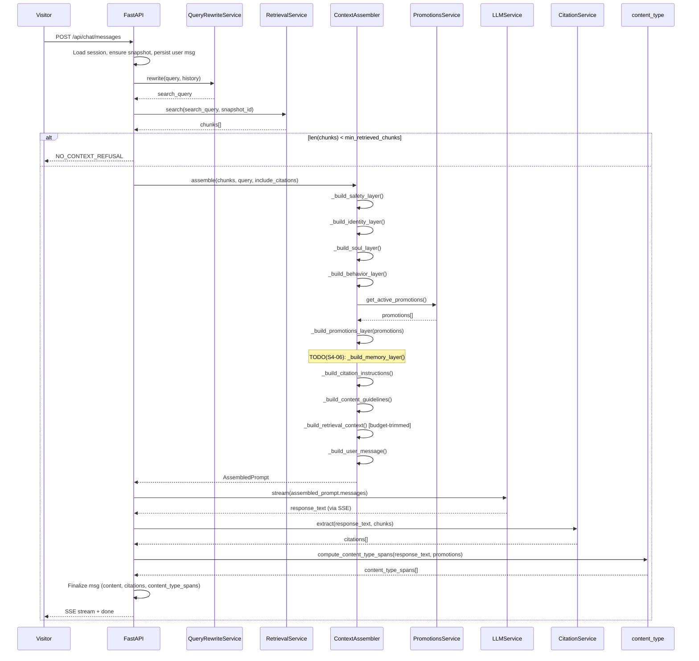

# S4-05: Promotions + Context Assembly — Design

## Context

S4-05 belongs to Phase 4: Dialog Expansion. All prerequisites are in place: SSE streaming with idempotency (S4-02), persona loading (S4-01), citation builder (S4-03), and query rewriting (S4-04) are complete. The retrieval pipeline already performs hybrid search (dense + BM25 sparse, RRF fusion) scoped by `snapshot_id`, and the chat service produces cited, streaming responses.

The current prompt builder (`build_chat_prompt` in `services/prompt.py`) is a flat function that concatenates persona sections and retrieval context without structure, token budget management, or promotions support. As the dialogue circuit grows (S4-05 promotions, S4-06 conversation memory), this monolithic approach becomes unmaintainable and untestable. Each prompt layer has a different lifecycle — persona files rarely change, promotions change weekly, retrieval changes per query — yet the function treats them identically.

S4-05 replaces this flat builder with a `ContextAssembler` class that orchestrates all prompt layers in XML tags, adds promotional content injection from `config/PROMOTIONS.md`, manages retrieval token budgets, and classifies response fragments by content type (fact/inference/promo) for the frontend.

**Affected circuit:** Dialogue circuit. The change introduces four new backend modules and modifies the chat service, prompt module, config, DI wiring, and app lifespan. No changes to the knowledge or operational circuits. No DB migrations — the existing `content_type_spans` JSONB column on `messages` is used.

## Goals / Non-Goals

### Goals

- Replace `build_chat_prompt()` with a layered `ContextAssembler` that constructs prompts from discrete, independently testable layers wrapped in XML tags
- Parse `config/PROMOTIONS.md` with date filtering and priority-based selection, injecting active promotions into the prompt
- Manage retrieval token budget (`retrieval_context_budget`), trimming whole chunks from the tail (lowest RRF score first) when the budget is exceeded
- Classify response sentences as fact/inference/promo using backend heuristics, storing the result in `message.content_type_spans`. These spans are observable externally via the existing `GET /api/chat/sessions/:id` endpoint, which already returns the `content_types` field in its response schema (defined in `docs/spec.md`). No new API endpoint is needed.
- Reserve a conversation memory slot (`TODO(S4-06)`) in the assembler layer list for the next story
- Extract shared `token_counter` module from `query_rewrite.py` for reuse across context assembly and query rewriting
- Maintain the existing config hash audit flow (`config_commit_hash`, `config_content_hash`) through the new DI structure

### Non-Goals

- Conversation memory — delivered in S4-06; only a placeholder comment in the assembler layer list
- Commerce catalog integration — S6-01 scope; promotions are manually authored in PROMOTIONS.md
- LLM-side content type tagging — the V1 approach is backend heuristics; LLM-side tagging may be explored if evals show insufficient accuracy
- Multi-promotion prompt templates — V1 default is `max_promotions_per_response=1`; the selection algorithm supports N, but the prompt builder uses only the first promotion and logs a warning if more are available
- Rewrite prompt tuning or eval pipeline — separate concern (S8)

## Decisions

| # | Decision | Choice | Alternatives Considered | Rationale |
|---|----------|--------|------------------------|-----------|
| D1 | Prompt builder architecture | New `ContextAssembler` class in `services/context_assembler.py` (Approach B) | (A) Extend `build_chat_prompt()` in place — grows to 200+ lines, violates SRP, hard to test individual layers. (C) Pipeline / chain of responsibility — over-engineering for a fixed 7-layer prompt with static order | SRP: each layer is a method, independently testable. Centralizes budget management. Easy to add conversation memory in S4-06 — one method + one line in `assemble()`. |
| D2 | Prompt section formatting | XML tags (`<system_safety>`, `<identity>`, `<promotions>`, etc.) | Plain text with markdown headers — weaker section boundaries for LLM comprehension | LLMs parse tagged prompts better than plain text sections. Tags also make programmatic testing easier (assert tag presence/order). |
| D3 | Content type markup mechanism | Backend heuristic post-processing (Variant B) | (A) LLM inline tags — complicates the prompt, increases token usage, depends on LLM compliance. (C) LLM-as-judge second pass — doubles latency and cost | YAGNI/KISS for V1. Citation presence -> fact, promo keyword match -> promo, else -> inference. Covers ~80% of cases. Upgradeable to LLM-side tagging later without changing the storage format. |
| D4 | Retrieval context budget scope | `retrieval_context_budget` governs only the `<knowledge_context>` portion | Budget all layers proportionally — persona, safety, promotions are small and fixed; budgeting them adds complexity without benefit | Retrieval is the only variable-size layer. Matches `docs/rag.md` parameter definition. |
| D5 | Budget trimming strategy | Drop whole chunks from the end (lowest RRF score) | Truncate chunks mid-text — breaks context and citation accuracy | Chunks arrive sorted by relevance. Dropping from the tail preserves the most relevant content. `min_retrieved_chunks` is a hard override that takes priority over the budget. |
| D6 | Refusal decision ownership | `ChatService` is the single owner of the no-context refusal decision | Let assembler decide refusal — creates dual decision points between `answer()` and `stream_answer()` | ChatService checks `len(retrieved_chunks) < min_retrieved_chunks` before calling the assembler. The assembler trims but never refuses. Consistent behavior across both code paths. |
| D7 | Config hash flow after DI change | `ContextAssembler.persona_context` is a public attribute | Pass hashes separately to ChatService — duplicates state; hide behind method — unnecessary indirection for a read-only value | `ChatService` needs `config_commit_hash` and `config_content_hash` for audit logging in every message persistence and error handling path. Accessing via `context_assembler.persona_context` is explicit and documented. |
| D8 | Promotions file path resolution | `promotions_file_path` setting defaults to `str(REPO_ROOT / "config" / "PROMOTIONS.md")` | Hardcode the path — inflexible for testing and alternate deployments | Same `REPO_ROOT` pattern as `persona_dir` and `config_dir`. Configurable via env var. |
| D9 | Prompt template for max_promotions > 1 | V1 builds the prompt for the first promotion only; values > 1 log a warning | Build dynamic prompt wording for any N — premature given the V1 default and unknown multi-promo UX | The selection algorithm supports N (future-proof), but `_build_promotions_layer()` formats only the first `Promotion` in the list. If `max_promotions_per_response > 1`, the assembler uses only the first result and emits a structlog warning. This is not an error — the system degrades gracefully. |
| D10 | Promotions parser placement | New `PromotionsService` in `services/promotions.py` | Inline in ContextAssembler — violates SRP, mixes parsing logic with prompt orchestration | Promotions and persona change for different reasons (SOLID/SRP). PromotionsService owns parsing, date filtering, priority sorting. PersonaLoader stays unchanged. |
| D11 | Token counting utility | New `services/token_counter.py` with `estimate_tokens(text) -> int` | Keep `CHARS_PER_TOKEN` in `query_rewrite.py` — duplicates the constant when context assembly also needs it | Single source of truth. `query_rewrite.py` imports from the new module. No behavior change. |
| D12 | Missing/empty PROMOTIONS.md | Fail-safe: no promotions layer in prompt, no error | Raise on missing file — a twin without active promotions is a normal state | The `<promotions>` block is omitted entirely (not empty), saving tokens. |
| D13 | Content type span granularity | Sentence-level | Word-level — too granular. Paragraph-level — too coarse | Sentence is the natural unit for fact/inference/promo classification. Boundaries detected by punctuation heuristic. |
| D14 | Citation vs. promo overlap priority | `"fact"` wins over `"promo"` | Promo wins — a cited statement is verifiable; labeling it as promo would undermine trust | If the LLM cites a source while recommending a product, the citation is the more useful signal for the frontend. |
| D15 | Promo keyword matching threshold | Case-insensitive, minimum 2 keyword matches from promotion title + body | Single keyword match — high false-positive rate on common words | Requiring 2+ matches significantly reduces false positives while still catching genuine promo mentions. |

## Architecture

### Component structure

```
services/
  context_assembler.py   NEW   ContextAssembler — orchestrate all prompt layers
  promotions.py          NEW   PromotionsService — parse, filter, select promotions
  token_counter.py       NEW   estimate_tokens() — shared token estimation
  content_type.py        NEW   compute_content_type_spans() — heuristic classifier
  prompt.py              MOD   Simplified — retains NO_CONTEXT_REFUSAL + templates only
  chat.py                MOD   Uses ContextAssembler instead of build_chat_prompt()
core/
  config.py              MOD   3 new settings
api/
  dependencies.py        MOD   Inject ContextAssembler into ChatService
main.py                  MOD   Initialize PromotionsService in lifespan
```

### Data types

```
PromptLayer(tag, content, token_estimate, required)
Promotion(title, priority, valid_from, valid_to, context, body)
AssembledPrompt(messages, token_estimate, included_promotions,
                retrieval_chunks_used, retrieval_chunks_total,
                layer_token_counts)
```

`AssembledPrompt.messages` is the same `list[dict]` format (`[{"role": "system", ...}, {"role": "user", ...}]`) consumed by `LLMService`, so no changes are needed downstream.

### Chat flow with ContextAssembler



### Prompt layer ordering

The system message contains layers in this fixed order:

```
<system_safety>       required   Safety policy (immutable)
<identity>            required   IDENTITY.md content
<soul>                required   SOUL.md content
<behavior>            required   BEHAVIOR.md content
<promotions>          optional   Active promotion (omitted if none)
# TODO(S4-06): <conversation_memory>
<citation_instructions> conditional  Omitted when no retrieval chunks
<content_guidelines>  required   Fact/inference/promo distinction rules
```

The user message contains:

```
<knowledge_context>   optional   Budget-trimmed retrieval chunks
<user_query>          required   Original user question
```

### Dependency injection (before vs. after)

**Before S4-05:**
```
get_chat_service()
  +-- persona_context          <-- direct PersonaContext object
```

**After S4-05:**
```
get_chat_service()
  +-- context_assembler        <-- replaces persona_context
        +-- persona_context
        +-- promotions_service
        +-- token_counter
        +-- settings (budgets, limits)
```

`ChatService` accesses config hashes via `context_assembler.persona_context` — the explicit, documented contract.

### Token budget algorithm

```
Input:  chunks[] (sorted by RRF score desc), retrieval_context_budget, min_retrieved_chunks
Output: selected_chunks[], total_token_estimate

accumulated_tokens = 0
selected_chunks = []

for chunk in chunks:
    formatted = format_chunk(chunk)
    chunk_tokens = estimate_tokens(formatted)
    if accumulated_tokens + chunk_tokens > retrieval_context_budget:
        if len(selected_chunks) < min_retrieved_chunks:
            selected_chunks.append(chunk)       # hard limit override
            accumulated_tokens += chunk_tokens
            log.warning("budget_exceeded_for_min_chunks")
            continue
        break
    accumulated_tokens += chunk_tokens
    selected_chunks.append(chunk)
```

The budget is a soft limit; `min_retrieved_chunks` is a hard limit. The assembler does NOT decide refusal — only ChatService does.

### Content type classification

1. Split response into sentences (boundary: `.`, `!`, `?` followed by whitespace or end-of-string; respects common abbreviations).
2. For each sentence:
   - Contains `[source:N]` -> `"fact"`
   - Matches promotion keywords (case-insensitive, >=2 keyword hits from promotion title + body significant words) -> `"promo"`
   - Otherwise -> `"inference"`
3. Priority on overlap: `"fact"` > `"promo"` > `"inference"`.
4. Merge adjacent same-type sentences into a single span.
5. Return `[{start, end, type}]` — character positions covering the entire response.

### PROMOTIONS.md selection algorithm

1. Parse all `## ` sections from the file.
2. Extract `- **Key:** value` metadata lines per section.
3. Filter out expired (`today > valid_to`) and not-yet-active (`today < valid_from`).
4. Sort by priority: `high` > `medium` > `low` (stable sort preserves file order within same priority).
5. Select top `max_promotions_per_response` (default: 1).

Invalid date format -> skip with structlog warning. Invalid/missing priority -> default to `low`. Empty body -> skip with warning. Missing/empty file -> empty list, no error.

## Risks / Trade-offs

**Heuristic content type markup has ~80% accuracy.** The backend heuristic classifies response fragments without understanding semantics. A sentence that mentions a product name incidentally (not as a recommendation) may be tagged as promo if it matches 2+ keywords. This is acceptable for V1 — the storage format (`content_type_spans` JSONB) is the same regardless of whether classification is heuristic or LLM-based, so upgrading to LLM-side tagging later requires no schema changes.

**`CHARS_PER_TOKEN=3` is approximate.** Token estimation can be off by +/-20%. For CJK text the estimate is conservative (overestimates token count). This is acceptable for budget trimming — the goal is to stay within a reasonable budget, not to count tokens precisely. The same constant is already used in query rewriting (S4-04) without issues.

**Sentence splitting heuristic may miss edge cases.** Abbreviations ("Dr.", "U.S.A."), URLs, and decimal numbers contain periods that are not sentence boundaries. The heuristic handles common abbreviations but cannot cover all cases. Every character in the response is guaranteed to belong to exactly one span — edge cases affect type accuracy, not coverage.

**V1 prompt template handles only one promotion.** The selection algorithm supports top-N, but `_build_promotions_layer()` uses only the first promotion from the list and formats the prompt as "You have one active promotion below." If `max_promotions_per_response > 1`, the assembler takes the first and logs a structlog warning — it degrades gracefully rather than failing. Multi-promo prompt support will be addressed if needed.

**Safety policy text is updated.** The `SYSTEM_SAFETY_POLICY` in `persona/safety.py` will be replaced with the `<system_safety>` XML tag content defined in the prompt template. The new text is semantically equivalent but restructured for the XML-tagged format.

## Testing Approach

All tests are deterministic unit tests (CI track). No external provider dependencies. No mocks outside `tests/`.

### New test files

**`tests/unit/test_promotions.py`** — Covers PROMOTIONS.md parsing: valid multi-promotion files, missing optional fields, expired and not-yet-active filtering, priority sorting with stable order, top-N selection, empty file, file not found (fail-safe), invalid priority fallback, invalid date format skip, empty body skip.

**`tests/unit/test_context_assembler.py`** — Covers prompt layer ordering (XML tag order), all layers present with content, no active promotions (block absent), no retrieval chunks (citation instructions absent), budget trimming (partial fit, all exceed with min=0, all exceed with min=1 hard override), empty persona files, token estimate accuracy (sum of layer estimates), and `AssembledPrompt` metadata population.

**`tests/unit/test_token_counter.py`** — Covers empty string (returns 0), known string estimate with `CHARS_PER_TOKEN=3`, deterministic output, and Unicode/multilingual character counting.

**`tests/unit/test_content_type.py`** — Covers sentence with `[source:N]` (fact), sentence with promo keywords (promo with >=2 matches), plain sentence (inference), citation + promo overlap (fact wins), adjacent same-type merge, empty text (empty array), full coverage guarantee (spans cover entire text), no promotions (only fact/inference), and single promo keyword below threshold (not classified as promo).

### Existing test updates

Tests in `test_chat_service.py`, `test_chat_streaming.py`, `test_prompt_builder.py`, `conftest.py`, and `test_chat_sse.py` will be migrated to use `ContextAssembler` DI instead of direct `persona_context` injection. If `prompt.py` retains only `NO_CONTEXT_REFUSAL` and string templates, `test_prompt_builder.py` tests for layer ordering move to `test_context_assembler.py`.

## Configuration

Three new settings in `core/config.py`:

| Setting | Type | Default | Description |
|---------|------|---------|-------------|
| `retrieval_context_budget` | `int` | `4096` | Max tokens for retrieval context in prompt |
| `max_promotions_per_response` | `int` | `1` | How many promotions to inject into prompt |
| `promotions_file_path` | `str` | `str(REPO_ROOT / "config" / "PROMOTIONS.md")` | Absolute path to promotions file |

All existing settings (`max_citations_per_response`, `retrieval_top_n`, `min_retrieved_chunks`, `llm_temperature`) are unchanged.

## File Map

### New files

| File | Purpose |
|------|---------|
| `backend/app/services/context_assembler.py` | `ContextAssembler` — orchestrate all prompt layers, manage retrieval token budget |
| `backend/app/services/promotions.py` | `PromotionsService` — parse PROMOTIONS.md, filter by date, sort by priority, select top-N |
| `backend/app/services/token_counter.py` | `estimate_tokens(text)` — single source for token estimation (`CHARS_PER_TOKEN=3`) |
| `backend/app/services/content_type.py` | `compute_content_type_spans()` — heuristic post-processing classifier |
| `backend/tests/unit/test_promotions.py` | Unit tests for PromotionsService |
| `backend/tests/unit/test_context_assembler.py` | Unit tests for ContextAssembler |
| `backend/tests/unit/test_token_counter.py` | Unit tests for token_counter |
| `backend/tests/unit/test_content_type.py` | Unit tests for content type classifier |

### Modified files

| File | Change |
|------|--------|
| `backend/app/services/prompt.py` | Simplified — retains `NO_CONTEXT_REFUSAL` and chunk formatting helpers only |
| `backend/app/services/chat.py` | Calls `ContextAssembler.assemble()` instead of `build_chat_prompt()`. Calls `compute_content_type_spans()` after LLM response. Accesses persona hashes via `context_assembler.persona_context` |
| `backend/app/services/query_rewrite.py` | Imports `CHARS_PER_TOKEN` from `token_counter` instead of defining locally |
| `backend/app/core/config.py` | Add 3 new settings (`retrieval_context_budget`, `max_promotions_per_response`, `promotions_file_path`) |
| `backend/app/main.py` | Initialize `PromotionsService` in lifespan, store in `app.state` |
| `backend/app/api/dependencies.py` | Inject `ContextAssembler` into `ChatService` (replaces direct `persona_context` passing) |
| `backend/tests/conftest.py` | Add assembler fixtures, update `chat_app` fixture |
| `backend/tests/unit/test_chat_service.py` | Pass `context_assembler` instead of `persona_context` to `ChatService` |
| `backend/tests/unit/test_chat_streaming.py` | Same DI update |
| `backend/tests/unit/test_prompt_builder.py` | Migrate layer ordering tests to `test_context_assembler.py`; retain template-only tests if applicable |
| `backend/tests/integration/test_chat_sse.py` | Update DI wiring for integration tests |
