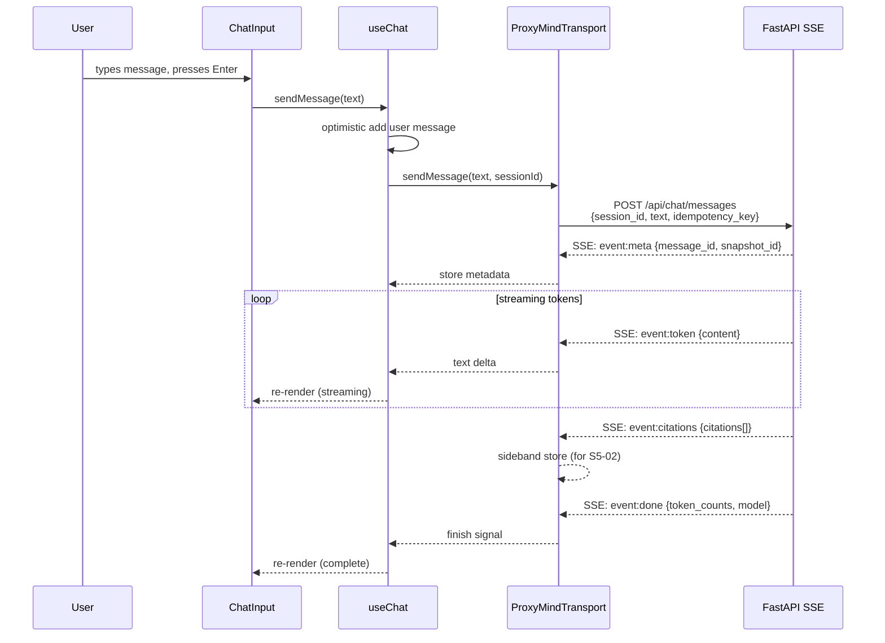
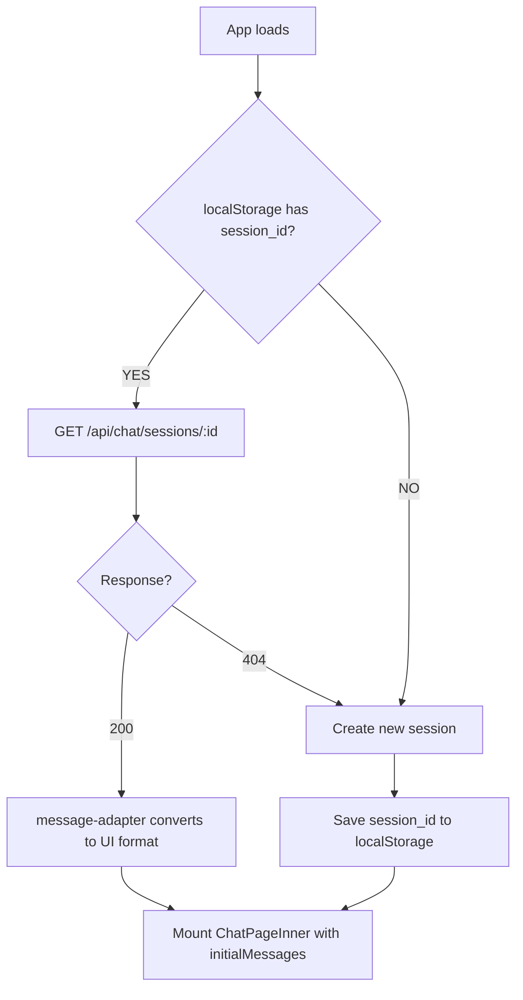

# S5-01: Chat UI — Design

## Context

ProxyMind's frontend is currently a bare Vite + React scaffold with no functional UI. The backend dialogue circuit is fully operational: Chat API exposes `POST /api/chat/sessions` (create), `POST /api/chat/messages` (SSE streaming), and `GET /api/chat/sessions/:id` (history). The backend requires zero changes for this story.

**Production routing:** Caddy serves both frontend (static) and backend (`/api/*`) on the same origin — no CORS needed at runtime.

**Dev routing:** Vite dev server on `:5173`, FastAPI on `:8000` — different origins. Solved with Vite `server.proxy`, not backend CORS middleware.

**Affected architecture areas:**
- **Frontend** (`frontend/src/`) — entirely new: components, hooks, lib, pages, types, tests. Replaces the bootstrap landing page.
- **Dialogue circuit (consumer side)** — the frontend becomes the first real consumer of the Chat API SSE stream.

**Unchanged areas:**
- Backend (all three circuits: dialogue, knowledge, operational) — zero modifications.
- Data stores (PostgreSQL, Qdrant, SeaweedFS, Redis) — no schema or config changes.
- Infrastructure (Docker, Caddy, Docker Compose) — no changes.
- Persona files, PROMOTIONS.md — not touched.

## Goals / Non-Goals

**Goals:**

- Deliver a working browser chat interface that satisfies the S5-01 verification criteria: open page, send message, see streaming response, see history on refresh.
- Implement SSE streaming client that consumes the existing `POST /api/chat/messages` stream (meta/token/citations/done events).
- Add session persistence (localStorage + backend API) for history restoration.
- Render assistant messages as Markdown with XSS protection.
- Display twin name and avatar (from environment variables).
- Establish frontend infrastructure: shadcn/ui + Tailwind CSS, React Router, Vitest + React Testing Library.
- Centralize UI strings in `lib/strings.ts` per the Product Language Policy (no hardcoded language).

**Non-Goals:**

- Citation display (inline references, collapsed source blocks) — S5-02.
- Twin avatar upload or profile metadata form — S5-02.
- Admin UI (sources, snapshots management) — S5-03.
- Dark mode — deferred.
- Backend changes of any kind.
- Full i18n framework — `lib/strings.ts` is sufficient for now (YAGNI).

## Decisions

### 1. CSS approach: shadcn/ui + Tailwind CSS

**Chosen:** shadcn/ui (new-york style, zinc palette) + Tailwind CSS.

**Alternatives considered:**
- *Plain CSS modules* — no shared primitives; would require building Button, Avatar, ScrollArea, Textarea from scratch. Rejected: too much effort for standard components.
- *Tailwind-only (no component library)* — possible but loses shadcn's accessible, production-ready primitives that S5-03 (Admin UI) also needs.

shadcn components live flat in `components/ui/`. Custom components use folder-per-component with a dedicated `.css` file alongside Tailwind utilities.

### 2. Chat architecture: AI SDK useChat + custom ProxyMindTransport

**Chosen:** AI SDK (`ai` + `@ai-sdk/react`) `useChat` hook with a custom `ProxyMindTransport` that bridges the backend SSE format to AI SDK's UI Message Stream format (Approach A). Fallback to Approach B (custom hook using AI SDK streaming utilities only) if the transport API is incompatible.

**Alternatives considered:**
- *Custom hook only (no AI SDK)* — full control but duplicates battle-tested streaming state management (optimistic updates, status tracking, abort). Rejected: unnecessary reinvention.
- *Context + Service pattern* — overengineered for a single chat page. Rejected: YAGNI.

**Approach A vs B ripple effect** (critical implementation detail):

| Aspect | Approach A (useChat) | Approach B (custom hook) |
|--------|---------------------|------------------------|
| Message format | `UIMessage` with `.parts` array | Flat `ChatMessage` with `.content` string |
| Text access in components | `message.parts.filter(p => p.type === 'text')` | `message.content` |
| Chat status enum | `submitted \| streaming \| ready \| error` | `idle \| streaming \| error` |
| Disable input condition | `status === "submitted" \|\| status === "streaming"` | `status === "streaming"` |
| Initial history param | `messages` (verify exact name at implementation) | Custom state initialization |
| Message adapter output | `UIMessage[]` | `ChatMessage[]` |

The implementer MUST verify the AI SDK v6 transport API before committing to Approach A.

### 3. SSE client: fetch + ReadableStream

**Chosen:** Manual SSE parsing with `fetch` + `ReadableStream`.

**Alternatives considered:**
- *EventSource* — does not support POST requests. Rejected: incompatible with the backend API.
- *SSE library (e.g., eventsource-polyfill)* — unnecessary dependency for a trivial format. Rejected: YAGNI.

The `sse-parser.ts` module is stateless: reads `ReadableStream<Uint8Array>`, handles partial chunks and heartbeats, yields typed events (`MetaEvent | TokenEvent | CitationsEvent | DoneEvent | ErrorEvent`).

### 4. Session persistence: localStorage + backend API

**Chosen:** Store `session_id` in localStorage under key `proxymind_session_id`. On reload, fetch history via `GET /api/chat/sessions/:id`. On 404, create a new session.

**Alternatives considered:**
- *URL-based (session ID in URL)* — exposes session ID, complicates routing. Rejected.
- *Cookie-based* — unnecessary server-side coupling. Rejected.

A `ChatPageLoader` / `ChatPageInner` wrapper pattern avoids the React hooks ordering issue: `useSession` resolves before `useChat` is mounted with `initialMessages`.

### 5. Dev CORS: Vite server.proxy

**Chosen:** Vite `server.proxy` forwards `/api` requests to `http://localhost:8000`.

**Rationale:** Keeps frontend code origin-agnostic (all requests use relative `/api/...` paths). No CORS middleware added to the backend — matches production behavior (Caddy same-origin).

### 6. UI strings: centralized lib/strings.ts

**Chosen:** Single record of all user-facing strings in `lib/strings.ts`.

**Rationale:** Product Language Policy compliance. Not a full i18n framework — just a single replaceable record per deployment. Components import strings from this module, never inline them.

### 7. Component structure: folder-per-component

Every custom component gets its own folder: `ComponentName.tsx`, `ComponentName.css`, `index.ts` (re-export). shadcn components remain flat in `ui/` as generated by the CLI.

### 8. Markdown rendering

`react-markdown` + `rehype-sanitize` for assistant messages. User messages are plain text. XSS protection is mandatory since content comes from an LLM.

## Data Flow

### Sending a message

### Page reload (history restoration)

## Testing Approach

All stable behavior MUST be covered by tests before archive (per Phase 5 requirements).

**Unit tests (Vitest):**
- `sse-parser.ts` — SSE format parsing, partial chunks, heartbeats, malformed data.
- `message-adapter.ts` — backend `MessageInHistory` to UI message format conversion.
- `ProxyMindTransport` — SSE event to AI SDK format mapping (mocked fetch).
- `useSession` — session creation, localStorage restore, 404 handling.
- `api.ts` — API client functions with mocked fetch.

**Component tests (Vitest + React Testing Library):**
- `MessageBubble` — user vs assistant styling, Markdown rendering, error + retry button.
- `ChatInput` — Enter sends, Shift+Enter newline, disabled during streaming, empty validation.
- `MessageList` — renders message list, scroll container present.
- `ChatHeader` — avatar and twin name display.

**Integration test:**
- `ChatPage` full flow — mock transport, render page, type message, verify streaming renders, verify final message.

**Not in CI scope:** real backend SSE connection (belongs to quality/evals), visual snapshot tests.

## Risks / Trade-offs

### AI SDK transport API compatibility (moderate risk)

The `ProxyMindTransport` depends on AI SDK v6's `ChatTransport` interface (or equivalent hook point like the `fetch` option). The exact API surface must be verified at implementation time.

**Mitigation:** Approach B fallback (custom hook with AI SDK streaming utilities only). The SSE parser and message adapter are transport-agnostic and work with either approach.

### useChat initialMessages parameter name (low risk)

AI SDK v6 may use `messages` instead of `initialMessages` for the history restoration prop.

**Mitigation:** Verify from `@ai-sdk/react` docs at implementation time. Trivial to adjust.

### submitted vs streaming disable gap (low risk)

Between the user pressing Send and the first SSE token arriving, the input should be disabled. With Approach A, AI SDK provides `status === "submitted"` for this window. With Approach B, the custom hook must track this state explicitly.

**Mitigation:** Approach A covers this natively. Approach B checks `status === "streaming"` which starts at send time (before first token), closing the gap.

### shadcn/ui + Tailwind CSS bundle size (low risk)

shadcn components are tree-shakeable (copied into project, not imported from a package). Only four components are used: Button, Avatar, ScrollArea, Textarea. Tailwind purges unused classes in production builds.

**Mitigation:** Minimal footprint by design. Monitor bundle size if more components are added in S5-02/S5-03.

### Citations stored but not displayed (by design)

The transport captures citation events and stores them alongside messages, but S5-01 does not render them. This is intentional — S5-02 will consume the stored citation data without requiring transport changes.

---

*Version constraints for all dependencies: see `docs/spec.md`. Detailed design spec: `docs/superpowers/specs/2026-03-25-s5-01-chat-ui-design.md`.*
