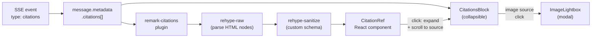
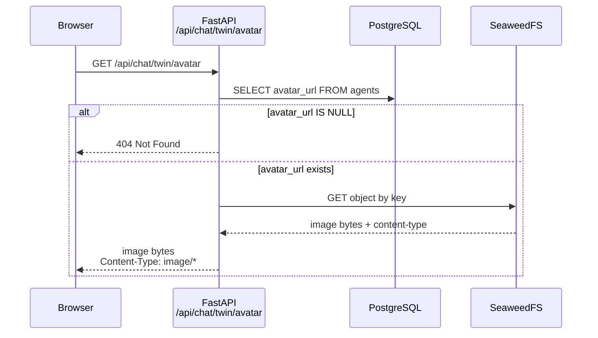

## Context

Story S5-02 adds visual citation rendering and twin profile management to the chat UI introduced in S5-01. Today, citations arrive as raw `[source:N]` markers with no interactive treatment, and the twin's identity is hardcoded via environment variables. See `proposal.md` for full motivation.

This change is **frontend-heavy** and touches the **dialogue circuit frontend** exclusively. The knowledge circuit, operational circuit, and all existing backend services remain unchanged. The only backend addition is a new `profile.py` router for twin profile CRUD and avatar proxying.

**Parallel pair:** S4-05 (Promotions + context assembly) -- zero file overlap by design.

## Goals / Non-Goals

**Goals:**

- Replace `[source:N]` text markers with clickable superscript numbers (Wikipedia-style) via a custom remark plugin
- Render a collapsible "Sources (N)" block beneath each cited assistant message (Perplexity-style)
- Provide type-specific icons for sources using lucide-react (tree-shakeable, standard for React + Radix UI)
- Open image-type sources in a lightweight lightbox modal
- Expose twin profile (name, avatar) through backend API endpoints with SeaweedFS avatar proxying
- Allow the owner to edit name and upload/remove avatar via a modal, gated by `VITE_ADMIN_MODE`
- Preserve raw `[source:N]` text in message storage -- rendering transforms at display time only

**Non-Goals:**

- PDF fragment preview (requires a backend page-render endpoint; deferred)
- Public links schema extension (deferred per plan)
- Twin description field (YAGNI -- story specifies name + avatar only)
- Backend authentication for admin endpoints (deferred to S7-01)
- E2E or visual regression testing

## Decisions

| Decision | Choice | Rationale |
|----------|--------|-----------|
| Inline citation style | Superscript numbers | Does not break reading flow; matches established UX patterns; badges are too heavy for 3-5 citations per paragraph |
| Sources block | Collapsible, collapsed by default | Keeps message area tidy; expand on demand |
| Source type indicators | lucide-react icons, color-coded per type | Tree-shakeable (~2KB), visually immediate, consistent with existing Radix UI usage |
| Image source interaction | Lightbox modal | Natural UX; minimal component (no carousel, no zoom) |
| Markdown pipeline | remark-citations plugin -> rehype-raw -> rehype-sanitize (custom schema) -> components mapping | rehype-raw parses HTML nodes injected by the remark plugin; sanitize schema allowlists `sup`, `button[class, data-citation-index, aria-label, type]`; components prop maps `button.citation-ref` to the CitationRef React component |
| Icon library | lucide-react | Standard for React + Radix UI; tree-shakeable; covers both citation type icons and UI icons (Settings, X) |
| Pluralization format | Count-only: `"Sources (3)"` via `strings.sourcesCount(n)` | Pluralization-neutral (no `count === 1` branching); default English, configurable per installation via `strings.ts` |
| Avatar storage | Object key in DB, proxy endpoint for browser | Browser never talks to SeaweedFS directly; decouples internal storage from public API |
| Profile data source | API with env var fallback | `agents` table already has `name` and `avatar_url`; env vars preserved as backward-compatible fallback |
| Profile backend | New `profile.py` router | Avoids bloating `admin.py`; prevents file overlap with S4-05 |
| Admin UI guard | `VITE_ADMIN_MODE` env var | UI-only guard -- hides the settings button. Does NOT protect backend endpoints (documented; S7-01 adds real auth) |
| Description field | Excluded | YAGNI for S5-02; trivial to add later |

### Citation data flow

How citation markers in SSE responses become interactive React components:

The remark plugin runs at render time. It finds `[source:N]` patterns in text nodes and replaces them with HTML `<button>` nodes. rehype-raw parses these into the hast tree. rehype-sanitize ensures only allowlisted elements pass through. The ReactMarkdown `components` prop maps `button.citation-ref` to the `CitationRef` component, connecting the Markdown output to interactive React.

During streaming, markers may appear before citations arrive -- they render as plain text until the `citations` SSE event triggers a re-render with superscripts.

### Avatar proxy flow

How the browser retrieves the twin's avatar without direct SeaweedFS access:

The `avatar_url` column stores a SeaweedFS object key (e.g., `agents/{agent_id}/avatar/{uuid}.{ext}`), not a URL. The proxy endpoint resolves the key, streams the image bytes, and sets the correct `Content-Type` header.

## Affected Architecture

**Changed:**

- **Dialogue circuit frontend** -- new components (CitationsBlock, CitationRef, ImageLightbox, ProfileEditModal), modified MessageBubble/ChatHeader/ChatPage, new remark plugin, new dependencies (lucide-react, rehype-raw)
- **Backend API layer** -- new `profile.py` router with 5 endpoints (2 public on chat router, 3 admin)

**Unchanged:**

- Knowledge circuit (ingestion, parsing, chunking, embedding, snapshots)
- Operational circuit (arq, Redis, rate limiting, audit logging, monitoring)
- All existing backend services (retrieval.py, citation.py, llm.py, chat.py, admin.py)
- SSE transport, message adapter, session management
- Database schema (uses existing `agents.name` and `agents.avatar_url` columns)

## Testing Approach

**Frontend (Vitest + React Testing Library):**

- `remark-citations.test.ts` -- unit tests for the plugin: marker replacement, out-of-range indices left as text, multiple markers, no-op on user messages
- `CitationsBlock.test.tsx` -- collapsed/expanded states, online vs offline source rendering, icon mapping, image lightbox trigger
- `ImageLightbox.test.tsx` -- open/close behavior (Escape, click outside, X button), correct image src
- `ProfileEditModal.test.tsx` -- modal open/close, name input binding, API call on submit, avatar upload trigger, avatar removal
- `MessageBubble.test.tsx` -- updated: citations present renders CitationsBlock, citations absent does not, streaming suppresses CitationsBlock

**Backend (pytest):**

- `test_profile_api.py` -- integration tests for all 5 endpoints: GET twin profile, GET avatar proxy (200 and 404), PUT profile name, POST avatar upload (type validation, size validation, SeaweedFS storage), DELETE avatar

## Risks / Trade-offs

| Risk | Impact | Mitigation |
|------|--------|------------|
| Admin endpoints unprotected until S7-01 | Anyone with network access can change twin name/avatar | `VITE_ADMIN_MODE` hides UI; S7-01 is a prerequisite before non-local deployment per plan security ordering. Documented as known limitation |
| rehype-raw + rehype-sanitize ordering | Incorrect order could allow XSS or strip valid citation markup | Strict plugin chain order enforced in MessageBubble; custom sanitize schema allowlists only the specific elements and attributes the remark plugin produces |
| Avatar proxy adds latency | Every avatar render requires a backend round-trip to SeaweedFS | Acceptable for v1 -- avatar is a small image, browser caches the response. Future optimization: add `Cache-Control` headers or serve via CDN |
| Streaming partial markers | `[source:` may appear as incomplete text during token streaming | Renders as plain text until complete; re-render on citations event replaces with superscripts. No user-visible glitch beyond momentary raw text |
| lucide-react bundle size | New dependency adds to frontend bundle | Tree-shakeable; only imported icons are bundled (~2KB for the set used) |
