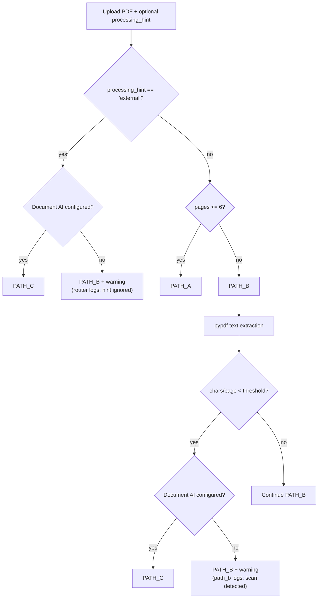
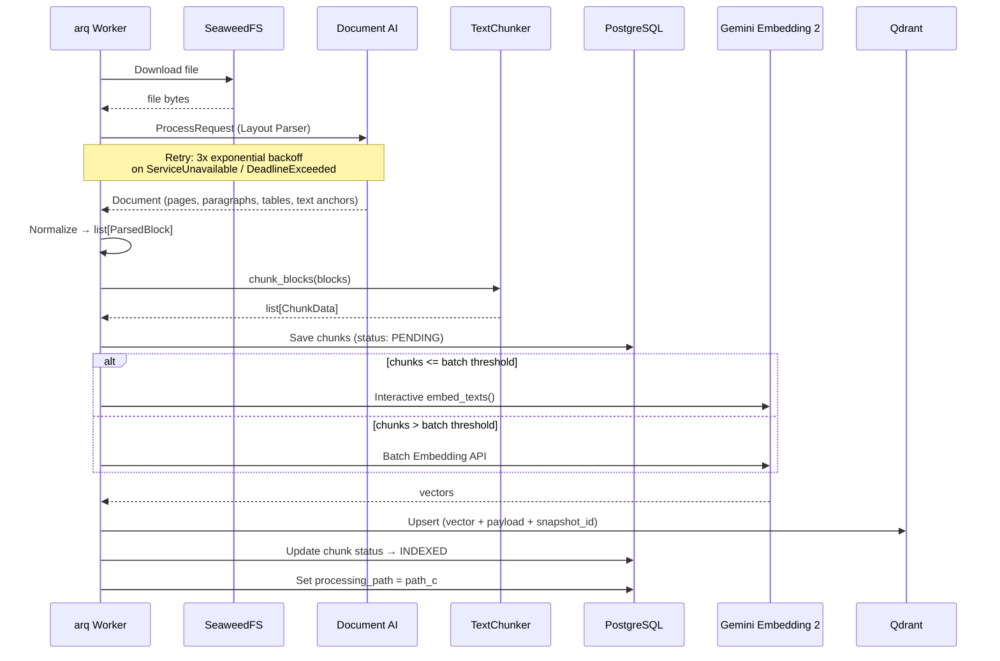

# S4-06: Lightweight Knowledge Processing Migration — Design

## Context

S4-06 belongs to Phase 4: Dialog Expansion. The knowledge circuit already supports three processing paths: Path A (Gemini native for short multimodal inputs), Path B (lightweight local parsing for text-centric formats), and a conceptual Path C (external fallback) that has never been implemented. All ingestion paths feed into the same embedding and indexing pipeline (Gemini Embedding 2, Qdrant with `snapshot_id` scoping).

The codebase migrated away from Docling at the implementation level during earlier stories — `DoclingParser` does not import or use Docling, and no Docling dependency exists in `pyproject.toml`. However, the naming (`DoclingParser`, `docling_parser.py`, `PipelineServices.docling_parser`), dead code (`_chunk_external_document()`, unused `chunker` parameter), and documentation (`docs/rag.md` still references "Path B — Docling") have not been updated. Meanwhile, the canonical architecture in `docs/architecture.md` already references "Lightweight Parser Stack" and "Document AI Fallback" — the code does not match the architecture.

S4-06 closes this gap: it renames the Docling-era artifacts, introduces a provider-agnostic `DocumentProcessor` Protocol, adds Google Cloud Document AI as the Path C fallback for complex documents, and synchronizes living documentation with the actual system state.

**Affected circuit:** Knowledge circuit. The path router, ingestion pipeline, and worker task handlers are modified. A new `DocumentAIParser` adapter and `path_c` handler are introduced. The dialogue and operational circuits are unchanged. One Alembic migration adds `path_c` to the PostgreSQL `processing_path_enum` and a `processing_hint` audit column to `document_versions`. The upload API gains an optional `processing_hint` field (backward-compatible, defaults to `"auto"`).

## Goals / Non-Goals

**Goals:**

- Replace all Docling-era naming with provider-agnostic equivalents: `DoclingParser` becomes `LightweightParser`, `docling_parser` field becomes `document_processor`, file and test renames follow
- Extract a `DocumentProcessor` Protocol as the single parsing contract that both `LightweightParser` and `DocumentAIParser` implement
- Extract `TextChunker` from `LightweightParser._chunk_blocks` into a standalone reusable class so that both parsers share identical chunking logic
- Implement `DocumentAIParser` — a Google Cloud Document AI (Layout Parser) adapter with retry logic for transient gRPC errors
- Add Path C routing via hybrid detection: automatic scan heuristic (low chars/page from pypdf) plus explicit user override (`processing_hint` field on upload)
- Add `PATH_C` to the `ProcessingPath` PostgreSQL enum and `processing_hint` column to `DocumentVersion` for audit, via Alembic migration
- Implement graceful disable: when Document AI is not configured, Path C is unavailable and qualifying documents fall back to Path B with a warning
- Remove dead code: `_chunk_external_document()`, unused `chunker` parameter, `_extract_anchor_page()`
- Update living documentation (`docs/rag.md`, `docs/lightweight-knowledge-processing-migration.md`) and verify `docs/architecture.md` and `docs/spec.md`

**Non-Goals:**

- Path C for non-PDF formats — DOCX, HTML, Markdown, and TXT already parse well locally via Path B
- Auto-provisioning of Document AI processors — the processor must be pre-created in Google Cloud Console
- Vertex AI Search or Vertex AI RAG Engine integration — ProxyMind uses Qdrant as the canonical local retrieval store
- Changes to archived OpenSpec specs or completed story descriptions in `docs/plan.md` — historical artifacts are preserved
- Conversation memory — a separate concern for a later story
- Local ML frameworks or heavyweight inference runtimes — strictly forbidden per project policy

## Decisions

| # | Decision | Choice | Alternatives Considered | Rationale |
|---|----------|--------|------------------------|-----------|
| D1 | Provider-agnostic parsing interface | Python Protocol (`DocumentProcessor`) with a single `parse_and_chunk` method. Two implementations: `LightweightParser`, `DocumentAIParser`. Router selects the processor. | (A) Single class with internal routing (`_parse_local()` / `_parse_document_ai()`) — violates SRP, harder to test, grows with each new provider. (B) Strategy pattern via `{PathType: DocumentProcessor}` dict — maximum flexibility but YAGNI at 2 implementations. | Protocol is the standard Python structural subtyping mechanism — 5 lines of code, testable, extensible. Strategy registry is justified at 5+ providers, not at 2. A Protocol allows any class with the right signature to satisfy the contract without explicit inheritance, keeping implementations decoupled. |
| D2 | Document AI processor type | Layout Parser | (A) Document OCR — basic OCR only, no structural analysis. (B) Form Parser — optimized for forms and key-value extraction, too specialized for general knowledge ingestion. | Layout Parser covers OCR, tables, and reading order in a single API call — the most versatile processor for ProxyMind's use cases (scanned PDFs, complex layout, mixed text+image pages). |
| D3 | Document complexity detection | Hybrid: auto-detection heuristic + user override | (A) Automatic detection only — covers scans via chars/page heuristic but misses complex tables that produce text. (B) User flag only — no false positives but breaks "just upload" UX. | Auto-detection covers ~80% of cases (scanned/image-based PDFs). The explicit `processing_hint="external"` override closes edge cases (complex tables, poor layout extraction) that cannot be detected without ML analysis. Hybrid matches the "local-first, external-on-complexity" routing policy. |
| D4 | Scan heuristic placement | Inside path_b handler, after pypdf text extraction | (A) In the path router before parsing — the router works on metadata only and cannot measure text density. (B) As a separate pre-processing step — adds a pipeline stage for a single check. | Text scarcity is observable only after pypdf extracts text. The path_b handler already has the extracted content at that point. If chars/page < `path_c_min_chars_per_page` (default: 50), path_b delegates to path_c. If Document AI is not configured, path_b continues with best-effort processing and a warning. |
| D5 | Retry and failure policy | tenacity: 3 attempts, exponential backoff (1s, 2s, 8s), retry only on `ServiceUnavailable` and `DeadlineExceeded` | (A) Retry on all exceptions — masks configuration and auth bugs. (B) No retry — transient gRPC errors are common in cloud APIs. | Only transient gRPC errors are retried. Configuration errors (`PermissionDenied`, `InvalidArgument`, `NotFound`) and code bugs must fail fast. On exhaustion after 3 attempts, the exception propagates and the ingestion task transitions to `failed`. |
| D6 | Graceful disable vs fail distinction | Two separate behaviors depending on whether Document AI is configured | (A) Single policy (always fail if Path C is needed) — prevents deployment without Google Cloud credentials. (B) Single policy (always fall back) — hides broken configuration. | Not configured (no `DOCUMENT_AI_PROJECT_ID`) is a normal deployment state — Path C is disabled, qualifying documents use Path B with a warning. This preserves the cheap-VPS-first constraint. Configured but unresponsive is an error — retry 3x, then fail. These are fundamentally different situations. |
| D7 | Warning ownership for fallback decisions | The router owns warnings when `processing_hint="external"` falls back to Path B due to disabled Document AI. The path_b handler owns warnings when scan auto-detection triggers but Document AI is unavailable. | (A) Centralize all warnings in a single component — the decision happens in two different places (explicit hint in router, auto-detection in path_b handler). | Each component logs the warning where the decision is made. The router decides for explicit hints. The path_b handler decides for auto-detected scans. |
| D8 | TextChunker extraction strategy | Extract `_chunk_blocks` from `DoclingParser` into a standalone `TextChunker` class in `document_processing.py`. Both `LightweightParser` and `DocumentAIParser` instantiate their own `TextChunker`. | (A) Keep `_chunk_blocks` as a private method on `LightweightParser` and duplicate in `DocumentAIParser` — violates DRY. (B) Module-level function — loses configurable `chunk_max_tokens` state. | A small class with `chunk_max_tokens` as constructor state and `chunk_blocks(blocks)` as the single public method. Each parser owns its `TextChunker` instance. Minimal refactoring — the algorithm is unchanged, only moved. |
| D9 | PostgreSQL enum migration for PATH_C | `ALTER TYPE processing_path_enum ADD VALUE IF NOT EXISTS 'path_c'` in Alembic | (A) Recreate the enum type — requires migrating all rows, risky and complex. (B) Use a String column instead of enum — loses type safety. | PostgreSQL supports adding values to existing enum types. The `IF NOT EXISTS` clause makes the migration idempotent. Downgrade cannot remove an enum value (PostgreSQL limitation), but this is safe — unused values are harmless. |
| D10 | `processing_hint` storage | Nullable `String(32)` column on `DocumentVersion` | (A) PostgreSQL enum — requires another enum type and migration for future hint values. (B) Store in task metadata only — loses audit trail on the document version record. | A plain string column avoids enum migration overhead for what is currently a two-value field (`"auto"`, `"external"`). Storing on `DocumentVersion` (not just task metadata) ensures the routing decision is auditable alongside the processing result. |

## Architecture

### Affected components

The change touches the knowledge circuit exclusively. No modifications to the dialogue circuit (chat, retrieval, citation, query rewriting, context assembly) or the operational circuit (task queue, rate limiter, audit logger, monitoring).

Within the knowledge circuit:

```
services/
  document_processing.py   NEW   DocumentProcessor Protocol + ChunkData + ParsedBlock + TextChunker
  document_ai_parser.py    NEW   DocumentAIParser — Document AI Layout Parser adapter
  lightweight_parser.py    REN   Renamed from docling_parser.py; class DoclingParser → LightweightParser
  path_router.py           MOD   Gains processing_hint parameter and PATH_C routing
  source.py                MOD   Passes processing_hint to task metadata
workers/
  main.py                  MOD   Renamed imports, conditional DocumentAIParser instantiation
  tasks/
    pipeline.py            MOD   document_processor field (was docling_parser), document_ai_parser field
    ingestion.py           MOD   Path C dispatch, processing_hint propagation
    handlers/
      path_b.py            MOD   Scan detection heuristic, reroute to path_c
      path_c.py            NEW   Path C handler — Document AI → chunk → embed → index
api/
  schemas.py               MOD   processing_hint field on SourceUploadMetadata
db/
  models/enums.py          MOD   PATH_C added to ProcessingPath
  models/knowledge.py      MOD   processing_hint column on DocumentVersion
migrations/                MOD   Alembic migration for enum + column
core/
  config.py                MOD   Document AI + Path C settings
```

### Routing flow



### Path C processing flow



### Chunk contract

All three paths produce the same `ChunkData` contract. Provider-specific response shapes never leak into domain models or retrieval logic.

```
ChunkData
  text_content: str
  token_count: int
  chunk_index: int
  anchor_page: int | None
  anchor_chapter: str | None
  anchor_section: str | None
  anchor_timecode: str | None
```

The `DocumentAIParser` normalizes Document AI's structured response (pages, paragraphs, text anchors) into `ParsedBlock` instances, then delegates to `TextChunker` which produces `ChunkData`. The Qdrant payload schema and citation builder remain unchanged.

### Shared embedding and indexing logic

Steps after chunking (save to PostgreSQL, embed, upsert to Qdrant, update statuses) are identical between path_b and path_c handlers. A shared extraction (`embed_and_index_chunks` or equivalent) is a natural refactoring within scope to avoid duplication. Both handlers follow the same pattern established in path_a and path_b: they are standalone async functions in `workers/tasks/handlers/` that receive `PipelineServices` and return a typed result dataclass.

## Configuration

### New environment variables

| Variable | Type | Default | Required | Description |
|----------|------|---------|----------|-------------|
| `DOCUMENT_AI_PROJECT_ID` | `str \| None` | `None` | No | Google Cloud project ID. Unset = Path C disabled entirely. |
| `DOCUMENT_AI_LOCATION` | `str` | `us` | No | Document AI processor region. |
| `DOCUMENT_AI_PROCESSOR_ID` | `str \| None` | `None` | Conditional | Required if `DOCUMENT_AI_PROJECT_ID` is set. |
| `PATH_C_MIN_CHARS_PER_PAGE` | `int` | `50` | No | Chars/page threshold for scan auto-detection. |

A computed property `document_ai_enabled` returns `True` when both `DOCUMENT_AI_PROJECT_ID` and `DOCUMENT_AI_PROCESSOR_ID` are set.

### New dependency

| Package | Role | Weight |
|---------|------|--------|
| `google-cloud-documentai` (>=3.0.0) | Document AI gRPC client | Lightweight — no ML runtime, no torch, no CUDA |

### Database migration

One Alembic migration:
1. `ALTER TYPE processing_path_enum ADD VALUE IF NOT EXISTS 'path_c'`
2. `ADD COLUMN document_versions.processing_hint VARCHAR(32) NULL`

Downgrade drops the column. The enum value cannot be removed (PostgreSQL limitation) but is harmless if unused.

## Risks / Trade-offs

**Scan detection heuristic has false positives and false negatives.** The chars/page threshold (default: 50) catches image-based PDFs with little or no extractable text, but it cannot detect complex tables or poor reading order in PDFs that do produce text. False positives are low-cost (Document AI processes a text PDF successfully, just at higher cost). False negatives are mitigated by the `processing_hint="external"` user override. The threshold is configurable and can be tuned per deployment.

**Document AI adds a cloud dependency for Path C only.** The base installation works without Google Cloud credentials — Path C is gracefully disabled. Documents that would qualify for Path C are processed via Path B (best-effort) with a warning. This preserves the cheap-VPS-first constraint but means scan-heavy knowledge bases may have lower extraction quality without Document AI configured.

**`ALTER TYPE ... ADD VALUE` is irreversible.** PostgreSQL does not support removing values from an existing enum type. Once `path_c` is added to `processing_path_enum`, it persists even after downgrade. This is a known PostgreSQL limitation and is safe — an unused enum value has no runtime impact.

**Retry policy retries only specific gRPC errors.** Only `ServiceUnavailable` and `DeadlineExceeded` are retried. Other errors (`PermissionDenied`, `InvalidArgument`, `NotFound`) fail immediately. If Google Cloud introduces new transient error codes, they would not be retried until the retry policy is updated. This is preferable to retrying all exceptions, which would mask configuration bugs.

**TextChunker uses `CHARS_PER_TOKEN=3` approximation.** Token estimation can be off by +/-20%, and for CJK text the estimate is conservative (overestimates token count). This is acceptable for chunking budget management. The same constant is already used across the codebase (query rewriting, context assembly) without issues.

**path_b handler gains scan detection responsibility.** The path_b handler now has a secondary concern: detecting scans and rerouting to path_c. This is a pragmatic trade-off — the alternative is a separate pre-processing pipeline step, which adds complexity for a single conditional check. The detection logic is a few lines within the existing pypdf extraction flow.

## Testing Approach

All tests are deterministic CI tests. No external API calls. Document AI, embedding, and Qdrant interactions are mocked.

### Unit tests

| Test file | What it covers |
|-----------|---------------|
| `test_text_chunker.py` | Standalone TextChunker: single block within budget, oversized block splitting, small block merging, empty text skipping, empty input, anchor metadata preservation from first block |
| `test_document_ai_parser.py` | DocumentAIParser with mocked gRPC client: normalization of Document AI response into `list[ChunkData]`, anchor fields correct, token_count computed, chunk_index sequential, empty response returns empty list, anchor_timecode always None for PDFs |
| `test_path_c_routing.py` | Path C routing in `determine_path()`: `processing_hint="external"` routes PDF to PATH_C, hint ignored for text formats (MD/TXT/HTML/DOCX), fallback to PATH_B when Document AI disabled (with "not configured" in reason), `processing_hint="auto"` preserves existing routing, default behavior unchanged without hint |
| `test_path_router.py` (existing, extended) | Existing path_a/path_b tests updated with `document_ai_enabled` in settings fixture |

### Integration tests

| Test file | What it covers |
|-----------|---------------|
| `test_path_c_ingestion.py` | Path C handler full cycle (mock Document AI + mock Embedding): chunks saved to PostgreSQL with correct statuses, valid Qdrant payload. Reroute from path_b to path_c when scan detected. Graceful disable: Document AI not configured + scan PDF -> path_b with warning, task not failed. Retry behavior: first 2 Document AI calls return transient error, third succeeds. Upload API: `processing_hint` field accepted, stored in DocumentVersion, passed to worker. |

### Regression boundary

All existing path_a and path_b tests continue to pass after renames. The `ChunkData` contract is unchanged — existing assertions on chunk fields remain valid. Qdrant payload schema is unchanged. The upload API is backward-compatible (`processing_hint` defaults to `"auto"`).

### Evals (separate, do not block CI)

- Real scanned PDF through Document AI: text extraction quality assessment
- Citation accuracy comparison: path_b vs path_c on complex documents

## Documentation Updates

| Document | Change |
|----------|--------|
| `docs/rag.md` | Replace all Docling/HybridChunker references. "Path B — Docling" becomes "Path B — lightweight local". Add Path C section. Update multilingual table (remove Docling row). Update pipeline diagrams. |
| `docs/lightweight-knowledge-processing-migration.md` | Mark migration as complete. Update checklist. Add final state after S4-06. |
| `docs/architecture.md` | Verify — already references "Lightweight Parser Stack" and "Document AI Fallback". Fix any remaining discrepancies. |
| `docs/spec.md` | Verify — add Path C configuration parameters to defaults table if appropriate. |

Archived OpenSpec specs and completed story descriptions are not modified — they preserve historical context.
