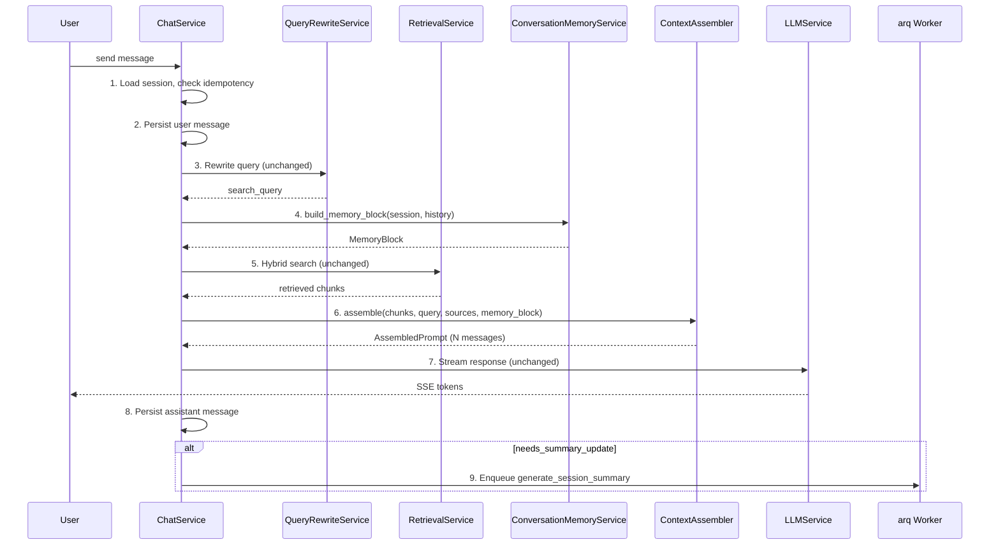
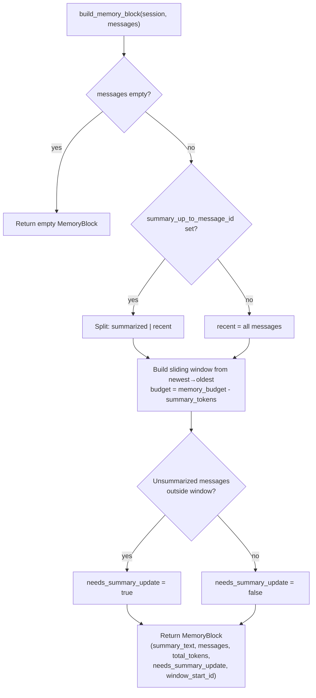
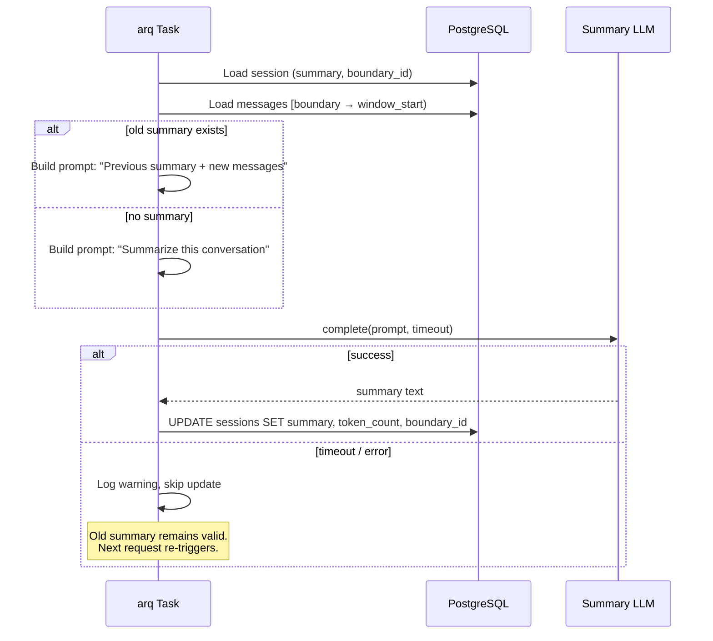

# S4-07: Conversation Memory — Design

## Context

S4-07 belongs to Phase 4: Dialog Expansion. Prerequisites are in place: SSE streaming (S4-02), persona loading (S4-01), citation builder (S4-03), query rewriting (S4-04), and promotions context assembly (S4-05) are complete. The dialogue circuit's `ContextAssembler` currently produces a 2-message output: a system prompt (persona layers 1-5, citation instructions, content guidelines) and a single user message (retrieval context + query).

The LLM sees only persona + retrieval context + the current query. In multi-turn conversations, it has no memory of what was discussed earlier in the session. Query rewriting (S4-04) reformulates follow-up queries into self-contained search queries for retrieval, but the LLM itself remains stateless across turns. The twin cannot maintain coherent long conversations, reference prior answers, or build on earlier context.

This story fills **layer 6 (Conversation memory)** in the context assembly stack: recent messages verbatim in native multi-turn format (sliding window) plus an LLM-generated summary of older messages when the token budget is exceeded. Summary is generated asynchronously via arq task after response streaming completes, following the same async pattern established by the existing worker infrastructure.

**Affected circuit:** Dialogue circuit only. The change touches `ConversationMemoryService` (new), `ContextAssembler` (modified output format), `ChatService` (two new steps in flow), arq worker (new summary task), and `sessions` table (3 new columns). The knowledge and operational circuits are unchanged.

**Important scope boundary:** Conversation memory provides conversational context to the LLM *after* retrieval succeeds. It does not bypass the retrieval refusal policy. The existing `min_retrieved_chunks` threshold remains unchanged — if retrieval returns fewer chunks than the threshold, the twin still refuses rather than answering from conversation history alone. This is deliberate: the twin must ground its answers in the knowledge base, not in prior conversation turns. Query rewriting (S4-04) is the mechanism that makes follow-up queries retrievable. If an installation wants pure chat without retrieval, it sets `min_retrieved_chunks=0`.

## Goals / Non-Goals

**Goals:**

- Enable the LLM to see conversation history during multi-turn sessions via a sliding window of recent messages in native multi-turn format
- Generate LLM summaries of older messages when the conversation exceeds the token budget, preserving context that falls outside the sliding window
- Refactor `ContextAssembler` from 2-message output (system + user) to N-message multi-turn output (system + history pairs + user), improving prompt quality for all modern LLMs
- Run summary generation asynchronously via arq task post-response, adding zero latency to the chat hot path
- Provide unified token accounting under a single `conversation_memory` key covering both summary and history messages
- Maintain full backward compatibility: first messages and short sessions produce identical output to current behavior

**Non-Goals:**

- Cross-session persistent memory (remembering facts across different sessions)
- User preferences or facts extraction (structured knowledge from conversations)
- Semantic memory (embedding conversation history for retrieval)
- Frontend changes (S4-07 is purely backend)
- Changes to query rewriting (remains independent, different budgets, different task)
- Summary quality evaluation (deferred to Phase 8 evals)
- Caching or persistence of MemoryBlock beyond request scope

## Decisions

### D1: Memory strategy — Sliding window + LLM summary

**Choice:** Recent messages verbatim in a sliding window, with an LLM-generated summary of older messages that no longer fit.

**Rationale:** Matches the canonical architecture ("recent messages + brief summary"). Summary is lazy — zero overhead for short sessions (~80% of sessions). The summary accumulates incrementally: "old summary + new messages -> new summary", handling arbitrarily long sessions without growing complexity.

**Alternatives rejected:**
- Pure sliding window — loses early context entirely, the twin forgets the beginning of the conversation
- Hierarchical multi-level summaries — overengineering at this stage; a single summary level handles the expected conversation lengths

### D2: Summary trigger — Token-budget based

**Choice:** Summary generation is triggered when messages exist between the summary boundary and the sliding window start — that is, when there are unsummarized messages that don't fit in the window.

**Rationale:** No wasted LLM calls while history fits in budget. Consistent with existing budget patterns (retrieval token budget, rewrite token budget). The `needs_summary_update` flag is a pure function of session state — no counters, no timers.

**Alternatives rejected:**
- Count-based trigger (every N messages) — fires too early for short messages, too late for long ones
- Per-message trigger — wasteful; the summary may not change meaningfully from one message to the next

### D3: Summary storage — 3 fields in `sessions` table

**Choice:** Three nullable columns on `sessions`: `summary` (Text), `summary_token_count` (Integer), `summary_up_to_message_id` (UUID FK to messages). Updated atomically when a new summary is generated.

**Rationale:** Summary is working state of a session, not a business entity. `summary_up_to_message_id` tracks which messages are already summarized, enabling incremental updates. Old summary is replaced in place — there is no use case for summary history.

**Alternatives rejected:**
- Separate `session_summaries` table — overengineering for state that is always overwritten
- Store in Redis — summary must survive restarts and is part of the session's durable state

### D4: Summary placement — Layer 6 in system message

**Choice:** The conversation summary is placed in the system prompt as layer 6, between promotions (layer 5) and citation instructions (layer 7). The prefix reads: "Earlier in this conversation: {summary}".

**Rationale:** Fits the existing `ContextAssembler` layer architecture. The summary provides broad conversational context that the LLM should consider alongside persona and behavioral instructions. History messages are placed as multi-turn pairs between the system message and the final user message.

### D5: Summary model — Separate `conversation_summary_model` with fallback

**Choice:** Optional `conversation_summary_model` setting. When `None`, falls back to the main `llm_model`.

**Rationale:** Works out of the box without extra config. Allows optimization with a cheaper model later (summarization is a straightforward task). Same pattern as `rewrite_llm_model` in S4-04.

### D6: Fail-safe strategy — Async generation + fallback to old summary

**Choice:** Summary is generated asynchronously via arq task after response streaming completes. If no summary exists yet, the system uses a pure sliding window. If the async task fails, the old summary remains valid.

**Rationale:** Zero added latency on the hot path. arq infrastructure already exists and is battle-tested. Summary is ready by the next user message. `needs_summary_update` naturally retries — if the arq task fails, the flag is `True` again on the next request. Deduplication via `job_id = f"summary:{session_id}"` ensures one task per session at a time.

**Alternatives rejected:**
- Synchronous summary before response — adds LLM call latency to the hot path
- Background thread — arq is the established async task mechanism; no reason to introduce a different pattern

### D7: History format — Native multi-turn messages

**Choice:** Conversation history is placed as separate `{"role": "user", "content": ...}` / `{"role": "assistant", "content": ...}` messages between the system prompt and the final user message.

**Rationale:** All modern LLMs are optimized for multi-turn format. LiteLLM already supports message arrays. The existing `AssembledPrompt.messages` is `list[dict]` — ready for extension from 2 elements to N elements.

**Alternatives rejected:**
- Serialize history as text inside the system prompt — loses native multi-turn format advantages; the LLM sees history as flat text rather than structured conversation

### D8: Assistant message handling — Full messages, no truncation

**Choice:** Include full assistant messages in the sliding window. Budget is controlled by the number of pairs fitting in the window, not by truncating individual messages.

**Rationale:** Truncation loses context that may be critical for digital twin conversations. Simpler implementation with clearer behavior. The budget naturally limits inclusion — when messages are large, fewer pairs fit in the window.

### D9: Interaction with query rewriting — Independent flows

**Choice:** Conversation memory and query rewriting load history independently. They use different budgets and serve different purposes. No coupling between the services.

**Rationale:** Query rewriting reformulates the query for retrieval search. Conversation memory provides context for the LLM response. Different budgets, different token limits, different timing. Current rewriting is tested and stable — no changes needed. One extra SELECT for history is negligible.

### D10: Summary timing — Post-response async via arq task

**Choice:** `ChatService` enqueues the arq task `generate_session_summary` after streaming completes, when `memory_block.needs_summary_update is True`.

**Rationale:** Zero added latency on hot path. The summary is ready by the next user message (typical human typing delay >> summary generation time). Fallback covers the gap if it is not ready. Consistent with the existing arq task patterns in the worker.

## Architecture

### Approach: Inline Memory Layer

Conversation memory is implemented as a new service (`ConversationMemoryService`) integrated into the existing `ContextAssembler` and `ChatService`. Summary is generated asynchronously via an arq task. No new abstractions, no new infrastructure — the change uses existing patterns (service layer, arq worker, Alembic migration).

### Data flow



### Updated `ChatService.stream_answer()` flow

```
1. Load session, check idempotency                       (unchanged)
2. Persist user message                                   (unchanged)
3. Query rewrite                                          (unchanged)
4. Build memory block (ConversationMemoryService)         [NEW]
5. Retrieval search                                       (unchanged)
6. Context assembly (persona + memory + retrieval)        [MODIFIED]
7. Stream LLM response                                    (unchanged)
8. Persist assistant message                              (unchanged)
9. Check needs_summary_update -> enqueue arq task         [NEW]
```

Steps 4 and 9 are the only additions. Step 6 changes its output format from 2 messages to N messages but its caller interface gains only one optional parameter.

### ContextAssembler output format change

**Before (2 messages):**
```
messages = [
    {"role": "system", "content": "<layers 1-5 + citation + guidelines>"},
    {"role": "user", "content": "<knowledge_context> + <query>"}
]
```

**After (N messages):**
```
messages = [
    {"role": "system", "content": "<layers 1-6 + citation + guidelines>"},
    {"role": "user", "content": "<message from history>"},
    {"role": "assistant", "content": "<response from history>"},
    ... more history pairs ...
    {"role": "user", "content": "<knowledge_context> + <query>"}
]
```

When `memory_block=None` or the block is empty, the output is identical to the current 2-message format.

### Prompt layer order

System message layers (assembled in order):

| Layer | Tag | Content |
|-------|-----|---------|
| 1 | `system_safety` | Safety policy (unchanged) |
| 2 | `identity` | IDENTITY.md (unchanged) |
| 3 | `soul` | SOUL.md (unchanged) |
| 4 | `behavior` | BEHAVIOR.md (unchanged) |
| 5 | `promotions` | PROMOTIONS.md active items (unchanged) |
| 6 | `conversation_summary` | "Earlier in this conversation: {summary}" **(NEW)** |
| 7 | `citation_instructions` | Citation format rules (unchanged) |
| 8 | `content_guidelines` | Content type guidelines (unchanged) |

Retrieval context lives in the final user message (wrapped in `<knowledge_context>` tags). This is unchanged.

### Token accounting

A single `conversation_memory` key in `layer_token_counts` covers both the summary tokens (from the system prompt layer) and the history message tokens (from multi-turn pairs). The `conversation_summary` layer is added to the system prompt for content, but its tokens are tracked under `conversation_memory` — not independently — to avoid double-counting.

When `memory_block` is `None` or has zero tokens, no `conversation_memory` key appears. This ensures backward compatibility with existing token accounting consumers.

## Data Model

### Sessions table extension

Three new nullable columns added via Alembic migration:

| Column | Type | Description |
|--------|------|-------------|
| `summary` | `Text \| NULL` | LLM-generated summary of earlier messages |
| `summary_token_count` | `Integer \| NULL` | Token count of the summary for fast budget calculation |
| `summary_up_to_message_id` | `UUID FK -> messages.id \| NULL` | Last message included in the summary (boundary marker) |

All three fields are updated atomically when a new summary is generated. The FK uses `ondelete="SET NULL"` so message cleanup does not break sessions.

## Service Design

### ConversationMemoryService

**Responsibility:** Build a `MemoryBlock` from session state and message history. Purely synchronous — performs no I/O. The caller loads session and messages from the database.

**Primary method:** `build_memory_block(session, messages) -> MemoryBlock`

The `messages` parameter must exclude the current user message (the current query is appended separately by `ContextAssembler` as the final user message). `ChatService._load_history()` already provides this filtered list.

**Algorithm:**



The sliding window iterates from newest to oldest, accumulating user/assistant messages while total tokens remain within budget. This guarantees the most recent messages are always included. Once budget is exhausted, older messages are excluded. The collected messages are reversed back to chronological order for the prompt.

### MemoryBlock

```
MemoryBlock (frozen dataclass)
  summary_text: str | None
  messages: list[dict[str, str]]    # multi-turn {role, content} pairs
  total_tokens: int                 # summary + window tokens combined
  needs_summary_update: bool        # unsummarized messages exist outside window
  window_start_message_id: UUID | None
```

### Summary generation (arq task)

**Task:** `generate_session_summary`

**Trigger:** Enqueued by `ChatService` after streaming completes, when `memory_block.needs_summary_update is True`.

**Algorithm:**

1. Load session from database (summary, `summary_up_to_message_id`)
2. Verify `summary_up_to_message_id` has not been updated by another task (deduplication guard)
3. Load messages to summarize: from boundary to `window_start_message_id` (exclusive)
4. Build summarization prompt (including old summary if it exists for incremental update)
5. Call LLM with `conversation_summary_model` and `conversation_summary_temperature`
6. Atomically update session: `summary`, `summary_token_count`, `summary_up_to_message_id`

**Fail-safe behaviors:**
- Timeout: `conversation_summary_timeout_ms` (default 10000ms)
- On failure: log error, do not update summary. Old summary remains valid.
- Natural retry: `needs_summary_update` will be `True` again on next request
- Deduplication: `job_id = f"summary:{session_id}"` ensures one task per session at a time



## Configuration

New parameters in `backend/app/core/config.py`:

| Parameter | Default | Description |
|-----------|---------|-------------|
| `conversation_memory_budget` | 4096 tokens | Max tokens for conversation memory (summary + sliding window) in prompt |
| `conversation_summary_ratio` | 0.3 | Soft target for summary generation length as fraction of budget. Not a hard partition — actual summary tokens deducted at face value |
| `conversation_summary_model` | `None` (falls back to `llm_model`) | Model for summarization |
| `conversation_summary_temperature` | 0.1 | Temperature for summarization LLM calls |
| `conversation_summary_timeout_ms` | 10000 | Timeout for summary LLM call in arq task |

`conversation_summary_ratio` controls the `max_summary_tokens` directive in the summarization prompt (`budget * ratio`, ~1228 tokens at defaults). This is a soft target — the LLM may produce a slightly longer summary. The actual `summary_token_count` is deducted from the budget at face value, shrinking the sliding window accordingly. This ensures the total memory block never exceeds `conversation_memory_budget`.

## File Map

### New files

| File | Purpose |
|------|---------|
| `backend/app/services/conversation_memory.py` | `MemoryBlock` dataclass + `ConversationMemoryService` |
| `backend/app/workers/tasks/summarize.py` | arq task `generate_session_summary` |
| `backend/migrations/versions/010_add_session_summary_fields.py` | Alembic migration: 3 new columns on `sessions` |
| `backend/tests/unit/test_conversation_memory.py` | Unit tests for `ConversationMemoryService` |
| `backend/tests/unit/test_summary_task.py` | Unit tests for summary arq task |

### Modified files

| File | Change |
|------|--------|
| `backend/app/db/models/dialogue.py` | Add `summary`, `summary_token_count`, `summary_up_to_message_id` to `Session` |
| `backend/app/core/config.py` | Add 5 new conversation memory settings |
| `backend/app/services/context_assembler.py` | Accept `MemoryBlock`, build multi-turn messages, unified token accounting |
| `backend/app/services/chat.py` | Integrate memory into `answer()` and `stream_answer()` (steps 5 and 9) |
| `backend/app/api/dependencies.py` | Wire `ConversationMemoryService` + arq enqueue |
| `backend/app/workers/main.py` | Register `generate_session_summary` task, add LLM service to worker context |
| `backend/app/workers/tasks/__init__.py` | Export new task |
| `backend/tests/unit/test_context_assembler.py` | Add tests for multi-turn + memory |
| `backend/tests/unit/test_chat_service.py` | Add tests for memory integration in chat flow |
| `docs/spec.md` | Add 5 new parameters to Implementation defaults table |

## Risks / Trade-offs

**Summary quality degrades in very long sessions.** As sessions grow past 100+ messages, the incremental summarization ("old summary + new messages -> new summary") may gradually lose detail. The `conversation_summary_ratio` soft target (~1228 tokens at defaults) limits summary size, forcing the LLM to compress aggressively. This is acceptable for v1 — Phase 8 evals will measure summary quality and determine if the strategy needs refinement (e.g., higher budget, structured summaries).

**Character-based token estimation is imprecise.** The `CHARS_PER_TOKEN = 3` estimate (already used across the codebase for query rewriting and context assembly) can be off by +/-20%. For CJK text, the estimate is conservative (overestimates token count), which means the sliding window may include fewer messages than optimal. This is acceptable — over-estimating is safer than exceeding the budget. The same constant is used consistently, so the imprecision is at least uniform.

**Multi-turn format change affects all LLM calls.** The `ContextAssembler` output changes from 2 messages to N messages. While LiteLLM and all modern LLMs support multi-turn arrays, any downstream consumer that assumed exactly 2 messages would break. Mitigation: the change is backward compatible when `memory_block=None` (produces identical 2-message output), and existing tests verify this.

**Async summary may not be ready for the next message.** If the user sends messages faster than the summary task completes, the sliding window operates without summary coverage for the gap. This is the fail-safe design: pure sliding window is strictly better than blocking on summary generation. The arq deduplication (`job_id = f"summary:{session_id}"`) prevents task buildup. Once the task completes, the next request uses the updated summary.

**Race condition under rapid sequential messages.** Two concurrent requests could both detect `needs_summary_update=True` and enqueue summary tasks. The arq `job_id` deduplication ensures only one runs. The task itself verifies `summary_up_to_message_id` before writing, preventing stale overwrites. Worst case: a summary task runs with slightly stale data, producing a summary that is valid but not fully up to date. The next request naturally re-triggers.

**New migration adds FK from sessions to messages.** The `summary_up_to_message_id` FK with `ondelete="SET NULL"` means message deletion clears the boundary marker. This is correct behavior — if the boundary message is deleted, the session falls back to pure sliding window (no summary), and `needs_summary_update` triggers a fresh summary on the next request.

**Refusal path skips summary enqueue.** When retrieval returns fewer chunks than `min_retrieved_chunks`, the ChatService returns a refusal before building the memory block or calling the assembler. This means the summary enqueue step is also skipped. In scenarios where a session accumulates many consecutive refusals (weak retrieval), the unsummarized message tail can grow longer than expected because summary generation is never triggered during refusal turns. This is an acceptable trade-off: refusals are short messages that add minimal context value, and the summary will be triggered on the next successful response. If this proves problematic in evals, the enqueue step can be moved before the refusal check — but this adds complexity for a marginal case.

## Testing Approach

### Unit tests (deterministic, no I/O)

**ConversationMemoryService.build_memory_block():**
- Empty session (first message) returns empty block with no summary and no messages
- Short session where all messages fit in budget — no summary needed, `needs_summary_update=False`
- Long session exceeding budget — oldest messages dropped, `needs_summary_update=True`
- Session with existing summary — only messages after boundary appear in window
- Budget enforcement with large summary — window shrinks to respect total budget
- Chronological order — messages are returned oldest-first regardless of internal iteration order

**ContextAssembler with memory_block:**
- Backward compatibility: `memory_block=None` produces identical 2-message output
- Multi-turn format: history pairs placed between system and final user message
- Summary in system prompt at layer 6 position (before citation instructions)
- Token accounting: `conversation_memory` key in `layer_token_counts` with correct value
- Summary-only case (no verbatim messages): tokens tracked under `conversation_memory`, not `conversation_summary`

### Unit tests (mocked I/O)

**arq task `generate_session_summary`:**
- Generates summary and updates session atomically (mock LLM, mock DB)
- Deduplication guard: skips when `summary_up_to_message_id` has changed
- Handles LLM timeout gracefully (old summary preserved)
- Handles LLM error gracefully (old summary preserved)

### Integration tests (in Docker, mock LLM)

- Full flow: create session, 20+ messages, verify summary is generated and used in next response
- arq task deduplication under rapid messages
- ChatService integration: memory block passed to assembler, summary enqueued after response

### Evals (Phase 8, separate from CI)

- Summary quality: are key facts preserved across incremental updates?
- Impact of conversation memory on answer quality in long dialogues
- Optimal `conversation_memory_budget` value
