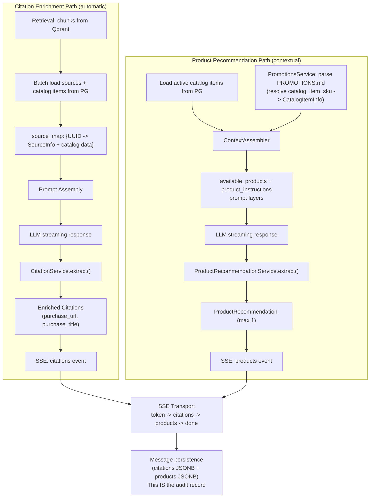

# S6-01: Commerce Backend — Catalog + Recommendations — Design

## Context

ProxyMind is a self-hosted digital twin. Phase 6 adds the commerce layer — the ability for the twin to naturally reference and recommend products owned by its prototype (books, courses, events, merch). This is the backend foundation; the frontend catalog UI is a separate story (S6-02).

**Current state:** The `CatalogItem` model exists since S1-02 with basic fields (`name`, `description`, `item_type`, `url`, `image_url`, `is_active`, `valid_from`, `valid_until`), but it has no SKU identifier, no CRUD API, and no integration with the dialogue circuit. The `Source.catalog_item_id` FK exists but has no `ondelete` behavior defined, creating a risk of orphaned references on catalog item deletion. The existing Admin API only exposes list and create endpoints for catalog items. The `Message` model has `citations: JSONB` but no field for product recommendations.

**Two delivery mechanisms** connect the catalog to the dialogue circuit, each serving a different use case:

1. **Citation enrichment (automatic).** When the LLM cites a source (`[source:N]`) and that source has a linked catalog item that is active and non-expired, the citation is automatically enriched with a `purchase_url`, `purchase_title`, and `catalog_item_type`. This is knowledge-driven: the user asked about a topic, the twin cited a source, and the source happens to be a product. No LLM involvement in the commercial decision.

2. **Product recommendations (contextual).** The LLM receives an `available_products` block in the system prompt (built from active catalog items matched to PROMOTIONS.md via SKU). If the conversation context makes a product recommendation natural, the LLM optionally places a `[product:N]` marker. The backend extracts the marker, resolves it to a catalog item, and delivers it as a structured SSE event. If the LLM decides no recommendation fits, nothing is forced. This is the hybrid marker strategy — consistent with the existing `[source:N]` citation pattern.

**Affected circuits:** Dialogue (prompt assembly, LLM output processing, SSE delivery, message persistence). No changes to the knowledge or operational circuits.

## Goals

- Full CRUD for `catalog_items` via Admin API (list, get, create, update, soft-delete) with SKU as the human-readable stable identifier
- Source re-linking via `PATCH /sources/:id` to connect/disconnect sources from catalog items
- Automatic citation enrichment: cited source with active linked catalog item gains purchase link fields
- `[product:N]` marker mechanism for contextual product recommendations, analogous to `[source:N]` for citations
- PROMOTIONS.md gains optional `Catalog item:` metadata for SKU-based matching to catalog items
- `ContextAssembler` extended with `available_products` and `product_instructions` prompt layers
- New SSE event `type: "products"` delivers recommended products between `citations` and `done`
- Product recommendations persisted as `products: JSONB` on the `Message` model (this IS the audit record — `recommended_product_ids` are derivable from the `products` array; no separate audit metadata structure is needed until S7-02 introduces a dedicated audit table)
- Max 1 product recommendation per response, enforced at both prompt and extraction levels

## Non-Goals

- **Database-stored promotions.** The plan states "files managed manually in v1." Moving promotions to the database is a separate concern, not part of this story.
- **Frontend catalog UI.** Deferred to S6-02. The backend delivers structured data; the frontend decides how to render product cards, "Buy" buttons, and recommendation styling.
- **Authentication and authorization.** Deferred to S7-01. Admin API continues with API key auth.
- **Product analytics dashboard.** S6-01 persists product recommendations in `Message.products` JSONB (from which `recommended_product_ids` are derivable) for future analytics but does not build any reporting surface. A dedicated audit table is deferred to S7-02.
- **Complex promotion targeting** (per-user, per-session, A/B testing). Out of scope for v1.
- **Multiple recommendations per response.** Explicitly capped at 1 to avoid ad-like behavior.

## Decisions

### D1: SKU field for PROMOTIONS.md matching

**Choice:** Add `sku: String(64), unique, not null, indexed` to `CatalogItem`. PROMOTIONS.md references catalog items by SKU in a `Catalog item:` metadata line.

**Rationale:** SKU is the practical middle ground for v1. It is human-readable for manual file editing (unlike UUID), stable across product renames (unlike name matching), and unique by definition. The owner writes `Catalog item: AI-PRACTICE-2026` in PROMOTIONS.md, and the backend resolves it to a catalog item.

**Alternatives rejected:**
- *UUID-based matching* -- reliable but unreadable in a hand-edited Markdown file.
- *Name-based matching* -- fragile; renaming a product silently breaks the link.

### D2: Hybrid [product:N] markers

**Choice:** LLM optionally places `[product:N]` markers when a recommendation is contextually appropriate. If the marker is present, the backend enriches it with the real product URL and metadata. If absent, no recommendation is delivered.

**Rationale:** Consistent with the existing `[source:N]` citation architecture. The LLM has autonomy to decide whether a recommendation fits the conversation. The anti-hallucination guarantee is preserved: the LLM never generates URLs; the backend substitutes real links from the catalog.

**Alternatives rejected:**
- *Mandatory markers (Option A)* -- forces the LLM to always use markers when products are in the prompt, producing unnatural text. Violates the verification criterion "not every response has a recommendation."
- *Pure metadata recommendations without markers (Option B)* -- no way to confirm the LLM actually mentioned the product. May produce irrelevant product cards below a message that does not discuss the product.

### D3: Citation enrichment as automatic

**Choice:** When a source has an active, non-expired linked `catalog_item` with a `url`, the citation built from that source automatically gains `purchase_url`, `purchase_title`, and `catalog_item_type` fields. No LLM involvement, no additional configuration.

**Rationale:** Zero-configuration. The existing `Source.catalog_item_id` FK is the sole trigger. Citation remains knowledge-first: `source_title` and `anchor` are primary; the purchase link is supplementary metadata. The frontend decides rendering (e.g., a "Buy" button next to the citation).

### D4: Citation takes priority over commercial link

**Choice:** Knowledge citations are primary; purchase links are supplementary metadata fields on the same citation object. The citation is not replaced or rewritten.

**Rationale:** The story explicitly states "citation takes priority over commercial link." A citation for "Clean Architecture, Chapter 5, p. 42" remains exactly that. The purchase URL is an additional field, not a replacement. If a source has both a `public_url` (original source) and a `catalog_item.url` (store link), both are provided and the frontend chooses what to display.

### D5: Max 1 recommendation enforced at prompt and extraction levels

**Choice:** Belt and suspenders. The prompt instructs "maximum one product recommendation per response." The extraction logic takes only the first valid `[product:N]` marker and discards the rest.

**Rationale:** Prompt-level instruction is the first gate. Extraction-level enforcement is the second gate for edge cases where the LLM places multiple markers despite instructions. Combined, they guarantee the verification criterion "not every response has a recommendation" and prevent ad-like stacking.

### D6: All active catalog items included in prompt

**Choice:** Every active, non-expired catalog item is included in the `available_products` prompt block. No filtering by relevance or topic.

**Rationale:** One twin = one prototype = small catalog (5-20 items typically). Token overhead is approximately 200-400 tokens for 10-20 items, which is negligible compared to the retrieval context budget. No filtering logic is needed at this scale.

### D7: SKU not found in DB produces warning, not error

**Choice:** When a PROMOTIONS.md section references a `Catalog item:` SKU that does not exist in the database, log a warning via structlog. The promotion works as text-only context (no `[product:N]` marker is assigned).

**Rationale:** Graceful degradation. The owner may have a typo, or the catalog item may not be created yet. The promotion still provides context hints to the LLM. Breaking the entire promotion system on a missing SKU would be disproportionate.

### D8: Soft delete keeps FK, ON DELETE SET NULL as safety net

**Choice:** Soft-deleting a catalog item (`is_active=false`, `deleted_at` set) does NOT nullify `source.catalog_item_id`. The FK remains intact. Citation enrichment and product recommendations are disabled by application-level filtering (`is_active` and `deleted_at` checks). `ON DELETE SET NULL` on the FK is retained as a safety net for potential future hard deletes only.

**Rationale:** Keeping the FK on soft delete is the safer, non-destructive default. Nullifying the FK would permanently sever audit context (which source was linked to which product at response time). Application-level filtering already prevents soft-deleted items from enriching citations (`_load_source_map` checks `catalog_active`) or appearing in recommendations (`get_active_items` filters by `deleted_at.is_(None)` and `is_active`). A restore/un-delete workflow is NOT part of S6-01 scope — if needed later, the preserved FK makes it straightforward to add.

**Important:** `ON DELETE SET NULL` is a PostgreSQL trigger that fires on SQL `DELETE`, not on soft delete via `deleted_at`. This is intentional — it guards against accidental hard deletes, not the normal soft-delete workflow.

### D9: New SSE event type "products"

**Choice:** A new `type: "products"` SSE event emitted after `citations`, before `done`. Only emitted when `[product:N]` markers were found and resolved.

**Rationale:** Product recommendations have a different data structure and different frontend rendering than citations. Mixing them into the `citations` event would complicate both the backend contract and the frontend parser. The event ordering `token -> citations -> products -> done` keeps each concern separated.

### D10: Source re-linking via PATCH

**Choice:** New `PATCH /api/admin/sources/:id` endpoint with `{ "catalog_item_id": "uuid | null" }` body. Uses `exclude_unset` Pydantic pattern: absent field means no change, explicit `null` means unlink, UUID means link.

**Rationale:** Upload-time linking (existing `catalog_item_id` on source upload) already works. PATCH enables linking existing sources without re-upload. The three-state semantics (absent/null/uuid) follow existing patterns in the codebase.

### D11: PATCH semantics, soft delete, pagination

**Choice:** Catalog CRUD follows existing admin API patterns: PATCH for partial update, soft delete (toggle `is_active`), pagination with `limit/offset`.

**Rationale:** No new patterns introduced. Consistent with batch-jobs list, source list, and snapshot list endpoints.

### D12: Products persisted as JSONB on Message model

**Choice:** Add `products: JSONB, nullable` to the `Message` model. Stores serialized `ProductRecommendation` list. This field IS the audit record for product recommendations — `recommended_product_ids` are derivable from the `catalog_item_id` field in each product object. No separate audit metadata structure is introduced; a dedicated audit table is planned for S7-02.

**Rationale:** Mirrors the existing `citations: JSONB` pattern. No separate table needed -- a message has zero or one product recommendations, stored inline. The audit trail enables future analytics: which products are recommended, how often, in what contexts.

**Alternatives rejected:**
- *Separate `message_products` table* -- over-engineered for a max-1-item list; adds a JOIN for every message load.
- *Store only in audit log, not on Message* -- forces frontend to cross-reference audit logs for history replay.

## Data Flow

Two independent delivery paths converge at the SSE transport layer:

### ContextAssembler dependency injection

`ContextAssembler` currently receives persona context and retrieval results. S6-01 extends it with `catalog_items: list[CatalogItemInfo] | None`. The `get_context_assembler()` factory in `dependencies.py` becomes async to load catalog items from PostgreSQL. This avoids passing the DB session into the assembler itself -- the dependency layer resolves external data before construction.

### Date vs datetime handling

The existing `CatalogItem` model stores `valid_from` and `valid_until` as `datetime`. The API schemas also use `datetime` to match the DB model exactly — no lossy conversion at the API boundary. Service-layer filtering (e.g., `filter_active()`) converts `datetime` to `date` via a `_to_date()` helper before comparing against `date.today()`. This isolates the conversion to one well-tested place and prevents type-mismatch errors in Python (which raises `TypeError` on direct `date` vs `datetime` comparison).

## Risks / Trade-offs

**[LLM may not follow product recommendation instructions consistently]** -- The LLM might never place `[product:N]` markers, or place them in every response, or use invalid indices. Mitigated at three levels: (1) prompt instructions set clear expectations and limits, (2) extraction silently ignores invalid indices, (3) the max-1 enforcement truncates excess markers. No error propagation from LLM non-compliance.

**[Products SSE event not handled until S6-02]** -- The frontend does not render product recommendations until S6-02. Until then, the `products` event is emitted but ignored by the client. This is acceptable: the `citations` event followed the same pattern (emitted in S4-03, rendered in S5-02).

**[SKU uniqueness migration on existing data]** -- If `catalog_items` rows exist without SKU values, the migration must backfill before adding the unique constraint. Mitigated by a two-step migration: (1) add nullable `sku` column, (2) backfill with `'LEGACY-' || id::text` (full UUID guarantees uniqueness), (3) set NOT NULL, (4) create unique index. Rollback drops the column cleanly.

**[PROMOTIONS.md format change is backward-compatible]** -- The new `Catalog item:` metadata line is optional. Existing PROMOTIONS.md files without it continue to work exactly as before. Promotions without a SKU reference provide text-only context hints.

**[ContextAssembler DI becomes async]** -- Changing `get_context_assembler()` to async adds a small coordination cost. Mitigated by keeping the pattern consistent with other async dependencies in the codebase. The catalog item query is a single indexed SELECT, adding negligible latency.

**[Soft-delete semantics for catalog items]** -- Soft-deleting a catalog item (setting `is_active=false`) stops citation enrichment and removes it from the products prompt. However, historical messages that already reference this product retain their persisted `products` JSONB. This is correct behavior: the message records what happened at response time.

## Migration Plan

Alembic migration 011 performs three changes in a single migration file:

1. **CatalogItem.sku column:**
   - `ADD COLUMN sku VARCHAR(64) NULL` (nullable initially)
   - Backfill existing rows: `UPDATE catalog_items SET sku = 'LEGACY-' || id::text WHERE sku IS NULL`
   - `ALTER COLUMN sku SET NOT NULL`
   - `CREATE UNIQUE INDEX ix_catalog_items_sku ON catalog_items (sku)`

2. **Source.catalog_item_id FK ondelete:**
   - Drop existing FK constraint
   - Re-create with `ON DELETE SET NULL`

3. **Message.products column:**
   - `ADD COLUMN products JSONB NULL`

**Backward compatibility:** All new fields are nullable or have defaults. The migration is additive -- no columns are removed or renamed. Rollback drops the new column and index, restoring the previous schema without data loss.
