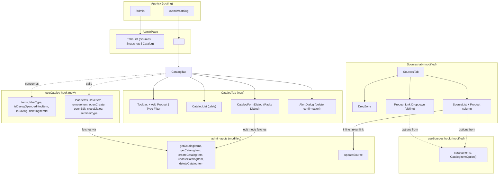

# S6-02: Admin UI — Product Catalog

## Context

S6-02 is a Phase 6 Commerce story. The commerce backend (S6-01) is complete: all catalog CRUD endpoints (`GET/POST/PATCH/DELETE /api/admin/catalog`) and source-linking endpoint (`PATCH /api/admin/sources/:id`) exist and are tested. This change is frontend-only.

The current Admin UI has two tabs (Sources, Snapshots) rendered as nested routes under `/admin`. State is managed through per-tab hooks (`useSources`, `useSnapshots`) with no global state layer. Components follow a consistent pattern: table layout, Radix UI primitives, Tailwind CSS styling, i18next translations.

Frontend stack: React 19, react-router v7, Radix UI, Tailwind CSS, i18next, Biome. No component library beyond Radix primitives and a small `components/ui` folder.

## Goals

- Admin can create, read, update, and soft-delete catalog items through a dedicated Catalog tab
- Admin can filter catalog items by `item_type` via a dropdown
- Admin can view linked sources in the catalog item edit dialog (read-only)
- Admin can link/unlink a catalog item to a source from the Sources tab (inline dropdown in source list, batch dropdown on upload)
- Stale catalog references (soft-deleted products still referenced by a source) display gracefully

## Non-Goals

- Full-text search in catalog
- Image upload (image_url remains a plain text field)
- Bulk operations (mass delete, mass link)
- Per-file product linking during batch upload (batch applies one product to all files)
- "Show inactive" toggle or viewing soft-deleted items
- Separate detail page or route for a catalog item
- Pagination (expected catalog size is 5-30 items)

## Decisions

### D1: Separate "Catalog" tab

**Decision:** Add a third top-level tab in `AdminPage`, not nested inside Sources.

**Rationale:** The product catalog is a distinct commerce domain. Three tabs (Sources, Snapshots, Catalog) map cleanly to content, versioning, and commerce. This pattern scales as future phases add more admin sections.

**Alternatives considered:** Nesting catalog management inside the Sources tab was rejected because it conflates two domains and would overcrowd the Sources UI.

### D2: Linking direction — mutation lives in Sources, read-only view in Catalog

**Decision:** The catalog item edit dialog shows linked sources as a read-only list. All link/unlink mutations happen in the Sources tab (inline dropdown per source row, batch dropdown on upload).

**Rationale:** The backend models the relationship as `source.catalog_item_id` (FK on Source). Mutating through Source is the natural direction matching the data model. Duplicating mutation controls in Catalog would create two edit paths for the same FK.

### D3: Flat form layout

**Decision:** All 8 fields (`sku`, `name`, `description`, `item_type`, `url`, `image_url`, `valid_from`, `valid_until`) visible in a single flat form inside the dialog.

**Rationale:** 8 fields is comfortable for a modal. Collapsing sections would hide commercially important fields. No progressive disclosure needed at this scale.

### D4: Table layout for catalog list

**Decision:** Desktop table with columns (Name, SKU, Type, Sources, Actions). Mobile card layout.

**Rationale:** Consistent with `SourceList` table pattern. Dense and scannable for the expected 5-30 item range.

### D5: Modal dialog for create/edit

**Decision:** Radix Dialog (not AlertDialog) for the create/edit form. No separate route.

**Rationale:** 8 fields fit in a dialog. Consistent with existing modal patterns. Admin stays in list context. No new routes required.

### D6: Soft delete with correct FK semantics

**Decision:** Delete button triggers an AlertDialog confirmation, then calls `DELETE /api/admin/catalog/:id` (soft delete). The confirmation message explicitly warns that the product will be deactivated and excluded from citations/recommendations.

**Critical detail:** Soft delete sets `deleted_at` + `is_active=false` on the catalog item. It does NOT null out `catalog_item_id` on linked sources. The FK `ondelete=SET NULL` only fires on physical row deletion, which soft delete does not trigger. Sources retain their stale reference. This is intentional: the admin can see which sources had a link and decide whether to unlink them manually.

### D7: Type filter dropdown only

**Decision:** Single dropdown filter by `item_type` (All / Book / Course / Event / Merch / Other). No text search, no status filter.

**Rationale:** A typical catalog has 5-30 items. Type filter is useful at 10+ items and maps directly to the backend's existing `item_type` query parameter. Text search is YAGNI.

### D8: Monolithic `useCatalog` hook

**Decision:** One hook (`useCatalog`) owns all catalog state and CRUD operations, following the `useSources` / `useSnapshots` pattern.

**Rationale:** Consistency with existing hooks. One tab = one hook. No Context provider or separate UI-state hook needed. The hook encapsulates loading, filtering, dialog state, and mutation logic.

### D9: Upload linking dropdown outside DropZone

**Decision:** The "Link to product" dropdown is placed as a sibling element outside the DropZone component, not embedded inside it.

**Rationale:** DropZone is a single clickable/droppable area. Embedding an interactive `<select>` inside it would create event conflicts (click on dropdown vs. click to open file picker). Sibling placement avoids this entirely.

### D10: Stale reference handling

**Decision:** If a source's `catalog_item_id` references a product not present in the active catalog items list (e.g., soft-deleted), the dropdown renders a fallback option displaying "(unknown product)" so the admin can see the stale link and unlink it.

**Rationale:** This is a frontend-only concern. No backend changes needed. Without the fallback, the dropdown would show no selection for a source that actually has a link, which is confusing and prevents unlinking.

### D11: Batch upload semantics

**Decision:** The product link selected during upload applies to all files in a single batch. Per-file linking is not supported during upload; the admin uses inline dropdowns in the source list after upload for per-file control.

**Rationale:** The upload flow sends files individually via `Promise.allSettled`, each with the same `SourceUploadMetadata`. Adding per-file product selection would require a file staging UI, which is out of scope.

## Component Architecture

### New files

| File                                                 | Responsibility                                                             |
| ---------------------------------------------------- | -------------------------------------------------------------------------- |
| `pages/AdminPage/CatalogTab.tsx`                     | Tab page: toolbar (add button + type filter) + list + dialog orchestration |
| `components/CatalogList/CatalogList.tsx`             | Table rendering: columns, type badges, empty state, mobile cards           |
| `components/CatalogFormDialog/CatalogFormDialog.tsx` | Radix Dialog: create/edit form (8 fields), linked sources list (edit mode) |
| `hooks/useCatalog.ts`                                | State + CRUD: loading, filtering, dialog state, create/update/delete       |

### Modified files

| File                                   | Change                                                                                                                                                                |
| -------------------------------------- | --------------------------------------------------------------------------------------------------------------------------------------------------------------------- |
| `App.tsx`                              | Add route `/admin/catalog` with `CatalogTab` element                                                                                                                  |
| `pages/AdminPage/AdminPage.tsx`        | Add third `TabsLink` for Catalog                                                                                                                                      |
| `pages/AdminPage/index.ts`             | Re-export `CatalogTab`                                                                                                                                                |
| `lib/admin-api.ts`                     | Add 5 catalog API functions + `updateSource()`                                                                                                                        |
| `types/admin.ts`                       | Add `CatalogItem`, `CatalogItemDetail`, `CatalogItemCreate`, `CatalogItemUpdate`, `CatalogItemType`, `CatalogItemListResponse`, `LinkedSource`, `SourceUpdateRequest` |
| `locales/en/admin.ts`                  | Add `catalog.*` i18n section                                                                                                                                          |
| `lib/i18n.ts`                          | Import new catalog translations if separate namespace needed                                                                                                          |
| `pages/AdminPage/SourcesTab.tsx`       | Add "Link to product" dropdown as sibling to DropZone                                                                                                                 |
| `components/SourceList/SourceList.tsx` | Add "Product" column with inline select dropdown, stale-reference fallback "(unknown product)", and clear/replace flow for soft-deleted links                        |
| `hooks/useSources.ts`                  | Fetch active catalog items on init, on Sources-view focus, on configurable polling (default 60s), and via manual retry; pass `catalog_item_id` in upload metadata |

## Data Flow

### Catalog CRUD

1. `CatalogTab` mounts, `useCatalog` fires `loadItems()` via `useEffect`
2. `loadItems()` calls `getCatalogItems(filterType)` which hits `GET /api/admin/catalog?item_type=X`
3. Create/edit: `CatalogFormDialog` collects form data, calls `saveItem(data)` on the hook
4. `saveItem` dispatches to `createCatalogItem` or `updateCatalogItem` based on `editingItem` presence, then refreshes the list and closes the dialog
5. Delete: `AlertDialog` confirmation triggers `removeItem(id)` which calls `deleteCatalogItem(id)`, then refreshes

### Source linking

1. `useSources` fetches active catalog items on init via `getCatalogItems()` (no filter), re-fetches them when the Sources view regains focus, on a configurable polling interval (default 60s), and when the UI invokes the exposed manual refresh action
2. Upload flow: `ProductDropdown` sets `catalog_item_id` on the shared upload metadata; `uploadFiles` passes it through `SourceUploadMetadata`
3. Source list: inline dropdown per row reads from the cached catalog items; selection calls `updateSource(sourceId, { catalog_item_id })` then refreshes sources. If catalog fetch fails, the dropdown shows a disabled "Failed to load products" state and the Sources tab exposes a retry control.
4. Stale reference: if `source.catalog_item_id` is not in the refreshed active catalog list, `SourceList` renders a fallback "(unknown product)" entry so the admin can see the stale link in the current value, then clear it or replace it with one of the refreshed active options

## Risks and Trade-offs

| Risk                                                  | Severity | Mitigation                                                                                                                                     |
| ----------------------------------------------------- | -------- | ---------------------------------------------------------------------------------------------------------------------------------------------- |
| Stale catalog reference after soft delete             | Low      | Frontend fallback "(unknown product)" option in dropdown; admin can unlink manually                                                            |
| DropZone event conflict with embedded controls        | Medium   | Dropdown placed as sibling outside DropZone (D9), not inside                                                                                   |
| Catalog items in `useSources` go stale during session | Low      | Mitigated by focus refresh, configurable 60s polling, and manual retry; stale soft-deleted links still render with a clear fallback             |
| No pagination in catalog list                         | Low      | Expected item count is 5-30; if catalogs grow past ~100, pagination should be added                                                            |
| Single monolithic hook grows complex                  | Low      | Current scope (6 state fields, 7 actions) is within the complexity budget of the existing hook pattern; extract if it exceeds ~15 state fields |

## Error Handling

| Scenario                             | HTTP Status | UI Behavior                                                                                  |
| ------------------------------------ | ----------- | -------------------------------------------------------------------------------------------- |
| SKU conflict on create/update        | 409         | Toast: "A product with this SKU already exists"                                              |
| Item not found (concurrent deletion) | 404         | Toast: "Product not found", refresh list                                                     |
| Network error                        | --          | Toast with generic error message                                                             |
| Validation error                     | 422         | Highlight invalid fields, show inline messages                                               |
| Soft delete of linked item           | 200         | AlertDialog warns about deactivation and citation/recommendation exclusion before confirming |

After every mutation (create, update, delete): refresh the catalog list. Same pattern as `useSources`.

## Testing Strategy

Component and hook tests using Vitest + React Testing Library:

- **CatalogList**: renders items in table, renders empty state, filters by type
- **CatalogFormDialog**: create mode (empty form, correct title/button), edit mode (pre-filled, linked sources list), validation (required fields, URL format, date ordering)
- **useCatalog**: CRUD operations with mocked API (create refreshes list, delete refreshes list, filter triggers reload)
- **Source linking dropdown**: renders with catalog items, renders "No products available" when empty, renders "(unknown product)" for stale references

Not in scope: E2E browser tests, backend tests (covered by S6-01).
