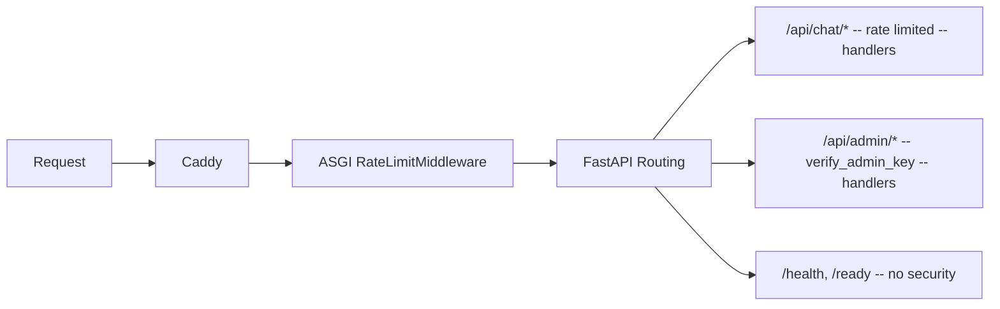

## Context

- ProxyMind is a self-hosted digital twin (FastAPI backend, Python).
- Admin API endpoints accumulated across Phases 2-6 with no authentication (three `TODO(S7-01)` comments in `admin.py`).
- Chat API has been public since S2-04 with no rate limiting.
- Redis is already running for the arq job queue and is available for rate limit counters.
- Caddy reverse proxy sits in front of the application, making `X-Forwarded-For` available on every request.
- Architecture requires admin auth and visitor identity to remain decoupled so future channel connectors (S11-01) can introduce their own identity model independently.

## Goals / Non-Goals

### Goals

- Protect admin API with Bearer token authentication (API key loaded from `.env`).
- Protect chat API with Redis-based sliding window rate limiting (per IP).
- Make all security parameters configurable via `.env`: `ADMIN_API_KEY`, `CHAT_RATE_LIMIT`, `CHAT_RATE_WINDOW_SECONDS`, `TRUSTED_PROXY_DEPTH`.
- Secure-by-default: admin API returns 503 when key is not configured.
- Fail-open on Redis failure for rate limiting so chat never breaks due to a Redis outage.

### Non-Goals

- OAuth / JWT authentication (future phases).
- Visitor identity or registration (S11-01).
- CORS or HTTPS configuration (handled by Caddy).
- Rate limiting the admin API (already protected by API key).
- Multiple API keys (trivial to add later, YAGNI).
- Service endpoint protection (`/health`, `/ready`, `/metrics`).

## Decisions

### D1: Admin auth mechanism -- FastAPI Security dependency

**Chosen:** `Security(HTTPBearer(auto_error=False))` on the admin router.

**Rationale:** Provides native OpenAPI integration, meaning Swagger UI shows a lock icon and an Authorize button for every protected endpoint. The dependency function validates the token and raises the appropriate HTTP error, keeping auth logic centralized.

**Alternatives considered:**

- ASGI middleware -- intercepts too early, no OpenAPI integration, cannot distinguish admin routes from others without duplicating routing logic.
- Custom header check -- non-standard pattern, no Swagger integration, harder for consumers to discover.

### D2: Rate limiting layer -- Pure ASGI middleware

**Chosen:** Pure ASGI middleware (not `BaseHTTPMiddleware`) applied in `main.py`.

**Rationale:** `BaseHTTPMiddleware` wraps response bodies, which breaks SSE streaming used by chat endpoints. A pure ASGI middleware passes the ASGI `send` callable through unmodified, preserving streaming behavior. Middleware also intercepts before routing and deserialization, rejecting abusive requests early and saving resources.

**Alternatives considered:**

- `BaseHTTPMiddleware` -- simpler API, but wraps the response body and breaks SSE streaming.
- FastAPI dependency -- executes after routing and request parsing, wasting resources on requests that should be rejected immediately.

### D3: Rate limit algorithm -- Sliding window counter

**Chosen:** Sliding window counter using two adjacent Redis windows with weighted interpolation.

**Rationale:** Balances simplicity (two Redis commands per request, pipelined) and correctness (no burst-at-boundary problem). Weighted count = `previous_count * (1 - elapsed_fraction) + current_count`. Redis keys: `ratelimit:{ip}:{window_start}` with auto-expiry.

**Alternatives considered:**

- Fixed window -- allows burst-at-boundary (2x limit in a short span when windows rotate).
- Token bucket -- more complex state management with no practical benefit for this use case.

### D4: Rate limit key -- IP address only

**Chosen:** Client IP address as the sole rate limit key.

**Rationale:** Simplest and most robust approach for a public API without user authentication. Session IDs can be trivially rotated to bypass limits. A generous default of 60 requests per minute mitigates the NAT-sharing problem where multiple legitimate users share one IP.

**Alternatives considered:**

- IP + session -- session is easily rotated, adding complexity without security benefit.
- Session only -- trivially bypassed by creating new sessions.

### D5: IP extraction -- TRUSTED_PROXY_DEPTH from X-Forwarded-For

**Chosen:** The default deployment model is **single trusted proxy** (Caddy). The rate limiter reads the client IP set by Caddy in `X-Forwarded-For`. `TRUSTED_PROXY_DEPTH` (default 1) is retained for non-standard setups but the documented and tested model is single proxy. Formula: `parts[len(parts) - depth - 1]`. Falls back to ASGI scope `client` when no `X-Forwarded-For` is present.

**Prerequisite:** Caddy MUST overwrite the incoming `X-Forwarded-For` header with the direct peer IP rather than appending to a client-supplied value. Without this, clients can spoof XFF to bypass rate limiting. Caddy configuration for the reverse proxy block: `header_up X-Forwarded-For {remote_host}`. This prerequisite MUST be documented in `.env.example` and as a comment in `Caddyfile`.

**Rationale:** A single-proxy deployment is the standard ProxyMind setup. Multi-hop trusted proxy chains (CloudFlare → Caddy → FastAPI) are a niche edge case that adds significant complexity to both documentation and security guarantees. Users with multi-hop setups can adjust `TRUSTED_PROXY_DEPTH` but must understand the XFF sanitization requirements of their specific chain.

**Alternatives considered:**

- Take rightmost entry -- returns the proxy IP in multi-hop setups, not the client IP.
- Take leftmost entry -- trivially spoofable by clients.
- CIDR-based trust (like nginx `set_real_ip_from`) -- more robust for multi-hop but significantly more complex for a single-proxy deployment. Can be added later if needed.

### D6: Missing admin key behavior -- Fail-safe (503)

**Chosen:** Admin API returns 503 Service Unavailable when `ADMIN_API_KEY` is not configured (None or empty).

**Rationale:** Secure-by-default. The application starts normally so health checks and chat continue working, but admin endpoints are locked until the owner consciously sets a key. Prevents accidental deployment without protection.

**Alternatives considered:**

- Fail-open -- insecure, defeats the purpose of adding auth.
- Block startup -- breaks `docker-compose up` for first-time users who have not yet configured `.env`.

### D7: Redis failure in rate limiting -- Fail-open

**Chosen:** If Redis is unreachable during a rate limit check, allow the request through and log a warning via structlog.

**Rationale:** Rate limiting is a defense mechanism, not a correctness requirement. Chat should not break because Redis is temporarily down. The warning log provides operational visibility.

**Alternatives considered:**

- Fail-closed -- makes chat availability dependent on Redis, which is an unacceptable coupling for a defense-in-depth control.

### D8: API key comparison -- Timing-safe

**Chosen:** `secrets.compare_digest()` for API key validation.

**Rationale:** Prevents timing attacks that could leak key bytes through response-time analysis. Standard practice for secret comparison. Zero additional dependencies (stdlib).

## Request Flow

## Risks / Trade-offs

- **NAT sharing.** Multiple users behind the same IP share a single rate limit counter. Mitigated by a generous default (60 requests per minute) and configurability via `.env`.
- **IP spoofing.** A client can prepend fake entries to `X-Forwarded-For` before reaching trusted proxies. `TRUSTED_PROXY_DEPTH` alone does NOT prevent this — it only works correctly when the outermost trusted proxy (Caddy) overwrites the incoming XFF header. Mitigated by documenting the Caddy configuration prerequisite in `.env.example` and as a comment in `Caddyfile`. Without proper Caddy config, rate limiting can be bypassed by XFF spoofing (impact: rate limit evasion only, not auth bypass).
- **Key rotation requires restart.** Changing `ADMIN_API_KEY` takes effect only after an application restart. Acceptable for a v1 self-hosted deployment; future enhancement could support hot reload via signal.
- **Test fixture cascade.** Adding auth to admin routers breaks all existing admin integration tests. Mitigated by updating `conftest.py` fixtures to include `TEST_ADMIN_API_KEY` and injecting auth headers into test clients.
- **SSE compatibility.** Middleware must not wrap the response body or SSE streaming in chat endpoints will break. Mitigated by using pure ASGI middleware instead of `BaseHTTPMiddleware`.

## Component Overview

### New files

| File                                   | Purpose                                                  |
| -------------------------------------- | -------------------------------------------------------- |
| `backend/app/api/auth.py`              | `verify_admin_key` FastAPI dependency using `HTTPBearer` |
| `backend/app/middleware/rate_limit.py` | `RateLimitMiddleware` pure ASGI middleware for chat API  |
| `backend/app/middleware/__init__.py`   | Package init                                             |

### Modified files

| File                         | Change                                                                                             |
| ---------------------------- | -------------------------------------------------------------------------------------------------- |
| `backend/app/core/config.py` | Add `ADMIN_API_KEY`, `CHAT_RATE_LIMIT`, `CHAT_RATE_WINDOW_SECONDS`, `TRUSTED_PROXY_DEPTH` settings |
| `backend/app/main.py`        | Mount `RateLimitMiddleware` on the ASGI app                                                        |
| `backend/app/api/admin.py`   | Wire `verify_admin_key` dependency to admin router, remove `TODO(S7-01)` comments                  |
| `backend/app/api/profile.py` | Wire `verify_admin_key` dependency to admin profile router                                         |
| `backend/tests/conftest.py`  | Add `TEST_ADMIN_API_KEY` and auth headers to admin test fixtures                                   |
