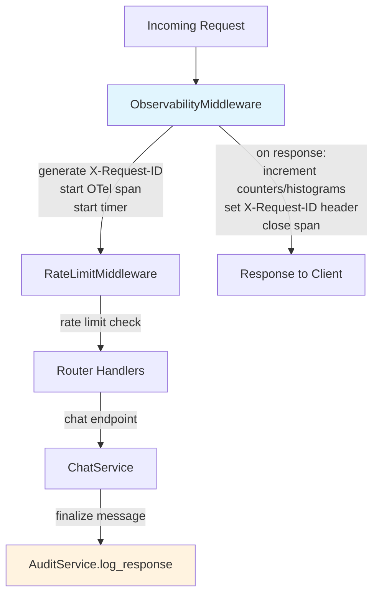
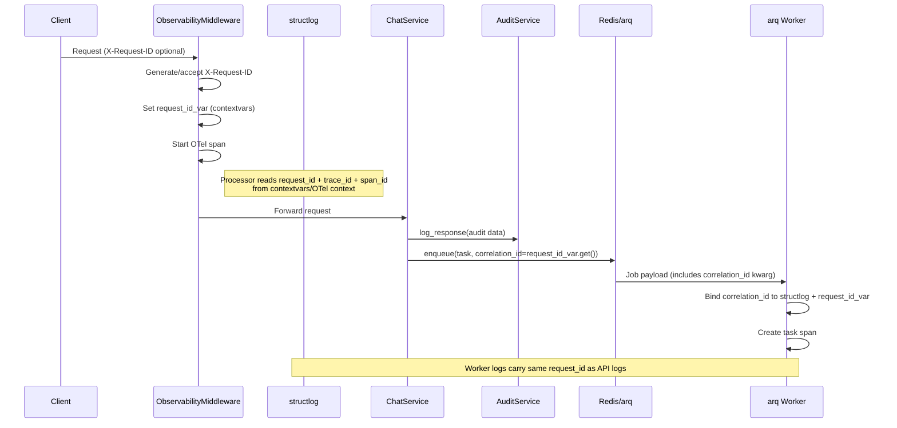
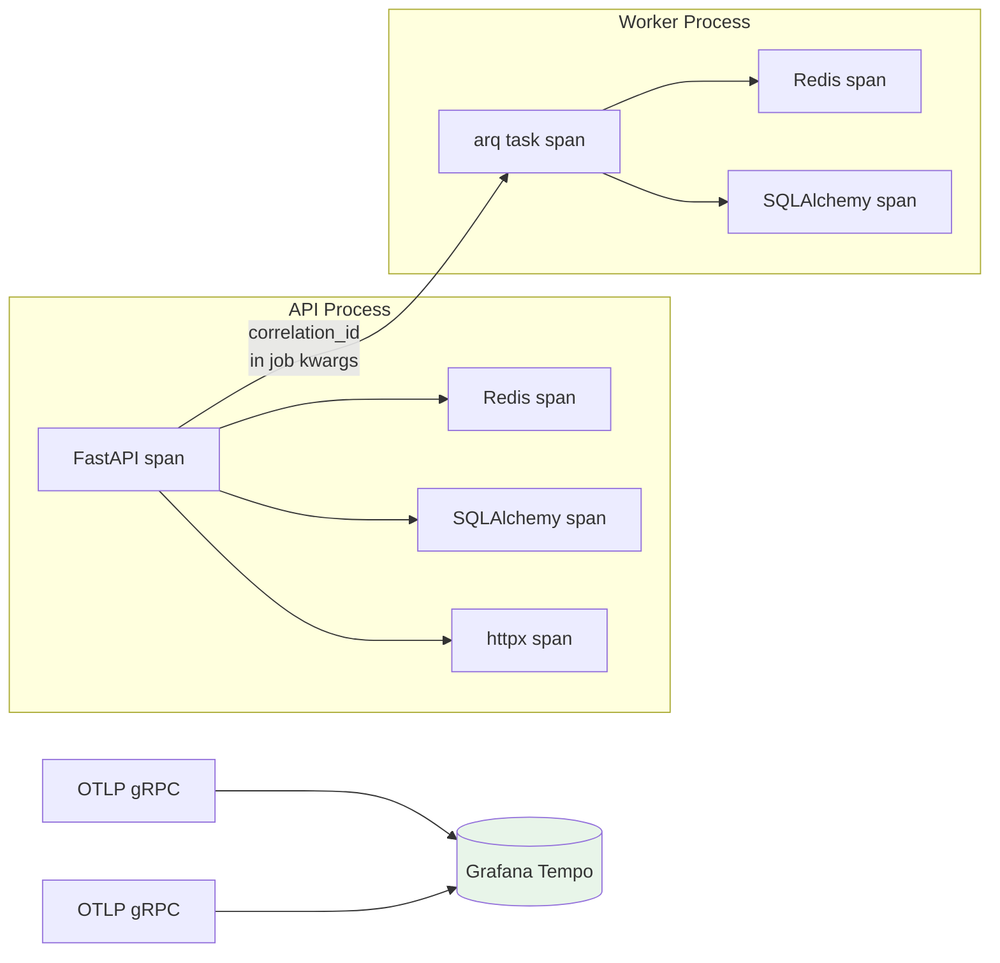

## Context

**Story S7-02** from `docs/plan.md`: Observability -- audit logging + monitoring. Conversation produces audit records with full data (snapshot_id, source_ids, config hashes, token counts, latency). Dashboard shows system metrics. Correlated request traces visible in Grafana (API and worker are separate trace trees linked by correlation_id).

This change lives in the **operational circuit**. It makes the system observable by wiring up the existing-but-unused `audit_logs` table, adding Prometheus metrics, OpenTelemetry tracing, and correlation IDs that link logs across the full request lifecycle. The **dialogue circuit** is touched only at chat finalization points (audit writes). The **knowledge circuit** is unaffected.

**Current state:**

- `audit_logs` model exists in the database (migration 001) but no code writes to it.
- structlog is configured for JSON output but carries no correlation IDs (no request_id, no trace_id, no span_id).
- No metrics endpoint, no Prometheus counter/histogram definitions.
- No distributed tracing. No OTel SDK initialization.
- No monitoring services (Prometheus, Grafana, Tempo) in docker-compose.
- Config hashes (`config_commit_hash`, `config_content_hash`) are already computed by `PersonaLoader` and stored on every assistant message via `PersonaContext`.

**Note on sources of truth:** The OpenSpec specs within this change are the authoritative requirements. The brainstorming-phase document `docs/superpowers/specs/2026-03-28-s7-02-observability-design.md` is historical context with extended rationale -- in case of conflict, the OpenSpec specs take precedence.

## Goals / Non-Goals

**Goals:**

- Write audit records to `audit_logs` for every chat response at all terminal states (complete, partial, failed) with full reproducibility data: snapshot_id, source_ids, config_commit_hash, config_content_hash, token counts, latency_ms.
- Define and expose Prometheus metrics (request rate, error rate, latency percentiles, chat response counters, rate limit hits, queue depth, audit activity) via `GET /metrics`.
- Initialize OpenTelemetry tracing with OTLP/gRPC export to Grafana Tempo. Auto-instrument FastAPI, httpx, SQLAlchemy, Redis.
- Generate and propagate `X-Request-ID` correlation IDs across the full request lifecycle, including into arq worker tasks.
- Inject `request_id`, `trace_id`, and `span_id` into every structlog entry to link logs with traces.
- Provision Prometheus, Grafana, and Tempo as Docker Compose services with auto-provisioned data sources and a pre-built dashboard.

**Non-Goals:**

- Alerting rules -- dashboard is sufficient for a single-instance self-hosted product.
- Log aggregation via Loki -- structured logs go to stdout, viewable via `docker compose logs`.
- Infrastructure metrics (PostgreSQL connections, Redis memory, Qdrant collection size) -- easy to add later; not needed on day one.
- OTel Collector sidecar -- direct export is sufficient at current scale.
- Major schema changes -- only one small migration (add `status` column to existing `audit_logs` table).

## Decisions

### D1: Grafana Tempo for tracing (not Jaeger)

Grafana is already being added for dashboards. Tempo gives unified observability (metrics + traces + dashboards) within one UI, avoiding a separate Jaeger interface. Tempo runs in monolithic mode -- single container, local disk storage, zero external dependencies.

### D2: Direct OTLP exporter (no OTel Collector)

YAGNI. One API process + one worker -- a Collector adds a container with no benefit at this scale. The API and worker export spans directly to Tempo via OTLP/gRPC. If the system grows to multiple instances, adding a Collector later is a configuration change, not a code change.

### D3: Layered middleware (ObservabilityMiddleware + AuditService)

Two layers, each with a single responsibility:

1. **ObservabilityMiddleware** -- request-level: correlation ID generation/propagation, OTel span creation, Prometheus request metrics, latency measurement. Wraps all requests including rate-limited ones.
2. **AuditService** -- domain-level: writes audit records with full reproducibility data after chat response finalization.

This separation keeps request-level telemetry (generic, all endpoints) cleanly decoupled from domain-level audit logging (chat-specific, business data).

### D4: Audit after SSE stream finalization (not async)

All domain data needed for the audit record (source_ids, token counts, latency_ms, snapshot_id) is available at message finalization. A single INSERT after finalization is simpler and more reliable than background processing. No risk of lost audit records from worker failures.

### D5: Minimal dashboard scope (set A)

Single-instance self-hosted product. Adding metrics later is trivial. Overloading the dashboard on day one is an anti-pattern. The dashboard covers: request rate, error rate, latency percentiles, chat response counts by status, rate limit hits, queue depth, audit activity, and service health.

### D6: Config hashes from existing PersonaContext (no new ConfigHasher)

Config hashes are already computed by `PersonaLoader` and available via `PersonaContext.config_commit_hash` and `PersonaContext.config_content_hash`. AuditService reads these from the same `PersonaContext` instance used by ChatService. No new abstraction needed.

### D7: arq correlation via regular kwargs (not ctx injection)

When the API enqueues an arq job, it passes `correlation_id=request_id_var.get()` as a regular keyword argument. arq serializes kwargs into the job payload; the worker task receives `correlation_id` as a function kwarg. arq's `ctx` dict is worker-constructed only and cannot carry caller-side data. If no correlation ID is present (cron-triggered tasks), the worker generates its own.

### D8: OTel instrumentors use global monkey-patching, called before client/engine creation

Auto-instrumentors for FastAPI, httpx, SQLAlchemy, and Redis use global monkey-patching. They must be called during application startup, before any HTTP clients or database engines are created. This is standard OTel practice and ensures all I/O is traced without explicit per-call instrumentation.

### D9: Audit covers ALL terminal states with explicit literal values

Every chat response finalization writes an audit record, regardless of outcome. Partial responses (client disconnect) and failures are as important for debugging and compliance as successful completions. The `status` field stores one of three literal values: `complete` for a fully finalized assistant response, `partial` for a client disconnect after partial generation, and `failed` for an internal failure or timeout.

### D10: Logging -- single init point in worker on_startup (not duplicated in run.py)

Worker telemetry (structlog configuration, OTel TracerProvider) is initialized once in `on_startup` of `backend/app/workers/main.py` with `service.name=proxymind-worker`. Shutdown in `on_shutdown`. This avoids duplicate initialization that could occur if both `run.py` and `main.py` set up logging.

## Architecture

### Middleware order

ObservabilityMiddleware is the outermost layer -- it wraps everything, including rate-limited requests. It reads the normalized route template from `request.scope["route"]` when available and falls back to the raw path only when the router has not resolved a template yet. This ensures requests are counted under stable Prometheus labels even when the original URL contains UUID segments.

### Correlation ID flow

### Trace flow

Note: API and worker traces are separate trace trees (arq does not propagate OTel trace context). They are correlated via the shared `correlation_id` / `request_id` in structlog entries.

## Component Summary

### New files

| File                                                          | Purpose                                                              |
| ------------------------------------------------------------- | -------------------------------------------------------------------- |
| `backend/app/services/audit.py`                               | AuditService -- writes audit_logs records                            |
| `backend/app/services/metrics.py`                             | Prometheus metric definitions (Counter, Histogram, Gauge)            |
| `backend/app/api/metrics.py`                                  | `GET /metrics` endpoint with private-network / bearer access control |
| `backend/app/middleware/observability.py`                     | ObservabilityMiddleware (request ID, OTel span, request metrics)     |
| `backend/app/services/telemetry.py`                           | OTel TracerProvider setup with OTLP/gRPC exporter                    |
| `monitoring/prometheus/prometheus.yml`                        | Scrape config: api:8000/metrics, 15s interval                        |
| `monitoring/tempo/tempo.yml`                                  | Monolithic mode, local storage, internal-only OTLP gRPC receiver     |
| `monitoring/grafana/provisioning/datasources/datasources.yml` | Prometheus + Tempo data sources                                      |
| `monitoring/grafana/provisioning/dashboards/dashboards.yml`   | Dashboard provider pointing to JSON files                            |
| `monitoring/grafana/dashboards/proxymind-overview.json`       | Main dashboard (set A metrics)                                       |

### Modified files

| File                                   | Change                                                                                   |
| -------------------------------------- | ---------------------------------------------------------------------------------------- |
| `backend/app/main.py`                  | Add ObservabilityMiddleware, harden telemetry lifecycle, add metrics router              |
| `backend/app/core/config.py`           | Add OTEL_ENABLED, OTEL_EXPORTER_OTLP_ENDPOINT, OTEL_SERVICE_NAME settings                |
| `backend/app/core/logging.py`          | Add structlog processors for request_id, trace_id, span_id injection                     |
| `backend/app/services/chat.py`         | Call AuditService.log_response() at all terminal states; require AuditService            |
| `backend/app/middleware/rate_limit.py` | Increment rate_limit_hits_total counter on rejection                                     |
| `backend/app/api/dependencies.py`      | Wire AuditService into ChatService; pass correlation_id on arq enqueue                   |
| `backend/app/workers/main.py`          | Init/shutdown telemetry in on_startup/on_shutdown; preserve explicit session factory key |
| `backend/app/db/models/operations.py`  | Add validated `status` column to `AuditLog` model                                        |
| `backend/migrations/versions/*.py`     | Alembic migration adding and backfilling `audit_logs.status`                             |
| `backend/pyproject.toml`               | Add prometheus-client, opentelemetry-api/sdk/exporter-otlp, 4 instrumentor packages      |
| `docker-compose.yml`                   | Add prometheus, grafana, tempo services with monitoring volumes and named volumes        |

### Prometheus metrics (set A)

| Metric                          | Type      | Labels                    | Source                         |
| ------------------------------- | --------- | ------------------------- | ------------------------------ |
| `http_requests_total`           | Counter   | method, path, status_code | ObservabilityMiddleware        |
| `http_request_duration_seconds` | Histogram | method, path              | ObservabilityMiddleware        |
| `chat_responses_total`          | Counter   | status                    | ChatService                    |
| `chat_response_latency_seconds` | Histogram | --                        | ChatService                    |
| `rate_limit_hits_total`         | Counter   | --                        | RateLimitMiddleware            |
| `arq_queue_depth`               | Gauge     | --                        | Periodic probe or enqueue hook |
| `audit_logs_total`              | Counter   | --                        | AuditService                   |

### Docker Compose additions

| Service    | Image                     | Ports | Purpose                                        |
| ---------- | ------------------------- | ----- | ---------------------------------------------- |
| prometheus | `prom/prometheus:v3.10.0` | 9090  | Metrics scraping and storage                   |
| grafana    | `grafana/grafana:12.4.1`  | 3000  | Dashboards and trace visualization             |
| tempo      | `grafana/tempo:2.10.3`    | 3200  | Trace storage; OTLP gRPC remains internal only |

### OTel configuration

| Variable                      | Default             | Description                                                                                                                                         |
| ----------------------------- | ------------------- | --------------------------------------------------------------------------------------------------------------------------------------------------- |
| `OTEL_ENABLED`                | `false`             | Kill switch for tracing. Default off to avoid noisy errors without Tempo. Set `OTEL_ENABLED=true` in docker-compose environment for api and worker. |
| `OTEL_EXPORTER_OTLP_ENDPOINT` | `http://tempo:4317` | Tempo gRPC endpoint. `services/telemetry.py` normalizes the URL to `tempo:4317` before passing it to the Python gRPC exporter.                      |
| `OTEL_SERVICE_NAME`           | `proxymind-api`     | Service identifier (worker uses `proxymind-worker`)                                                                                                 |

## Risks / Trade-offs

| Risk                                                                                                         | Mitigation                                                                                                                                                                                                               |
| ------------------------------------------------------------------------------------------------------------ | ------------------------------------------------------------------------------------------------------------------------------------------------------------------------------------------------------------------------ |
| **Direct export to Tempo** -- no buffering if Tempo is down; spans are lost                                  | Acceptable for single-instance. BatchSpanProcessor provides in-process buffering. If Tempo restarts, only spans during downtime are lost. Adding an OTel Collector later is a config change.                             |
| **No trace context propagation through arq** -- API and worker traces are separate trace trees               | Correlated via shared `correlation_id` in structlog. Full distributed tracing across the queue boundary would require custom W3C trace context serialization in arq kwargs -- complexity not justified at current scale. |
| **Prometheus metrics cardinality** -- `path` label on HTTP metrics could explode with dynamic path segments  | Normalize paths to route templates (e.g., `/api/chat/sessions/:id` not `/api/chat/sessions/abc-123`). FastAPI provides route info on the request object.                                                                 |
| **Grafana provisioned dashboard becomes stale** -- dashboard JSON must be manually updated as metrics evolve | Dashboard is version-controlled in `monitoring/grafana/dashboards/`. Changes go through normal PR review. Grafana UI edits are overwritten on restart (provisioned mode).                                                |
| **Additional Docker containers increase resource usage** -- three new services (Prometheus, Grafana, Tempo)  | All three are lightweight in monolithic/single-instance mode. Prometheus and Tempo use local disk. Grafana is stateless beyond its SQLite DB. Total additional RAM is modest (~200-300 MB combined).                     |

## Migration Plan

One small migration required: add a validated `status` column to the existing `audit_logs` table, backfill existing rows to `complete`, and then remove the server default. Most runtime changes are additive, but two operational expectations change: ChatService now requires an AuditService instance, and `/metrics` is no longer public.
