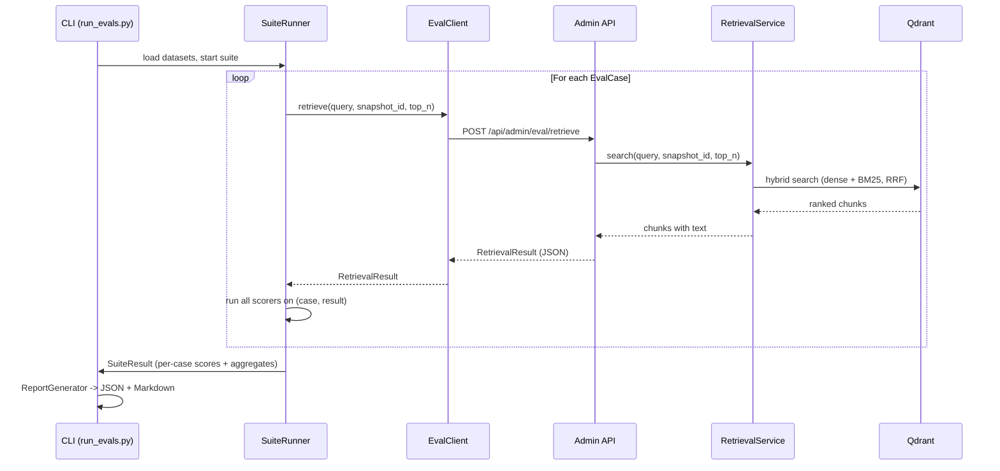

# S8-01: Eval Framework -- Design

## Context

ProxyMind defines two testing tracks (see `docs/spec.md`, `docs/rag.md`): deterministic CI tests that block deployment, and quality evals on real models that run separately. CI tests exist and cover unit/integration behavior. Quality evals do not exist yet -- there is no infrastructure to measure retrieval quality (Precision@K, Recall@K, MRR) or to establish baselines for future answer metrics.

Without evals, Phase 9 upgrade decisions (chunk enrichment, parent-child chunking, BGE-M3 fallback) would be guesswork. This change delivers the eval infrastructure so that quality can be measured before and after every change to the retrieval pipeline.

### Architecture impact

This change affects the **operational circuit** by adding a new admin eval endpoint behind the existing admin API key middleware (S7-01). The **dialogue circuit** and **knowledge circuit** remain unchanged. No existing endpoints, services, or data flows are modified.

The eval framework itself (`backend/evals/`) is a standalone tool that lives outside the application package. It runs in the `backend-test` container against a live stack, exercising the system end-to-end via HTTP -- it is not part of the runtime image.

## Goals / Non-Goals

### Goals

- Deliver a CLI-based eval runner that produces retrieval quality metrics (Precision@K, Recall@K, MRR).
- Define a YAML dataset format with ground truth based on `source_id` + text substring matching.
- Provide a pluggable scorer pipeline with a protocol that S8-02 can extend (LLM-as-judge) without changing the runner.
- Add a dedicated admin eval endpoint (`POST /api/admin/eval/retrieve`) that exposes raw retrieval results for scoring.
- Generate machine-readable (JSON) and human-readable (Markdown) reports per eval run.

### Non-Goals

- LLM-as-judge scorers, answer metrics (Groundedness, Citation accuracy, Persona fidelity, Refusal quality) -- deferred to S8-02.
- Eval via chat API with SSE streaming -- deferred to S8-02 (needed for answer evals).
- Parallel eval case execution, comparison reports, Gemini Batch API integration.
- CI integration or automated scheduling of eval runs.
- Threshold-based pass/fail verdicts -- evals produce metrics, not pass/fail.

## Decisions

### 1. CLI entry point, not pytest

Evals are not tests -- they produce metrics and reports, not pass/fail verdicts. A separate CLI entry point (`python -m evals.run_evals`) reinforces the CI/evals boundary defined in the architecture. The CLI is also easier to extend for Gemini Batch API usage in S8-02.

### 2. YAML dataset format

Eval datasets contain multiline prompts, expected answers, and descriptive annotations. YAML supports comments, multiline strings natively, and is human-readable without escaping. Datasets are stored in-repo (`backend/evals/datasets/`) because they are small (dozens of cases) and benefit from git versioning for reproducibility.

### 3. source_id + text substring ground truth

Each expected chunk is identified by `source_id` (permanent, survives reindexing) plus a `contains` substring (survives re-chunking). This is more precise than `source_id` alone and avoids dependency on volatile `chunk_id` values. Matching logic: `returned.source_id == expected.source_id` AND `expected.contains in returned.text` (case-insensitive).

### 4. Pluggable scorer pipeline

Four components with clear responsibilities:

| Component | Responsibility |
|-----------|---------------|
| **Dataset loader** | Parses YAML, validates schema with Pydantic models |
| **Suite runner** | Orchestrates API calls per eval case, collects raw results |
| **Scorer registry** | Set of scorers implementing a common `Scorer` protocol |
| **Report generator** | Transforms scored results into JSON + Markdown |

The scorer protocol is a simple interface: `name: str` and `score(case, result) -> ScorerOutput`. S8-01 ships three retrieval scorers; S8-02 adds LLM-judge scorers through the same protocol without runner changes.

### 5. Dedicated admin eval endpoint

A new `POST /api/admin/eval/retrieve` endpoint calls `RetrievalService.search()` directly -- no LLM call, no chat session. It returns ranked chunks with full text to enable `contains` matching. This keeps the chat API clean (no debug parameters). The endpoint is protected by the existing admin API key middleware from S7-01. `top_n` defaults to 5, independent of the backend's `retrieval_top_n` setting.

### 6. HTTP API interaction (end-to-end)

Evals exercise the system as users see it. The eval client sends HTTP requests to the running API, catching integration bugs that unit tests miss. Docker Compose provides the full stack. This enforces a clear separation between the eval framework (client) and the system under test (server).

### 7. LLM-as-judge deferred to S8-02

S8-01 scope is infrastructure: dataset format, runner, scorer protocol, report generator. S8-02 will define eval prompts, scoring rubrics, and the human review process. The scorer protocol in S8-01 provides the extension point.

### 8. Execution environment

Evals run in the `backend-test` container, not in the `api` or `worker` containers. This keeps the eval tooling out of the production runtime image while giving it access to the same Python environment and network.

## Data Flow



Execution is sequential (one request at a time). If an API call fails, the case is marked as `error` with the exception message and the runner continues with remaining cases.

## Directory Structure

```
backend/
  evals/
    __init__.py
    run_evals.py           # CLI entry point (argparse)
    config.py              # EvalConfig (Pydantic): base_url, admin_key, top_k, output_dir
    loader.py              # YAML dataset loader + Pydantic validation
    runner.py              # SuiteRunner: orchestrates API calls, collects raw results
    client.py              # EvalClient: async HTTP client for eval admin endpoints
    report.py              # ReportGenerator: JSON + Markdown output
    scorers/
      __init__.py          # Scorer protocol + registry
      precision.py         # PrecisionAtK
      recall.py            # RecallAtK
      mrr.py               # MRR
    datasets/
      retrieval_basic.yaml # Seed dataset (demo/smoke)
    reports/               # Generated reports (gitignored)
      .gitkeep
  app/
    api/
      admin_eval.py        # POST /api/admin/eval/retrieve
```

- `evals/` is top-level in `backend/`, not inside `app/` -- it is a tool, not part of the application.
- `evals/reports/` is gitignored; `evals/datasets/` is versioned.
- `admin_eval.py` follows existing API file patterns (no `v1` prefix).

## Testing Approach

- **Scorer algorithms** (Precision@K, Recall@K, MRR): unit tests with known inputs and expected outputs. These are deterministic pure functions -- straightforward to test exhaustively.
- **Dataset loader**: unit tests verifying Pydantic validation accepts valid YAML and rejects malformed datasets.
- **Report generator**: unit tests verifying JSON structure and Markdown output from known `SuiteResult` inputs.
- **Admin eval endpoint**: unit tests with mock `RetrievalService` via FastAPI `ASGITransport`, verifying response structure, admin Bearer auth requirement, request validation (empty query, invalid snapshot_id, top_n out of range), and correct field mapping.
- **Suite runner**: tested via the above components. End-to-end eval runs serve as the integration test for the runner itself.

## Risks / Trade-offs

| Risk | Mitigation |
|------|------------|
| Sequential execution is slow for large datasets | Acceptable for S8-01 (dozens of cases). Parallelization via `asyncio.gather` with a concurrency limit can be added later without architectural changes. |
| Eval results depend on snapshot state | Dataset YAML includes `snapshot_id`; CLI allows override via `--snapshot-id`. Reports record the snapshot used for reproducibility. |
| `contains` substring matching may produce false positives | Case-insensitive substring is a pragmatic balance. If precision becomes an issue, the `ExpectedChunk` model can be extended with stricter matching modes in a future change. |
| YAML datasets in-repo may not scale | At dozens of cases this is fine. Git versioning ensures reproducibility. Externalization is straightforward if needed (YAGNI). |

## Dependencies

- `pyyaml>=6.0.2` -- new dependency for YAML dataset parsing, added to `backend/pyproject.toml`.
- `httpx` -- already in dev dependencies.
- `pydantic` -- already a runtime dependency.

No other new dependencies required.

## Open Questions

None -- all design decisions are resolved. Extension points for S8-02 (LLM-as-judge scorers, answer metrics) are accounted for via the scorer protocol.
