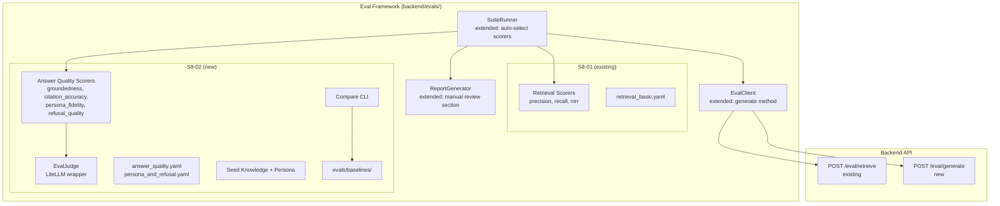
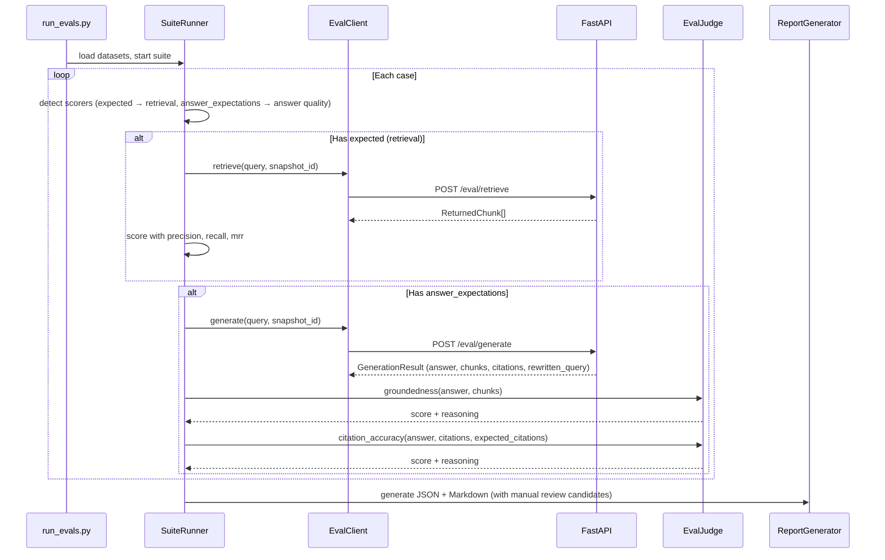

# S8-02: Eval Runs + Upgrade Decision — Design

## Story

> Report with retrieval + answer metrics. Baseline recorded. Decision document supported by data.

**Outcome:** The owner has quantitative metrics for both retrieval and answer quality, a recorded baseline, and a structured process for data-driven RAG upgrade decisions.

**Verification:** Eval suite runs end-to-end producing a report with all 7 metrics; baseline is promotable and comparable; decision document template is populated with real data.

## Context

S8-01 delivered the eval scaffolding: dataset format, retrieval scorers (precision, recall, MRR), a suite runner, and Markdown/JSON report generation. However, retrieval metrics alone cannot answer "Is the twin's answer good?" — a chunk can be retrieved correctly yet produce a hallucinated, off-persona, or poorly cited response.

S8-02 closes this gap by adding LLM-as-judge answer quality scoring and the tooling to record baselines, compare runs, and make data-backed upgrade decisions. The change feeds directly into Phase 9 where chunk enrichment, parent-child chunking, and BGE-M3 fallback are evaluated against the baseline.

**Current state:**
- Eval framework exists in `backend/evals/` with retrieval-only scorers, `SuiteRunner`, `ReportGenerator`, `EvalClient`, and YAML dataset loader (S8-01).
- Dialogue circuit has query rewriting, hybrid retrieval, prompt assembly, and LLM streaming via LiteLLM.
- Persona files (`IDENTITY.md`, `SOUL.md`, `BEHAVIOR.md`) are loaded by the persona service.
- No answer quality measurement, no baseline storage, no comparison tooling.

**Full design spec:** `docs/superpowers/specs/2026-03-29-s8-02-eval-runs-upgrade-decision-design.md` — contains complete rubrics, schema details, seed data structure, and the decision document template.

## Goals / Non-Goals

### Goals

- **Debug generation endpoint** (`POST /api/admin/eval/generate`) — same pipeline as chat but synchronous JSON, exposing retrieved chunks and rewritten query for scoring.
- **4 LLM-as-judge scorers** — groundedness, citation accuracy, persona fidelity, refusal quality. 1-5 rubric normalized to 0.0-1.0.
- **EvalJudge wrapper** — thin LiteLLM-based judge with configurable `EVAL_JUDGE_MODEL`, fallback to twin's `LLM_MODEL`.
- **Extended dataset format** — optional `answer_expectations` section; runner auto-selects scorers based on case fields.
- **Compare CLI** (`python -m evals.compare`) — baseline vs current report, threshold zones (green/yellow/red), non-zero exit on RED.
- **Report extension** — manual review candidates (worst performers with full answer, judge reasoning, chunks).
- **Seed data** — 3 knowledge docs, 3 persona files, 2 answer-quality datasets (~15-20 total cases).
- **Decision document template** (`docs/eval-decision-v1.md`) — structured format for recording baseline analysis and upgrade recommendations.

### Non-Goals

- **Automated eval triggering** (e.g., on snapshot publish) — future work.
- **Web UI for eval results** — reports are Markdown/JSON files.
- **Multi-turn conversation evals** — single-turn sufficient for baseline.
- **A/B testing framework** — Phase 9 uses before/after baseline comparison.
- **Embedding dimension tuning** — separate eval concern.

## Decisions

### D1: Separate debug endpoint instead of extending chat SSE

Add `POST /api/admin/eval/generate` that reuses the same retrieval, rewriter, prompt assembler, and LLM services but returns a synchronous JSON response with exposed intermediate artifacts (`retrieved_chunks`, `rewritten_query`).

**Rationale:** Chat SSE is optimized for streaming to the frontend — extracting intermediate artifacts would require protocol changes and coupling eval concerns into the hot path. A separate endpoint keeps eval-specific data exposure isolated behind admin auth with zero impact on dialogue circuit performance.

**Rejected:** Extending chat endpoint with a `?debug=true` flag (couples eval and production concerns, complicates SSE contract). Calling retrieval and LLM separately from the eval client (bypasses prompt assembly and query rewriting — would not reflect real pipeline behavior).

### D2: LLM-as-judge with configurable model

Each answer quality scorer sends a rubric prompt to an LLM judge via `EvalJudge`, a thin wrapper over LiteLLM. The judge model is configurable via `EVAL_JUDGE_MODEL` env var, falling back to the twin's `LLM_MODEL`.

**Rationale:** LLM-as-judge is the standard approach for evaluating open-ended generation quality (see `docs/rag.md`). LiteLLM is already in the stack — any provider works without new dependencies. The zero-config fallback means eval runs work immediately; owners who want higher accuracy can set a stronger model.

**Rejected:** Embedding-based similarity scoring (cannot evaluate persona fidelity or refusal quality). Human-only evaluation (does not scale, no automation). Fixed judge model (limits flexibility across deployments).

### D3: 1-5 discrete rubric normalized to 0.0-1.0

All scorers use a 5-level rubric with explicit level descriptions. Raw scores are normalized via `(raw - 1) / 4` to produce 0.0-1.0 values compatible with existing retrieval metrics.

**Rationale:** LLMs score more reliably on discrete scales with described levels than on continuous scales. The 5-point range provides enough granularity for meaningful comparison while remaining easy to calibrate. Normalization to 0.0-1.0 enables uniform aggregation and threshold zones across all 7 metrics. See full rubric definitions in the detailed design spec.

**Rejected:** Binary pass/fail (too coarse for tracking improvements). 10-point scale (diminishing returns, harder for LLM judge to distinguish adjacent levels). Raw scores without normalization (incompatible with retrieval metric range).

### D4: Unified dataset format with optional sections

The existing YAML dataset schema is extended with an optional `answer_expectations` field per case. The runner auto-selects scorers based on which fields are present: `expected` triggers retrieval scorers, `answer_expectations` triggers answer quality scorers, both triggers all applicable scorers.

**Rationale:** One format, one loader, one runner — no duplication. Cases can test retrieval only, answer quality only, or both in combination. The `should_refuse` flag enables conditional scorer execution (refusal quality only on cases that should be refused). Persona fidelity only runs when `persona_tags` is non-empty.

**Rejected:** Separate dataset formats for retrieval and answer quality (duplicate infrastructure, harder to correlate). Separate runner for answer quality (duplication of config loading, report generation, CLI).

### D5: Git-committed baselines + compare CLI

Baselines are JSON report files promoted to `evals/baselines/` and committed to git. The compare CLI loads two JSON reports, computes per-metric deltas, and classifies each metric into green/yellow/red threshold zones. Exit code 1 on any RED zone.

**Rationale:** YAGNI on database storage — baselines change rarely (once per eval cycle). Git provides history, diffing, and audit trail for free. The CLI's non-zero exit enables script integration. Initial thresholds (detailed in the spec) are starting points calibrated after the first real run.

**Rejected:** Database-stored baselines (overengineered for single-twin self-hosted). Dashboard-based comparison (no web UI for evals). Threshold-free comparison (numbers without zones require manual interpretation every time).

### D6: Manual review candidates in reports

The report generator adds a section listing the top-3 worst performers per answer quality metric, including the twin's full answer, judge score, reasoning, and retrieved chunks summary.

**Rationale:** LLM-as-judge scores need human calibration — the owner must verify whether the judge's assessment is accurate before trusting aggregate numbers. Worst performers surface systematic issues (persona drift, citation gaps) and feed directly into the decision document's analysis sections.

## Architecture

### Component overview

### Eval run data flow

### Circuits affected

- **Dialogue circuit:** Unchanged at runtime. The new `/eval/generate` endpoint reuses existing retrieval, query rewriting, prompt assembly, and LLM services but produces a synchronous JSON response — no changes to SSE streaming or chat state model.
- **Knowledge circuit:** Unchanged. Eval uses existing snapshots and chunks.
- **Operational circuit:** Unchanged. No new background tasks or cron jobs.
- **Eval framework** (`backend/evals/`): Primary area of change — new scorers, judge, compare CLI, extended models/runner/report/client/loader.
- **Admin API:** One new endpoint (`POST /api/admin/eval/generate`), same auth pattern as existing admin endpoints.

### New and modified components

| Component | Location | Change |
|-----------|----------|--------|
| `/eval/generate` endpoint | `backend/app/api/admin_eval.py` | **Modified** — new endpoint |
| `EvalJudge` | `backend/evals/judge.py` | **New** — LiteLLM wrapper for judge calls |
| Groundedness scorer | `backend/evals/scorers/groundedness.py` | **New** |
| Citation accuracy scorer | `backend/evals/scorers/citation_accuracy.py` | **New** |
| Persona fidelity scorer | `backend/evals/scorers/persona_fidelity.py` | **New** |
| Refusal quality scorer | `backend/evals/scorers/refusal_quality.py` | **New** |
| Compare CLI | `backend/evals/compare.py` | **New** |
| `EvalConfig` | `backend/evals/config.py` | **Modified** — judge_model, persona_path, thresholds |
| `models.py` | `backend/evals/models.py` | **Modified** — AnswerExpectations, GenerationResult |
| `SuiteRunner` | `backend/evals/runner.py` | **Modified** — scorer auto-selection |
| `ReportGenerator` | `backend/evals/report.py` | **Modified** — manual review section, extended JSON |
| `EvalClient` | `backend/evals/client.py` | **Modified** — generate() method |
| `loader.py` | `backend/evals/loader.py` | **Modified** — answer_expectations support |
| `run_evals.py` | `backend/evals/run_evals.py` | **Modified** — --judge-model, --persona-path args |
| Seed knowledge | `backend/evals/seed_knowledge/` | **New** — 3 test documents |
| Seed persona | `backend/evals/seed_persona/` | **New** — IDENTITY/SOUL/BEHAVIOR files |
| Answer quality dataset | `backend/evals/datasets/answer_quality.yaml` | **New** |
| Persona/refusal dataset | `backend/evals/datasets/persona_and_refusal.yaml` | **New** |
| Baselines directory | `backend/evals/baselines/` | **New** — .gitkeep |
| Decision template | `docs/eval-decision-v1.md` | **New** — written manually after eval run |

**Not affected:** Chat API, SSE streaming, ingestion pipeline, snapshot lifecycle, persona loader service, frontend, database schema, Docker configuration, worker tasks.

## Risks / Trade-offs

### LLM-as-judge reliability

Judge scores may vary between runs, especially on borderline cases. Different judge models produce different calibrations.

**Mitigation:** Manual review candidates section lets the owner verify judge accuracy. The decision document includes a "human review summary" section for recording agreement/disagreement. Initial threshold zones are explicitly labeled as orientation values to be calibrated after the first run. The `EVAL_JUDGE_MODEL` is configurable per-run for reproducibility.

### Seed data representativeness

Seed knowledge and persona files are generic — they demonstrate the eval format but do not represent the owner's actual content. Baseline metrics from seed data may not predict real-world performance.

**Mitigation:** Seed data is explicitly positioned as format examples and smoke tests. The baseline workflow documentation guides the owner to extend datasets with real content. The decision document template separates seed-data observations from real-data conclusions.

### Scoring cost

Each answer quality case requires one `/eval/generate` call (full retrieval + LLM generation) plus 2-4 judge LLM calls. A 20-case suite could mean 80+ LLM calls.

**Mitigation:** Eval suites are run manually, not in CI. The owner controls frequency and dataset size. Using a cheaper model for `EVAL_JUDGE_MODEL` (e.g., a smaller model for scoring while using a stronger model for the twin) reduces cost without affecting generation quality.

### No database schema changes

This change adds no migrations — all new data (reports, baselines) lives on the filesystem as JSON/Markdown files committed to git. This is intentional for a single-twin self-hosted system but means eval history is tied to git history rather than being queryable.

**Trade-off accepted:** YAGNI. Database storage for eval results would add schema complexity with no current consumer. If eval result querying becomes a need (e.g., automated regression detection), it can be added as a separate story.

## Testing strategy

### CI tests (deterministic, all judge calls mocked)

| Test | Verifies |
|------|----------|
| `test_groundedness_scorer` | Rubric prompt construction, response parsing, score normalization |
| `test_citation_accuracy_scorer` | Citation matching logic, expected_citations comparison |
| `test_persona_fidelity_scorer` | Persona file loading, prompt assembly, conditional execution |
| `test_refusal_quality_scorer` | Conditional execution (only when `should_refuse=True`), skip otherwise |
| `test_judge_response_parsing` | Regex parsing of `Score: N / Reasoning: ...` format, error handling for malformed responses |
| `test_runner_scorer_selection` | Auto-selection: `expected` only -> retrieval scorers, `answer_expectations` only -> answer quality, both -> all |
| `test_compare_cli` | Delta computation, zone classification (green/yellow/red), exit codes (0 vs 1) |
| `test_dataset_loader_extended` | `answer_expectations` parsing, optional fields, backward compatibility |
| `test_report_manual_review` | Worst-3 selection per metric, output includes answer + reasoning + chunks |

All unit tests mock `EvalJudge` — no external provider dependency in CI. The `/eval/generate` endpoint is tested with mocked retrieval and LLM services, same pattern as existing chat endpoint tests.

### Quality tests (separate from CI, require running backend)

Run manually with a populated knowledge base, published snapshot, and configured `EVAL_JUDGE_MODEL`. These validate end-to-end scoring accuracy and report generation with real LLM responses. Not automated — results feed into the decision document.
