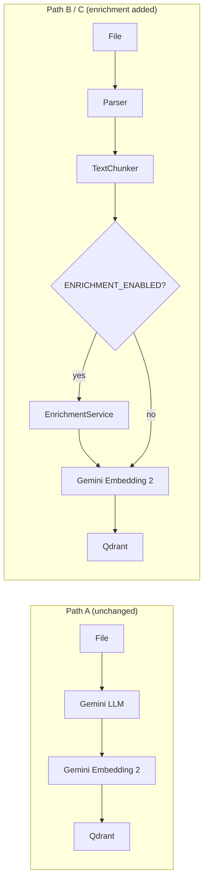
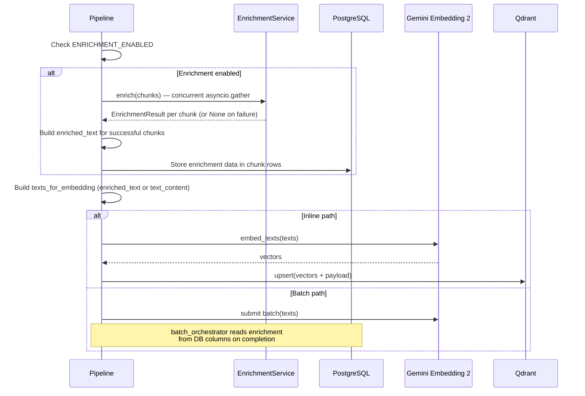

# S9-01: Chunk Enrichment — Design

## Story

> A/B eval — with enrichment vs without -> documented improvement.

**Outcome:** The ingestion pipeline supports an optional LLM enrichment stage that generates summary, keywords, and questions per chunk. Enriched metadata is concatenated to chunk text before both dense embedding and BM25 sparse vector generation, improving retrieval quality by closing the vocabulary gap between user queries and document content.

**Verification:** A/B eval comparing enriched vs unenriched snapshots produces a comparison report with metric deltas. Feature flag controls activation. Pipeline degrades gracefully when enrichment fails for individual chunks.

## Context

Retrieval quality depends on overlap between how users phrase queries and how information is stored in chunks. Common failure modes in the current pipeline:

- **Synonym mismatch:** user asks about "company earnings" but chunk contains "revenue growth"
- **Abstraction gap:** user asks "How to deploy?" but chunk contains step-by-step instructions without the word "deploy"
- **Question-statement gap:** user asks a question, chunk contains a declarative statement

Hybrid search (dense + BM25 + RRF) and query rewriting partially address this, but a vocabulary gap remains at indexing time. Chunk enrichment closes this gap by adding search-optimized metadata before embedding.

**Key uncertainty:** Whether enrichment provides measurable improvement over the current pipeline is unknown. No benchmark exists for the specific configuration (Gemini Embedding 2 + Qdrant BM25 + RRF). This story includes A/B eval to answer that question.

**Current state:**
- Ingestion pipeline processes sources through Path A (Gemini native), Path B (lightweight local), and Path C (Document AI fallback) as defined in [docs/rag.md](../../../docs/rag.md).
- Eval framework exists in `backend/evals/` with retrieval scorers, answer quality scorers, baseline comparison, and decision tooling (S8-01, S8-02).
- [docs/rag.md](../../../docs/rag.md) documents chunk enrichment as "deferred" with an implementation plan outline.

**Full design spec:** [docs/superpowers/specs/2026-03-29-s9-01-chunk-enrichment-design.md](../../../docs/superpowers/specs/2026-03-29-s9-01-chunk-enrichment-design.md) — contains complete prompt templates, schema definitions, cost calculations, and error handling details.

**Research exploration:** [documentation/explorations/2026-03-29-chunk-enrichment-techniques-for-rag.md](../../../documentation/explorations/2026-03-29-chunk-enrichment-techniques-for-rag.md) — evaluated Anthropic Contextual Retrieval, RAGFlow Transformer, LlamaIndex Metadata Extractors, HyPE, RAPTOR, and others.

## Goals / Non-Goals

### Goals

- **EnrichmentService** — new service that generates summary, keywords, and questions per chunk via Gemini structured output (concurrent interactive API calls with semaphore).
- **Pipeline integration** — enrichment stage inserted between chunking and embedding in Path B and Path C. Conditional on `ENRICHMENT_ENABLED` feature flag (default: `false`).
- **Text concatenation** — enriched text (`text_content` + summary + keywords + questions) used for both dense embedding and BM25 sparse vector generation. Original `text_content` preserved for LLM context and citations.
- **Database schema** — 6 new nullable columns on `chunks` table for enrichment persistence (Alembic migration). Serves as the contract between enrichment stage and batch embedding completion handler.
- **Qdrant payload extension** — enrichment fields stored in payload for audit trail and reproducibility.
- **Feature flag** — `ENRICHMENT_ENABLED=false` by default. Required for A/B eval and owner cost control.
- **Vocabulary-gap eval dataset** — new `retrieval_enrichment.yaml` with synonym, question-form, abstract, and terminology mismatch cases.
- **A/B comparison** — baseline (unenriched) vs enriched snapshot comparison using existing `compare.py` tooling.

### Non-Goals

- **Document-context enrichment** — Anthropic Contextual Retrieval requires full document per chunk call. Deferred because Gemini Batch API lacks prompt caching, making cost ~15x higher.
- **Separate named vectors for enriched fields** — adds Qdrant complexity without proven need. Concatenation achieves the same outcome with zero retrieval pipeline changes.
- **Path A enrichment** — Path A `text_content` is already LLM-generated (description, transcript). Enrichment adds marginal value at extra cost.
- **Rolling key dictionary (MDKeyChunker)** — sequential dependency within documents conflicts with batch parallelism.
- **DSPy prompt optimization** — requires baseline enrichment first.
- **Retrieval pipeline changes** — enrichment improves retrieval purely through better embeddings and BM25 vectors. No changes to search, fusion, or filtering.
- **Gemini Batch API for enrichment** — interactive concurrent calls are sufficient for current scale and simpler to implement. Batch API remains a future cost optimization.

## Decisions

### D1: Chunk-only enrichment via Gemini interactive API (concurrent)

Generate summary, keywords, and questions per chunk using individual Gemini API calls executed concurrently via `asyncio.gather` with a configurable semaphore (`ENRICHMENT_MAX_CONCURRENCY`, default: 10).

**Rationale:** No new dependencies — uses existing `google-genai` SDK. Gemini structured output (`response_schema`) guarantees syntactically valid JSON, eliminating parsing failures. Fully parallelizable across chunks. Interactive mode is simpler than batch and sufficient for current scale.

**Rejected:**
- *Document-context enrichment (Anthropic Contextual Retrieval pattern):* Requires passing the full source document with every chunk call. Gemini Batch API lacks prompt caching, making this ~15x more expensive. Deferred until prompt caching is available.
- *LlamaIndex as a dependency:* Same concept (metadata extractors) but adds a heavyweight framework for 3 prompt calls. Native Gemini API covers the need with zero new dependencies.
- *Gemini Batch API for enrichment:* Adds latency (SLO <= 24h) and complexity (polling, status management) for a cost saving that matters only at large scale. Interactive concurrent calls keep the implementation simple.

### D2: Three enrichment fields — summary, keywords, questions

Each chunk receives:
- **Summary** (1-2 sentences) — describes what the chunk contains
- **Keywords** (5-8 terms) — synonyms and related concepts not in the original text
- **Questions** (2-3) — natural questions the chunk can answer

**Rationale:** This field set covers all three vocabulary gap failure modes. Keywords close BM25 lexical gaps (synonym mismatch). Questions improve dense embedding match for question-form queries. Summary improves both by providing a concise alternative phrasing. This pattern is proven in RAGFlow's Transformer stage.

**Rejected:**
- *Entities/title/semantic keys:* Anchor metadata already provides structural context (heading, section, page). Additional structural fields add cost without addressing the vocabulary gap.
- *HyPE-only (questions only):* Misses BM25 keyword improvement. The questions field already serves the HyPE purpose within the combined approach.

### D3: Concatenation to text before embedding and BM25

Enriched text is built by appending summary, keywords, and questions to the original `text_content`. This concatenated `enriched_text` replaces `text_content` as the source for both dense embedding and BM25 sparse vector generation.

```text
{text_content}

Summary: {summary}
Keywords: {keyword1, keyword2, ...}
Questions:
{question1}
{question2}
```

**Rationale:** Zero changes to the retrieval pipeline. Both dense and sparse vectors automatically benefit from the enriched vocabulary. The original `text_content` is preserved separately for LLM context and citation display — no enrichment artifacts leak into generated answers.

**Rejected:**
- *Separate named vectors for enriched fields:* Would require new Qdrant vectors, modified retrieval queries, and fusion weight tuning. Adds complexity without proven benefit. Can be revisited if concatenation proves insufficient.
- *Enrichment in payload only (not in vectors):* Would require retrieval pipeline changes to search enrichment fields separately. Defeats the purpose of transparent improvement.

### D4: Text source matrix

Enrichment introduces multiple text representations. This matrix defines which text is used where:

| Consumer | Source | Why |
|----------|--------|-----|
| Dense embedding (Gemini Embedding 2) | `enriched_text` (or `text_content` if unenriched) | Enriched keywords and questions improve semantic match |
| BM25 sparse vector | `enriched_text` (or `text_content` if unenriched) | Enriched keywords close vocabulary gap for lexical search |
| LLM context (answer generation) | `text_content` (original, always) | Clean text without enrichment artifacts avoids confusing the LLM |
| Citation display | `text_content` (original, always) | User sees original document text, not generated metadata |
| Qdrant payload | Both `text_content` and `enriched_text` + individual fields | Full audit trail; `enriched_text` stored for reproducibility |

### D5: Skip Path A, enrich Path B and C only

Path A creates one chunk per file with LLM-generated `text_content` (image descriptions, audio transcripts). Enrichment is skipped for Path A chunks.

**Rationale:** Path A text is already LLM-generated — it is already a search-optimized representation of the source content. Enriching LLM output with another LLM call adds cost with marginal benefit. Can be revisited if eval shows poor media retrieval.

### D6: Feature flag with default off

`ENRICHMENT_ENABLED=false` by default. When disabled, the pipeline behaves identically to the current implementation — no code path changes, no performance impact.

**Rationale:** Required for A/B eval methodology (one snapshot without enrichment, one with). Gives the owner explicit control over cost impact (~$1.60 per 1000 chunks at Gemini 2.5 Flash interactive pricing). Easy to disable if eval shows no improvement.

### D7: Fail-open per chunk

If enrichment fails for an individual chunk (timeout, API error, unexpected response), that chunk proceeds through the pipeline with its original `text_content`. Enrichment fields remain `None`.

**Rationale:** Partial enrichment is better than pipeline failure. Each chunk is independent — one failure does not affect others. Structured output makes JSON parse failures unlikely, but the safety net ensures robustness.

### D8: Reindex via existing snapshot lifecycle

Reindexing with enrichment uses the existing snapshot workflow: create draft, reindex all sources (re-parse, chunk, enrich, embed, upsert), publish, activate. Previous snapshot remains available for rollback.

**Rationale:** No new mechanisms required. The snapshot lifecycle already supports reindexing with arbitrary pipeline changes. Rollback is built in.

## Architecture

### Pipeline with enrichment stage



### EnrichmentService

**Location:** `backend/app/services/enrichment.py`

Accepts a list of chunks, calls Gemini LLM concurrently with structured output enforcement, returns per-chunk enrichment results. Uses `asyncio.gather` with a semaphore for rate limit control.

- **Model:** configurable via `ENRICHMENT_MODEL` (default: `gemini-2.5-flash`)
- **Temperature:** 0.1 (factual extraction, low creativity)
- **Output:** Gemini `response_schema` with JSON Schema enforcement
- **Minimum chunk size:** chunks below `ENRICHMENT_MIN_CHUNK_TOKENS` (default: 10) are skipped

### Pipeline integration point

Enrichment runs in `embed_and_index_chunks()` **before** both inline and batch embedding paths:



**Key change to Qdrant upsert:** `upsert_chunks()` uses `chunk.enriched_text or chunk.text_content` for BM25 document construction (currently hardcoded to `chunk.text_content`).

### Database schema change

New nullable columns on `chunks` table (Alembic migration):

| Column | Type | Purpose |
|--------|------|---------|
| `enriched_summary` | `TEXT NULL` | LLM-generated summary |
| `enriched_keywords` | `JSONB NULL` | LLM-generated keywords array |
| `enriched_questions` | `JSONB NULL` | LLM-generated questions array |
| `enriched_text` | `TEXT NULL` | Full concatenated text used for embedding |
| `enrichment_model` | `VARCHAR(100) NULL` | Model used for enrichment (audit) |
| `enrichment_pipeline_version` | `VARCHAR(50) NULL` | Pipeline version tag (audit) |

These columns serve as the persistence contract between the enrichment stage and the batch embedding completion handler (`batch_orchestrator._apply_results`). When batch embedding completes asynchronously, it reads enrichment data from these columns to build the full Qdrant payload.

### Qdrant payload extension

New fields added to chunk payload, prefixed with `enriched_` to distinguish from original data:

- `enriched_summary`, `enriched_keywords`, `enriched_questions` — individual enrichment fields
- `enriched_text` — full concatenated text (stored for reproducibility)
- `enrichment_model`, `enrichment_pipeline_version` — audit trail

No new payload indexes — enriched fields are not used for filtering.

### Token overflow handling

When `enriched_text` exceeds the 8192-token embedding window, truncation follows a priority order: questions removed first, then keywords, summary preserved last. This ensures the most information-dense enrichment (summary) survives truncation.

### Configuration

| Variable | Default | Purpose |
|----------|---------|---------|
| `ENRICHMENT_ENABLED` | `false` | Feature flag |
| `ENRICHMENT_MODEL` | `gemini-2.5-flash` | LLM model for enrichment |
| `ENRICHMENT_MAX_CONCURRENCY` | `10` | Concurrent API call limit |
| `ENRICHMENT_TEMPERATURE` | `0.1` | Low creativity for factual extraction |
| `ENRICHMENT_MAX_OUTPUT_TOKENS` | `512` | Per-chunk output token budget |
| `ENRICHMENT_MIN_CHUNK_TOKENS` | `10` | Minimum chunk size to attempt enrichment |

### Circuits affected

- **Knowledge circuit:** Primary area of change. Enrichment stage added to ingestion pipeline between chunking and embedding. Qdrant upsert modified to use `enriched_text` for BM25.
- **Dialogue circuit:** Unchanged. Retrieval continues to use `text_content` from Qdrant payload for LLM context and citations. No search or fusion changes.
- **Operational circuit:** Unchanged. No new background tasks or queue changes.

### New and modified components

| Component | Location | Change |
|-----------|----------|--------|
| `EnrichmentService` | `backend/app/services/enrichment.py` | **New** |
| Pipeline integration | `backend/app/workers/tasks/pipeline.py` | **Modified** — enrichment stage before embedding |
| Qdrant service | `backend/app/services/qdrant.py` | **Modified** — BM25 source uses `enriched_text`, payload extended |
| Batch orchestrator | `backend/app/workers/tasks/batch_orchestrator.py` | **Modified** — reads enrichment from DB on batch completion |
| Config | `backend/app/core/config.py` | **Modified** — enrichment settings |
| Chunk model | `backend/app/db/models/knowledge.py` | **Modified** — 6 new nullable columns |
| Alembic migration | `backend/migrations/versions/` | **New** |
| Enrichment eval dataset | `backend/evals/datasets/retrieval_enrichment.yaml` | **New** |

**Not affected:** Chat API, SSE streaming, retrieval service, citation builder, persona loader, query rewriter, snapshot lifecycle endpoints, frontend, Docker configuration.

### Cost estimation

Gemini 2.5 Flash interactive API: $0.30/M input tokens, $2.50/M output tokens.

| Knowledge base | Chunks | Est. cost (interactive) |
|----------------|--------|------------------------|
| 10 articles | ~100 | ~$0.16 |
| 1 book | ~1,000 | ~$1.60 |
| Small library | ~10,000 | ~$16.10 |

Cost is per enrichment pass. Embedding cost is additional (same as current pipeline).

## Risks / Trade-offs

### Enrichment may not improve retrieval

The entire premise is a hypothesis. Gemini Embedding 2 may already capture synonyms and question-form semantics well enough that enriched text adds noise rather than signal.

**Mitigation:** Feature flag defaults to `false`. A/B eval is the deliverable, not enrichment itself. If eval shows no improvement, enrichment stays disabled with zero cost to the pipeline.

### Enrichment quality is not guaranteed by structured output

Gemini's `response_schema` guarantees syntactically valid JSON but not semantic quality. The LLM could generate irrelevant keywords or off-topic questions.

**Mitigation:** Low temperature (0.1) constrains creativity. The prompt is specific about what to generate. A/B eval measures the actual retrieval impact — poor enrichment quality shows up as no metric improvement. Manual review of enriched fields is possible via Qdrant payload inspection.

### Increased ingestion time

Each chunk requires an additional Gemini API call. Even with concurrency, large knowledge bases take longer to ingest.

**Mitigation:** Concurrency semaphore (`ENRICHMENT_MAX_CONCURRENCY=10`) parallelizes calls. Interactive enrichment is only for individual file uploads — bulk operations use Gemini Batch API for embedding (enrichment runs before batch submission). Owner controls activation via feature flag.

### Token overflow risk

Large chunks combined with enrichment text may exceed the 8192-token embedding window.

**Mitigation:** Graduated truncation — questions first, then keywords, summary last. This preserves the most information-dense enrichment. The truncation threshold is deterministic and testable.

### Batch path complexity

The batch embedding path requires enrichment data to survive between the enrichment stage and the asynchronous batch completion handler. This introduces a persistence dependency through the `chunks` table.

**Trade-off accepted:** The 6 new nullable columns on `chunks` serve as the contract. This is simpler than alternative approaches (separate enrichment table, Redis cache, file-based storage) and keeps enrichment data queryable for debugging.

## Testing strategy

### CI tests (deterministic, all Gemini calls mocked)

| Test | Verifies |
|------|----------|
| `test_enrichment_service` | Structured output parsing, concurrent execution, semaphore behavior |
| `test_enrichment_skip_small_chunks` | Chunks below `ENRICHMENT_MIN_CHUNK_TOKENS` are skipped |
| `test_enrichment_fail_open` | Individual chunk failure does not block other chunks; failed chunks proceed with `text_content` |
| `test_pipeline_enrichment_disabled` | `ENRICHMENT_ENABLED=false` skips enrichment entirely, pipeline unchanged |
| `test_pipeline_enrichment_enabled` | Enrichment stage runs, enriched text passed to embedding, DB columns populated |
| `test_qdrant_bm25_source` | BM25 document uses `enriched_text` when available, falls back to `text_content` |
| `test_payload_enrichment_fields` | Qdrant payload contains enrichment fields with correct values |
| `test_token_overflow_truncation` | Graduated truncation: questions first, keywords second, summary preserved |
| `test_path_a_skip` | Path A chunks bypass enrichment |
| `test_batch_path_enrichment` | Batch orchestrator reads enrichment from DB columns on completion |

### Evals (on real models, manual)

- **A/B comparison:** Run eval suite against unenriched baseline snapshot, then against enriched snapshot. `compare.py` produces delta report.
- **Vocabulary-gap cases:** `retrieval_enrichment.yaml` targets synonym, question-form, abstract, and terminology mismatch queries.
- **Cost tracking:** Record actual enrichment cost per run for cost/benefit analysis.
- **Go/no-go decision:** Comparison report feeds into the decision document template from S8-02, determining whether enrichment is enabled by default.
