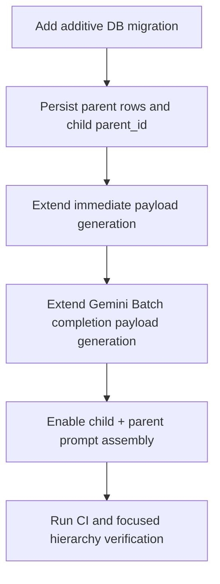

## Context

**Story:** S9-02: Parent-child chunking.

ProxyMind already supports structure-aware child chunking, hybrid retrieval, optional chunk enrichment, and both immediate and Gemini Batch embedding flows. That pipeline works well for short and medium documents, but long-form sources such as books frequently need more context than a single retrieved child chunk can provide. The current flat retrieval shape can find the right fragment while still starving the answer model of the broader section-level context required for grounded long-form responses.

This change affects the **knowledge contour** primarily and the **dialogue contour** secondarily:

- **Knowledge contour:** Path B and Path C ingestion gain hierarchy qualification, parent-section persistence, and parent-aware payload assembly.
- **Dialogue contour:** prompt assembly gains child + parent context units with shared-parent deduplication.
- **Operations contour:** ingestion emits structured logs that explain whether hierarchy was enabled, why, and whether fallback grouping was used.

What stays unchanged:

- Path A remains single-chunk and out of scope.
- Retrieval ranking remains child-only.
- Public API contracts do not change.
- Existing flat chunking remains the fallback for short or non-qualifying sources.

Reference material:
- `docs/rag.md` documents parent-child chunking as the planned long-form retrieval upgrade.
- `docs/superpowers/specs/2026-03-29-s9-02-parent-child-chunking-design.md` contains the full story-level design rationale used as the source for this OpenSpec change.

## Goals / Non-Goals

**Goals:**
- Qualify long-form Path B/Path C documents for hierarchical indexing without requiring strong heading extraction.
- Build parent sections with a structure-first algorithm and deterministic bounded fallback grouping.
- Persist canonical parent-child links in PostgreSQL while keeping Qdrant child-only for ranking.
- Extend immediate and batch embedding flows so both produce the same parent-aware child payload contract.
- Assemble prompt context from child evidence plus deduplicated parent context.
- Add structured logs for hierarchy decisions and fallback visibility.

**Non-Goals:**
- Multi-level retrieval beyond one parent layer.
- Sibling expansion in prompt context.
- Any Path A hierarchy behavior.
- Public API additions or admin UI work.
- New retrieval ranking algorithms or changes to dense/BM25/RRF semantics.

## Decisions

### 1. Use a structure-first hierarchy with bounded fallback grouping

Qualifying long-form documents will attempt parent construction from normalized structure (`anchor_chapter`, `anchor_section`) first. If structure is shallow, missing, or produces oversized groups, the pipeline will switch to bounded token-based grouping over the existing child chunks.

This keeps the mental model aligned with document structure while avoiding a hard dependency on strong heading extraction.

**Alternatives considered:**
- **Fixed windows only:** simpler but semantically weaker for books.
- **Heading-rich only:** rejected because it would strand weakly structured long-form documents on the flat path.

### 2. PostgreSQL is the canonical hierarchy store; Qdrant remains child-ranked

Parent sections are business state and must be reproducible across reindex, rollback, and audit workflows. Parent rows therefore live in PostgreSQL, linked from child chunks via `parent_id`. Qdrant stores denormalized parent metadata on the child point payload for fast online retrieval and prompt assembly.

**Alternatives considered:**
- **Qdrant-only hierarchy:** rejected because it weakens source-of-truth guarantees.
- **PostgreSQL-only parent resolution on the hot path:** rejected because it adds avoidable round-trips during chat retrieval.

### 3. Retrieval stays child-only; prompt assembly receives child + parent

The change does not alter ranking semantics. Dense/BM25/RRF continue to rank child chunks. The dialogue layer uses the matched child as evidence and the parent section as expanded context. If multiple top-ranked children share the same parent, the parent text appears once while each child remains independently citable.

**Alternatives considered:**
- **Parent-only prompt context:** rejected because it weakens exact grounding.
- **Child + parent + siblings:** deferred as a future upgrade because it increases token pressure and complexity.

### 4. Immediate and batch embedding must share one ingestion contract

Hierarchical indexing is a property of the document-processing contract, not of the embedding execution mode. Immediate embedding and Gemini Batch embedding must therefore:

- use the same child rows and `parent_id` links,
- preserve child-based embedding input,
- produce the same parent-aware child payload fields in Qdrant.

This avoids behavioral drift between small and large documents.

### 5. Observability is part of the feature contract

Hierarchy rollout decisions must be visible in logs and in deterministic acceptance tests. Each qualifying decision emits a structured event carrying `qualifies`, `reason`, `has_structure`, `total_tokens`, `chunk_count`, `parent_count`, and `fallback_used`.

This distinguishes intentional flat fallback from hidden long-form degradation.

### 6. Qualifying hierarchy failures fail closed

Once a document qualifies for hierarchical indexing, parent construction and persistence are part of the required ingestion contract for that document version. If hierarchy construction or parent persistence fails after qualification, the ingestion run fails rather than silently degrading that qualifying document back to flat chunking.

This preserves contract clarity, keeps immediate and batch behavior aligned, and avoids masking hierarchy bugs behind an implicit downgrade path.

### 7. Add a dedicated hierarchy capability instead of overloading existing specs

The canonical parent model, qualification logic, and fallback grouping are first-class feature behavior, not just incidental changes inside ingestion. A new `hierarchical-chunking` capability captures that contract explicitly, while existing capabilities receive narrow delta specs for their own changed boundaries.

## Risks / Trade-offs

- **Weakly structured grouping may still produce imperfect parent boundaries** → Keep grouping deterministic, bounded by token targets, and observable in logs.
- **Batch/immediate parity can drift over time** → Capture both paths in specs and verification suites.
- **Prompt token growth from parent context** → Deduplicate shared parents and preserve child evidence as the non-droppable unit.
- **Schema and payload expansion increase change surface** → Keep migration additive only and avoid public API changes.
- **Qualifying hierarchy failures could be hidden by silent flat downgrade** → Treat post-qualification hierarchy construction/persistence failures as ingestion failures, not as an implicit flat fallback.

## Migration Plan

1. Apply an additive migration for `chunk_parents` and `chunks.parent_id`.
2. Implement hierarchy qualification and persistence for Path B and Path C.
3. Extend Qdrant payload generation for immediate and batch flows.
4. Update prompt assembly for child + parent context units.
5. Verify deterministic tests for qualification, payload parity, prompt assembly, and observability.
6. Rollback remains operationally simple: deactivate the feature in code or revert before archive; additive DB columns/tables may remain without affecting flat chunking behavior.

## Open Questions

- No blocking product questions remain for artifact creation.
- Concrete threshold defaults (`parent_child_min_document_tokens`, `parent_child_min_flat_chunks`, parent target/max tokens) remain implementation-time tuning values validated by tests rather than unresolved design questions.
