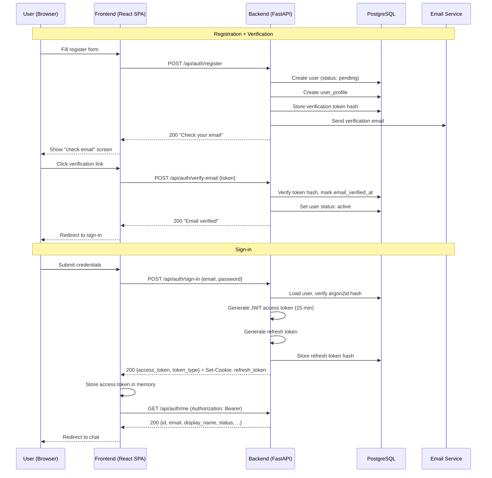
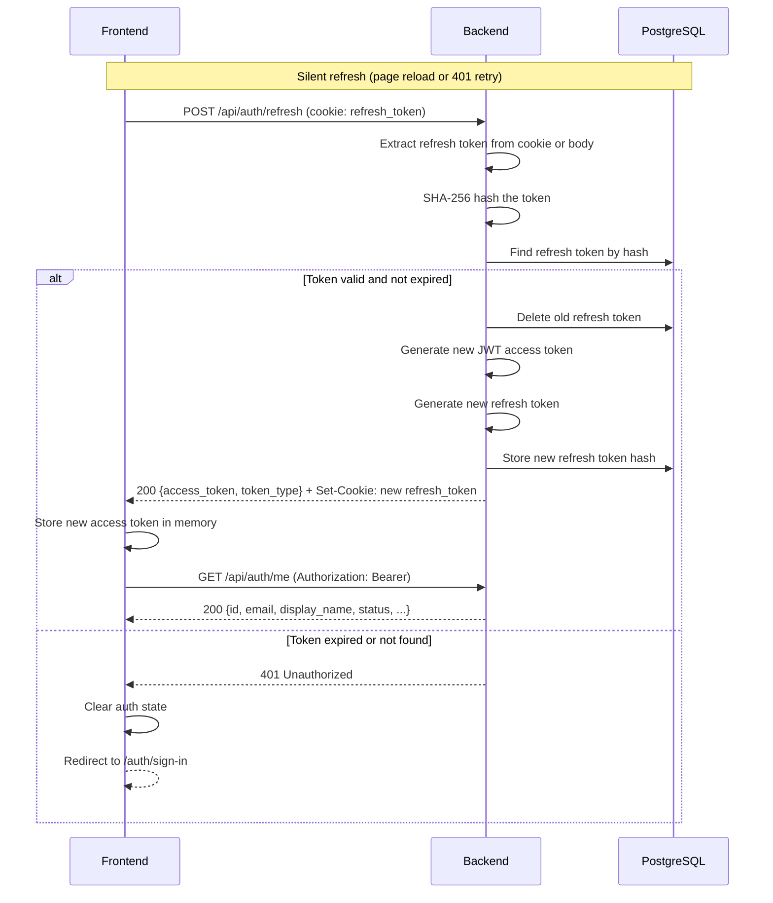

## Context

Story **S7-03** addresses a fundamental gap: all ProxyMind chat endpoints are currently public. Anyone can create sessions, send messages, and read history without authentication. This is acceptable for local development but blocks production deployment -- every chat request costs LLM inference money, and there is no way to identify or manage visitors.

ProxyMind operates three system circuits (dialogue, knowledge, operational). This change primarily affects the **dialogue circuit** (auth middleware on all chat endpoints, session ownership) and the **operational circuit** (token cleanup background job, rate limiting on auth brute-force targets). The **knowledge circuit** is unchanged -- ingestion and embedding pipelines have no user-facing surface.

Admin authentication (API key in header) remains separate and unchanged. The two auth domains are intentionally decoupled to support future channel connectors (Phase 10), where external users may arrive without a ProxyMind registration.

The system adds four new database tables (`users`, `user_profiles`, `user_tokens`, `user_refresh_tokens`), renames `sessions.visitor_id` to `sessions.user_id` with a foreign key, and introduces frontend auth pages with a dedicated layout.

## Goals / Non-Goals

### Goals

- Protect all chat and twin-profile endpoints behind JWT-based authentication (401 for unauthenticated requests).
- Implement email-based registration, sign-in, email verification, and password recovery flows.
- Enforce session ownership -- users can only access their own chat sessions (403 for foreign sessions).
- Provide a pluggable email service (console for dev, Resend for prod) switchable via environment variable.
- Extend rate limiting to auth brute-force targets (`/api/auth/sign-in`, `/api/auth/register`, `/api/auth/forgot-password`, `/api/auth/reset-password`).
- Replace the admin AuthDialog modal with a dedicated `/admin/sign-in` page.
- Deliver frontend auth pages (sign-in, register, forgot-password, reset-password, verify-email) with an AuthLayout.

### Non-Goals

- **OAuth / social login** (Google, GitHub) -- out of scope, no immediate need for a self-hosted single-twin product.
- **Multi-factor authentication (MFA/2FA)** -- unnecessary complexity for the current threat model.
- **Per-user rate limiting** -- current per-IP limiting is sufficient; per-user requires session-aware rate tracking.
- **GDPR / account deletion** -- deferred to a future compliance story.
- **Immediate token revocation via Redis blacklist** -- the 15-minute stale access window is acceptable; Redis blacklist is trivial to add later (~20 lines) if needed.
- **External channel identity integration** -- belongs to Phase 10 channel connectors.

## Decisions

### D1: JWT Access + Refresh Tokens

**Chosen:** Stateless JWT access tokens (15 min, HS256) + refresh tokens (7 days, rotated) stored in PostgreSQL.

**Alternatives considered:**
- **Redis session tokens** -- every request checks Redis; increases coupling since Redis already handles rate limiting and job queues.
- **Hybrid: JWT + Redis blacklist** -- adds immediate revocation but makes Redis a critical auth path.

**Rationale:** JWT scales better for future channel connectors (Phase 10). Refresh token in PostgreSQL provides reliable revocation without adding another Redis dependency. Worst-case stale access window is 15 minutes, acceptable for a self-hosted product. Option C (Redis blacklist) is recorded in `docs/next.md` as a trivial future addition.

### D2: Pluggable Email with Resend

**Chosen:** Protocol abstraction (`EmailSender`) with two implementations -- `ConsoleEmailSender` (dev/test) and `ResendEmailSender` (prod). Switched via `EMAIL_BACKEND` env var.

**Alternatives considered:**
- **Real email via SMTP** -- external SMTP dependency, more complex configuration.
- **Console/log output only** -- no production path, blocks deployment.

**Rationale:** The abstraction is trivial (protocol + 2 implementations). Resend has a clean Python SDK and generous free tier. Console output is essential for development and testing.

### D3: Mandatory Email Verification Before Access

**Chosen:** Register, verify email, then access. No access until email is confirmed.

**Alternatives considered:**
- **No verification** -- register and access immediately; makes password recovery unreliable.
- **Soft verification** -- access immediately, remind to verify later; weaker spam protection.

**Rationale:** ProxyMind is a self-hosted twin for a specific person, not a mass-market service. Each visitor is intentional, so verification friction is minimal. Every chat request costs LLM inference money, so preventing spam registrations matters. Password recovery requires a confirmed email to be reliable.

### D4: argon2id Password Hashing

**Chosen:** argon2id via `argon2-cffi`.

No alternatives considered -- argon2id is the OWASP-recommended algorithm (2026), memory-hard, resistant to GPU/ASIC brute-force. Industry standard.

### D5: Dedicated Auth Routes with AuthLayout

**Chosen:** Dedicated `/auth/*` routes with a minimal AuthLayout (twin logo + centered form).

The spec requires pages, not dialogs. Standard SPA auth pattern. Twin name on auth pages comes from `VITE_TWIN_NAME` env variable, not from the API (the twin profile endpoint requires authentication).

### D6: In-Memory Access Token + httpOnly Cookie Refresh

**Chosen:** Access token stored in JS memory (unreachable by XSS). Refresh token in httpOnly cookie (Secure, SameSite=Lax).

**Alternatives considered:**
- **localStorage access + httpOnly cookie refresh** -- access token vulnerable to XSS.
- **Both tokens in httpOnly cookies** -- CSRF-vulnerable, problematic for SPA + SSE streaming.

**Rationale:** Best security balance for SPA. Backend is client-agnostic (only sees `Authorization: Bearer` header) -- each client (web, mobile, future) decides its own storage strategy. Refresh endpoint accepts token from cookie OR request body to support mobile clients. 50ms silent refresh on page reload is imperceptible. Users stay logged in as long as they visit once per week (7-day refresh TTL with rotation).

### D7: Entity Naming -- `users`

**Chosen:** `users` table, not `visitors`.

**Alternatives considered:** `visitors` (already in codebase, implies transient/anonymous), `members`, `contacts`, `audience`.

**Rationale:** With email registration these are registered users, not anonymous visitors. No conflict with admin (admin has no database record, API key only). Migration renames `visitor_id` to `user_id` in sessions table.

### D8: Split `users` (auth) + `user_profiles` (data)

**Chosen:** Separate tables with a one-to-one relationship. Profile created automatically at registration.

**Alternatives considered:**
- **Single `users` table** -- simpler, fewer JOINs.

**Rationale:** Profile will grow significantly (temperament, communication style, behavioral fields). Auth table should remain stable and minimal. JOIN cost is negligible for expected load.

### D9: Separate `user_refresh_tokens` Table

**Chosen:** Dedicated table for refresh tokens, separate from `user_tokens` (email verification / password reset).

**Alternatives considered:**
- **Same table as email/reset tokens** -- fewer tables, but conflates different access patterns.

**Rationale:** Refresh tokens are high-frequency (created at login, rotated at refresh, deleted at logout). Email/reset tokens are rare. Separate cleanup jobs. `device_info` field prepares for "active sessions" management when mobile clients arrive.

## Architecture

### Circuit Impact

| Circuit | Impact | Details |
|---------|--------|---------|
| Dialogue | Modified | Auth middleware (`get_current_user` dependency) added to chat router. Session ownership enforcement. `visitor_id` renamed to `user_id`. |
| Knowledge | Unchanged | Ingestion, embedding, and snapshot pipelines have no user-facing surface. |
| Operational | Modified | Token cleanup arq job (every 6 hours). Rate limiting extended to auth endpoints (10 req/min per IP). |

### Auth Flow

### Token Refresh Flow

### Middleware Architecture

The `get_current_user` FastAPI dependency is applied at **router level** on the chat router. It extracts the JWT from the `Authorization: Bearer` header, decodes it (PyJWT, HS256), loads the user from PostgreSQL, and verifies status. Returns the `User` object on success, raises 401 for invalid/expired token or missing/inactive user, and raises 403 for blocked users (so the transport does not attempt infinite refresh loops — 401 is retry-able, 403 is terminal).

- `chat_router`: `dependencies=[Depends(get_current_user)]`
- `auth_router`: no auth dependency (public, except `GET/PATCH /api/auth/me`)
- `admin_router`: `verify_admin_key` (unchanged)
- `health_router`, `metrics_router`: no changes

### Database Migration

Alembic migration 018 creates four new tables and modifies `sessions`:

**New tables:** `users`, `user_profiles`, `user_tokens`, `user_refresh_tokens` (schemas detailed in the design spec).

**Modified table:** `sessions` -- rename `visitor_id` to `user_id`, add FK to `users(id)` with `ON DELETE SET NULL`. Column remains nullable to support future channel connectors using `external_user_id`.

### New Dependencies

| Package | Purpose | Runtime |
|---------|---------|---------|
| PyJWT | JWT encode/decode | Backend |
| argon2-cffi | Password hashing (argon2id) | Backend |
| resend | Resend Python SDK for email delivery | Backend |

No new frontend dependencies. Uses existing React Router and Radix UI.

### Security Measures

- All tokens (refresh, verification, reset) stored as SHA-256 hashes, never plaintext.
- Timing-safe comparison (`secrets.compare_digest`) for all token verifications.
- Email enumeration protection: `/register` and `/forgot-password` always return 200 with generic message.
- CORS updated with `credentials: true` for cookie transmission.
- Refresh cookie: `httpOnly`, `SameSite=Lax`, `Secure` flag derived from `FRONTEND_URL` scheme.
- Cleanup arq job runs every 6 hours to purge expired tokens from `user_tokens` and `user_refresh_tokens`, and used `user_tokens` (with `used_at IS NOT NULL`) older than 24 hours.

## Risks / Trade-offs

**[Risk] Stale access window (15 minutes)** -- A compromised or revoked user retains access until the JWT expires. --> Mitigation: 15 minutes is acceptable for a self-hosted single-twin product. Redis blacklist (D1 Option C) is a trivial future addition (~20 lines) if instant revocation becomes necessary.

**[Risk] Email delivery reliability** -- If the email service (Resend) is down, users cannot register or recover passwords. --> Mitigation: Console backend provides a development fallback. Resend has high uptime and a generous free tier. The pluggable architecture allows swapping to any email provider (SMTP, SendGrid, etc.) with a single new implementation.

**[Risk] Migration of existing sessions** -- Renaming `visitor_id` to `user_id` affects all existing session rows. --> Mitigation: `user_id` remains nullable. Existing sessions with anonymous `visitor_id` values become sessions with `user_id = NULL`. No data loss. New sessions created by authenticated users get a proper FK.

**[Risk] Silent refresh on page reload** -- If the refresh token cookie is missing or expired, the user is redirected to sign-in on every page load. --> Mitigation: 7-day refresh TTL with rotation on each use means regular users are effectively logged in permanently. Only users who don't visit for 7+ days need to re-authenticate.

**[Risk] Frontend auth state complexity** -- Adding `AuthProvider` alongside existing admin `useAuth` creates two parallel auth systems. --> Mitigation: The two systems are intentionally separate (per spec). Admin auth is API-key-based with no database records. User auth is JWT-based with full lifecycle. They share no state or tokens. Separate concerns, separate providers.

**[Risk] Rate limiting gaps on `/api/auth/refresh`** -- Refresh endpoint is intentionally NOT rate-limited (fires on every page load during silent refresh). --> Mitigation: Refresh requires a valid refresh token (stored as hash in PostgreSQL). Without a valid token, the endpoint returns 401 immediately. An attacker without a valid refresh token cannot abuse this endpoint meaningfully.
